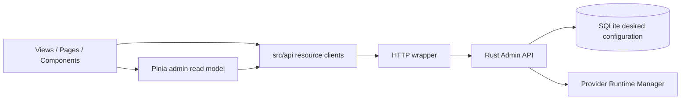

# Kiến trúc và mô hình dữ liệu

## Ranh giới trách nhiệm

Admin Web là một SPA quản trị. Browser gửi desired configuration qua Admin API; backend giữ SQLite, credentials, Provider Runtime Manager và Voice Session. Configuration vừa lưu không chứng minh runtime đã ready, và không thay trực tiếp snapshot của Voice Session đã admit.

Microphone ở browser chỉ dùng cho Speaker enrollment và ASR diagnostics. Admin Web không điều khiển vòng đời một Voice Session; việc Vite proxy `/voice` không có nghĩa UI là Voice Protocol Client.

## Entry points và cấu trúc

| Đường dẫn trong ứng dụng | Trách nhiệm |
| --- | --- |
| `src/main.ts` | Mount Vue, Pinia, Router, CSS |
| `src/App.vue` | Connect token, load cache ban đầu, error banner, RouterView gate |
| `src/router/index.ts` | History router, lazy import trang, redirects, document title |
| `src/layouts/AdminShell.vue` | Shell/sidebar responsive |
| `src/config/navigation.ts` | Nhóm Workspace, Voice, Infrastructure |
| `src/views/` | Overview, Agents, Providers, Devices, Speakers, MCP catalog, System |
| `src/pages/` | Detail pages và Templates catalog |
| `src/components/` | Form, cards, pipeline, enrollment, diagnostics, UI primitives |
| `src/api/` và `src/api/types/` | Transport/resource clients và wire types |
| `src/stores/admin.ts` | Cache/read model Agents, Templates, Providers, Devices |
| `src/stores/auth.ts` | Session token và fallback env |
| `src/stores/server.ts` | Health, readiness, system runtime aggregates |
| `src/domain/admin.ts` | View models và provider types |
| `src/composables/` | Locale, theme, microphone recorder |
| `src/lib/` | WAV, endpoint redaction, relative time, CSS helpers |
| `public/enrollment-worklet.js` | AudioWorklet capture microphone |

## Quan hệ resource

Agent liên kết nhiều Template global; default nằm trên relationship, không phải field persisted của Template. Default phải là một Template đã liên kết với Agent. Device thuộc một Agent; override chỉ được trỏ tới Template liên kết với Agent đó. Effective Template lấy override nếu có, nếu không lấy default của Agent.

Template liên kết tối đa một Provider Instance cho mỗi slot `vad`, `asr`, `llm`, `tts`. Nhiều Template dùng chung một Provider Instance; usage được tính từ bindings. Speaker được liên kết với Agent như identification candidate. External MCP Server được liên kết với Agent bằng binding riêng; tool review là policy riêng nữa.

| Wire value | View model | Lưu ý |
| --- | --- | --- |
| Agent/Template/Provider `key` | `id` | Public key dùng trong route/API |
| Device `id` | `id: String(id)` | DB primary key; khác public `device_id` |
| Device `device_id` | `deviceId` | Identity dùng trong API/Device detail route |
| Device `enabled` | `status: online/offline` | Tên legacy; hiển thị Admission Enabled/Disabled, không phải kết nối |
| Provider `config_json` string | `configJson` object + model/endpoint | Parse ở boundary; cấu hình riêng adapter phải được giữ |
| Resource `revision` | Revision map hoặc raw resource | Dùng cho `If-Match` |
| Timestamp không được map | Chuỗi rỗng trong một số view models | Hiển thị unknown; Device/Speaker detail dùng timestamp raw nếu có |

Device identity/revision bị dùng sai trong store hiện tại; xem finding 2 của [review](review.md). Không lấy `Device.id` làm public route identity khi thêm caller mới.

## Cache và tải dữ liệu

`loadAll()` chạy song song bốn list requests; sau đó tải Template assignments cho từng Agent, rồi provider bindings cho từng Template. Selectors đọc đồng bộ cache để render cards và tính usage/effective configuration.

Hiện tại load chỉ lấy:

- 50 Agent enabled, tối đa 50 Template assignments mỗi Agent.
- 100 Template, 100 Provider, 100 Device ở trang đầu.
- Một binding request mỗi Template đã tải.

Số request một lần reload xấp xỉ `4 + A + T`. Đây là cache cho workload homelab, chưa phải cơ chế tổng hợp toàn bộ catalog hay realtime sync. Overview counts, usage badges và selector-based detail pages có thể thiếu dữ liệu khi vượt trang đầu. Devices catalog tự tải nhiều trang; không dùng danh sách Device trong store để render catalog.

Mutations thường gọi API, cập nhật resource/revision trong cache rồi reload relationship khi cần. `syncAgent()` và `applyBindings()` thay array để Vue nhận thay đổi, nhưng các `upsert*()` vẫn `splice()` array trong `shallowRef`; hạn chế đã xác nhận trong review.

MCP, Speaker, Device detail và Provider detail giữ raw API state riêng và có cơ chế reload/AbortController tùy trang. Chúng không cùng một global store; cập nhật ở một trang có thể cần `refreshAll()` để danh mục/selector khác theo kịp.

## Errors và concurrency

`run()` trong admin store đổi exception thành `store.error` rồi trả `undefined`. Caller phải kiểm tra kết quả trước khi đóng modal, điều hướng hoặc thông báo thành công. Setup Provider/Template và Device claim dùng luồng rethrow để giữ lỗi gần form.

Store mutations đi qua `run()` reload cache khi gặp `revision_conflict`; `loadAll()` tự clear error nên banner conflict có thể biến mất sau reload. Các trang raw API tự xử lý conflict, không có retry/reload chung áp dụng cho mọi request.

Không có request timeout mặc định ở HTTP wrapper. `AbortSignal` được hỗ trợ, và nhiều detail/diagnostic components hủy request khi đổi route hoặc unmount. Các component Agent tool/speaker/MCP bindings chưa có đầy đủ cancellation cho route changes.

## UI, locale và audio

Primitives Button, Badge, Card, Tabs, ActionMenu do repo sở hữu. `BaseModal` Teleport đến body, có dialog role, Escape và restore focus; chưa trap Tab/focus hay inert background, xem review.

Locale được lưu dưới `voice-agent-admin-locale`; lựa chọn EN/VI và `document.documentElement.lang` đi cùng nhau. Theme dưới `voice-agent-admin-theme`, mặc định dark nếu chưa có preference. Typed translation keys không kiểm soát text hard-code, nên chưa thể gọi UI là EN/VI hoàn chỉnh.

Recorder lấy MediaStream, AudioContext và AudioWorklet, downmix mono, resample 16 kHz, encode PCM16 WAV. `dispose()` dừng tracks, disconnect nodes, clear timers và đóng context; clip là Blob trong RAM, không persist vào localStorage/IndexedDB. Recognition/enrollment limits và availability vẫn do server trả về.
