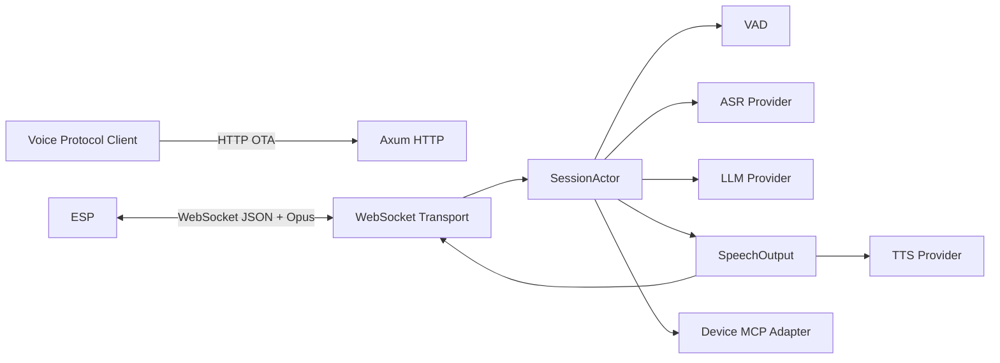
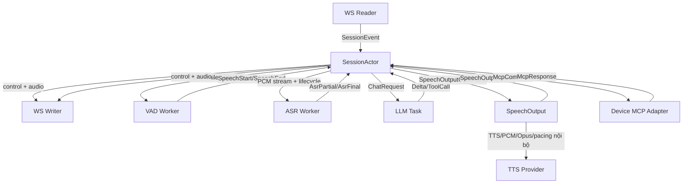
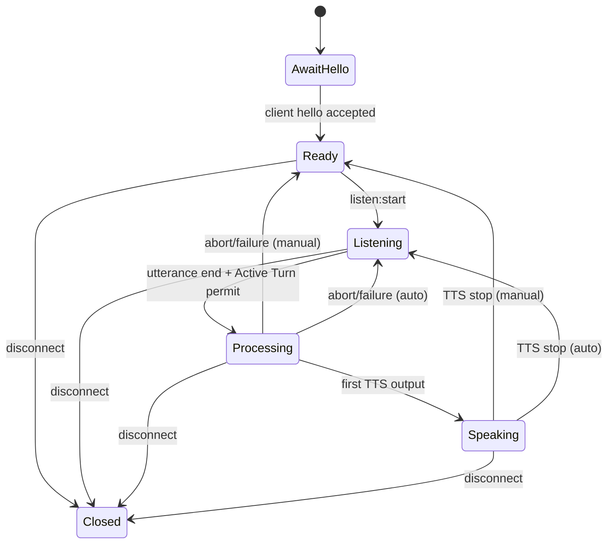

# 01 — Kiến trúc hệ thống

## 1. Context diagram



## 2. Runtime tasks cho mỗi session



## 3. Ownership model

`SessionActor` sở hữu:

- `session_id`
- `device_id`, `client_id`
- `SessionPhase`
- Canonical Audio Profile đã validate
- listen mode
- dialogue buffer của Voice Session
- current `generation_id`
- current turn cancellation token
- MCP tool registry / pending requests
- quyền tăng `generation_id` và cập nhật `GenerationGate`

Các task khác nhận bản sao dữ liệu bất biến hoặc message DTO. Không giữ mutable reference trực tiếp đến actor state.

`SpeechOutput` là Module sâu, không phải một đường gửi WS thứ hai. Interface của nó chỉ nhận segment, tín hiệu input đã hết và cancel; implementation che giấu TTS stream, normalize/resample, Opus, queue và pacing. Nó trả event về actor; chỉ actor tạo `OutboundMessage`.

## 4. Dependency direction

```text
main/app
   |
   +--> transport/http
   +--> transport/ws
   +--> session
   +--> providers implementations

session
   +--> protocol DTO
   +--> provider traits
   +--> audio abstractions
   +--> dialogue
   +--> tools abstractions

provider implementations
   +--> local inference runtimes hoặc reqwest / external APIs

protocol
   +--> serde only
```

Quy tắc: `protocol`, `session`, `dialogue` không được import implementation cụ thể của OpenAI, Whisper, FishSpeech, v.v.

## 5. State machine



State phục vụ logging/validation. Pipeline async vẫn sử dụng generation id để chống stale output.

## 6. Reliability rules

- Provider timeout riêng cho ASR/LLM/TTS/MCP.
- `AsrStreamLease` được acquire khi recognition stream bắt đầu và release sau ASR final, cancel hoặc lỗi; `Active Turn` permit được acquire ở utterance terminal boundary, trước ASR finalization, không chờ queue vô hạn, và release ở mọi terminal path.
- VAD chỉ xử lý microphone khi `Listening`; V1 không acoustic barge-in khi `Speaking`. `abort` hoặc `listen:start` hợp lệ là cơ chế interrupt explicit.
- Transport idle dựa trên WebSocket RX/TX hợp lệ hai chiều; conversation idle tắt trong V1.
- Telemetry dùng Trace Session ID ngẫu nhiên; không log/persist nội dung audio, transcript, prompt/response, tool payload hay secret.
- Mọi task con gắn với session cancellation root.
- Turn cancellation không đóng WS; session cancellation mới đóng tất cả.
- Mọi queue ingress, worker command, audio và outbound đều bounded; mỗi queue có capacity và overload policy được cấu hình.
- WS writer nhận bản sao chỉ-đọc của `GenerationGate`; actor cập nhật gate trước khi enqueue control message abort để writer drop packet stale dù chúng đã nằm trong queue.
- `AwaitHello` fail closed: chỉ ClientHello canonical hợp lệ mới tạo Voice Session; lỗi application handshake đóng 1002.
- Sau handshake, parser ignore unknown field/type và invalid application message không thay đổi state hay đóng session.
- Frame vượt size cap đóng 1009 trước application parse; WebSocket framing/UTF-8 fault do transport library xử lý.
- `Drop`/cleanup phải đóng pending MCP waiters và provider streams.
- WS writer sở hữu control và audio queue riêng, cả hai bounded; control hợp lệ có ưu tiên. Audio phải mang generation và bị kiểm tra lại ngay trước send.
