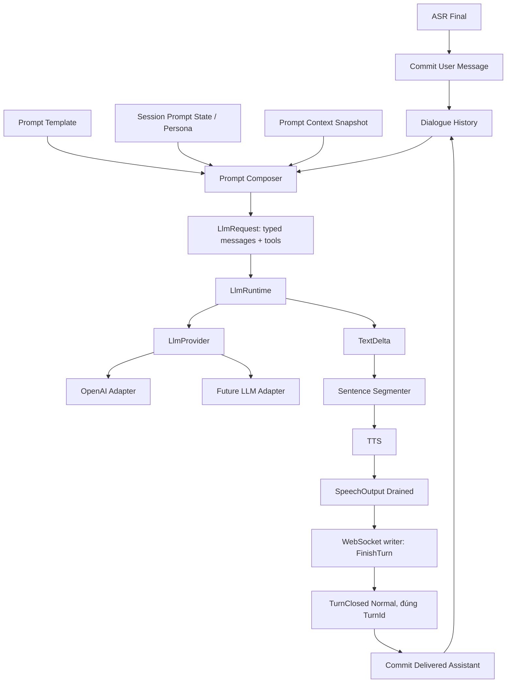

# Flow 04A — Agent Prompt, Persona và Prompt Composition

## 1. Mục tiêu

Tài liệu này định nghĩa cách `voice-agent-server` xây dựng input cho LLM trước mỗi Conversational Turn để hỗ trợ:

- **Agent Persona**: định hình tên, vai trò, phong cách và hành vi của trợ lý;
- **System Prompt**: áp dụng các quy tắc chung cho voice assistant;
- **ASR-aware instructions**: cho LLM biết input đến từ speech recognition và có thể có lỗi nhận dạng;
- **TTS-aware output rules**: ưu tiên câu trả lời tự nhiên khi đọc thành tiếng;
- **Dialogue History** có role rõ ràng;
- **Prompt Context** chỉ chứa dữ liệu deployment-trusted ở Phase A; nguồn ngoài cần trust contract riêng trong phase sau;
- giữ `LlmProvider` **provider-neutral**, không để OpenAI adapter sở hữu persona hoặc business rules.

Tính năng này tham khảo cách `xiaozhi-esp32-server` tách `agent-base-prompt.txt`, `PromptManager`, role prompt và dynamic context, nhưng không copy nguyên implementation hoặc prompt product-specific của Xiaozhi.

### 1.1. Kết quả mong muốn

Flow mục tiêu:

```text
ASR Final
   |
   v
commit User message vào Dialogue History
   |
   v
PromptComposer
   |-- Prompt Template
   |-- Agent Persona
   |-- Voice/ASR rules
   |-- Session Prompt State
   |-- Prompt Context snapshot
   `-- Dialogue History
   |
   v
LlmRequest { messages, tools }
   |
   v
LlmRuntime
   |
   v
LlmProvider
   |
   +--> OpenAI adapter
   `--> future adapters
```

Provider chỉ chịu trách nhiệm chuyển typed request sang API của vendor. Provider không được tự load prompt file, đọc persona, lấy thời gian/vị trí, truy cập Dialogue History hoặc biết Voice Session.

---

## 2. Baseline hiện tại và khoảng trống cần sửa

Tại baseline hiện tại, `crates/voice-agent-server/src/providers/llm/mod.rs` đã expose:

```rust
async fn stream(&self, request: LlmRequest) -> Result<LlmEventStream, LlmError>
```

`LlmRequest` đã có typed `messages` và `tools`. `ChatMessage` là enum gồm `User`, `AssistantText`, `AssistantToolCalls` và `ToolResult`; OpenAI adapter đã map các variant này sang crate `llm`. Device MCP đã đưa tool definitions vào request khi có tool visible. Còn thiếu `System` variant và prompt composition.

`SessionActor::begin_speech_delivery(...)` hiện khởi tạo `llm_messages` chỉ với current user rồi truyền typed request vào `LlmRuntime::start(...)`:

```text
ASR final text
   -> llm_messages = [User(user_text)]
   -> LlmRuntime::start(identity, LlmRequest { messages, tools }, cancellation)
   -> provider.stream(request)
```

Điều này làm runtime thiếu các thành phần:

- system message;
- persona;
- language/voice policy;
- ASR tolerance policy;
- System role;
- structured history được đưa vào request;
- deployment-trusted context theo contract Phase A.

Ngoài ra `DialogueHistory` hiện lưu `Vec<String>`, nên role user/assistant chỉ tồn tại ở tên method commit và bị mất khi lưu.

`docs/flows/04-llm.md` còn mô tả `generation` trong request, nhưng runtime hiện giữ generation trong `WorkerIdentity`. Contract đã chốt cho feature này là:

```rust
pub struct LlmRequest {
    pub messages: Vec<ChatMessage>,
    pub tools: Vec<ToolDefinition>,
}
```

Feature này bổ sung System role và nối Dialogue History vào request, đồng thời sửa tài liệu LLM flow cho khớp contract hiện hành.

---

## 3. Quyết định kiến trúc

### 3.1. Prompt composition thuộc application/session domain

`PromptComposer` nằm **trước** `LlmRuntime`.

Không đặt PromptComposer trong:

- `providers/llm/openai`;
- `LlmRuntime`;
- TTS;
- WebSocket protocol adapter.

Boundary:

```text
SessionActor
   -> PromptComposer
   -> LlmRequest
   -> LlmRuntime
   -> LlmProvider
```

### 3.2. Giữ typed provider request hiện hành

Contract hiện hành:

```rust
#[async_trait::async_trait]
pub trait LlmProvider: Send + Sync {
    fn adapter(&self) -> &'static str;

    async fn stream(
        &self,
        request: LlmRequest,
    ) -> Result<LlmEventStream, LlmError>;
}
```

`LlmRuntime::start(...)` cũng đã nhận `LlmRequest` và cancellation token:

```rust
pub fn start(
    &self,
    identity: WorkerIdentity,
    request: LlmRequest,
    cancellation: CancellationToken,
) -> Result<(), LlmStartError>;
```

Generation tiếp tục thuộc `WorkerIdentity`, không lặp trong `LlmRequest`.

### 3.3. System prompt không được lưu trong Dialogue History

System prompt được compose lại từ configuration/session state cho mỗi LLM Operation.

Dialogue History chỉ lưu conversation state đã commit.

Lợi ích:

- đổi persona không cần rewrite history;
- không nhân bản system prompt trong RAM;
- không vô tình trim system prompt do history bound;
- provider luôn nhận system message ở vị trí xác định.

### 3.4. Assistant chỉ vào history sau writer terminal outcome Normal

Theo ADR 0014 và ADR 0046:

- user message commit sau ASR final hợp lệ;
- Generated Assistant Response chưa được coi là history;
- `SpeechOutput::Drained` chỉ xác nhận pipeline speech đã drain vào outbound path;
- chỉ commit Delivered Assistant Response khi nhận `WriterEvent::TurnClosed { outcome: Normal }` cho đúng `TurnId`;
- cancel/error không commit partial assistant text.

Prompt của turn sau chỉ chứa nội dung mà server writer đã gửi đủ audio và normal `tts:stop`; không suy ra client đã phát xong audio.

### 3.5. V1 không cho PromptComposer tự gọi network

PromptComposer là pure/deterministic composition layer.

Không được gọi trực tiếp:

- weather API;
- geolocation API;
- database memory;
- MCP;
- HTTP context provider.

Phase A chỉ render dữ liệu deployment-trusted. Weather, memory, HTTP/context-provider và dữ liệu ngoài khác cần phase và trust contract riêng, với boundary rõ giữa instruction và untrusted data.

---

## 4. Thuật ngữ miền

Các thuật ngữ đã chốt được ghi trong `CONTEXT.md`. Các mô tả dưới đây nêu contract của feature.

### Agent Persona

Cấu hình định hình identity, vai trò, phong cách giao tiếp và hành vi cấp agent. Persona không chứa provider credential hoặc protocol state.

_Avoid_: OpenAI prompt, provider prompt, model personality.

### Prompt Template

Template versioned do deployment quản lý để tạo system message từ Agent Persona, voice rules và Prompt Context. Template không tự fetch dữ liệu bên ngoài.

_Avoid_: provider request template, chat history.

### Prompt Context

Snapshot typed của dữ liệu được phép đưa vào prompt của đúng một LLM Operation. Phase A chỉ dùng dữ liệu deployment-trusted; external context cần trust contract và vị trí có authority phù hợp ở phase sau.

_Avoid_: global mutable context, provider state.

### Prompt Composer

Application component thuần túy nhận Prompt Template, Session Prompt State, Prompt Context và Dialogue History rồi tạo `LlmRequest`; không gọi LLM, không gọi network và không sở hữu Voice Session lifecycle.

_Avoid_: LLM adapter, PromptManager worker.

### Session Prompt State

State thuộc một Voice Session chứa Agent Persona/revision và các override prompt được phép thay đổi trong session. V1 có thể immutable sau construction nhưng type phải cho phép mở rộng runtime persona switching sau này.

_Avoid_: Dialogue History, provider configuration.

---

## 5. Module layout đề xuất

Tạo module:

```text
crates/voice-agent-server/src/prompt/
├── mod.rs
├── composer.rs
├── template.rs
└── context.rs
```

Không tạo provider-specific prompt module.

Export từ `src/lib.rs` hoặc crate root theo convention hiện tại:

```rust
pub mod prompt;
```

Vai trò từng file:

```text
prompt/mod.rs
  public typed contracts

prompt/template.rs
  load + validate template khi startup

prompt/context.rs
  PromptContext và SessionPromptState

prompt/composer.rs
  deterministic assembly System + History -> LlmRequest
```

Nguồn template mặc định nằm trong repository:

```text
prompts/
└── voice-assistant.txt
```

Binary compile template này bằng `include_str!`; deployment không khai báo `agent.prompt_template` không đọc filesystem hay phụ thuộc CWD. Không embed prompt dài trong OpenAI adapter.

---

## 6. Typed LLM message contract

### 6.1. ChatMessage

Giữ enum provider-neutral đang có ở `providers/llm/mod.rs`, chỉ bổ sung System:

```rust
#[derive(Clone, Debug, PartialEq)]
pub enum ChatMessage {
    System { content: String },
    User { content: String },
    AssistantText { content: String },
    AssistantToolCalls { calls: Vec<ToolCall> },
    ToolResult { tool_call_id: String, content: String },
}
```

Không thay enum bằng `{ role, content, tool_call_id }`: dạng đó không giữ được nhiều tool calls cùng arguments trong một assistant message.

### 6.2. LlmRequest

```rust
#[derive(Clone, Debug)]
pub struct LlmRequest {
    pub messages: Vec<ChatMessage>,
    pub tools: Vec<ToolDefinition>,
}
```

`ToolDefinition` và tool continuation đã tồn tại. Prompt composition phải giữ nguyên tools của round hiện tại; chỉ gửi empty vec khi round thật sự không cho tool.

### 6.3. Invariant

Mỗi request normal chat phải thỏa:

```text
matches!(messages[0], ChatMessage::System { .. })
```

và request của initial round có current `User` message đã commit đúng một lần.

PromptComposer phải reject/fail controlled khi initial request không có current user message. Tool continuation giữ nguyên System + history + chuỗi tool messages của turn hiện tại.

---

## 7. Dialogue History migration

### 7.1. Vấn đề hiện tại

Hiện tại:

```rust
pub(crate) struct DialogueHistory {
    messages: Vec<String>,
    max_messages: usize,
}
```

`commit_user()` và `commit_assistant()` cùng gọi một `commit(String)` nên role bị mất.

### 7.2. Contract mới

Chuyển trực tiếp sang typed Exchange Atom; không tạo bước trung gian `Vec<ChatMessage>` rồi tiếp tục evict message lẻ:

```rust
pub(crate) struct DialogueHistory {
    exchanges: VecDeque<DialogueExchange>,
    max_messages: usize,
}
```

`commit_user(turn_id, text)` mở atom cho đúng `TurnId`. Mỗi tool chỉ vào completed prefix khi có terminal result; success, `ok:false`, timeout hoặc tool/device error đã normalize đều là terminal. Atom lưu từng `CompletedToolRound`, bảo toàn ranh giới LLM tool round. Khi materialize sang `ChatMessage`, mỗi round tạo một `AssistantToolCalls { calls }` rồi các `ToolResult` tương ứng. Không ghi call dang dở. `commit_assistant` chỉ thêm `AssistantText` khi đúng writer terminal outcome Normal. Nếu turn lỗi trước tool đầu tiên, atom là user-only. Nếu tool đã hoàn tất rồi turn lỗi, atom giữ completed prefix nhưng không có final assistant.

### 7.3. Không trim giữa Exchange Atom

`CONTEXT.md` đã định nghĩa Exchange Atom. Device MCP đã tồn tại; history không được xóa riêng một tool result hoặc assistant tool call khỏi exchange.

Đơn vị lưu trữ và eviction:

```rust
pub(crate) struct DialogueExchange {
    turn_id: TurnId,
    user: ChatMessage,
    completed_rounds: Vec<CompletedToolRound>,
    assistant: Option<String>,
}

pub(crate) struct CompletedToolRound {
    calls: Vec<ToolCall>,
    results: Vec<ChatMessage>, // chỉ ChatMessage::ToolResult
}
```

`calls.len() == results.len()` là invariant. Mỗi cặp `(ToolCall, ToolResult terminal)` được append atomically vào round đang mở; vì vậy round `[A, B]` mà A hoàn tất còn B bị cancel materialize thành `AssistantToolCalls([A]) → ToolResult(A)`, không có B dangling. Khi A và B đều hoàn tất, cùng round materialize thành `AssistantToolCalls([A, B]) → ToolResult(A) → ToolResult(B)`. Round tiếp theo luôn tạo `AssistantToolCalls` mới.

`llm.max_history_messages` là eviction target theo logical `ChatMessage` sau materialization: `User = 1`, `AssistantText = 1`, `AssistantToolCalls` non-empty = `1`, mỗi `ToolResult = 1`. Các `ToolCall` bên trong cùng `AssistantToolCalls` không đếm riêng. Khi vượt target, xóa **toàn bộ Exchange Atom cũ nhất** cho tới khi đạt target hoặc chỉ còn atom hiện tại; không cắt atom hiện tại. Một atom hiện tại lớn có thể vượt target, nhưng hard byte bound riêng của request/prompt phải fail có kiểm soát trước khi gọi provider.

Exchange thường là:

```text
User
Assistant delivered
```

hoặc `User → AssistantToolCalls([A, B]) → ToolResult(A) → ToolResult(B) → AssistantToolCalls([C]) → ToolResult(C) → Assistant delivered`,

hoặc `User → completed tool call/result prefix` khi turn lỗi sau khi tool đã chạy,

hoặc khi generation thất bại:

```text
User
```

### 7.4. Không duplicate current user

Flow hiện tại commit user trước khi `begin_speech_delivery()`.

Sau migration, PromptComposer đọc current user từ Dialogue History. Không truyền lại `user_text` để append lần thứ hai.

Sai:

```text
History: User("xin chào")
+
compose(user_text="xin chào")
=
User bị lặp hai lần
```

Đúng:

```text
commit_user(turn_id, "xin chào")
-> compose(turn_id, history_snapshot)
-> System + ... + User("xin chào")
```

Composer nhận requested `TurnId` và yêu cầu atom current tồn tại, có đúng `turn_id`, bắt đầu bằng User và User đó xuất hiện đúng một lần trong Base Snapshot. Vi phạm trả `MissingCurrentUser` hoặc invariant error; không fallback sang User gần nhất trong history.

---

## 8. Agent configuration

### 8.1. Config đề xuất

Thêm:

```toml
[agent]
name = "May"
language = "vi-VN"
persona = """
Bạn là Mây, một trợ lý giọng nói tiếng Việt.
Bạn nói tự nhiên, thân thiện, súc tích và ưu tiên nội dung dễ nghe qua loa.
"""
```

Không đặt fields này dưới `[providers.llm.openai]`.

### 8.2. Rust config

```rust
#[derive(Clone, Debug, Deserialize)]
#[serde(deny_unknown_fields)]
pub struct AgentConfig {
    pub name: Option<String>,
    pub language: Option<String>,
    pub prompt_template: Option<PathBuf>,
    pub persona: Option<String>,
}
```

`AppConfig` thêm `pub agent: Option<AgentConfig>`. Sau deserialize, config loading tạo `EffectiveAgentConfig` đầy đủ từ built-in defaults và override hợp lệ. `[agent]` vắng, hoặc field riêng lẻ vắng trong bảng `[agent]`, dùng default tương ứng. Một value operator chủ động khai báo nhưng rỗng/whitespace là configuration error; không fallback ngầm.

```rust
const DEFAULT_AGENT_NAME: &str = "Mây";
const DEFAULT_AGENT_LANGUAGE: &str = "vi-VN";
const DEFAULT_AGENT_PERSONA: &str = "\
Bạn là Mây, một trợ lý giọng nói tiếng Việt.
Bạn trả lời tự nhiên, thân thiện và súc tích.
Ưu tiên nội dung dễ nghe qua loa.";
const DEFAULT_PROMPT_TEMPLATE: &str =
    include_str!(concat!(
        env!("CARGO_MANIFEST_DIR"),
        "/../../prompts/voice-assistant.txt"
    ));
```

Built-in persona là đoạn tiếng Việt ngắn, tách riêng template; template render `{{persona}}`. Deployment không có database hoặc `[agent]` vẫn dùng đầy đủ defaults, còn operator được override từng field độc lập.

`AppConfig` thêm:

```rust
pub agent: Option<AgentConfig>,
```

### 8.3. Validation

Startup fail trước public bind nếu:

- `agent.name`, `agent.language` hoặc `agent.persona` được khai báo nhưng rỗng/whitespace;
- `agent.prompt_template` được khai báo nhưng rỗng;
- custom template không tồn tại hoặc không phải regular file;
- custom template không UTF-8;
- template chứa placeholder không được allowlist;
- template thiếu `{{persona}}`;
- rendered system prompt vượt hard bound cấu hình.

Khuyến nghị hard bounds:

```text
persona <= 16 KiB UTF-8 bytes
prompt template <= 64 KiB UTF-8 bytes
rendered system prompt <= 96 KiB UTF-8 bytes
```

Các giá trị này là safety/memory bounds, không phải token budget.

Hard bound của mỗi `LlmRequest` là `256 * 1024` bytes, kiểm tra trước **mỗi LLM round** bằng hàm domain-level deterministic `llm_request_size_bytes(&LlmRequest)`. Accounting dùng `checked_add`; overflow cũng là `llm_request_too_large`.

```text
request base             = 32 B
mỗi ChatMessage          = 32 B
mỗi ToolDefinition       = 64 B
mỗi ToolCall             = 48 B
mỗi ToolResult payload   = 48 B
```

Hàm còn tính UTF-8 bytes của mọi message content, tool ID/name/description, compact JSON serialized bytes của tool arguments và parameter schemas. `ToolResult` là `ChatMessage`, nên chịu `32 B` message + `48 B` tool-result overhead + UTF-8 fields/content. `AssistantToolCalls` chịu `32 B` message, rồi mỗi call chịu `48 B` + ID/name UTF-8 + compact JSON arguments. Không dùng `size_of`, heap capacity hoặc HTTP JSON provider-specific. Nếu tổng vượt bound, fail LLM Operation có kiểm soát **trước** `LlmProvider::stream`; không trim từng message hoặc Exchange Atom để lách bound. Đây là implementation constant Phase A, chưa thêm config knob.

### 8.4. Prompt token budget

Nếu `prompt_budget_tokens` chưa implementation chính xác bằng tokenizer của model, không giả vờ enforce bằng `chars / 4`.

`llm.prompt_budget_tokens` là cấu hình **declared-but-not-enforced**: hiện mới được validate `> 0`, chưa có runtime semantics. Phase A không dùng field này để trim, reject hoặc làm completion gate. Trong feature này:

- giữ hard byte bound deterministic cho request/prompt;
- dùng `max_history_messages` làm eviction target theo Exchange Atom;
- token-aware trimming/enforcement cần ticket và quyết định riêng với tokenizer hoặc counting strategy đáng tin cậy.

---

## 9. Prompt Template V1

### 9.1. Không cần Jinja đầy đủ ở V1

Xiaozhi dùng Jinja2, nhưng Rust V1 không cần template engine có control flow.

Khuyến nghị template chỉ hỗ trợ explicit placeholders:

```text
{{agent_name}}
{{persona}}
{{language}}
```

Chỉ `{{persona}}` bắt buộc. `{{agent_name}}` và `{{language}}` hợp lệ nhưng optional; custom template có thể diễn đạt policy theo cách khác. Template mặc định dùng đủ:

```text
{{agent_name}}
{{persona}}
{{language}}
```

Phase A chỉ cho phép ba placeholder deployment-trusted trên. Context placeholders tương lai cần trust contract và phase riêng; nếu xuất hiện trong Phase A, chúng là unknown placeholder và làm startup fail.

Grammar chỉ chấp nhận literal exact `{{agent_name}}`, `{{persona}}`, `{{language}}`. Whitespace (`{{ persona }}`), nesting, escape, property access, filters, expressions hoặc token khác đều là startup error. Rendering single-pass literal substitution; value được chèn không bao giờ được parse lại.

### 9.2. Không cho template thực thi code

Không hỗ trợ:

- include path động;
- expression;
- function call;
- arbitrary environment lookup;
- filesystem lookup trong render;
- HTTP fetch.

`PromptTemplate` chỉ là deterministic string substitution trên allowlist.

### 9.3. Prompt mẫu

`prompts/voice-assistant.txt`:

```text
<identity>
Tên trợ lý: {{agent_name}}
{{persona}}
</identity>

<core_rules>
Bạn đang giao tiếp với người dùng bằng giọng nói.
Đi thẳng vào nội dung chính và tránh lời dẫn không cần thiết.
Ưu tiên câu trả lời ngắn, tự nhiên và dễ nghe khi được TTS đọc thành tiếng.
Không tự nhận đã thực hiện hành động bên ngoài nếu chưa có tool/result xác nhận.
</core_rules>

<speech_input>
Nội dung của người dùng đến từ hệ thống nhận dạng giọng nói ASR và có thể chứa lỗi đồng âm, thiếu dấu hoặc nhận dạng sai từ.
Hãy dùng ngữ cảnh hội thoại để suy luận ý định hợp lý; không sửa lỗi phát âm hoặc chính tả trừ khi người dùng yêu cầu.
</speech_input>

<output_language>
Ngôn ngữ ưu tiên của trợ lý là {{language}}.
Giữ nguyên tên riêng, mã, thuật ngữ kỹ thuật hoặc nội dung mà người dùng yêu cầu ở ngôn ngữ khác khi cần.
</output_language>

<tts_output>
Câu trả lời thông thường sẽ được đọc bằng TTS.
Tránh Markdown trang trí, emoji dư thừa, bảng lớn và ký hiệu khó đọc thành tiếng trừ khi người dùng yêu cầu định dạng đó.
Ưu tiên câu và đoạn ngắn có dấu câu rõ ràng để Sentence Segmenter có thể phát audio sớm.
</tts_output>

```

### 9.4. Không copy product-specific policy của Xiaozhi

Không đưa vào prompt mặc định các rule chỉ thuộc sản phẩm khác, ví dụ:

- tên tool của Xiaozhi;
- weather behavior riêng của Xiaozhi;
- speaker-recognition format riêng;
- country/territory policy hard-code;
- emoji whitelist nếu server chưa có feature đó;
- exit tool chưa tồn tại.

Prompt chỉ mô tả capability thật của server hiện tại.

---

## 10. PromptContext và SessionPromptState

### 10.1. SessionPromptState

```rust
#[derive(Clone, Debug)]
pub struct SessionPromptState {
    pub persona: String,
    pub persona_revision: u64,
    pub agent_name: String,
    pub language: String,
}
```

V1 khởi tạo từ `EffectiveAgentConfig` khi SessionActor được tạo, với `persona_revision = 1` bất kể persona đến từ built-in hay config override. Revision không biểu diễn source của persona.

Dù V1 chưa expose command đổi persona runtime, giữ `persona_revision` để sau này hỗ trợ:

- switch role;
- per-device agent profile;
- per-user assistant;
- manager/API update có explicit session policy.

Mỗi update persona runtime được accept tăng revision đúng một lần: `1 → 2 → 3`.

Không reload `config.toml` ngầm giữa turn.

### 10.2. PromptContext

Phase A chưa có runtime/external context. Không cần type `PromptContext` có các field `current_time`, `device_context` hay `dynamic_context` trong Phase A; type mở rộng chỉ được thêm khi có nguồn và trust contract rõ.

### 10.3. Context là data, không phải authority

External context là untrusted data, không tự nhận authority của system instruction. Phase sau phải định nghĩa boundary, provenance, kích thước và vị trí message trước khi bật placeholder hoặc context provider.

---

## 11. PromptTemplate API

Ví dụ:

```rust
pub struct PromptTemplate {
    source: String,
}

#[derive(Debug, thiserror::Error)]
pub enum PromptError {
    #[error("cannot read prompt template")]
    Read,
    #[error("prompt template is not valid UTF-8")]
    InvalidUtf8,
    #[error("unknown prompt placeholder: {0}")]
    UnknownPlaceholder(String),
    #[error("required prompt placeholder is missing: {0}")]
    MissingRequiredPlaceholder(String),
    #[error("rendered system prompt exceeds configured bound")]
    TooLarge,
    #[error("LLM request has no user message")]
    MissingUserMessage,
    #[error("LLM request has no current user message")]
    MissingCurrentUser,
    #[error("LLM request exceeds hard bound")]
    RequestTooLarge,
}
```

Startup:

```rust
let prompt_template = match effective_agent.custom_template_path.as_ref() {
    Some(path) => PromptTemplate::load_and_validate(path, PromptTemplateLimits::default())?,
    None => PromptTemplate::from_builtin_and_validate(PromptTemplateLimits::default())?,
};
```

Chỉ `agent.prompt_template` do operator khai báo mới được resolve: relative theo thư mục file config đã load, absolute giữ nguyên. Sau resolve, runtime chỉ dùng resolved path và không phụ thuộc process CWD. Rule này chỉ áp dụng prompt template trong feature này, không đổi semantics của path deployment khác.

Sau startup, template được giữ immutable bằng `Arc<PromptTemplate>`.

Không đọc file prompt trong mỗi turn.

---

## 12. PromptComposer API

### 12.1. Input

```rust
pub struct PromptBuildInput<'a> {
    pub turn_id: TurnId,
    pub session: &'a SessionPromptState,
    pub history: &'a DialogueHistory,
    pub tools: &'a [ToolDefinition],
}
```

Phase A chưa có external `PromptContext`. Composer chỉ chạy cho initial round, tạo **Prompt/LLM Base Snapshot**: `System + các Exchange Atom đã commit trước turn + current User`. Snapshot này bất biến suốt Conversational Turn; tool continuation nối `AssistantToolCalls` và `ToolResult` đã hoàn tất vào `llm_messages`, không recompose history và không lặp current User.

### 12.2. Composer

```rust
pub struct PromptComposer {
    template: Arc<PromptTemplate>,
    limits: PromptLimits,
}

impl PromptComposer {
    pub fn compose(
        &self,
        input: PromptBuildInput<'_>,
    ) -> Result<LlmRequest, PromptError> {
        let system = self.template.render(input.session, self.limits)?;

        let mut messages = Vec::with_capacity(
            1 + input.history.message_count()
        );
        messages.push(ChatMessage::System { content: system });
        messages.extend(input.history.messages_for_prompt(input.turn_id)?);

        input.history.verify_current_user_once(input.turn_id, &messages)?;

        let request = LlmRequest {
            messages,
            tools: input.tools.to_vec(),
        };
        request.ensure_within_byte_bound()?;
        Ok(request)
    }
}
```

### 12.3. Composer không mutate history

`compose()` chỉ đọc snapshot/history view.

Nó không được:

- commit message;
- trim history ngoài policy của DialogueHistory;
- cancel generation;
- send WebSocket event;
- gọi provider.

---

## 13. SessionActor integration

### 13.1. Field mới

`SessionActor` thêm:

```rust
prompt_composer: Arc<PromptComposer>,
prompt_state: SessionPromptState,
```

Nếu composer là application-owned immutable component, đặt trong `SessionRuntimes` hoặc một application dependency bundle rồi clone `Arc` vào actor.

### 13.2. Construction

Production startup:

```text
AppConfig::load
   -> materialize + validate EffectiveAgentConfig
   -> PromptTemplate::from_builtin_and_validate or load custom template
   -> PromptComposer::new
   -> build ProviderSet / runtimes
   -> bind server
```

Prompt template lỗi phải fail **trước public bind**.

### 13.3. begin_speech_delivery

Hiện tại `begin_speech_delivery(user_text)` khởi tạo `llm_messages` chỉ với current User. Đích là compose `System + Dialogue History + active-turn messages` đúng một lần, rồi truyền `LlmRequest` cùng `WorkerIdentity` và cancellation token vào runtime. `user_text` có thể còn là tham số điều khiển flow, nhưng không được append lần hai sau khi đã commit vào history. Tool continuation phải dùng cùng system snapshot và giữ tool definitions theo chính sách round hiện tại.

`llm_messages` trở thành backing state của Base Snapshot. Initial round đặt nó từ composer. Mỗi continuation clone base snapshot hiện có rồi nối completed tool prefix; kiểm tra `llm_request_size_bytes` trước provider ở mọi round. Không recompute base snapshot để evict thêm history nếu continuation quá lớn: round đó fail controlled, để history của cùng turn luôn ổn định.

### 13.4. Failure policy

Prompt composition failure là failure của Conversational Turn hiện tại, không phải crash process sau startup.

Tuy nhiên các lỗi tĩnh như missing template/unknown placeholder phải bị bắt ở startup, nên runtime failure chủ yếu còn:

- request bound vượt giới hạn do history/active turn;
- history/request invalid invariant;

Với hard bound, terminal failure dùng stable domain code `llm_request_too_large`: không gọi provider, không rollback User/completed tool prefix, không tạo assistant placeholder và không `fail_closed` Voice Session. Nếu `tts:start` chưa gửi, không tạo writer turn giả hay gửi `tts:stop`; release Active Turn permit và mở History-Barrier trực tiếp. Nếu playback đã bắt đầu, giữ writer ownership hiện có: writer quyết định terminal outcome và permit release theo terminal path đó. Nếu wire chưa có turn-error envelope, feature không thêm protocol mới chỉ để gửi code này. Log và wire không chứa prompt content hoặc byte count.

---

## 14. LlmRuntime boundary

Runtime hiện đã nhận `LlmRequest` và `CancellationToken`, rồi gọi `provider.stream(LlmRequest)`. Feature giữ typed chain này.

Cancellation, timeout, semaphore và route semantics giữ nguyên.

Không để runtime inspect hoặc modify message content.

Generation chỉ thuộc `WorkerIdentity`; không lặp field trong `LlmRequest`.

---

## 15. OpenAI adapter migration

OpenAI adapter tiếp tục map enum hiện hữu sang crate `llm`; chỉ bổ sung `System`.

Pseudo-code:

```rust
fn to_llm_message(message: &ChatMessage) -> llm::chat::ChatMessage {
    match message {
        ChatMessage::System { content } => llm::chat::ChatMessage::system()
            .content(content)
            .build(),
        // Các variant User, AssistantText, AssistantToolCalls và ToolResult
        // giữ mapping hiện hữu, kể cả nhiều tool calls cùng arguments.
        other => map_existing_variant(other),
    }
}
```

Sau đó:

```rust
let messages = request
    .messages
    .iter()
    .map(to_llm_message)
    .collect::<Vec<_>>();

let tools = map_tools(&request.tools)?;

let stream = self
    .client
    .chat_stream_with_tools(
        &messages,
        tools.as_deref(),
    )
    .await?;
```

`request.tools` có thể non-empty khi Device MCP visible. Giữ đúng semantics `Some(tools)`/`None` hiện hành.

### 15.1. Không flatten message

Cấm kiểu:

```text
"SYSTEM: ...\nUSER: ...\nASSISTANT: ..."
```

rồi gửi thành một user message.

Role semantics phải được giữ tới provider API.

---

## 16. History retention và prompt assembly

### 16.1. Thứ tự message

Request normal:

```text
System
User(old)
Assistant(old delivered)
User(old)
Assistant(old delivered)
User(current)
```

Không thêm một system message mới giữa history.

### 16.2. User-only failed turn

Nếu user turn trước đã commit nhưng assistant generation lỗi trước delivery:

```text
System
User(old failed-turn)
User(current)
```

Đây là history trung thực theo current ADR. Không tự tạo assistant placeholder như "error".

Nếu turn lỗi sau khi tool đã chạy, giữ completed prefix `AssistantToolCalls`/`ToolResult` trong atom đó, không ghi call thiếu terminal result và không tạo final assistant giả. Với một batch nhiều call, prefix giữ đúng thứ tự call đã hoàn tất.

Với `McpResultDelivery::Silent`, atom kết thúc sau completed tool prefix và không có assistant text. Với `DirectTts`, text direct là candidate assistant delivery; chỉ thêm `AssistantText` khi writer trả `TurnClosed(Normal)` đúng `TurnId`. Writer abort/fail giữ completed prefix nhưng không thêm assistant text. `SpeechOutput::Drained` không phải commit boundary trong cả hai mode.

Raw MCP result chỉ tồn tại ở MCP boundary đủ để parse/normalize. Boundary lấy mọi text content item theo thứ tự, nối bằng `\n`, bỏ non-text item, rồi chạy đúng một pipeline: Unicode NFC, bỏ mọi `char::is_control()` trừ `\n` (U+000A) và `\t` (U+0009), bỏ bidi formatting controls U+202A..U+202E và U+2066..U+2069, rồi cap một lần trước `ChatMessage::ToolResult`. Không trim whitespace hoặc collapse newline. `llm.max_tool_result_chars` đếm Unicode scalar values (`Rust char`) **sau sanitize**: lấy tối đa N scalar và `truncated=true` chỉ khi còn scalar N+1; ký tự đã bị sanitize không làm `truncated=true`. Nếu không có text item, `content = ""`; `ok`, `code` và `truncated=false` vẫn được giữ, kể cả `isError=true`. Chỉ representation `{ ok, code, content, truncated }` được đưa vào `llm_messages`, completed Exchange Atom và mọi round sau; raw device result không vào history hoặc normal logs. Hard request bound sau normalization tính UTF-8 bytes.

`code` của ToolResult là allowlist hữu hạn: `timeout`, `invalid_arguments`, `unknown_tool`, `request_id_exhausted`, `device_tool_error`. `request_id_exhausted` hiện là terminal ToolResult vì runtime có nhánh tạo result này. Mọi JSON-RPC/device/provider error khác map thành `device_tool_error`; không đưa raw code/message vào history hoặc LLM. `ok:false` với code allowlisted vẫn là terminal ToolResult.

Khi đạt `max_tool_depth`, turn kết thúc bằng controlled terminal failure nội bộ `tool_depth_exceeded`. Không gọi continuation, không tạo synthetic ToolResult hoặc sentinel `tool_call_id`; các CompletedToolRound đã hoàn tất vẫn được giữ trong Exchange Atom.

### 16.3. Bounded retention

Khi vượt `llm.max_history_messages` (eviction target):

- evict exchange cũ nhất;
- không evict system message vì system không nằm trong history;
- không tách tool exchange;
- current user exchange không được evict trước khi compose request của chính turn đó;
- dừng eviction khi chỉ còn atom hiện tại, dù tổng số message vẫn vượt target.

Nếu request/prompt vượt hard byte bound riêng, fail LLM Operation có kiểm soát trước provider. `prompt_budget_tokens` không tham gia quyết định này.

Base Snapshot đã accept không được recompute để giảm history giữa các tool round. Tool result làm round sau vượt 256 KiB khiến round đó fail controlled.

Sau cancellation, tool call chưa có terminal result không được bổ sung ngược vào Exchange Atom, kể cả device gửi result muộn. Correlation state consume/drop late result, không restart LLM và không đổi history. Telemetry có thể ghi `turn_id`, request correlation và `late_result=true`, không ghi raw result; turn sau không suy diễn side effect đã xảy ra.

---

## 17. Prompt context extension phases

Feature nên triển khai theo các mức sau.

### Phase A — Required baseline

Bắt buộc cho ticket hiện tại:

```text
System policy
Agent Persona
Language
ASR-aware rules
TTS-aware response rules
Typed Dialogue History
Typed LlmRequest
OpenAI role mapping
Device MCP tool-call/tool-result preservation
```

### Phase B — Runtime context với trust contract riêng

Thêm sau khi có contract rõ:

```text
current time
device metadata
location đã được resolve hợp lệ
runtime device state
```

Context provider chạy ngoài composer và tạo snapshot. Trước khi bật, phase này phải chốt provenance, trust boundary và vị trí message cho dữ liệu ngoài; không tự đưa dữ liệu đó vào system instruction.

### Phase C — Memory

Thêm:

```text
conversation summary
long-term memory
user preferences
```

Memory không thay thế Dialogue History. Nó là context source riêng, có provenance và bound riêng.

### Phase D — Dynamic persona

Thêm command/API có authorization rõ để update:

```text
SessionPromptState.persona
SessionPromptState.persona_revision += 1
```

Turn đang chạy giữ snapshot cũ; persona revision mới chỉ áp dụng cho LLM Operation tiếp theo, tránh thay prompt giữa stream.

---

## 18. Concurrency và snapshot semantics

Prompt request phải immutable sau khi `LlmRuntime::start()` accept.

Nếu persona/context có thể thay đổi runtime:

```text
Turn N compose
 -> snapshot persona revision 7
 -> LlmRequest immutable
 -> stream đang chạy

persona đổi -> revision 8

Turn N vẫn dùng revision 7
Turn N+1 dùng revision 8
```

Không để provider đọc `Arc<RwLock<Persona>>` trong lúc streaming.

Điều này làm cancellation/generation semantics deterministic.

---

## 19. Security và privacy

### 19.1. Không log full prompt mặc định

System prompt có thể chứa:

- persona riêng;
- user history;
- future memory;
- device context.

Production log chỉ nên có metadata:

```text
prompt_template_revision/hash
persona_revision
message_count
history_message_count
system_prompt_bytes
total_prompt_bytes
```

Không log:

- full system prompt;
- API key;
- raw memory;
- raw dynamic context;
- full Dialogue History ở info/error level.

### 19.2. Error không echo prompt

`PromptError`, `LlmError` và WebSocket error không được format raw prompt hoặc history vào error string.

### 19.3. Dynamic context injection

External context là untrusted data.

Khi Phase B/C thêm dynamic context:

- bound kích thước trước compose;
- không cho context override system policy;
- không parse context thành template source;
- không render template lần hai trên data đã inject;
- không đưa secret/token/header vào context.

---

## 20. Observability

Khuyến nghị span fields:

```text
trace_session_id
llm_generation
llm_adapter
prompt_template_hash
persona_revision
prompt_messages
prompt_system_bytes
prompt_history_messages
prompt_history_bytes
```

Không dùng Device ID trong telemetry nếu Trace Session ID đã được định nghĩa để tránh identifier không cần thiết.

Metrics có thể thêm:

```text
prompt_compose_total{result="ok|error"}
prompt_system_bytes
prompt_history_messages
prompt_request_messages
```

Không label metric bằng persona text hoặc user text.

---

## 21. Config example sau feature

`config.example.toml` thêm gần `[llm]`:

```toml
[agent]
name = "May"
language = "vi-VN"
persona = """
Bạn là Mây, một trợ lý giọng nói tiếng Việt.
Bạn nói tự nhiên, thân thiện và súc tích.
Ưu tiên câu trả lời phù hợp để nghe qua loa thay vì văn bản dài.
"""

[llm]
max_history_messages = 20
```

Provider config giữ nguyên:

```toml
[providers.llm]
type = "openai"

[providers.llm.openai]
api_key = ""
base_url = "https://api.openai.com/v1"
model = "model-name"
timeout_ms = 60000
```

Không thêm `system_prompt` vào `[providers.llm.openai]`.

---

## 22. Files cần thay đổi

### 22.1. File mới

```text
prompts/voice-assistant.txt

crates/voice-agent-server/src/prompt/mod.rs
crates/voice-agent-server/src/prompt/template.rs
crates/voice-agent-server/src/prompt/context.rs
crates/voice-agent-server/src/prompt/composer.rs

crates/voice-agent-server/tests/prompt_composition.rs
```

### 22.2. File sửa

```text
CONTEXT.md
config.example.toml
docs/03-module-contracts.md
docs/04-configuration.md
docs/flows/README.md
docs/flows/04-llm.md
docs/adr/0014-dialogue-delivery-commit.md
docs/PHASE5_XIAOZHI_BARGE_IN_RUST_UPDATE_GUIDE.md
docs/PHASE6_DEVICE_MCP_IMPLEMENTATION_GUIDE.md

crates/voice-agent-server/src/lib.rs
crates/voice-agent-server/src/config/mod.rs
crates/voice-agent-server/src/config/defaults.rs
crates/voice-agent-server/src/config/validation.rs
crates/voice-agent-server/src/providers/llm/mod.rs
crates/voice-agent-server/src/workers/llm.rs
crates/voice-agent-server/src/session/turn.rs
crates/voice-agent-server/src/session/actor/mod.rs
crates/voice-agent-server/src/session/actor/construct.rs
crates/voice-agent-server/src/session/actor/delivery.rs
```

Nếu codebase không export module từ `lib.rs` mà từ crate root khác, follow cấu trúc hiện tại; không tạo parallel public API không cần thiết.

---

## 23. Implementation sequence

Triển khai theo thứ tự để mỗi commit có contract rõ.

### Step 1 — Bổ sung System vào typed LLM contract hiện có

- giữ `ChatMessage` enum và các variant tool hiện có;
- thêm `System { content }` và OpenAI system mapping;
- giữ `LlmRequest { messages, tools }`, `WorkerIdentity` và cancellation seam;
- update fake/test providers cho System message.

Gate:

```text
cargo test
```

phải pass trước khi làm prompt composition.

### Step 2 — Typed Dialogue History

- thay `Vec<String>`;
- preserve user/assistant/tool roles và toàn bộ Exchange Atom;
- giữ commit semantics ADR 0014/0046;
- normalize/cap tool result một lần trước `ChatMessage::ToolResult`;
- lưu completed tool prefix theo `CompletedToolRound`; depth limit terminalize turn không chèn sentinel;
- update tests public accessor nếu cần.

Gate:

```text
User final -> history role User
Assistant sau Drained nhưng trước TurnClosed(Normal) -> chưa commit
Assistant sau TurnClosed(Normal) đúng TurnId -> history AssistantText
Cancel -> partial assistant không commit
```

### Step 3 — AgentConfig, effective defaults và validation

- thêm `[agent]`;
- `AppConfig.agent: Option<AgentConfig>` và override fields optional;
- materialize `EffectiveAgentConfig` từ built-in defaults;
- explicit empty name/language/persona/template fail startup, field omit dùng default;
- built-in template dùng `include_str!`; chỉ custom template resolve relative theo thư mục config một lần và được validate;
- bounds;
- update `config.example.toml`.

### Step 4 — PromptTemplate

- load một lần khi startup;
- strict placeholder allowlist;
- reject unknown/missing required placeholder;
- no runtime file read.

### Step 5 — PromptComposer

- render system prompt;
- prepend system message;
- append typed history;
- reject no-current-user invariant;
- giữ tool definitions của round hiện hành.
- tạo Base Snapshot một lần và enforce 256 KiB deterministic request bound.

### Step 6 — SessionActor integration

- inject composer/session state;
- `begin_speech_delivery()` build request từ committed history và active-turn tool transcript;
- continuation dùng Base Snapshot bất biến, chỉ nối completed tool prefix;
- không duplicate user;
- runtime compose failure cleanly completes/fails current turn.

### Step 7 — OpenAI mapping

- giữ mapping enum hiện hữu và thêm System;
- system role phải đi qua `ChatMessage::system()` của crate `llm`;
- không flatten prompt;
- giữ current streaming/cancellation semantics.

### Step 8 — Docs + regression

- update `docs/flows/04-llm.md` để code và docs cùng contract;
- update configuration docs;
- thêm terminology;
- chạy full tests.

---

## 24. Test contract

### 24.1. Prompt template tests

Bắt buộc:

1. valid template load thành công;
2. missing file fail;
3. invalid UTF-8 fail;
4. unknown placeholder fail;
5. thiếu `{{persona}}` fail;
6. template vượt size limit fail;
7. render vượt size limit fail;
8. placeholder value không được render lần hai;
9. whitespace, nesting, escape, property access, filters và expression đều fail startup.

Case 8 quan trọng:

```text
persona = "{{agent_name}}"
```

phải xuất literal `{{agent_name}}` trong persona, không được second-pass expand.

### 24.2. Composer tests

Bắt buộc:

```text
input history:
  User("xin chào")

output:
  [0] System(...persona...)
  [1] User("xin chào")
```

Thêm cases:

- history nhiều turn giữ đúng order;
- assistant role giữ nguyên;
- completed tool prefix của turn lỗi giữ đúng call/result và không có final assistant;
- base snapshot không đổi qua tool continuation;
- continuation vượt 256 KiB fail trước provider, không evict history lại;
- missing current atom/user hoặc User không đúng một lần -> `MissingCurrentUser`;
- current user không duplicate;
- generation giữ trong `WorkerIdentity`, không lặp trong request;
- Base Snapshot được build bằng requested `TurnId`, không fallback sang User cũ;
- tools giữ đúng round, kể cả khi Device MCP visible;
- compose không mutate history.

### 24.3. Dialogue History tests

- `commit_user` tạo User;
- `commit_user(turn_id, text)` tạo atom mang đúng TurnId;
- `commit_assistant` tạo Assistant;
- overflow evict oldest exchange;
- chỉ còn atom hiện tại thì giữ nguyên dù vượt `max_history_messages`;
- hard request byte bound fail trước provider;
- `llm_request_size_bytes` tính content, compact JSON và structural overhead xác định;
- accounting dùng đúng 32/32/64/48/48 bytes và overflow `checked_add` fail `llm_request_too_large`;
- `max_history_messages` đếm logical ChatMessage sau materialization, không đếm ToolCall bên trong AssistantToolCalls;
- user-only failed exchange được giữ đúng;
- batch nhiều tool append atomic từng call/result terminal; B bị cancel sau A chỉ materialize `[A]`; error/timeout normalized cũng là terminal;
- nhiều LLM tool round giữ ranh giới AssistantToolCalls/ToolResult riêng;
- không ghi call chưa có terminal result;
- raw MCP result không vào history/log; mọi text item được nối theo thứ tự trước sanitize/cap;
- normalizer dùng NFC, giữ `\\n`/`\\t`, bỏ control khác và bidi U+202A..U+202E/U+2066..U+2069, không trim/collapse whitespace;
- `max_tool_result_chars` đếm Rust char sau sanitize; `truncated` chỉ true khi có scalar N+1 sau sanitize;
- no text item giữ `content = ""`, `truncated = false` và metadata `ok`/`code` normalized;
- ToolResult `ok:false` chỉ dùng code allowlist, gồm `request_id_exhausted`;
- `tool_depth_exceeded` là internal terminal failure, không phải ToolResult;
- không trim giữa Exchange Atom có tool messages;

### 24.4. LlmRuntime tests

Existing runtime contract phải tiếp tục pass:

- capacity;
- timeout;
- cancellation;
- terminal event delivery;
- stream error;
- stale generation handling tại actor.

Thêm assert request không bị runtime mutate.

### 24.5. OpenAI adapter tests

Không cần network thật để kiểm tra mapping nếu crate boundary có seam phù hợp.

Bắt buộc chứng minh:

```text
ChatMessage::System             -> provider system role
ChatMessage::User               -> provider user role
ChatMessage::AssistantText      -> provider assistant role
ChatMessage::AssistantToolCalls -> provider assistant tool calls
ChatMessage::ToolResult         -> provider tool result mapping hiện hữu
```

Không chấp nhận test chỉ kiểm tra concatenated string.

### 24.6. Actor integration tests

Scenario:

```text
ASR final: "xin chào"
-> STT event
-> history có User("xin chào")
-> LLM request có System + User
-> LLM text delta
-> TTS start/audio
-> Drained: assistant vẫn chưa trong history
-> WriterEvent::TurnClosed { outcome: Normal } đúng TurnId
-> Assistant(full response) được commit
```

Tool delivery scenarios:

```text
completed tool result + Silent    -> atom giữ tool prefix, không AssistantText
completed tool result + DirectTts -> AssistantText chỉ sau TurnClosed(Normal) đúng TurnId
writer abort/fail                 -> atom giữ tool prefix, không AssistantText
max_tool_depth                    -> fail controlled, không continuation/sentinel; giữ completed rounds
```

Oversized request scenarios:

```text
initial request > 256 KiB -> llm_request_too_large, không provider/tts:start/tts:stop, release turn
continuation > 256 KiB    -> llm_request_too_large, writer ownership giữ nguyên nếu playback đã bắt đầu
```

Cancellation scenario:

```text
ASR final
-> LLM emits partial text
-> abort/barge-in cancellation
-> audio invalidated
-> partial assistant không commit
-> next LLM request không chứa partial assistant
```

Late tool-result scenario:

```text
tool call cancel trước terminal result
-> device reply muộn
-> consume/drop theo correlation, không restart LLM và không đổi Exchange Atom
```

### 24.7. Configuration tests

- valid agent config pass;
- bảng `[agent]` vắng dùng default persona/template;
- bảng `[agent]` có field omit dùng default field tương ứng;
- persona/name/language/template được khai báo rỗng/whitespace fail;
- custom template có `{{persona}}` nhưng thiếu name/language pass;
- custom template thiếu `{{persona}}` fail;
- empty language fail;
- missing prompt file fail startup;
- built-in template không đọc filesystem/CWD;
- built-in defaults là Mây / vi-VN / persona tiếng Việt;
- `DEFAULT_AGENT_PERSONA` khớp nguyên văn product contract Phase A;
- SessionPromptState khởi tạo `persona_revision = 1` cho built-in và override;
- template relative được resolve theo parent của file config, không theo CWD;
- unknown config field fail do `deny_unknown_fields`;
- `prompt_budget_tokens > 0` vẫn parse/validate nhưng không đổi runtime prompt;
- OpenAI config validation không phụ thuộc persona content ngoài shared AppConfig validation.

---

## 25. Reference-client completion gate

Prompt feature không được coi hoàn tất chỉ vì unit test pass.

E2E gate tối thiểu:

1. start server với persona test rõ ràng;
2. Reference Client gửi một utterance;
3. ASR final được commit;
4. LLM provider nhận system + user roles;
5. assistant response stream qua Sentence Segmenter/TTS bình thường;
6. sau `WriterEvent::TurnClosed { outcome: Normal }` đúng TurnId, history có delivered assistant;
7. turn thứ hai chứng minh history được gửi đúng role;
8. abort turn có partial response chứng minh partial assistant không xuất hiện trong request tiếp theo;
9. oversized request fail `llm_request_too_large` trước provider và Voice Session nhận turn sau bình thường;
10. raw MCP result vượt cap chứng minh chỉ normalized/truncated representation vào history và LLM continuation.

Nếu dùng LLM remote thật, test không nên assert exact natural-language response. Gate cần assert request structure và lifecycle semantics; persona behavioral smoke chỉ là bổ sung.

---

## 26. Compatibility và migration

### 26.1. Voice wire protocol

Feature này không yêu cầu thay wire protocol V1.

Không thêm system prompt vào WebSocket message từ client.

Persona là server-side agent policy, không phải untrusted client field trong V1.

### 26.2. Provider compatibility

Mọi LLM adapter compile trong binary phải migrate cùng contract `LlmRequest`.

Không giữ adapter cũ nhận raw string bằng fallback vì sẽ làm adapter đó bỏ qua system/persona/history.

### 26.3. Existing tests

Các fake LLM provider hiện trả text từ `complete(&str)` có thể cần đổi thành fake nhận `LlmRequest` và đọc latest user message.

Helper test có thể cung cấp:

```rust
fn latest_user_text(request: &LlmRequest) -> Option<&str>
```

chỉ dùng trong test/fake; production adapter vẫn map toàn bộ messages.

---

## 27. Không thuộc scope của feature baseline

Không triển khai trong cùng ticket nếu chưa có contract riêng:

- persistent long-term memory;
- database agent management UI;
- network context providers;
- weather/geolocation fetch;
- speaker recognition;
- runtime client-controlled system prompt;
- arbitrary Jinja/Liquid scripting;
- automatic prompt optimization;
- token-cost based prompt truncation bằng heuristic;
- policy mới riêng cho Device MCP ngoài tool contract đã có;
- prompt hot reload từ filesystem.

Các phần này phải dùng typed extension points đã định nghĩa ở trên thay vì sửa OpenAI adapter.

---

## 28. Definition of Done

Feature chỉ hoàn tất khi tất cả điều kiện sau đúng:

- [ ] `LlmProvider` tiếp tục nhận typed `LlmRequest`;
- [ ] `LlmRuntime` nhận typed `LlmRequest`;
- [ ] OpenAI adapter preserve System/User/Assistant role;
- [ ] Dialogue History không còn `Vec<String>` mất role;
- [ ] eviction xóa nguyên Exchange Atom; completed tool prefix của turn lỗi được giữ;
- [ ] `max_history_messages` là eviction target, hard request byte bound fail trước provider;
- [ ] mọi round kiểm tra `llm_request_size_bytes` với hard bound 256 KiB trước provider;
- [ ] accounting dùng checked_add và constants 32/32/64/48/48; overflow là `llm_request_too_large`;
- [ ] Base Snapshot không đổi trong tool continuation và không re-evict history để cứu round quá lớn;
- [ ] `prompt_budget_tokens` được ghi rõ chưa enforce;
- [ ] user ASR final được commit đúng một lần trước compose;
- [ ] current user không bị duplicate trong request;
- [ ] Base Snapshot nhận requested TurnId và fail `MissingCurrentUser` nếu atom current không hợp lệ;
- [ ] assistant chỉ commit sau `WriterEvent::TurnClosed { outcome: Normal }` đúng `TurnId`;
- [ ] silent/direct-TTS tool delivery giữ completed prefix; direct TTS chỉ commit assistant sau writer Normal;
- [ ] cancelled/failed partial assistant không vào prompt turn sau;
- [ ] `[agent]` config parse + validate startup;
- [ ] `AgentConfig` giữ explicit override optional; `EffectiveAgentConfig` materialize built-in defaults;
- [ ] prompt template load một lần trước public bind;
- [ ] unknown placeholder/missing required placeholder fail startup;
- [ ] chỉ `{{persona}}` bắt buộc; name/language optional;
- [ ] PromptComposer không gọi network và không mutate history;
- [ ] deployment cũ thiếu `[agent]` dùng built-in persona/template bằng `include_str!`; explicit empty override fail startup;
- [ ] built-in persona là exact Phase A product contract; SessionPromptState bắt đầu revision 1;
- [ ] `llm_request_too_large` chỉ terminalize Conversational Turn, không thêm protocol envelope hoặc fail Voice Session;
- [ ] oversized request trước `tts:start` release turn trực tiếp, không tạo writer turn hoặc gửi `tts:stop`;
- [ ] late tool result sau cancel không đổi history hoặc restart LLM;
- [ ] raw MCP result được normalize/cap một lần trước `ChatMessage::ToolResult`; `truncated` phản ánh overflow thật;
- [ ] ToolResult code chỉ thuộc allowlist, `request_id_exhausted` giữ là terminal ToolResult;
- [ ] depth limit là controlled turn failure, không tạo synthetic ToolResult; Phase 6 guide đã đồng bộ;
- [ ] normalizer nối toàn bộ text item theo thứ tự, cap theo Rust char và bỏ non-text item;
- [ ] strict placeholder grammar chỉ nhận ba token exact, single-pass;
- [ ] `max_history_messages` đếm logical ChatMessage sau materialization;
- [ ] Exchange Atom giữ CompletedToolRound và materialize đúng ranh giới nhiều LLM tool round;
- [ ] default voice prompt chứa persona + ASR-aware + TTS-aware rules;
- [ ] full prompt/history không bị log mặc định;
- [ ] existing LLM/TTS/cancellation tests vẫn pass;
- [ ] prompt-specific unit/integration tests pass;
- [ ] Reference Client two-turn gate chứng minh history role semantics;
- [ ] abort/cancel gate chứng minh partial assistant không leak vào history;
- [ ] `CONTEXT.md`, configuration docs, module contracts, ADR-0014, Phase 5 update guide và LLM flow docs được cập nhật cùng implementation.
- [ ] search toàn bộ `docs/` và `CONTEXT.md` không còn mô tả `Drained` là assistant commit boundary hoặc `prompt_budget_tokens` là runtime-enforced.

---

## 29. Review checklist

Khi review PR, kiểm tra trực tiếp các câu hỏi sau:

```text
1. Persona có nằm ngoài OpenAI provider không?
2. Provider có nhận typed messages không?
3. System role có thực sự đi tới provider API hay bị flatten thành user text?
4. Current user có bị append hai lần sau commit_user không?
5. Assistant partial có thể lọt vào Dialogue History không?
6. Prompt template có bị đọc lại mỗi turn không?
7. Dynamic context có thể làm second-pass template injection không?
8. Full prompt/history có xuất hiện trong log/error không?
9. History trimming có thể tách một Exchange Atom không?
10. Cancellation/timeout semantics của LlmRuntime có bị thay đổi ngoài ý muốn không?
11. PromptComposer có dependency vào WebSocket/provider/network không?
12. Config lỗi có fail trước public bind không?
```

Nếu bất kỳ câu 1–12 có câu trả lời không đúng contract, feature chưa đạt completion gate.

---

## 30. Kiến trúc cuối cùng



Boundary quan trọng nhất của feature:

```text
Persona / System Policy / Context / History
                  |
                  v
            PromptComposer
                  |
                  v
              LlmRequest
                  |
        -----------------------
        provider boundary starts
                  |
                  v
             LlmProvider
```

Nhờ boundary này, server có thể thay OpenAI bằng LLM provider khác mà persona, dialogue semantics, prompt policy và voice behavior không phải viết lại trong từng adapter.
