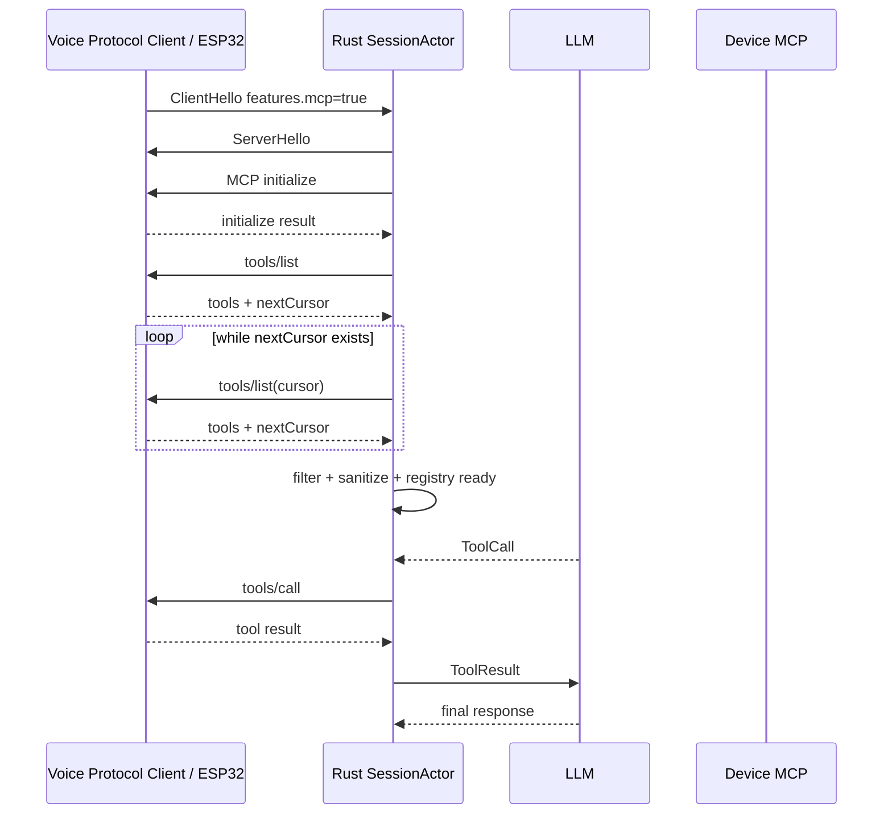
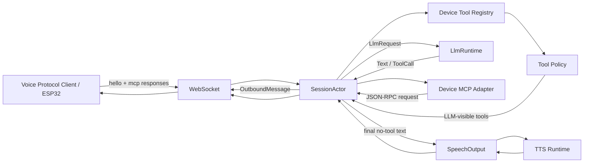

# Phase 6 — Device MCP Implementation Guide

> Project: `hailp-vn38/ai-agent-voice`
> Scope: Device MCP over Voice WebSocket Protocol V1
> Reference behavior: `xinnan-tech/xiaozhi-esp32-server` + `78/xiaozhi-esp32` pinned compatibility baseline
> Implementation language: Rust
> Status: implementation guide for Phase 6

---

## 1. Mục tiêu Phase 6

Phase 6 bổ sung **Device MCP** vào Voice Session hiện tại để LLM có thể khám phá và gọi các tool do Voice Protocol Client cung cấp. Catalog tool thuộc client; Reference Client dùng catalog deterministic:

- `test.echo`
- `test.get_value`
- `test.set_value`

Flow mục tiêu:

```text
Voice input
   ↓
ASR final
   ↓
LLM round
   ↓
ToolCall
   ↓
Device MCP tools/call
   ↓
Tool result
   ↓
LLM continuation
   ↓
Final assistant response
   ↓
TTS
```

Phase 6 phải giữ nguyên các invariant đã xây dựng ở Phase 1–5:

- `SessionActor` là owner duy nhất của mutable Voice Session state.
- Không task/provider nào được tự gửi trực tiếp WebSocket.
- Mọi output thuộc Conversational Turn phải đi qua generation ownership.
- Cancellation/abort không được phát output stale.
- MCP discovery không đồng nghĩa với permission.
- Tool call có side effect không được automatic retry.
- Tool-capable LLM round không được phát TTS trước khi biết round đó có tool call hay không.
- Voice Session vẫn bounded về queue, memory, timeout và concurrency.

---

# 2. Scope

## 2.1 Trong Phase 6

Implement:

1. `hello.features.mcp`.
2. MCP envelope trên WebSocket Protocol V1.
3. JSON-RPC 2.0 request/response parsing.
4. MCP `initialize`.
5. MCP `tools/list`.
6. `tools/list` pagination.
7. Device tool registry per Voice Session.
8. Tool-name sanitization cho LLM.
9. Server-side allowlist/default-deny policy.
10. `tools/call`.
11. Request/response correlation.
12. Tool timeout.
13. Tool result normalization/sanitization.
14. LLM tool schema integration.
15. Tool round buffering.
16. Multi-tool sequential execution.
17. Tool result continuation vào LLM.
18. `max_tool_depth`.
19. Generation/cancellation correctness.
20. Deterministic tests và Reference Client MCP completion gate.

## 2.2 Không nằm trong Phase 6

Không implement:

- server-side MCP plugin marketplace;
- dynamic Rust plugin loading;
- MCP over HTTP/SSE;
- remote third-party MCP server;
- MCP Endpoint của manager;
- RAG;
- long-term memory;
- user confirmation UI;
- interactive permission dialog;
- arbitrary shell/command execution;
- firmware upgrade tool;
- reboot/reset tool;
- dynamic hot reload tool policy;
- parallel execution nhiều Device MCP call trong cùng một LLM round.

---

# 3. Compatibility baseline

Phase 6 dùng behavior của Xiaozhi làm nguồn tham khảo tương thích, không port implementation Python 1:1.

Compatibility flow:



Các điểm cần tương thích với firmware reference:

- thiết bị advertise `"mcp": true` trong `hello.features`;
- server chỉ gửi MCP sau `ServerHello`;
- MCP được bọc trong `type: "mcp"`;
- inner payload là JSON-RPC 2.0;
- request ID là numeric;
- `tools/list` hỗ trợ `nextCursor`;
- `tools/call.params.arguments` là JSON object;
- response giữ nguyên request ID;
- firmware có thể trả `result.isError`;
- firmware có thể trả JSON-RPC `error`.

---

# 4. Wire protocol

## 4.1 Client capability

Mở rộng:

```rust
pub struct ClientFeatures {
    #[serde(default)]
    pub aec: bool,

    #[serde(default)]
    pub mcp: bool,
}
```

Unknown feature vẫn phải compatible.

Ví dụ:

```json
{
  "type": "hello",
  "version": 1,
  "transport": "websocket",
  "features": {
    "aec": true,
    "mcp": true
  },
  "audio_params": {
    "format": "opus",
    "sample_rate": 16000,
    "channels": 1,
    "frame_duration": 60
  }
}
```

Nếu `mcp=false` hoặc field không tồn tại:

- không gửi `initialize`;
- không tạo MCP registry;
- không expose device tool cho LLM;
- voice flow hoạt động bình thường.

---

## 4.2 MCP envelope

Client → server:

```json
{
  "type": "mcp",
  "session_id": "optional-compatible-session-id",
  "payload": {
    "jsonrpc": "2.0",
    "id": 42,
    "result": {}
  }
}
```

Server → client:

```json
{
  "type": "mcp",
  "session_id": "current-session-id",
  "payload": {
    "jsonrpc": "2.0",
    "id": 42,
    "method": "tools/call",
    "params": {}
  }
}
```

`session_id` dùng cùng compatibility rule với `listen`/`abort`:

- missing: accept;
- empty string: accept;
- non-empty match current Voice Session: accept;
- non-empty mismatch: ignore;
- wrong JSON type: parse thành `Unknown`.

---

# 5. JSON-RPC domain types

Không truyền `serde_json::Value` xuyên toàn bộ core nếu có thể tránh.

Đề xuất:

```rust
#[derive(Clone, Copy, Debug, PartialEq, Eq, Hash)]
pub struct McpRequestId(u64);

#[derive(Clone, Debug)]
pub enum McpIncoming {
    Result {
        id: McpRequestId,
        result: serde_json::Value,
    },
    Error {
        id: McpRequestId,
        code: i64,
        message: String,
        data: Option<serde_json::Value>,
    },
    Notification {
        method: String,
        params: Option<serde_json::Value>,
    },
}

#[derive(Clone, Debug)]
pub enum McpOutgoing {
    Initialize {
        id: McpRequestId,
    },
    ToolsList {
        id: McpRequestId,
        cursor: Option<String>,
    },
    ToolsCall {
        id: McpRequestId,
        name: String,
        arguments: serde_json::Map<String, serde_json::Value>,
    },
}
```

MCP adapter chỉ chịu trách nhiệm:

```text
typed McpOutgoing
    ↓ serialize
JSON-RPC payload

JSON-RPC payload
    ↓ validate/parse
typed McpIncoming
```

Adapter không:

- sở hữu WebSocket;
- sở hữu Voice Session state;
- sở hữu tool registry;
- quyết định permission;
- gọi LLM;
- gọi TTS.

---

# 6. Module layout

Đề xuất thêm:

```text
crates/voice-agent-server/src/
├── tools/
│   ├── mod.rs
│   └── device_mcp/
│       ├── mod.rs
│       ├── protocol.rs
│       ├── registry.rs
│       ├── policy.rs
│       ├── sanitize.rs
│       └── result.rs
```

Nếu muốn Phase 6 nhỏ hơn, có thể bắt đầu:

```text
tools/
├── mod.rs
└── device_mcp.rs
```

sau đó tách file khi module lớn.

---

# 7. Ownership model

## 7.1 SessionActor là owner duy nhất

Mỗi Voice Session sở hữu:

```rust
struct DeviceMcpState {
    enabled: bool,
    ready: bool,

    next_request_id: u64,

    discovery: DiscoveryState,

    discovered_tools: HashMap<String, DiscoveredTool>,
    visible_tools: Vec<LlmVisibleTool>,
    name_mapping: HashMap<String, String>,

    pending_requests: HashMap<McpRequestId, PendingMcpRequest>,

    active_tool_batch: Option<ToolBatchState>,
}
```

Không tạo global tool registry vì tool là capability của từng device/session.

---

## 7.2 Không await MCP response bên trong SessionActor

Không làm:

```rust
let result = timeout(..., oneshot_rx).await;
```

trong event handler của actor.

Lý do:

- actor đang chờ;
- MCP response từ WebSocket cần actor xử lý;
- actor không đọc mailbox;
- có thể deadlock hoặc tạo re-entrancy phức tạp.

Đúng hơn là event-driven.

```text
Actor
  |
  |-- send tools/call id=42
  |-- store PendingMcpRequest
  `-- return event loop

later...

SessionEvent::Mcp(Result id=42)
  |
  `-- actor resolves pending request
```

Timeout cũng được mô hình hóa thành event/deadline, không block actor.

---

# 8. SessionEvent changes

Hiện tại:

```rust
pub enum SessionEvent {
    ClientMessage(ClientMessage),
    ClientAudio(Vec<u8>),
}
```

Phase 6 có thể giữ MCP trong `ClientMessage`, nhưng nên parse thành typed message ngay ở protocol layer:

```rust
pub enum ClientMessage {
    Hello(ClientHello),

    Listen {
        session_id: Option<String>,
        command: ListenCommand,
    },

    Abort {
        session_id: Option<String>,
    },

    Mcp {
        session_id: Option<String>,
        payload: McpIncoming,
    },

    Unknown,
}
```

Timeout/internal MCP events có thể là:

```rust
pub enum SessionEvent {
    ClientMessage(ClientMessage),
    ClientAudio(Vec<u8>),

    McpTimeout {
        generation: u64,
        request_id: McpRequestId,
    },
}
```

Hoặc dùng một actor-owned timer queue nếu muốn tránh spawn task cho từng timeout.

---

# 9. MCP initialization

## 9.1 Ordering

Firmware reference đợi ServerHello trước khi xử lý MCP.

Do đó:

```text
1. parse ClientHello
2. construct SessionActor
3. enqueue ServerHello
4. nếu features.mcp=true và config.mcp.enabled=true
      enqueue initialize
```

Cả `ServerHello` và `initialize` nên đi cùng ordered control lane.

Không gửi initialize trước ServerHello.

---

## 9.2 Initialize request

V1 tối thiểu:

```json
{
  "jsonrpc": "2.0",
  "id": 1,
  "method": "initialize",
  "params": {
    "protocolVersion": "2024-11-05",
    "capabilities": {},
    "clientInfo": {
      "name": "voice-agent-server",
      "version": "0.1.0"
    }
  }
}
```

Không cần đưa vision capability vào Phase 6 nếu server chưa implement vision endpoint.

Sau initialize success:

```text
MCP state:
Initializing
    ↓
ListingTools
```

Sau đó gửi `tools/list`.

---

# 10. tools/list pagination

Initial request:

```json
{
  "jsonrpc": "2.0",
  "id": 2,
  "method": "tools/list"
}
```

Continuation:

```json
{
  "jsonrpc": "2.0",
  "id": 3,
  "method": "tools/list",
  "params": {
    "cursor": "..."
  }
}
```

Khuyến nghị Rust dùng **request ID mới cho mỗi page**, mặc dù reference Python có thể reuse ID `2`.

Lý do:

- correlation rõ ràng;
- dễ timeout/debug;
- không nhập nhằng nếu response trễ;
- đúng ownership model.

`nextCursor` empty/missing:

```text
Discovery finished
    ↓
policy filter
    ↓
sanitize
    ↓
registry ready
```

---

# 11. DiscoveredTool và LlmVisibleTool

```rust
#[derive(Clone, Debug)]
pub struct DiscoveredTool {
    pub original_name: String,
    pub description: String,
    pub input_schema: serde_json::Value,
}

#[derive(Clone, Debug)]
pub struct LlmVisibleTool {
    pub llm_name: String,
    pub original_name: String,
    pub description: String,
    pub input_schema: serde_json::Value,
}
```

Phân biệt hai type này là bắt buộc.

```text
device tools/list
      ↓
DiscoveredTool
      ↓
server policy
      ↓
sanitize
      ↓
LlmVisibleTool
```

Không được suy diễn:

```text
discovered == allowed
```

---

# 12. Tool policy

## 12.1 Discovery policy

Policy V1:

```text
not announced by client -> unavailable
dangerous tool          -> deny
announced tool          -> allow
configured allowlist    -> restrict to that subset when present
```

Config:

```toml
[mcp]
enabled = true
call_timeout_ms = 30000

# Optional deployment restriction. Omit to use the client catalog.
# allowed_tools = ["test.echo", "test.get_value", "test.set_value"]
```

Policy phải check **original device name**, không check sanitized LLM name.

---

## 12.2 Dangerous deny list

Dù accidentally nằm trong allowlist, các tool nguy hiểm vẫn bị deny ở V1:

```text
self.reboot
self.reset
self.factory_reset
self.upgrade_firmware
shell.*
command.*
exec.*
```

Không chỉ match exact name; có thể implement:

```rust
fn is_dangerous_tool(name: &str) -> bool
```

V1 không có user confirmation UI, do đó không expose loại tool này cho LLM.

---

# 13. Tool-name sanitization

Tên firmware thường có dot:

```text
self.audio_speaker.set_volume
```

OpenAI-style function name thường cần dạng an toàn:

```text
self_audio_speaker_set_volume
```

Đề xuất:

```rust
fn sanitize_tool_name(original: &str) -> String
```

Rule:

```text
allowed: [A-Za-z0-9_-]
everything else -> _
```

Ví dụ:

```text
self.get_device_status
→ self_get_device_status

self.audio_speaker.set_volume
→ self_audio_speaker_set_volume
```

---

## 13.1 Collision detection

Không overwrite silently:

```text
a.b
a_b
```

cả hai đều có thể sanitize thành:

```text
a_b
```

Khi collision:

- không expose tool collision cho LLM;
- ghi metadata log không chứa sensitive payload;
- giữ Voice Session hoạt động;
- không chọn tool ngẫu nhiên.

Có thể deny cả hai collision để behavior deterministic.

---

## 13.2 Description rewrite

Nếu description chứa original name:

```text
Call `self.get_device_status` first.
```

nhưng LLM chỉ thấy:

```text
self_get_device_status
```

thì rewrite description:

```text
Call `self_get_device_status` first.
```

Rewrite phải dùng complete mapping sau khi discovery kết thúc.

---

# 14. Tool schema conversion

Firmware trả:

```json
{
  "name": "self.audio_speaker.set_volume",
  "description": "...",
  "inputSchema": {
    "type": "object",
    "properties": {
      "volume": {
        "type": "integer"
      }
    },
    "required": ["volume"]
  }
}
```

LLM-visible schema:

```json
{
  "type": "function",
  "function": {
    "name": "self_audio_speaker_set_volume",
    "description": "...",
    "parameters": {
      "type": "object",
      "properties": {
        "volume": {
          "type": "integer"
        }
      },
      "required": ["volume"]
    }
  }
}
```

Không tự thêm argument mà firmware không khai báo.

---

# 15. tools/call

LLM trả:

```text
tool name:
self_audio_speaker_set_volume

arguments:
{"volume": 50}
```

Actor lookup:

```text
sanitized name
    ↓
LlmVisibleTool
    ↓
original_name
```

Wire request:

```json
{
  "type": "mcp",
  "session_id": "...",
  "payload": {
    "jsonrpc": "2.0",
    "id": 42,
    "method": "tools/call",
    "params": {
      "name": "self.audio_speaker.set_volume",
      "arguments": {
        "volume": 50
      }
    }
  }
}
```

Không gửi sanitized name xuống firmware.

---

# 16. Argument validation

Trước khi gửi `tools/call`:

1. arguments phải parse thành JSON object;
2. tool phải tồn tại trong LLM-visible registry;
3. tool phải vẫn được policy cho phép;
4. generation phải current;
5. Voice Session phải còn active;
6. MCP phải `ready`.

Không cố sửa JSON lỗi bằng regex/heuristic.

Nếu LLM trả malformed JSON arguments:

```text
normalize thành tool result:
ok=false
error=invalid_arguments
```

rồi tiếp tục LLM nếu session vẫn khỏe.

---

# 17. Request correlation

Actor giữ:

```rust
HashMap<McpRequestId, PendingMcpRequest>
```

Ví dụ:

```rust
struct PendingMcpRequest {
    generation: u64,
    kind: PendingMcpKind,
    deadline: Instant,
}

enum PendingMcpKind {
    Initialize,
    ToolsList {
        cursor: Option<String>,
    },
    ToolCall {
        tool_call_id: String,
        llm_name: String,
        original_name: String,
    },
}
```

Incoming response:

```text
id exists + generation valid
    ↓
dispatch typed response

id unknown
    ↓
ignore as late/stale response
```

Không close Voice Session chỉ vì nhận response của request đã timeout/cancel.

---

# 18. Timeout

Config:

```toml
[mcp]
enabled = true
call_timeout_ms = 30000
discovery_timeout_ms = 10000
```

Nếu muốn giữ config nhỏ, có thể chỉ expose:

```toml
call_timeout_ms = 30000
```

và dùng internal constant cho discovery Phase 6.

## Tool call timeout

Timeout:

```text
pending.remove(id)
    ↓
normalize ToolResultError::Timeout
    ↓
continue current LLM tool round
```

Không retry.

Đặc biệt:

```text
set_volume timeout
```

không được tự gọi lại vì thiết bị có thể đã thực hiện side effect nhưng response bị mất.

---

# 19. Discovery failure policy

Khuyến nghị:

```text
MCP initialize/list failure
    ↓
mark MCP unavailable for this Voice Session
    ↓
voice remains usable
```

Không fail closed toàn Voice Session chỉ vì tool discovery lỗi.

Sau discovery failure:

```text
mcp.ready = false
visible_tools = []
```

LLM request tiếp theo chạy không tools.

Điều này khác với audio/VAD integrity failure vì MCP là optional capability.

---

# 20. LLM abstraction cần refactor

Hiện tại Phase 4 boundary dạng:

```rust
async fn stream(&self, prompt: String)
```

Phase 6 cần request typed.

Đề xuất:

```rust
pub struct LlmRequest {
    pub messages: Vec<ChatMessage>,
    pub tools: Vec<ToolDefinition>,
}

#[async_trait]
pub trait LlmProvider {
    async fn stream(
        &self,
        request: LlmRequest,
    ) -> Result<LlmEventStream, LlmError>;
}
```

Domain types không import trực tiếp type của crate `llm`.

---

# 21. LLM message model

Đề xuất:

```rust
pub enum ChatMessage {
    System {
        content: String,
    },

    User {
        content: String,
    },

    AssistantText {
        content: String,
    },

    AssistantToolCalls {
        calls: Vec<ToolCall>,
    },

    ToolResult {
        tool_call_id: String,
        content: String,
    },
}
```

Tool call:

```rust
pub struct ToolCall {
    pub id: String,
    pub name: String,
    pub arguments: serde_json::Value,
}
```

---

# 22. LLM events

Không dùng `UnexpectedToolCall` từ Phase 6.

Đề xuất:

```rust
pub enum LlmEvent {
    TextDelta(String),

    ToolCallStart {
        id: String,
        name: String,
    },

    ToolCallArgumentsDelta {
        id: String,
        delta: String,
    },

    ToolCallComplete {
        id: String,
        name: String,
        arguments: serde_json::Value,
    },

    Finished,
}
```

Nếu crate `llm` đã assemble tool input hoàn chỉnh, domain có thể đơn giản:

```rust
pub enum LlmEvent {
    TextDelta(String),
    ToolCall(ToolCall),
    Finished,
}
```

Ưu tiên bridge typed event của crate, không tự parse SSE wire format.

---

# 23. Phase 4 behavior phải giữ khi không có tools

Nếu:

```text
MCP unavailable
```

hoặc:

```text
visible_tools.is_empty()
```

thì giữ behavior Phase 4:

```text
LLM TextDelta
   ↓
SentenceSegmenter
   ↓
SpeechOutput
   ↓
TTS streaming
```

Không bắt mọi request phải buffer toàn bộ response.

---

# 24. Tool-capable round phải buffer

Khi request có LLM-visible tool:

```text
tools != []
```

không được push `TextDelta` trực tiếp vào `SpeechOutput`.

Ví dụ model stream:

```text
"Để tôi kiểm tra..."
ToolCall(self_get_device_status)
```

Nếu TTS câu đầu trước khi ToolCall xuất hiện thì không thể thu hồi.

Do đó:

```rust
struct LlmRoundBuffer {
    prose: String,
    tool_calls: Vec<ToolCall>,
}
```

Flow:

```text
TextDelta
    ↓
round.prose.push(...)

ToolCall
    ↓
round.tool_calls.push(...)

Finished
    ↓
evaluate round
```

---

# 25. Tool round decision

## Round không có tool call

```text
Finished
   ↓
tool_calls empty
   ↓
prose.trim non-empty
   ↓
SpeechOutput
   ↓
TTS
```

## Round có tool call

```text
Finished
   ↓
tool_calls non-empty
   ↓
DO NOT TTS prose
   ↓
execute tool batch
   ↓
append assistant tool-call message
   ↓
append tool results
   ↓
next LLM round
```

Prose của tool round không trở thành Delivered Assistant Response.

---

# 26. Sequential multi-tool batch

Nếu một round trả:

```text
Tool A
Tool B
Tool C
```

Phase 6 chạy:

```text
A -> result
B -> result
C -> result
```

Không parallelize.

Lý do:

- side-effect ordering deterministic;
- tool B có thể phụ thuộc tool A;
- dễ correlation;
- dễ cancellation;
- phù hợp ADR hiện tại.

Tool-level error của A không tự động skip B nếu session/generation còn hợp lệ.

---

# 27. Tool depth

Config:

```toml
[llm]
max_tool_depth = 4
```

`max_tool_depth` đếm **tool round**.

Ví dụ:

```text
LLM round #1 -> tools
LLM round #2 -> tools
LLM round #3 -> final prose
```

tool depth = 2.

Nếu vượt limit:

```text
inject sanitized tool result:
tool_depth_exceeded
```

sau đó cho phép đúng một final LLM round với:

```text
tools = []
```

Nếu final no-tool round vẫn không có text:

```text
llm_empty_final_response
```

và fail controlled turn.

---

# 28. Tool result normalization

Không gửi raw error/body vào LLM context.

Đề xuất internal type:

```rust
pub struct NormalizedToolResult {
    pub ok: bool,
    pub code: &'static str,
    pub content: String,
    pub truncated: bool,
}
```

Success:

```json
{
  "ok": true,
  "content": "{\"volume\":50}"
}
```

Timeout:

```json
{
  "ok": false,
  "code": "timeout"
}
```

Invalid args:

```json
{
  "ok": false,
  "code": "invalid_arguments"
}
```

JSON-RPC error:

```json
{
  "ok": false,
  "code": "device_error"
}
```

Không forward:

- provider stack trace;
- Authorization;
- API key;
- raw HTTP body;
- internal path;
- full MCP raw payload nếu không cần.

---

# 29. Tool result size cap

Config:

```toml
[llm]
max_tool_result_chars = 4096
```

Trước khi append vào prompt:

```text
sanitize
    ↓
UTF-8 / scalar-safe truncate
    ↓
mark truncated=true
```

Không để device trả payload rất lớn làm phình context.

---

# 30. DialogueHistory phải chuyển sang typed history

Hiện tại dạng:

```rust
Vec<String>
```

không đủ cho MCP.

Phase 6 nên đổi thành typed exchange:

```rust
pub enum DialogueAtom {
    User {
        text: String,
    },

    Assistant {
        text: String,
    },

    ToolExchange {
        user_text: String,
        rounds: Vec<ToolRoundRecord>,
        final_assistant: String,
    },
}
```

Hoặc message-based:

```rust
pub struct DialogueHistory {
    exchanges: VecDeque<ExchangeAtom>,
}
```

Quan trọng nhất:

**không eviction nửa tool exchange.**

Một exchange:

```text
user
assistant tool_call
tool result
assistant final
```

phải là atom không thể tách khi trim history.

---

# 31. Prompt/history commit semantics

User message:

```text
ASR final accepted
    ↓
commit user side
```

Assistant final response:

```text
TTS fully drained
    ↓
commit Delivered Assistant Response
```

Nếu turn bị cancel:

- không commit final assistant chưa được deliver;
- không commit partial prose;
- không để tool result orphan trong history.

Nếu tool đã gây side effect nhưng turn bị abort sau đó:

- side effect không thể rollback;
- history vẫn không được giả vờ assistant response đã deliver.

---

# 32. Cancellation

Khi:

```text
abort
listen:start explicit replacement
acoustic barge-in
session close
generation replacement
shutdown
```

phải:

1. invalidate `GenerationGate`;
2. cancel LLM operation;
3. cancel SpeechOutput;
4. mark active MCP tool batch cancelled;
5. remove pending logical MCP request ownership;
6. ignore late MCP responses;
7. release Active Turn đúng một lần.

Không gửi automatic compensating tool call.

---

# 33. MCP call không cancellable ở device level

Firmware V1 không có `tools/cancel`.

Do đó cancellation nghĩa là:

```text
server no longer accepts semantic result
```

chứ không đảm bảo thiết bị dừng side effect đã bắt đầu.

Điều này phải được ghi rõ trong contract.

Ví dụ:

```text
tools/call set_volume(80) sent
user aborts
device may still change volume
late result ignored
```

---

# 34. Generation identity

Mọi pending tool call phải mang generation:

```rust
struct PendingMcpRequest {
    generation: u64,
    ...
}
```

Response chỉ có semantic effect khi:

```text
pending.generation == actor.generation
```

Nếu generation stale:

```text
remove/ignore
```

Không cho stale tool result trigger LLM continuation.

---

# 35. Configuration

Code Phase 6 nên đưa config về đúng contract tài liệu.

Đề xuất:

```toml
[mcp]
enabled = true
call_timeout_ms = 30000
discovery_timeout_ms = 10000

allowed_tools = [
    "self.get_device_status",
    "self.audio_speaker.set_volume",
    "self.screen.set_brightness",
]

[llm]
max_history_messages = 20
prompt_budget_tokens = 12000
max_tool_result_chars = 4096
max_tool_depth = 4
```

Rust:

```rust
pub struct McpConfig {
    pub enabled: bool,
    pub call_timeout_ms: u64,
    pub discovery_timeout_ms: u64,
    pub allowed_tools: Vec<String>,
}

pub struct LlmConfig {
    pub max_history_messages: usize,
    pub prompt_budget_tokens: usize,
    pub max_tool_result_chars: usize,
    pub max_tool_depth: usize,
}
```

---

# 36. Config validation

Validate:

```text
call_timeout_ms > 0
discovery_timeout_ms > 0
max_tool_depth > 0
max_tool_result_chars > 0
prompt_budget_tokens > 0
allowed_tools contains non-empty strings
allowed_tools has no duplicate exact original names
```

Dangerous names trong allowlist:

- có thể fail startup;
- hoặc silently deny.

Khuyến nghị **fail startup** để config error lộ rõ.

---

# 37. AppState

MCP không cần global runtime kiểu VAD/ASR/TTS.

Policy config có thể nằm trong:

```rust
Arc<AppConfig>
```

Tool state vẫn per-session.

Không tạo:

```rust
GlobalMcpRuntime
```

trừ khi sau này có server-side MCP transport riêng.

---

# 38. Outbound MCP

MCP request phải dùng control lane:

```text
OutboundMessage::Text
```

Có thể thêm typed variant:

```rust
OutboundMessage::Mcp {
    generation: Option<u64>,
    text: String,
}
```

nhưng không bắt buộc.

Discovery message không thuộc Conversational Turn generation.

Tool call thì thuộc generation và cần stale protection.

Có thể phân biệt:

```rust
OutboundMessage::SessionText
OutboundMessage::TurnText { generation, ... }
```

Tool `tools/call` nên là `TurnText`.

---

# 39. Incoming MCP routing

Trong `parse_client_message()`:

```text
type == "mcp"
    ↓
parse optional session_id
    ↓
parse payload JSON-RPC
    ↓
ClientMessage::Mcp
```

Trong actor:

```rust
ClientMessage::Mcp { session_id, payload }
    ↓
inbound_session_matches(...)
    ↓
on_mcp_message(payload)
```

MCP malformed application message:

- ignore hoặc convert controlled MCP error state;
- không panic;
- không log raw payload.

---

# 40. Discovery state machine

Đề xuất:

```rust
enum DiscoveryState {
    Disabled,

    WaitingInitialize {
        request_id: McpRequestId,
    },

    Listing {
        request_id: McpRequestId,
        cursor: Option<String>,
    },

    Ready,

    Failed,
}
```

Transitions:

```text
Disabled
  |
  | hello mcp=true + config enabled
  v
WaitingInitialize
  |
  | valid result
  v
Listing
  |
  | tools page + nextCursor
  v
Listing
  |
  | final page
  v
Ready
```

Error/timeout:

```text
any discovery state
    ↓
Failed
```

Voice Session vẫn usable.

---

# 41. Tool batch state machine

```rust
struct ToolBatchState {
    generation: u64,
    round_depth: usize,
    calls: Vec<ToolCall>,
    next_index: usize,
    results: Vec<ToolResultMessage>,
}
```

Flow:

```text
LLM round Finished with calls
    ↓
create ToolBatchState
    ↓
send call[next_index]
    ↓
await event loop
    ↓
result
    ↓
results.push(...)
    ↓
next_index += 1
    ↓
more?
   /   \
 yes    no
 |       |
call     next LLM round
```

---

# 42. LLM runtime changes

Hiện tại runtime start nhận:

```rust
start(identity, prompt, cancellation)
```

Phase 6:

```rust
start(identity, request, cancellation)
```

với:

```rust
LlmRequest
```

Runtime vẫn:

- giữ global LLM semaphore;
- giữ timeout toàn operation;
- route event theo session;
- không biết MCP;
- không gọi tool.

MCP orchestration thuộc actor.

---

# 43. Provider adapter responsibilities

OpenAI adapter:

```text
domain LlmRequest
    ↓
crate llm ChatMessage + ToolDefinition
    ↓
chat_stream_with_tools(...)
    ↓
crate StreamChunk
    ↓
domain LlmEvent
```

Adapter không:

- execute tools;
- giữ tool depth;
- giữ history;
- quyết định TTS buffering;
- biết generation policy ngoài identity do runtime quản lý.

---

# 44. System prompt và tool definitions

System prompt không được xem là security boundary.

Không dùng prompt kiểu:

```text
Only call safe tools.
```

để thay policy.

Policy bắt buộc diễn ra **trước khi tool schema tới LLM**.

```text
device discovery
    ↓
policy filter
    ↓
LLM-visible tools
```

---

# 45. Privacy

Không log:

- MCP raw payload;
- tool arguments;
- tool result content;
- transcript;
- prompt;
- assistant generated text;
- Authorization/token/API key;
- Device ID / Client ID raw.

Được log metadata:

```text
event=mcp_tool_call_started
trace_session_id=<random>
generation=4
request_id=42
tool_name_hash=...
```

Nếu tool name không được coi sensitive theo policy project, vẫn ưu tiên không log raw arguments/result.

---

# 46. Existing privacy issue cần sửa trước/đồng thời Phase 6

WebSocket writer hiện không nên log full `llm_text`.

Phase 6 phải bảo đảm tracing chỉ ghi:

```text
chars=<count>
message_type=llm
```

không ghi raw assistant content.

Không thêm log:

```text
arguments = ...
result = ...
payload = ...
```

như reference Python.

---

# 47. Tool-level failure policy

Khi Voice Session vẫn khỏe:

```text
timeout
JSON-RPC error
result.isError=true
invalid arguments
tool disappeared
discovery race
```

→ normalize thành `ToolResult(ok=false)`
→ continue LLM.

Terminal:

```text
WebSocket disconnect
session replaced
generation cancelled
root cancellation
shutdown
MCP route unavailable because session is gone
```

→ không tiếp tục LLM.

---

# 48. isError handling

Firmware có thể trả:

```json
{
  "result": {
    "content": [
      {
        "type": "text",
        "text": "..."
      }
    ],
    "isError": true
  }
}
```

Đây là logical tool failure.

Không coi nó là successful content.

Normalize:

```text
ok=false
code=device_tool_error
```

---

# 49. JSON-RPC error handling

Ví dụ:

```json
{
  "jsonrpc": "2.0",
  "id": 42,
  "error": {
    "code": -32602,
    "message": "Invalid arguments"
  }
}
```

Không forward message raw vào LLM nếu message có thể chứa implementation detail.

Normalize:

```text
ok=false
code=device_rpc_error
```

Có thể map known code:

```text
-32601 -> method_not_found
-32602 -> invalid_params
other  -> device_rpc_error
```

---

# 50. Prompt token budget

Phase 6 nên implement `prompt_budget_tokens`.

Prompt assembly giữ:

1. system;
2. current user turn;
3. current tool round;
4. newest history Exchange Atom.

Evict:

```text
oldest complete Exchange Atom first
```

Không cắt:

```text
assistant tool call
```

khỏi:

```text
matching tool result
```

---

# 51. Suggested implementation order

## Ticket 6A — MCP wire + discovery

Files:

```text
protocol/client.rs
protocol/server.rs
tools/device_mcp/*
session/actor/*
app/websocket.rs
config/*
```

Implement:

- `features.mcp`;
- ClientMessage MCP parsing;
- JSON-RPC types;
- ServerHello → initialize ordering;
- initialize response;
- tools/list;
- pagination;
- discovery timeout;
- ready/failed state.

Tests:

- mcp=false → no initialize;
- mcp=true → initialize after ServerHello;
- initialize result → tools/list;
- pagination;
- malformed response;
- discovery timeout;
- session-id compatibility.

Completion:

```text
ESP32 connects
server discovers real device tools
```

chưa cần LLM.

---

## Ticket 6B — Registry + policy + tools/call

Implement:

- DiscoveredTool;
- LlmVisibleTool;
- allowlist;
- dangerous deny;
- sanitization;
- collision handling;
- description rewrite;
- tools/call;
- request correlation;
- timeout;
- late response ignore.

Tests:

- original↔sanitized mapping;
- collision;
- unknown tool denied;
- dangerous tool denied;
- timeout cleanup;
- out-of-order response IDs;
- no automatic retry.

Completion:

```text
actor/test harness can call one real device tool safely
```

---

## Ticket 6C — LLM tool rounds

Implement:

- typed `LlmRequest`;
- typed `ChatMessage`;
- typed ToolDefinition;
- tool stream bridge;
- round buffer;
- sequential multi-tool;
- tool result continuation;
- max tool depth;
- typed Exchange Atom history;
- prompt budget.

Tests:

- fragmented tool arguments;
- prose + tool call does not TTS;
- final no-tool prose TTS;
- multiple tools preserve order;
- tool error continues;
- depth exceeded;
- cancellation;
- stale tool result;
- history eviction atomic.

---

## Ticket 6D — Reference Client MCP E2E completion gate

Reference Client giữ `value = 10` khi bắt đầu Voice Session và thực thi tool trong state của client. Scenario:

```text
User:
"Đặt giá trị thành 50"

ASR:
final text

LLM:
test_set_value

Server:
tools/call test.set_value({ value: 50 })

Reference Client:
value = 50, result

LLM:
final natural-language response

TTS:
audio delivered
```

Second scenario trên cùng Voice Session:

```text
User:
"Giá trị hiện tại là bao nhiêu?"

LLM:
tool call test_get_value

Reference Client:
returns `{ "value": 50 }`

LLM:
final confirmation

TTS:
delivered
```

Completion gate yêu cầu Reference Client nhận và thực thi tool stateful qua WebSocket thật. ESP32/Xiaozhi là compatibility reference.

---

# 52. Unit test matrix

## Protocol

- parse MCP success result.
- parse MCP JSON-RPC error.
- parse notification.
- invalid jsonrpc.
- invalid id type.
- invalid payload type.
- session_id missing.
- session_id empty.
- session_id mismatch.

## Registry

- sanitize dot.
- sanitize unsupported characters.
- collision.
- allowlist.
- dangerous deny.
- schema passthrough.
- description rewrite.

## Discovery

- initialize success.
- initialize error.
- initial list.
- 2+ page pagination.
- empty tool list.
- duplicate original tool.
- malformed schema.
- timeout.

## Call

- successful content.
- `isError=true`.
- JSON-RPC error.
- timeout.
- out-of-order response.
- late response.
- stale generation.
- unknown id.
- malformed arguments.

## LLM

- no tool definitions → Phase 4 streaming.
- tool definitions → round buffering.
- text-only tool-capable round.
- prose then tool call.
- tool call then prose.
- fragmented arguments.
- multi-tool.
- tool error continuation.
- max depth.
- empty final response.

## Cancellation

- abort before tool send.
- abort after tool send.
- response after abort.
- reconnect/session replacement.
- shutdown.

---

# 53. Integration test scenario

Fake MCP client:

```text
connect WS
send hello mcp=true
receive ServerHello
receive initialize
reply initialize result
receive tools/list
reply two pages
```

Fake LLM:

```text
round 1:
ToolCall self_get_device_status

round 2:
Text "Âm lượng hiện tại là 50%."
```

Assertions:

```text
ServerHello before initialize
tools/list pagination complete
only policy-approved tool visible
tools/call uses original device name
tool result fed to LLM
tool-round prose never reaches TTS
final response reaches TTS
```

---

# 54. Reference Client extension

`voice-reference-client` là Device MCP Server deterministic của completion gate. Core library giữ state MCP trong cùng WebSocket để nhiều text turn có thể xác nhận persistence; CLI `--mcp` chỉ là wrapper debug.

Ví dụ:

```bash
cargo run -p voice-reference-client -- \
  --ota http://127.0.0.1:8000/voice/ota/ \
  --mcp \
  "Đặt giá trị thành 50"
```

Reference Client Device MCP Server phải:

- advertise `mcp=true`;
- answer initialize;
- return deterministic paginated tools/list;
- execute `test.echo`, `test.get_value` và stateful `test.set_value` (initial value 10, valid 0..=100);
- return MCP `result.content`/`isError` and record call order.

Nhờ đó CI không cần ESP32.

API gate giữ một kết nối stateful thay vì tạo WebSocket mới cho mỗi text turn:

```rust
let mut client = ReferenceClient::connect(McpSessionOptions { /* ... */ }).await?;
client.run_text_turn("Đặt giá trị thành 50").await?;
client.run_text_turn("Giá trị hiện tại là bao nhiêu?").await?;
let report = client.finish();
```

`report.received_calls` giữ thứ tự wire call, còn `report.tool_results` giữ content
và `is_error` của response do Device MCP Server trả về.

---

# 55. Reference Client MCP completion gate

Phase 6 được đánh dấu hoàn tất khi:

```text
real WebSocket protocol
    +
real tools/list
    +
real tools/call
```

được chứng minh.

Gate tối thiểu:

```text
Text or voice command
→ ASR
→ LLM tool call
→ Reference Client stateful tool
→ result
→ LLM final
→ TTS
```

Scenario bắt buộc:

```text
test.set_value({ value: 50 })
```

trên state initial `value = 10`, sau đó `test.get_value()` phải trả 50 trong cùng Voice Session. `test.echo` dùng cho regression deterministic. ESP32/Xiaozhi tiếp tục là firmware compatibility reference, không phải acceptance gate.

---

# 56. Definition of Done

Phase 6 hoàn tất khi tất cả điều sau đúng:

- `features.mcp=true` được nhận đúng;
- ServerHello luôn precedes MCP initialize;
- initialize success;
- tools/list pagination hoạt động;
- per-session device registry hoàn chỉnh;
- default-deny policy hoạt động;
- dangerous tools không thể expose;
- sanitize mapping deterministic;
- collision không overwrite;
- tools/call numeric correlation đúng;
- timeout cleanup đúng;
- không automatic retry;
- out-of-order response đúng request;
- stale result không tạo semantic effect;
- LLM nhận đúng tool schema;
- tool-capable round buffer trước TTS;
- multi-tool chạy tuần tự;
- tool failure có thể continuation;
- max tool depth hoạt động;
- tool result bounded/sanitized;
- history không tách tool exchange;
- abort không tạo stale LLM/TTS;
- logs không chứa MCP content/argument/result;
- deterministic CI tests pass;
- Reference Client MCP stateful E2E pass.

---

# 57. Recommended Rust contracts

Một contract tổng hợp có thể bắt đầu như sau:

```rust
pub struct ToolDefinition {
    pub name: String,
    pub description: String,
    pub parameters: serde_json::Value,
}

pub struct ToolCall {
    pub id: String,
    pub name: String,
    pub arguments: serde_json::Value,
}

pub enum ChatMessage {
    System(String),
    User(String),
    AssistantText(String),
    AssistantToolCalls(Vec<ToolCall>),
    ToolResult {
        tool_call_id: String,
        content: String,
    },
}

pub struct LlmRequest {
    pub messages: Vec<ChatMessage>,
    pub tools: Vec<ToolDefinition>,
}

pub enum LlmEvent {
    TextDelta(String),
    ToolCall(ToolCall),
    Finished,
}
```

MCP:

```rust
pub struct DiscoveredTool {
    pub original_name: String,
    pub description: String,
    pub input_schema: serde_json::Value,
}

pub struct LlmVisibleTool {
    pub llm_name: String,
    pub original_name: String,
    pub description: String,
    pub input_schema: serde_json::Value,
}

pub enum McpIncoming {
    Result {
        id: McpRequestId,
        result: serde_json::Value,
    },
    Error {
        id: McpRequestId,
        code: i64,
        message: String,
    },
}
```

---

# 58. Actor pseudo-flow

```rust
fn on_llm_finished(&mut self) {
    if self.round.tool_calls.is_empty() {
        self.deliver_final_round();
        return;
    }

    if self.tool_depth >= self.config.max_tool_depth {
        self.start_final_no_tools_round_with_depth_error();
        return;
    }

    self.tool_depth += 1;
    self.start_tool_batch();
}

fn start_tool_batch(&mut self) {
    let first = self.round.tool_calls[0].clone();

    match self.resolve_visible_tool(&first.name) {
        Some(tool) => {
            self.send_mcp_call(tool, first);
        }
        None => {
            self.record_tool_failure("tool_not_available");
            self.advance_tool_batch();
        }
    }
}

fn on_mcp_tool_result(
    &mut self,
    id: McpRequestId,
    result: McpIncoming,
) {
    let Some(pending) = self.pending_requests.remove(&id) else {
        return;
    };

    if pending.generation != self.generation {
        return;
    }

    self.record_normalized_result(result);
    self.advance_tool_batch();
}
```

---

# 59. Failure matrix

| Failure | Voice Session | LLM continuation |
|---|---|---|
| MCP unsupported | healthy | no tools |
| initialize timeout | healthy | no tools |
| tools/list malformed | healthy | no tools |
| tool not allowlisted | healthy | normalized failure / ideally never visible |
| argument invalid | healthy | yes |
| tools/call timeout | healthy | yes |
| JSON-RPC error | healthy | yes |
| result.isError | healthy | yes |
| tool result too large | healthy | yes, truncated |
| max tool depth | healthy | one final no-tools round |
| user abort | current turn cancelled | no |
| generation replacement | current turn cancelled | no |
| WebSocket disconnect | session terminal | no |
| shutdown | session terminal | no |

---

# 60. Không nên làm

Không làm các pattern sau:

### MCP adapter gửi thẳng WebSocket

```rust
mcp_client.websocket.send(...)
```

Sai ownership.

### LLM provider tự execute tool

```rust
provider.handle_tool_call(...)
```

Sai layer.

### Actor await tools/call

```rust
let result = call_tool().await;
```

Có nguy cơ block event loop/correlation.

### Discovery == permission

```rust
for tool in tools_list {
    expose_to_llm(tool);
}
```

Sai security boundary.

### Retry tools/call

```rust
if timeout {
    retry();
}
```

Không an toàn với side effect.

### Stream tool-round prose thẳng TTS

```rust
TextDelta -> SpeechOutput
```

Sai vì ToolCall có thể xuất hiện sau prose.

### Persist raw MCP content trong tracing

```rust
info!(?payload)
```

Không phù hợp privacy contract.

---

# 61. Suggested file-by-file changes

## `protocol/client.rs`

- add `ClientFeatures.mcp`;
- add `ClientMessage::Mcp`;
- parse MCP envelope;
- reuse `parse_session_id`.

## `protocol/server.rs`

Có thể thêm helper serialize MCP envelope.

## `tools/device_mcp/*`

- JSON-RPC types;
- registry;
- sanitize;
- policy;
- result normalization.

## `session/event.rs`

- optional MCP timeout/internal events.

## `session/actor/mod.rs`

Add:

```text
mcp state
llm round buffer
tool depth
tool batch
```

## `session/actor/ingress.rs`

- route ClientMessage::Mcp.

## `session/actor/delivery.rs`

Refactor:

```text
normal LLM streaming path
tool-capable buffered round path
tool result continuation
```

## `session/turn.rs`

Replace simple `Vec<String>` history with typed Exchange Atom.

## `providers/llm/mod.rs`

- typed request;
- typed message;
- typed tool definition/call;
- remove Phase-4-only `UnexpectedToolCall` semantics.

## `workers/llm.rs`

- accept `LlmRequest`;
- route tool events;
- preserve current semaphore/timeout/cancellation behavior.

## `config/mod.rs`

- add `McpConfig`;
- extend `LlmConfig`.

## `config/defaults.rs`

Add defaults.

## `config/validation.rs`

Validate MCP/LLM tool settings.

## `app/websocket.rs`

- pass `hello.features.mcp`;
- ensure ServerHello before initialize;
- remove raw LLM content logging.

## `config.example.toml`

Add `[mcp]` and complete `[llm]`.

---

# 62. PR boundary khuyến nghị

Không làm toàn bộ Phase 6 trong một PR.

### PR 6.1 — Wire + discovery

```text
ClientFeatures.mcp
MCP protocol types
initialize
tools/list
pagination
tests
```

### PR 6.2 — Registry + policy + call correlation

```text
tool registry
allowlist
sanitize
tools/call
timeout
tests
```

### PR 6.3 — LLM tool integration

```text
typed LlmRequest
tool events
round buffering
tool continuation
tests
```

### PR 6.4 — History + Reference Client MCP gate

```text
Exchange Atom
prompt budget
Reference Client MCP stateful gate
docs
```

---

# 63. Exit criteria chính thức đề xuất

Có thể cập nhật `docs/06-implementation-plan.md` Phase 6 thành:

```text
Exit criteria:

- A Voice Protocol Client advertising features.mcp=true completes
  ServerHello → initialize → paginated tools/list.
- Only server-allowlisted non-dangerous discovered tools become LLM-visible.
- Sanitized LLM tool names map deterministically back to original device names,
  with collisions rejected rather than overwritten.
- tools/call is correlated by numeric request id, bounded by timeout, never
  automatically retried, and late/stale responses have no semantic effect.
- Tool-capable LLM rounds buffer prose until round completion. A round containing
  tool calls emits no TTS; tool results are normalized and sent to a subsequent
  LLM round. Only a final no-tool round is synthesized.
- Multiple tool calls execute sequentially in model order.
- Tool result/history retention remains bounded and tool exchanges are not
  split by history eviction.
- Abort, generation replacement, disconnect and shutdown cannot resume stale
  MCP/LLM/TTS output.
- Deterministic protocol/runtime tests pass.
- Final completion gate: the Reference Client Device MCP Server executes a
  stateful tools/call produced from a text/voice turn and its result reaches the
  final LLM/TTS response.
```

---

# 64. Final architecture



Boundary quan trọng:

```text
WebSocket transport
        |
        v
SessionActor
   |       |
   |       +------ Device MCP adapter
   |
   +-------------- LLM Runtime
   |
   +-------------- SpeechOutput/TTS
```

`SessionActor` là nơi duy nhất orchestration ba domain này gặp nhau.

---

# 65. Kết luận

Phase 6 không chỉ là thêm ba RPC:

```text
initialize
tools/list
tools/call
```

Phần khó nhất là giữ đúng ownership và lifecycle của Voice Session khi LLM có tool call.

Implementation phải bảo đảm bốn lớp tách biệt:

```text
Protocol
    ↓
Device MCP discovery/call
    ↓
Server policy
    ↓
LLM tool orchestration
```

Nếu giữ đúng boundary này, Phase 6 sẽ không phá các invariant đã đạt được ở Phase 3–5 và vẫn cho phép mở rộng provider/tool trong tương lai mà không biến `SessionActor`, WebSocket hoặc LLM adapter thành một khối monolithic.
