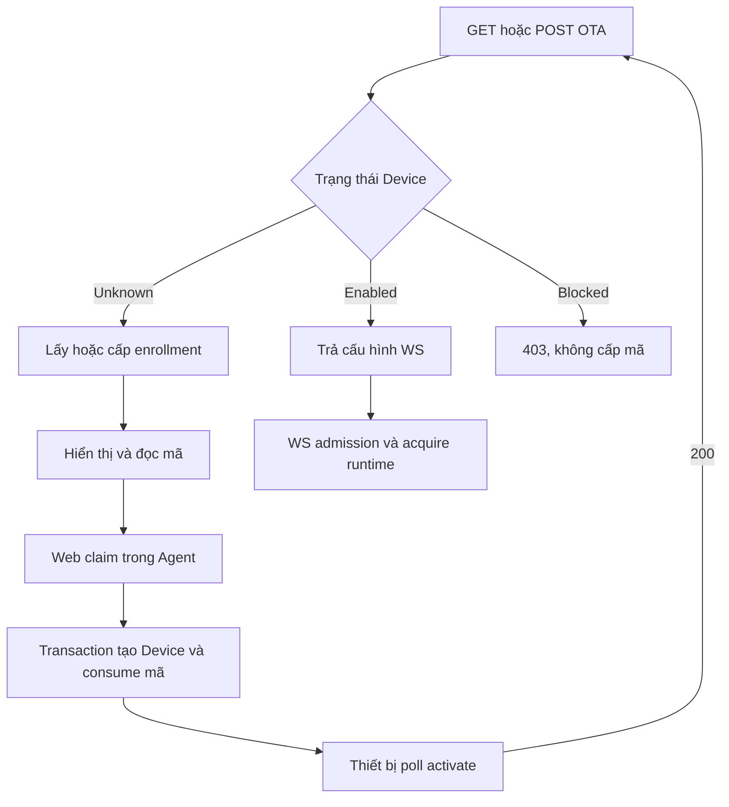

# Hướng dẫn triển khai Add Device bằng mã kích hoạt

## 1. Mục tiêu và baseline đã review

Thêm flow đăng ký thiết bị: ESP32 gọi OTA → nhận mã 6 số → quản trị viên nhập mã trong Agent trên web → server tạo Device trong SQLite → thiết bị poll activate → gọi lại OTA lấy cấu hình WS → WS admission resolve Device → Agent → Template → Providers.

**Dùng SQLite hiện có thay Redis.** Enrollment là dữ liệu tạm của control plane, không nằm trong audio pipeline. Device chỉ được tạo khi claim thành công.

Baseline review ngày 03/10/2026:

- Repository: `hailp-vn38/ai-agent-voice`.
- Branch: `dev-test`.
- Commit: `275c0a1830e937f4689f4aed28fed2bb7bdf36ca` — `feat: add bounded provider runtime manager`.
- Review tập trung vào OTA, Admin Device CRUD, database admission/migrations, session profile và các ADR liên quan. Đã đọc code qua snapshot của commit; chưa build hoặc chạy test server trong review này. Đây là hướng dẫn triển khai, không phải xác nhận feature đã được implement.
- Khi bắt đầu làm, fetch lại `dev-test`; nếu HEAD khác baseline, đối chiếu lại các file/ADR dưới đây trước khi áp dụng. Không ghi đè migration hoặc thay đổi đang có.

### 1.1. Các seam thực tế trong code

Các đường dẫn dưới đây tương đối với root repository; source permalink nằm ở cuối tài liệu.

| File/thành phần | Hiện trạng đã xác minh | Việc cần làm |
|---|---|---|
| `src/app/ota.rs` | Handler chỉ nhận state/header; trả time, firmware rỗng, URL WS và `auth.token`; chưa đọc Device hoặc body | Thêm nhánh pending/registered/blocked và giới hạn body |
| `src/protocol/server.rs` | `OtaResponse.websocket` bắt buộc; chưa có activation | Chuyển websocket thành optional, thêm activation optional; omit field khi không có |
| `src/app/mod.rs` | Mount GET/POST/OPTIONS `/voice/ota/`; WS `/voice/v1/`; Admin chỉ mount khi database và API enabled | Bổ sung `/voice/ota/activate`, giữ các route cũ |
| `src/app/admin/devices.rs` | Có create/list/get/patch Device; Agent enabled; Template override phải thuộc assignment enabled và Template enabled | Tái sử dụng validation và logic insert trong transaction claim |
| `src/app/admin/mod.rs` | Bearer admin riêng, JSON transport, request ID, audit, body 256 KiB | Claim nằm trong router này, hưởng cùng middleware |
| `src/database/admission.rs` | Unknown Device được từ chối hoặc auto-register; Device/Agent disabled bị Denied; snapshot graph trước upgrade | Giữ WS admission; OTA cần lookup chỉ đọc trạng thái, không gọi auto-register |
| `src/app/state.rs` | `resolve_session_profile` có thể acquire provider runtime; nếu admission tắt sẽ dùng server defaults | Không gọi resolver từ OTA, activate hoặc claim |
| `src/database/mod.rs` | SQLx pool, WAL, foreign keys, busy timeout; migration embedded, fail trước bind | Thêm migration forward-only và enrollment repository |
| `src/app/admin/deletion.rs` | Device có history trả `409 device_in_use`; delete dùng `If-Match` | Không biến unbind thành xóa ngầm; FK enrollment không được chặn delete vốn hợp lệ |
| `src/database/history.rs` | Retention cleaner có task và cancellation riêng; archive gắn lifecycle | Enrollment cleaner có owner riêng, chạy dù transcript capture tắt |

Prefix của các file `src/...` trong bảng là `crates/voice-agent-server/`.

### 1.2. Các phát hiện quan trọng khi tích hợp

1. **[Cao khi bật onboarding] OTA đang phát token mà chưa kiểm tra Device.** Đây là hành vi hiện tại trong mô hình trusted LAN. Khi enrollment bật, pending/blocked response phải bỏ cả trường websocket, không trả token. Khi feature tắt, giữ response legacy để tránh regression.
2. **[Cao] Database bật chưa đồng nghĩa WS enforce Device.** `resolve_session_profile` dùng server defaults nếu `database.devices.admission_enabled=false`. Enrollment enabled phải bắt buộc admission enabled; nếu không, thiết bị có thể đi vào WS mà chưa claim khi có token hoặc token đang rỗng.
3. **[Cao] Không dùng `admit_device`/`resolve_session_profile` để phát mã.** Admission Denied bao gồm disabled; admission còn có nhánh auto-register, còn resolver có thể tải model. OTA phải phân biệt rõ `Unknown`, `Registered`, `Blocked`, `Unavailable` bằng một read query Device JOIN Agent.
4. **[Vừa] Một số error mapping trong Device CRUD chưa thích hợp để sao chép.** Lookup Agent dùng wildcard error → `invalid_agent`; `mutation_sql_error` có thể biến lỗi không phải busy thành `409 resource_conflict`. Enrollment phải phân biệt RowNotFound, unique violation, busy và storage failure; DB lỗi không được báo như mã sai hay Agent sai.
5. **[Vừa] Response sau commit phải ổn định.** Create Device hiện commit rồi đọc lại DTO; đọc lại lỗi có thể trả 503 dù insert đã thành công. Claim nên dựng DTO trong transaction trước commit và trả DTO đó sau commit; không thêm read dependency sau commit.
6. **[Vừa] Runtime manager hiện có là optional.** Claim chỉ xác nhận dữ liệu liên kết. Managed mode có thể acquire exact Provider Version ở WS admission; legacy mode vẫn phụ thuộc runtime đã load. Không cam kết “claim xong là hội thoại được” và không bắt restart vô điều kiện.

Đây là các ràng buộc tích hợp trong phạm vi review, không phải báo cáo audit toàn repository.

## 2. Quyết định triển khai

| Chủ đề | Quyết định V1 |
|---|---|
| Kho dữ liệu | Một SQLite của server; không thêm Redis hoặc bản sao cache authoritative |
| Enrollment identity | ID riêng cho từng lần cấp mã; Protocol Device Identity giữ nguyên byte |
| Mã | Chuỗi đúng 6 chữ số ASCII; giữ số 0 đầu; CSPRNG và chọn phân phối đều |
| TTL | 600 giây tính từ lần cấp; OTA gọi lại không gia hạn |
| Một thiết bị | Tối đa một enrollment có status pending; expire lazy trước khi cấp mới |
| Claim | Admin token; create Device + consume code + audit trong một transaction |
| Consume | At most once; code đã dùng không thể bind lại hoặc chuyển Agent |
| Poll | 202 pending; 200 Device và Agent enabled; blocked 403; DB lỗi 503 |
| Runtime | Không load model ở OTA/activate/claim; WS là boundary acquire runtime |
| WS auto-register | Bắt buộc false khi enrollment enabled |
| Rate limiting | Reverse proxy/network ACL theo ADR-0051; không tự thêm in-process brute-force limiter |
| Cleanup | Task riêng, startup rồi mỗi 60 giây, bounded batch; TTL luôn enforce lúc đọc/claim |
| Revoke | Database mutation chỉ ảnh hưởng connection mới; revoke session realtime ngoài phạm vi |
| Token | Giữ voice token cấu hình hiện tại cho Device được phép; không tạo credential riêng trong feature này |

Mã kích hoạt là cơ chế liên kết Device với Agent. MAC/Device-Id và Client-Id do client khai không chứng minh quyền sở hữu phần cứng. Challenge V1 phục vụ firmware polling; không tuyên bố đã xác thực HMAC. Muốn device authentication mạnh cần provision credential và thiết kế riêng.

ADR cần tuân thủ: 0049, 0051, 0052, 0058, 0063, 0064, 0065, 0066, 0070 và 0071. Đặc biệt không retry transaction trên BUSY/LOCKED, không query DB từ SessionActor, không tạo admin CORS, không fallback khi DB lỗi.

## 3. Flow cuối cùng



### 3.1. Lookup trạng thái dùng chung cho OTA và activate

Repository trả enum domain, không trả một bool “admitted”:

- `Unknown`: không có row Device cho đúng Device-Id.
- `Registered`: Device tồn tại, Device enabled và Agent enabled.
- `Blocked`: Device tồn tại nhưng Device/Agent disabled; không được cấp mã mới.
- Lỗi SQL/pool/I/O: trả error riêng, HTTP 503.

Query chỉ lấy `d.id`, `d.enabled`, `a.enabled`; dùng LEFT JOIN hoặc cách khác để orphan/corrupt Agent bị fail closed, không biến thành Unknown. Không đọc Provider config, prompt hay toàn graph. Không gọi `admit_device`, vì phương thức đó có thể auto-register.

Device được thêm thủ công cũng là Registered; activate không bắt buộc enrollment claimed còn tồn tại. `devices` là nguồn trạng thái authoritative sau claim. Template/provider invalid không biến Device thành Unknown: OTA/activate vẫn thể hiện registration, WS có thể trả 503 profile/runtime unavailable.

### 3.2. Identity và metadata

- OTA/activate dùng header `Device-Id`, `Client-Id`; HTTP header name không phân biệt hoa thường.
- Khi feature bật, yêu cầu đúng một giá trị mỗi header; duplicate, rỗng hoặc vượt giới hạn trả 400 trước DB. Device-Id dùng cùng rule hiện có: 1..128 byte UTF-8, không ASCII control/DEL, **không trim/lowercase/chuẩn hóa MAC**. Client-Id áp cùng bound.
- Client-Id là metadata, không phải secret và không tham gia ownership. Cùng Device-Id đổi Client-Id trong TTL vẫn nhận cùng code/challenge; không cập nhật metadata mỗi poll và không gia hạn.
- Không nhận identity từ body để ghi đè header. Không thêm query chứa activation code hoặc token.
- OTA POST cap 32 KiB, kể cả chunked không Content-Length; GET không tạo dependency vào body. POST body rỗng được xem là `{}`, body không rỗng phải là JSON object và Content-Type JSON.
- Chỉ giữ metadata được whitelist từ firmware/board như application.version, board.type/name. Nếu body thiếu field thì bỏ qua. Dựng object server-owned `{ "source": "activation_code", "client_id": "...", "firmware": { ... }, "board": { ... } }`.
- JSON metadata cuối cùng ≤16 KiB, depth ≤8, nodes ≤256 như bound admin hiện tại. Field được lưu giới hạn chuỗi trước serialize; không giữ Authorization, token, HMAC, challenge payload, Wi-Fi credential hoặc nguyên request.
- Payload tương thích firmware có thể chứa nhiều field khác: kiểm tra shape/bound rồi bỏ các field ngoài whitelist; không deny-unknown toàn body OTA.

## 4. Config mới

Thêm `EnrollmentConfig` dưới `DatabaseDevicesConfig` với `#[serde(default)]`, `deny_unknown_fields`. Config sau là **đề xuất mới**, chưa dùng được trên baseline:

```toml
[database]
enabled = true

[database.devices]
admission_enabled = true
auto_register = false

[database.devices.enrollment]
enabled = true
code_ttl_seconds = 600
retention_seconds = 86400
cleanup_interval_seconds = 60
max_pending = 1000

[api]
enabled = true
admin_token = "<deployment-managed-admin-token>"
```

Default enrollment.enabled=false; bỏ section phải parse đúng và giữ behavior cũ. Validation khi bật:

1. database.enabled, admission_enabled và api.enabled đều true; admin_token non-empty đã có rule.
2. auto_register=false; cấu hình mâu thuẫn fail trước bind, không tự sửa silent.
3. TTL 60..3600; retention từ TTL tới 604800 giây; cleanup interval 10..3600; max_pending 1..10000.
4. Giữ config/debug secret handling hiện có; không log admin_token/voice token.

`retention_seconds` là thời gian giữ terminal row sau thời điểm kết thúc: claimed/cancelled tính từ terminal_at; expired tính từ expires_at. Với default, giữ mã terminal 24 giờ để báo lỗi dùng lại và giảm reuse ngay lập tức.

TTL theo Unix seconds UTC; OTA server_time vẫn Unix milliseconds và timezone_offset=420. Không trộn ms với seconds. TTL hết hạn tại `now >= expires_at`. Clock seam phải injectable để test boundary không chờ thực.

## 5. Migration và schema SQLite

Baseline có migrations 0001..0004. Thêm migration mới, ví dụ `0005_device_enrollments.sql` **chỉ nếu version 0005 chưa bị dùng ở HEAD mới**. Không sửa migration cũ.

Schema gợi ý đủ ràng buộc cho V1:

```sql
CREATE TABLE device_enrollments (
    id INTEGER PRIMARY KEY AUTOINCREMENT,
    device_id TEXT NOT NULL,
    client_id TEXT NOT NULL,
    code TEXT NOT NULL UNIQUE
        CHECK (length(code) = 6 AND code NOT GLOB '*[^0-9]*'),
    challenge TEXT NOT NULL,
    metadata_json TEXT NOT NULL
        CHECK (json_valid(metadata_json)
               AND length(CAST(metadata_json AS BLOB)) <= 16384),
    status TEXT NOT NULL DEFAULT 'pending'
        CHECK (status IN ('pending', 'claimed', 'expired', 'cancelled')),
    created_at INTEGER NOT NULL,
    expires_at INTEGER NOT NULL CHECK (expires_at > created_at),
    terminal_at INTEGER,
    claimed_device_id INTEGER REFERENCES devices(id) ON DELETE SET NULL,
    CHECK (
        (status = 'pending' AND terminal_at IS NULL AND claimed_device_id IS NULL)
        OR (status <> 'pending' AND terminal_at IS NOT NULL)
    ),
    CHECK (status = 'claimed' OR claimed_device_id IS NULL)
);

CREATE UNIQUE INDEX device_enrollments_one_pending_device
ON device_enrollments(device_id) WHERE status = 'pending';

CREATE INDEX device_enrollments_pending_expiry
ON device_enrollments(expires_at, id) WHERE status = 'pending';

CREATE INDEX device_enrollments_terminal_retention
ON device_enrollments(terminal_at, id) WHERE status <> 'pending';
```

`id` enrollment khác `devices.id`. `device_id` là protocol string, còn `claimed_device_id` là integer FK. Không đặt FK từ pending device_id tới devices: Device chưa tồn tại lúc cấp mã.

UNIQUE(code) áp dụng cả terminal row còn retention, tránh code claimed được cấp lại ngay cho Device khác. Khi cleaner xóa row, mã có thể được cấp lại; TTL và retention không bảo đảm unique vĩnh viễn. Không dùng code làm idempotency key lâu dài.

Không dùng partial index `WHERE expires_at > now()`; thời gian thay đổi và SQLite không cho predicate như vậy. Một pending row đã quá TTL vẫn chiếm index tới khi chuyển expired. Repository expire nó trong cùng transaction trước insert mới.

`ON DELETE SET NULL` giúp enrollment inert không cản hard-delete Device hợp lệ theo ADR-0070. Claimed row sau delete có thể còn status claimed nhưng FK null; polling phải nhìn devices hiện tại, không nhìn row này để cho phép kết nối. Không bắt CHECK claimed luôn có FK khác null.

Status cancelled dùng cho enrollment còn chờ khi quản trị viên đã thêm Device thủ công. Chưa cần public cancel/list enrollment API. Không thêm user_id/owner_id vì baseline chỉ có một admin bearer, chưa có hệ thống account.

## 6. Repository và transaction

Đề xuất module `src/database/device_enrollments.rs`, tách khỏi handler. Mỗi operation trả typed error, dùng bind parameter và pool hiện tại. Tách DTO/error khỏi HTTP để test database không cần LLM hoặc model.

Public seams gợi ý, agent chọn type cụ thể theo conventions:

```text
lookup_device_registration(device_id) -> Unknown | Registered | Blocked
get_or_create_enrollment(device_id, client_id, safe_metadata, now, candidates)
    -> PendingEnrollment | Registered | Blocked
claim_enrollment(code, agent_key, name, template_key, request_id, now)
    -> CreatedDevice | typed error
purge_enrollments(now, retention, batch_limit) -> counters
```

### 6.1. Cấp hoặc lấy lại mã

1. Kiểm tra lifecycle admission gate; shutdown trả 503, không tạo enrollment.
2. Validate HTTP/body, dựng safe metadata ngoài transaction; tạo bounded candidate code/challenge bằng CSPRNG ngoài lock.
3. Bắt đầu **SQLx-managed transaction `BEGIN IMMEDIATE`** để hai request không cùng đọc “chưa có” rồi nâng read lock lên write. Dùng API begin-with của SQLx 0.8 đã resolve trong Cargo.lock; xác minh chữ ký trước implement. Không `pool.execute("BEGIN IMMEDIATE")` rồi dùng query pool khác connection, không raw BEGIN mà thiếu RAII rollback.
4. Recheck trạng thái Device bên trong transaction: Registered/Blocked trả outcome tương ứng; không cấp mã.
5. Tìm pending row theo device_id. Nếu còn hạn, trả cùng code/challenge/expiry, không write metadata hoặc TTL.
6. Nếu quá hạn, UPDATE pending → expired, `terminal_at=expires_at`. Check row affected theo điều kiện pending.
7. Count pending **còn hạn**; nếu đạt max_pending, rollback, trả 503 enrollment_capacity_exceeded. Pending quá hạn của thiết bị khác không được tính là active capacity.
8. Insert candidate. Có thể dùng `ON CONFLICT(code) DO NOTHING` và thử candidate tiếp theo tối đa 8 lần trong cùng transaction; đây là xử lý va chạm code, **không retry transaction hoặc BUSY**. Không dùng INSERT OR IGNORE để che mọi constraint.
9. Mọi candidate đều trùng → rollback, 503 enrollment_code_unavailable; Device còn một pending do race phải được xử lý an toàn bởi serialization và unique index.
10. Commit rồi trả DTO đã capture. Random source lỗi → 503 enrollment_unavailable; không dùng timestamp, MAC hash, counter hoặc RNG không bảo đảm mật mã.

OTP chọn trong 0..999999 với rejection sampling/bounded uniform API; format zero-pad 6 digits. Không lấy 6 digit đầu của UUID hoặc `% 1000000` trên random range mà không xử lý bias. Challenge dùng giá trị CSPRNG riêng, tối thiểu 128 bit, hex string. Không dùng challenge thay code.

### 6.2. Claim mã và tạo Device

Claim là create operation; không yêu cầu If-Match vì chưa có resource revision trước claim. DTO dùng deny_unknown_fields; code đúng `[0-9]{6}`, agent_key/template_key theo rule business key hiện tại, name optional ≤128 byte. Không nhận device_id từ web: lấy từ enrollment.

Transaction `BEGIN IMMEDIATE`:

1. Tìm row theo code. Không có → enrollment_code_invalid.
2. Claimed → enrollment_already_claimed; cancelled → enrollment_cancelled; expired hoặc pending quá TTL → enrollment_code_expired. Pending hết TTL có thể rollback và trả expired mà không đổi status: expire materialization thuộc OTA/cleaner, tính đúng không phụ thuộc write đó.
3. Kiểm tra Agent tồn tại và enabled. RowNotFound/disabled là invalid_agent; DB lỗi là 503, không gộp vào validation.
4. Nếu template_key có giá trị: kiểm tra đúng assignment của Agent, assignment enabled và Template enabled; dùng lại `template_override_id` sau khi tách typed error. Null/omitted nghĩa là devices.template_id=NULL, dùng policy default/fallback có sẵn ở admission.
5. Không bắt Agent phải có default Template nếu hiện tại admission cho Agent chưa có assignment dùng server defaults. Không acquire provider ở bước này.
6. Kiểm tra Device-Id chưa tồn tại. Đã có → device_already_registered; không chuyển Agent, re-enable hoặc overwrite metadata. Cùng code không được claim lại ngay cả vào cùng Agent.
7. INSERT Device với enabled=1, revision=1, agent_id/template_id, name và metadata sạch từ enrollment. Không dùng upsert DO UPDATE.
8. UPDATE enrollment `SET status='claimed', claimed_device_id=?, terminal_at=? WHERE id=? AND status='pending' AND expires_at>?`; yêu cầu rows_affected=1.
9. Ghi audit Device create và enrollment claim trong **cùng transaction**, chỉ resource id/action/revisions/request_id/outcome, không code/challenge/body/token.
10. Dựng Device DTO bằng SELECT trong transaction, rồi COMMIT; trả 201 sau commit thành công. Audit/insert/update/commit lỗi → rollback; không để Device tồn tại mà mã vẫn pending.

Hai claim đồng thời: tối đa một 201; request còn lại nhận 409 đã claim, hoặc 503 database_busy nếu chờ lock vượt timeout. Không coi 503 là thành công, không retry trong server. Test cần xác nhận state, không bắt mọi contention đều ra cùng status.

Nếu HTTP response mất sau commit, retry cùng code nhận 409 enrollment_already_claimed. UI chuyển sang tải danh sách Device để người dùng kiểm tra, không hiển thị chắc chắn “claim thất bại”. V1 không thêm Idempotency-Key table.

### 6.3. Race với thêm thủ công và xóa Device

- Tách logic create Device thành helper nhận transaction, để manual create và claim dùng cùng validation/audit/DTO.
- Manual create thành công phải cancel pending enrollment cùng Device-Id trong transaction đó (`terminal_at=now`). Khi claim thắng trước, manual create nhận conflict; khi manual thắng, claim nhận cancelled hoặc already_registered.
- Nếu Device bị xóa hợp lệ, poll không được dùng claimed enrollment cũ để trả 200. OTA mới có thể cấp mã mới; không tái sử dụng code claimed còn retention.
- Không sửa unbind thành xóa hoặc tạo Device disabled tự động. Disabled Device không được onboarding lại để vượt quản trị.
- Admin update Device chuyển Agent vẫn dùng API patch/If-Match, validate Template override; tác động session mới.

### 6.4. Error taxonomy

| Lỗi | HTTP | Code đề xuất |
|---|---|---|
| Header/JSON/schema sai | 400 | validation_failed / invalid_json / invalid_device_identity |
| Media type/encoding không hỗ trợ | 415 | unsupported_media_type / unsupported_content_encoding |
| Body vượt cap | 413 | request_too_large |
| Claim thiếu/sai admin bearer | 401 | unauthorized |
| Device hoặc Agent disabled khi OTA/poll | 403 | device_not_admitted |
| Code không tồn tại | 404 | enrollment_code_invalid |
| Code hết TTL | 410 | enrollment_code_expired |
| Code đã claim/cancelled | 409 | enrollment_already_claimed / enrollment_cancelled |
| Device tồn tại khi claim | 409 | device_already_registered |
| Agent/Template không hợp lệ | 400 | invalid_agent / invalid_template_override |
| BUSY/LOCKED sau timeout | 503 | database_busy |
| Pool timeout/storage/I/O/commit failure | 503 | database_unavailable |
| Capacity/code collision exhausted | 503 | enrollment_capacity_exceeded / enrollment_code_unavailable |
| Server đang shutdown | 503 | server_shutting_down |

Giữ telemetry nội bộ pool_timeout khác storage theo DatabaseError. Chỉ unique Device/code constraint mới map conflict/va chạm; CHECK/FK violation bất ngờ sau validation là lỗi integrity, không mã sai. Admin dùng envelope hiện tại `{ "error": { "code": "...", "request_id": "..." } }` và X-Request-Id.

## 7. HTTP API thiết bị

### 7.1. GET/POST `/voice/ota/`

Enrollment disabled: giữ shape/behavior legacy, gồm GET và OPTIONS hiện tại. Enrollment enabled: identity bắt buộc như mục 3.2; endpoint onboarding không yêu cầu admin bearer hoặc voice bearer vì thiết bị chưa có token. Đặt trong mạng/proxy được kiểm soát theo deployment policy.

Unknown Device, enrollment còn hạn → **200**:

```json
{
  "server_time": { "timestamp": 1791000000000, "timezone_offset": 420 },
  "firmware": { "version": "", "url": "" },
  "activation": {
    "code": "042731",
    "message": "Nhập mã này trong mục Thêm thiết bị trên web.",
    "challenge": "7d25e54f6caa4c598c77b1ce5237f08e",
    "timeout_ms": 600000
  }
}
```

`timeout_ms` là thời gian còn lại của code, clamp không âm và vừa kiểu số firmware; trả cùng expires_at nên giảm ở các lần OTA sau. Firmware baseline đọc field này nhưng loop polling hiện vẫn có cadence riêng; không coi field này là quyền gia hạn.

Không có `websocket` ở pending response; không trả `null`, URL hoặc token rỗng để firmware nhầm đã có cấu hình. Không phát firmware update thật trong feature này.

Registered → 200 với server_time/firmware/websocket như response cũ; **không có activation**:

```json
{
  "server_time": { "timestamp": 1791000000000, "timezone_offset": 420 },
  "firmware": { "version": "", "url": "" },
  "websocket": {
    "url": "wss://voice.example/voice/v1/",
    "token": "<voice-token-from-server-config>"
  }
}
```

Blocked → 403, không activation/websocket. DB unavailable → 503, không fallback response legacy. Thêm `Cache-Control: no-store` cho OTA/activate vì có activation/token; giữ loopback-only OTA CORS, không wildcard, không mở CORS cho Admin.

Route `/voice/ota` không trailing slash nên hỗ trợ cùng handler/OPTIONS khi enrollment bật để URL cấu hình firmware cả hai dạng đều hoạt động. Tránh redirect POST làm mất method/body. Giữ canonical `/voice/ota/`.

### 7.2. POST `/voice/ota/activate`

Mount khi enrollment.enabled=true; disabled trả 404. Firmware nối `activate` vào OTA URL, cả có/không slash đều ra path này.

Headers Device-Id/Client-Id bắt buộc. Body cap 8 KiB; cho phép `{}`, body rỗng hoặc object tương thích:

```json
{
  "algorithm": "hmac-sha256",
  "serial_number": "example",
  "challenge": "7d25e54f6caa4c598c77b1ce5237f08e",
  "hmac": "..."
}
```

V1 bỏ qua proof fields sau validation/bound, không lưu/log body. Firmware không có serial có thể gửi `{}`; không bắt challenge body hoặc HMAC để tránh phá client đó. Serial/challenge không làm override Device-Id. Không tuyên bố verified device trong response/audit.

| Kết quả lookup | Response |
|---|---|
| Device tồn tại và Device/Agent enabled | 200, body `{}` |
| Unknown, có enrollment pending còn hạn | 202, body `{}`, Retry-After: 3 |
| Unknown, pending đã hết hạn, terminal hoặc chưa có row | 410 enrollment_code_expired hoặc 404 enrollment_not_found; client quay lại OTA |
| Device/Agent disabled | 403 device_not_admitted |
| DB/pool/storage lỗi | 503 theo taxonomy |

Activate là polling status, **không tạo Device, không consume code, không cấp token**. Không yêu cầu enrollment claimed khi Device đã được manual create. Có thể chỉ read hai lookup nhỏ; không viết last_seen_at mỗi poll và không cấp mã mới ở activate.

Đối chiếu firmware đã đọc: `Ota::Activate` yêu cầu challenge xuất hiện trong OTA response, dù body có thể là `{}`; 202 được map timeout, 200 thành công, status khác thành thất bại. `Application::CheckNewVersion` poll tối đa 10 lần mỗi vòng, chờ 3 giây khi 202, 10 giây khi error, rồi quay lại OTA. Sau activate 200, firmware vẫn gọi OTA vòng sau để nhận websocket. Do đó **phải có challenge và phải omit activation sau khi Device đã Registered**.

OPTIONS activate nếu phục vụ browser tooling: Allow POST/OPTIONS, áp đúng origin allowlist OTA hiện tại; không tạo enrollment/session. Không POST-only CORS rule rồi quên GET nếu hỗ trợ browser GET.

## 8. Admin API claim và flow web

### 8.1. POST `/api/admin/device-enrollments/claim`

Mount trong router Admin hiện có, chỉ khi enrollment bật. Dùng Authorization Bearer admin_token, Content-Type JSON, request ID, body cap 256 KiB và bounded parser có sẵn.

Request:

```json
{
  "code": "042731",
  "agent_key": "may",
  "name": "Loa phòng khách",
  "template_key": null
}
```

`name` optional; `template_key` omitted/null là theo Agent. Không nhận client-supplied metadata_json, enabled, revision, device_id hoặc claimed_device_id.

201 trả trực tiếp Device DTO cùng shape GET `/devices/{device_id}`:

```json
{
  "id": 12,
  "device_id": "67:28:43:1D:95:90",
  "agent_key": "may",
  "template_key": null,
  "name": "Loa phòng khách",
  "description": null,
  "enabled": 1,
  "metadata_json": "{\"source\":\"activation_code\",\"client_id\":\"esp32-example\"}",
  "revision": 1,
  "created_at": 1791000000,
  "updated_at": 1791000000
}
```

Giữ enabled dạng integer và metadata_json dạng JSON string như Device API hiện tại; không tự đổi schema cả API trong feature này. Không trả code/challenge trong DTO hoặc audit. Không tạo một response “online=true”.

### 8.2. Modal Add Device trên Agent detail

1. Chọn Add Device trong Agent detail. Agent context cố định; hiển thị tên Agent đang nhận Device.
2. Modal có mã kích hoạt, tên thiết bị và Template selector. Mã dùng text input, inputmode numeric, maxlength=6; không dùng number input/parseInt vì mất leading zero. Web có thể trim khoảng trắng quanh input, server vẫn yêu cầu chuỗi 6 ASCII digits chính xác.
3. Template mặc định “Theo Agent”; options từ `GET /api/admin/agents/{key}/templates`, chỉ assignment enabled + Template enabled. Nếu list API chưa trả đủ enabled state thì lấy Template detail, không chọn template chỉ theo tên.
4. Nút Xác nhận chỉ enabled khi mã hợp lệ; disable khi request đang chạy để tránh double submit. Không verify code qua public preview API và không load model từ modal.
5. POST claim theo contract trên. 201 → đóng modal, cập nhật Device list/count hoặc refetch; thông báo “Đã liên kết thiết bị. Thiết bị sẽ kết nối sau khi hoàn tất kích hoạt”.
6. Invalid/expired code → giữ modal và tên/Template, hướng dẫn lấy mã mới trên thiết bị. Claimed/cancelled → báo đã sử dụng/thay đổi; có nút làm mới danh sách. Invalid Template → refetch options, yêu cầu chọn lại.
7. 401 xử lý auth chung; 503/timeout/network error giữ input, không auto-loop POST và không tuyên bố chắc chắn chưa tạo Device. Cho tải lại danh sách để xác minh.
8. Tab “Thêm thủ công” tiếp tục dùng `POST /api/admin/devices`; Device-Id text, không ép MAC nếu backend coi identity opaque.

**Baseline `GET /devices` chưa có filter agent_key và chưa trả online.** Không gọi API với filter giả rồi tưởng đã filter. Web hiện có thể lọc client-side trên các page lấy đủ; nếu cần pagination đúng cho Agent detail, bổ sung optional agent_key filter trong query DTO/SQL/validation và Postman như phần phụ riêng. Không suy online từ enabled, code claimed, last_seen hoặc thời điểm tạo.

Trạng thái hiển thị tách rõ:

- Đã liên kết: Device record tồn tại.
- Được phép hoạt động: Device và Agent enabled.
- Runtime: lấy diagnostics/prepare API đã có nếu UI đang sử dụng; response phải gắn đúng revision, GET không tải model.
- Online: chỉ từ session telemetry có thật; nếu chưa có thì không hiển thị.

Admin V1 không có CORS; web nên qua cùng origin/reverse proxy như integration hiện tại. Bearer token không được nằm trong URL, nội dung lỗi hoặc frontend analytics.

## 9. Cleaner, lifecycle và vận hành

Tạo `EnrollmentCleaner` hoặc task owner tương đương ở application lifecycle, không gắn vào `history.enabled`. Mượn pattern scheduling/cancellation của RetentionCleaner, không sửa history purge thành purge enrollment ngầm.

- Owner tạo đúng một task khi enrollment bật, giữ JoinHandle/cancellation trong AppState/lifecycle, dừng trước pool close. Cloning AppState không spawn thêm task.
- Startup có một pass, sau đó interval 60 giây, missed ticks Skip.
- Mỗi pass expire tối đa 256 pending theo expires_at, rồi delete tối đa 256 terminal row hết retention; không unbounded loop quét hết bảng dưới write lock.
- Expired có terminal_at=expires_at; claimed/cancelled có terminal_at lúc transition. DELETE terminal không đụng Device/history/audit.
- SQL transaction ngắn; DB busy/error thì bỏ pass hiện tại, đợi scheduled pass kế tiếp; không retry/backoff cùng pass.
- TTL correctness không phụ thuộc cleaner. Test stop cleaner hoặc restart server phải vẫn reject code hết hạn.
- Capacity active pending max 1000 là guard tài nguyên; proxy limit new enrollment creation để terminal retention không tăng vô hạn. `max_pending` không phải total row cap.
- Metric counts: enrollment_created/reused/claimed/expired/cancelled/capacity_rejected, request outcomes/latency. Label không chứa Device-Id, Client-Id, code, challenge, token hoặc metadata.
- Không dump enrollment DTO qua Debug/tracing, không log request/response body hoặc activation_code. Audit failure giữ transaction rollback.

Deployment rate policy khởi điểm, điều chỉnh theo số ESP32:

| Endpoint | Proxy policy gợi ý |
|---|---|
| OTA | 30 request/phút/IP, burst 10; cho phép nhiều thiết bị chung NAT khi cần |
| Activate | 60 request/phút/IP, burst 10; firmware poll khoảng 3 giây khi pending |
| Claim | 10 request/phút/admin source, burst 3; throttle lỗi nhập mã tại proxy |

429 do proxy có Retry-After. Không tin X-Forwarded-For tùy ý ở app để làm identity/IP; chỉ trust proxy đã cấu hình. Không đưa token/raw code vào access log. Nếu cần in-process limiter sau này phải mở ADR riêng, vì ADR-0051 hiện quy định proxy/network ACL.

Backup/rollback theo ADR-0063: schema mới forward-only; binary cũ phải từ chối DB mới. Muốn rollback release dùng SQLite-consistent backup tương thích, không xóa bảng/migration record để ép chạy.

## 10. Ba đợt triển khai cho agent

Trước khi viết code: đọc AGENTS.md, CONTEXT.md và ADR nêu trên. Ghi glossary Device Enrollment/Activation Code/Claim nếu chưa có; ghi ADR cho lựa chọn SQLite enrollment và OTA pending contract, không ghi naming Xiaozhi vào production symbols. Repo có issue tracker Markdown: nếu tách tickets, dùng `.scratch/device-enrollment/spec.md` và mỗi issue một file dưới `issues/`, Status ready-for-agent; không cần publish GitHub issue.

### Đợt 1 — Database, config và claim

- Thêm config/default/validation; feature off giữ behavior cũ.
- Migration/table/index; typed repository, clock/random test seams.
- Refactor nhỏ Device create/Template validation/audit để dùng cùng transaction helper; giữ API manual shape và If-Match patch/delete.
- Implement get-or-create/claim/cancel-on-manual và cleaner owner.
- Mount claim với Admin middleware; phân loại lỗi SQL, DTO trước commit.
- Gate: expiry, at-most-once, audit rollback, race/lock, forward migration và feature disabled đều pass. Chưa bật enrollment trên production trước khi Đợt 2 hoàn tất.

### Đợt 2 — OTA và activate

- OtaResponse optional websocket/activation có skip_serializing_if.
- Giữ legacy path khi disabled; pending không token, Registered không activation, Blocked không code.
- Parse/bound header/body, scrub metadata, no-store, exact routes/OPTIONS/CORS.
- Activate read status; support `{}` và payload proof fields theo V1; không giả HMAC verification.
- Gate: HTTP onboarding → claim → polling 200 → OTA registered → WS admission; không audio session trước claim và không load provider trên HTTP enrollment path.

### Đợt 3 — Web, API docs và qualification

- Modal code/manual, Template selector, error handling, Device list/count.
- Dùng đúng shape/filter hiện có; chỉ thêm filter agent_key nếu cần, có contract/test riêng.
- Update `docs/api/00-all-apis.postman_collection.json`: Device Enrollment nhóm Admin, OTA/Activate nhóm thiết bị; variables cho code/Agent/Template/Device, tách admin/voice token. Code dùng string; không commit token thật.
- Update API docs, config example, CONTEXT/ADR và deployment proxy policy.
- E2E deterministic với production HTTP paths; firmware smoke bằng ESP32 thực hoặc reference trace rồi nghe/nhìn 6 chữ số.
- Report rõ test nào pass và smoke nào chưa chạy; không coi provider/runtime lỗi là enrollment lỗi.

## 11. Test bắt buộc và tiêu chí nghiệm thu

Tái dùng fixture file-backed SQLite và injected ProviderSet như `tests/device_admission.rs`, `tests/admin_api.rs`. Database thật qua SQLx/migrations; deterministic clock/random cho collision/TTL. Không thêm model thật hoặc credential cloud vào gate enrollment.

| Nhóm | Trường hợp và invariant cần chứng minh |
|---|---|
| Config | Off/missing section giữ legacy; on + DB/API/admission off hoặc auto_register on fail startup |
| Migration | DB mới và nâng 0004 → version mới; unique code/pending index; old binary reject newer schema; không đổi checksum migration cũ |
| Identity/body | Opaque identity giữ byte/case; duplicate/rỗng/129 byte reject trước DB; chunked over cap 413; malformed JSON 400; POST `{}` hợp lệ |
| Cấp mã | 6 ASCII digits, code `000001`; stable code/challenge/expiry khi OTA lặp; đổi Client-Id không gia hạn; bounded collision; RNG failure không fallback |
| Đồng thời OTA | Hai request cùng Device-Id chỉ một pending; khác Device-Id không trùng code; cap enforcement trong transaction |
| Expiry | now=expiry−1 valid; now=expiry expired; cleaner tắt vẫn reject; OTA cấp code mới, giữ code terminal cũ trong retention |
| Claim | 201 Device đúng Agent/Template, enabled=1/revision=1; không nhận device_id override; code invalid/expired/reused/cancelled đúng lỗi |
| Validation | Agent disabled/not found; Template disabled/unassigned; null theo Agent; invalid provider không trigger model load hoặc claim rollback |
| Atomicity | Fault audit/insert/consume/commit không có Device nửa chừng; hai claimant chỉ một Device/Agent winner |
| Manual race | Manual-first cancel pending; claim-first manual conflict; không chuyển Agent/re-enable Device đã có |
| Disabled | Device/Agent disabled OTA và activate 403; không tạo enrollment hoặc leak token; WS vẫn deny |
| Poll firmware | Challenge bắt buộc trong pending OTA; `{}` activate được; 202 → 200; OTA sau claim bỏ activation và có websocket; expired quay lại OTA |
| DB contention | Giữ write lock trên connection khác; BUSY sau timeout trả 503, không 409 code sai; pool close/I/O unavailable không phát legacy config |
| HTTP regressions | Legacy GET/POST/OPTIONS; localhost CORS giữ nguyên; origin ngoài allowlist không được; Admin không CORS; feature off activate/claim 404 |
| Auth/transport | Claim missing/wrong/duplicate bearer 401; voice token không authorize claim; content/media/body caps; request ID/envelope |
| Delete/history | Enrollment FK SET NULL không cản delete Device không history; có history vẫn 409; không purge transcript ngầm; deleted Device poll không 200 |
| Cleaner/lifecycle | Một task/process, capture off vẫn clean, bounded batch, restart giữ pending TTL, shutdown không nhận claim mới và task dừng trước pool |
| Runtime isolation | OTA/activate/claim không tăng loader/acquire counters; WS mới acquire manager version hoặc legacy loaded runtime; session đang chạy giữ profile |
| UI | Leading zero, double submit, error/timeout recovery, stale Template refetch, không suy online từ claimed |

Concurrency tests dùng synchronization barrier và nhiều pool connection, không chỉ hai future tuần tự. File-backed WAL đúng deployment; tránh `:memory:` vì config production reject và lock behavior khác. Fault injection ở repository seam cần test invariant DB, không chỉ status code.

Lệnh kiểm tra gợi ý sau implement (agent điều chỉnh tên test theo file thực tế):

```bash
cargo fmt --all -- --check
cargo test -p voice-agent-server --test device_enrollment
cargo test -p voice-agent-server --test device_admission
cargo test -p voice-agent-server --test admin_api
cargo test -p voice-agent-server --test database_bootstrap
cargo test -p voice-agent-server --test provider_runtime_manager
```

Chạy các module HTTP/OTA/config và required checks theo `docs/testing/00-test-strategy.md`/scripts hiện có. Gate mới có thể đặt trong `tests/device_enrollment.rs`; đừng viện dẫn tên test chưa tạo như test đã chạy.

Definition of done:

1. ESP32 unknown nhận code qua OTA, nhập trên web tạo đúng một Device, polling chuyển 202 → 200, OTA sau đó trả WS và voice handshake đi qua admission hiện có.
2. Chưa claim không nhận token qua OTA và không được WS admission chấp nhận khi cấu hình enforcement bật.
3. Mã hết TTL/đã dùng/race/disabled/DB unavailable có behavior đúng; code leading zero hoạt động.
4. Không Redis, không DB query/audio coupling, không tải model từ enrollment, không phá manual Device CRUD/history/session immutability.
5. API/docs/Postman/config/ADR cập nhật, tests có evidence, firmware smoke ghi kết quả thực tế.

## 12. Source đã đọc và giới hạn review

Code Rust đọc từ commit cố định; thư mục review cục bộ chỉ là snapshot các file liên quan, không phải checkout đầy đủ và không đủ để chạy cargo test. Tài liệu không khẳng định build/tests baseline pass.

- [Commit baseline dev-test](https://github.com/hailp-vn38/ai-agent-voice/commit/275c0a1830e937f4689f4aed28fed2bb7bdf36ca).
- [OTA handler](https://github.com/hailp-vn38/ai-agent-voice/blob/275c0a1830e937f4689f4aed28fed2bb7bdf36ca/crates/voice-agent-server/src/app/ota.rs).
- [OTA DTO](https://github.com/hailp-vn38/ai-agent-voice/blob/275c0a1830e937f4689f4aed28fed2bb7bdf36ca/crates/voice-agent-server/src/protocol/server.rs).
- [Device CRUD](https://github.com/hailp-vn38/ai-agent-voice/blob/275c0a1830e937f4689f4aed28fed2bb7bdf36ca/crates/voice-agent-server/src/app/admin/devices.rs).
- [Admin middleware/routes](https://github.com/hailp-vn38/ai-agent-voice/blob/275c0a1830e937f4689f4aed28fed2bb7bdf36ca/crates/voice-agent-server/src/app/admin/mod.rs).
- [Device admission](https://github.com/hailp-vn38/ai-agent-voice/blob/275c0a1830e937f4689f4aed28fed2bb7bdf36ca/crates/voice-agent-server/src/database/admission.rs).
- [Session profile resolution](https://github.com/hailp-vn38/ai-agent-voice/blob/275c0a1830e937f4689f4aed28fed2bb7bdf36ca/crates/voice-agent-server/src/app/state.rs).
- [WS boundary](https://github.com/hailp-vn38/ai-agent-voice/blob/275c0a1830e937f4689f4aed28fed2bb7bdf36ca/crates/voice-agent-server/src/app/websocket.rs).
- [Database/migration owner](https://github.com/hailp-vn38/ai-agent-voice/blob/275c0a1830e937f4689f4aed28fed2bb7bdf36ca/crates/voice-agent-server/src/database/mod.rs).
- [ADR-0071 Runtime Manager](https://github.com/hailp-vn38/ai-agent-voice/blob/275c0a1830e937f4689f4aed28fed2bb7bdf36ca/docs/adr/0071-versioned-provider-runtime-manager.md).
- [Xiaozhi OTA controller tham khảo](https://github.com/xinnan-tech/xiaozhi-esp32-server/blob/main/main/manager-api/src/main/java/xiaozhi/modules/device/controller/OTAController.java): activation status endpoint nhìn Device tồn tại; Rust bổ sung enabled checks.
- [ESP32 OTA firmware](https://github.com/78/xiaozhi-esp32/blob/main/main/ota.cc): parse activation/websocket, tạo activation payload, status handling.
- [ESP32 application polling](https://github.com/78/xiaozhi-esp32/blob/main/main/application.cc): hiển thị mã, vòng poll và gọi lại OTA.

Các source firmware/reference đọc trên main tại thời điểm review, có thể thay đổi. Khi qualification, pin firmware SHA thực tế đang dùng và đối chiếu lại GetActivationPayload/Activate/CheckNewVersion. Flow controller tham khảo không phải bằng chứng HMAC đã được verify; V1 Rust ở tài liệu này cũng chưa có device credential provisioning.
