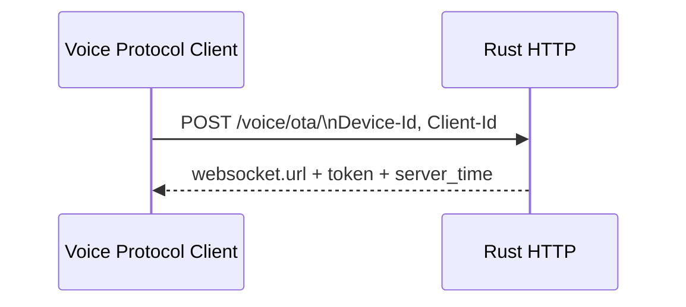
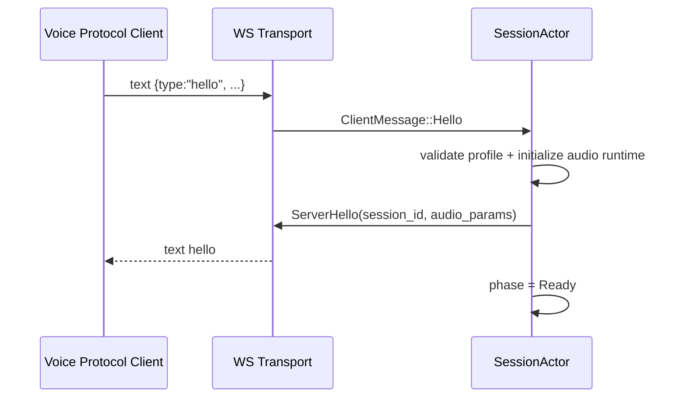
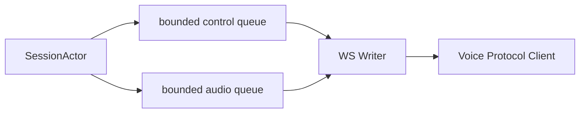

# Flow 01 — WebSocket

## 1. Mục tiêu

Duy trì protocol conformance bằng OTA discovery + WebSocket protocol v1.

## 2. OTA discovery



V1 không cần firmware hosting. `firmware.url` có thể rỗng.

## 3. WebSocket handshake

Firmware gửi headers:

```text
Authorization: Bearer <token>   # required only when auth.token is non-empty
Protocol-Version: 1
Device-Id: <mac>
Client-Id: <uuid>
```

Khi `auth.token` không rỗng, `Authorization` bắt buộc; thiếu hoặc sai token bị từ chối WebSocket upgrade với HTTP 401. Khi token rỗng, server không yêu cầu header. OTA trả static token khi auth bật, do đó chỉ supported trong trusted LAN và không phải security boundary.

Sau upgrade:



Server hello tối thiểu:

```json
{
  "type": "hello",
  "transport": "websocket",
  "session_id": "...",
  "audio_params": {
    "format": "opus",
    "sample_rate": 24000,
    "channels": 1,
    "frame_duration": 60
  }
}
```

Sau ClientHello hợp lệ, server khởi tạo `UplinkOpusDecoder` và `ManualCapture` trước khi tạo/register Voice Session và gửi ServerHello. Nếu init/allocation fallible lỗi, connection mới đóng 1011, không ServerHello hay payload custom và không ảnh hưởng Voice Session đang khỏe của cùng Device ID. Chỉ sau init thành công server mới atomically replace session cũ (nếu có).

V1 validate, không negotiate, Canonical Audio Profile trước khi tạo Voice Session/đi vào Ready:

```text
Protocol-Version header = 1
hello.version = 1
hello.transport = websocket
hello.audio_params = opus / 16000 Hz / mono / 60 ms
```

Trong `AwaitHello`, binary frame, malformed JSON, `type != "hello"`, missing hello field hay bất kỳ mismatch nào ghi telemetry và đóng WS bằng 1002 Protocol Error. Không tạo Voice Session, không gửi custom JSON error, không đoán hoặc resample uplink. Server hello luôn quảng bá Opus / 24000 Hz / mono / 60 ms; PCM từ TTS provider có thể được normalize nội bộ trước encode.

## 4. Message routing

WS reader chỉ làm 3 việc:

1. Text frame -> parse `ClientMessage` -> `SessionEvent::ClientMessage`.
2. Binary frame -> `SessionEvent::ClientAudio`.
3. Disconnect/error -> `SessionEvent::Disconnected`.

Không chạy ASR/LLM/TTS trực tiếp trong reader.

Listen được parse thành `ListenStart { mode }`, `ListenStop` và `ListenDetect { text }`; chỉ Start yêu cầu `mode`. `listen:start` mang `mode` parsed thành enum `Manual`, `Auto` hoặc `Realtime`. Phase 2 chỉ áp dụng `Manual`; `Auto`, `Realtime`, mode thiếu hay invalid là application message unsupported/invalid sau handshake, nên chỉ trace/ignore và giữ nguyên phase/capture/turn. Không default mode thiếu thành manual. `listen:start` manual hợp lệ mới áp dụng state matrix và có thể restart capture hoặc cancel turn theo matrix. `listen:stop` chỉ finalize Manual Capture active; ở phase khác chỉ trace/ignore.

## 5. Protocol v1 binary

V1 binary frame là raw Opus packet, không header riêng.

```text
WS binary payload == opus packet
```

Không parse v2/v3 trong MVP. Nếu `Protocol-Version != 1`, server log và reject rõ ràng. V1 không negotiate protocol chưa có parser; policy cấu hình chỉ xác nhận hành vi `reject`.

## 6. Single writer



Actor là producer duy nhất của hai queue; writer là task duy nhất gọi WebSocket send. Writer ưu tiên control hợp lệ; audio luôn mang generation và bị gate kiểm tra trước enqueue lẫn trước send. `SpeechOutput` và MCP trả event về actor, không gửi thẳng vào queue.

## 7. Ordering quan trọng

Một TTS turn điển hình:

```text
JSON tts:start
JSON tts:sentence_start
binary opus
binary opus
...
JSON tts:stop
```

Luồng hoàn tất bình thường chỉ gửi `tts:stop` sau event `SpeechOutputEvent::Drained`. Khi abort, actor cập nhật `GenerationGate`, sau đó gửi `tts:stop` dạng session control; writer drop packet stale còn nằm trong queue trước khi gửi control này.

## 8. Timeout

- Client hello timeout: nhỏ hơn firmware timeout 10 giây; khuyến nghị server 5 giây.
- Transport idle timeout đo activity WebSocket RX/TX hợp lệ hai chiều; V1 mặc định 300 giây. Conversation idle tắt.
- Firmware baseline có thể tự coi channel timeout sau hơn 120 giây không nhận dữ liệu từ server; V1 không thêm heartbeat để né hành vi này.

## 9. State/message matrix

| Incoming | Ready | Listening | Processing | Speaking |
| --- | --- | --- | --- | --- |
| binary audio | drop + counter | accept | drop + counter | drop + counter |
| `listen:start` | → Listening | reset collector, remain Listening | cancel → Listening | cancel → Listening |
| `listen:stop` | ignore | finalize/stop | ignore | ignore |
| `abort` | no-op | cancel capture | cancel turn | cancel turn |
| MCP response | route nếu pending | route nếu pending | route nếu pending | route nếu pending |
| unknown valid JSON | log/ignore | log/ignore | log/ignore | log/ignore |

Không warning từng binary frame bị drop để tránh log spam. `abort` phải idempotent. Sau handshake, malformed JSON, unknown/invalid application message và valid wrong-state message chỉ metric + ignore, không thay đổi state hay đóng session. WebSocket framing/UTF-8 fault do transport library xử lý.

Ở Listening, `listen:start` lặp lại discard capture đang có và restart capture mới, không finalize utterance hay phát wire response. `abort` discard capture rồi về Ready, cũng không tạo Capture Outcome cho downstream, không ASR và không wire response mới.
- WS ping có thể để transport/library xử lý; không trộn với conversation state.

## 10. Test contract

- valid hello -> valid server hello.
- audio/profile mismatch -> close 1002 trước Ready.
- missing type -> ignore/log, no panic.
- binary, malformed/non-hello JSON hoặc hello mismatch trước hello -> close 1002 và không tạo Voice Session.
- oversized text/binary frame -> close 1009 trước application parsing/decode.
- unknown JSON fields -> accepted.
- unknown type -> ignore/log.
- disconnect -> cancel session.
- `tts:start(gen N)` đến trước Opus đầu tiên của generation N.
- sau `tts:stop(gen N)`, không Opus generation N nào tới WebSocket.
- state/message matrix, gồm `listen:start` ở Listening reset collector và `abort` lặp lại, được test theo từng phase.
- một invalid application message sau handshake không terminate Voice Session khỏe.
- abort khi audio cũ đã nằm trong outbound queue -> writer drop cả JSON/audio stale trước `tts:stop`.
