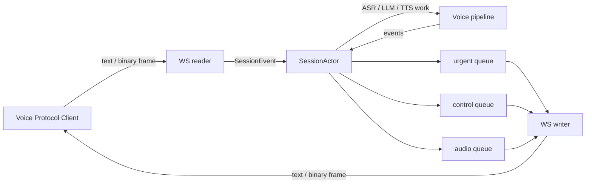
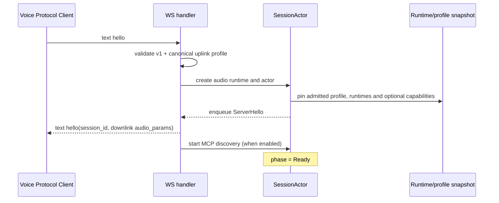
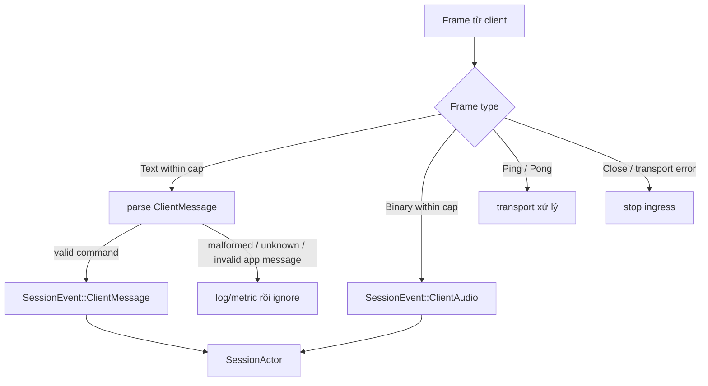
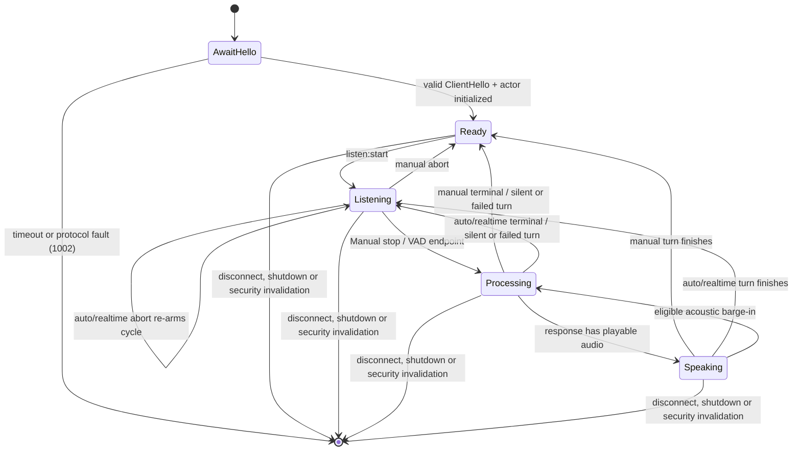
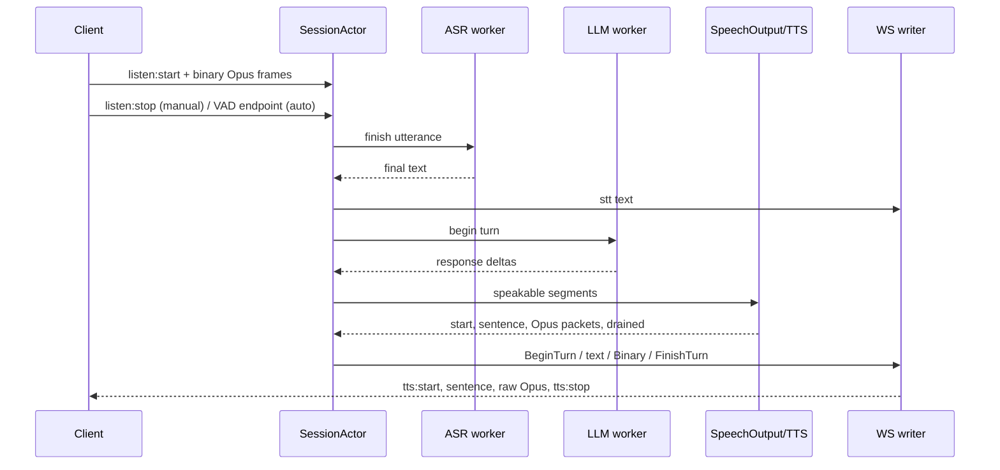
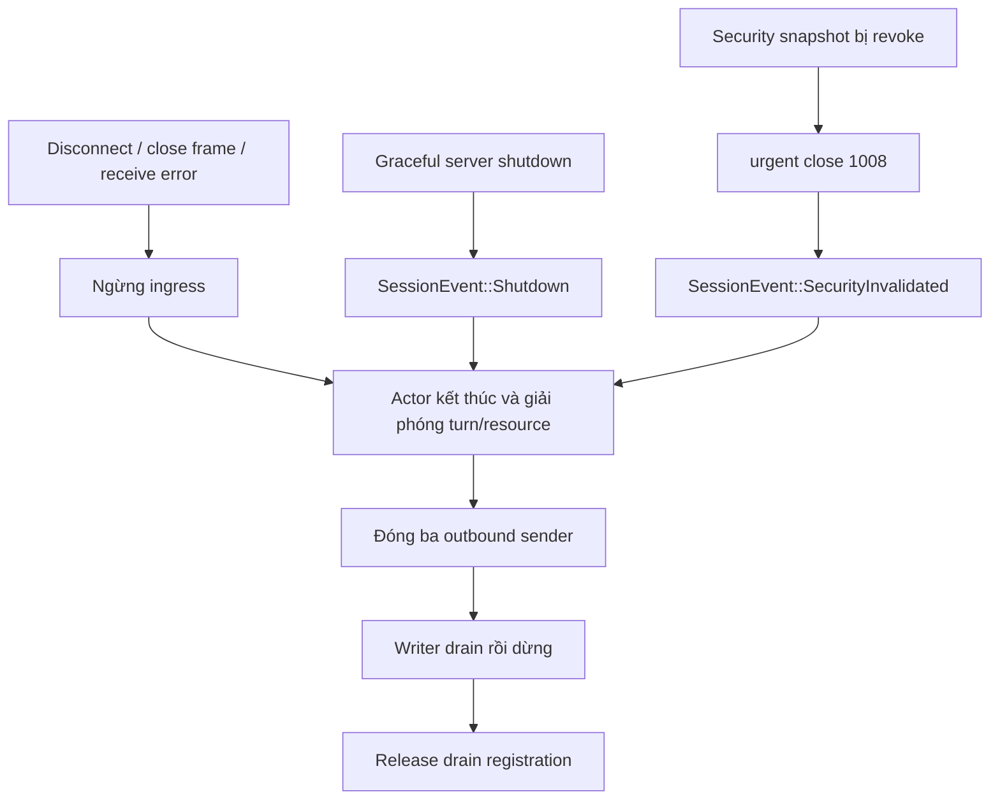

# Flow 01 — Luồng bên trong WebSocket

## 1. Phạm vi

Tài liệu này bắt đầu **sau khi HTTP đã chấp nhận WebSocket upgrade** cho một
Voice Session. Nó mô tả handshake ứng dụng, routing frame, lifecycle của
`SessionActor`, writer và đóng kết nối. OTA discovery, bearer authentication,
Device/Agent admission và enrollment không nằm trong flow này; xem
[ADR 0073](../adr/0073-required-database-and-device-admission.md) và
[ADR 0074](../adr/0074-websocket-enrollment-session.md).

Một Voice Session thuộc đúng một WebSocket connection và một `Device ID`.
`session_id` được cấp trước upgrade, dùng cho cả Voice Session và persistent
transcript (nếu profile bật), nhưng không phải credential.

## 2. Tổng quan


```mermaid
flowchart LR
    C[Voice Protocol Client] -->|text / binary frame| R[WS reader]
    R -->|SessionEvent| A[SessionActor]
    A -->|ASR / LLM / TTS work| P[Voice pipeline]
    P -->|events| A
    A --> U[urgent queue]
    A --> N[control queue]
    A --> Q[audio queue]
    U --> W[WS writer]
    N --> W
    Q --> W
    W -->|text / binary frame| C
```

- Reader chỉ kiểm giới hạn transport, parse text và chuyển thành
  `SessionEvent`; không chạy ASR, LLM hay TTS.
- `SessionActor` là owner duy nhất của state Voice Session và là producer của
  các outbound queue.
- Writer là task duy nhất gọi `WebSocket::send`. Ba queue bounded có thứ tự ưu
  tiên `urgent > control > audio`.

## 3. Handshake trong socket

Ngay sau upgrade, server chờ đúng một text `hello` trong
`server.hello_timeout_ms`. Trước `ServerHello`, socket chưa có Voice Session
sẵn sàng nhận command hoặc audio.


```mermaid
sequenceDiagram
    participant C as Voice Protocol Client
    participant W as WS handler
    participant A as SessionActor
    participant R as Runtime/profile snapshot

    C->>W: text hello
    W->>W: validate v1 + canonical uplink profile
    W->>A: create audio runtime and actor
    A->>R: pin admitted profile, runtimes and optional capabilities
    A-->>W: enqueue ServerHello
    W-->>C: text hello(session_id, downlink audio_params)
    W->>A: start MCP discovery (when enabled)
    Note over A: phase = Ready
```

Client hello V1 hợp lệ:

```json
{
  "type": "hello",
  "version": 1,
  "transport": "websocket",
  "audio_params": {
    "format": "opus",
    "sample_rate": 16000,
    "channels": 1,
    "frame_duration": 60
  },
  "features": {
    "pipeline_status": false,
    "speaker_status": false,
    "aec": false,
    "mcp": false
  }
}
```

`features` là các capability assertion tùy chọn; field feature chưa biết vẫn
tương thích. Server không negotiate audio profile. Nó luôn trả downlink Opus
24 kHz, mono, frame 60 ms:

```json
{
  "type": "hello",
  "transport": "websocket",
  "session_id": "…",
  "audio_params": {
    "format": "opus",
    "sample_rate": 24000,
    "channels": 1,
    "frame_duration": 60
  }
}
```

Binary frame đầu tiên, JSON lỗi, message không phải `hello`, hoặc hello sai
version/transport/profile đều đóng socket với code `1002` trước khi actor được
tạo. Frame vượt `websocket.max_frame_bytes` đóng `1009`. Nếu audio runtime,
speech output hoặc effective profile không khởi tạo được sau hello hợp lệ,
server đóng connection mới bằng `1011`, không gửi custom error. Một reconnect
lỗi vì thế không thay thế một Voice Session đang khỏe của cùng Device ID.

## 4. Ingress sau handshake


```mermaid
flowchart TD
    F[Frame từ client] --> K{Frame type}
    K -->|Text within cap| J[parse ClientMessage]
    K -->|Binary within cap| B[SessionEvent::ClientAudio]
    K -->|Ping / Pong| P[transport xử lý]
    K -->|Close / transport error| X[stop ingress]
    J -->|valid command| M[SessionEvent::ClientMessage]
    J -->|malformed / unknown / invalid app message| I[log/metric rồi ignore]
    M --> A[SessionActor]
    B --> A
```

Sau handshake, malformed JSON, message không biết, command sai schema hoặc
sai phase không làm chết Voice Session: reader/actor ghi telemetry và ignore.
Riêng text hoặc binary vượt frame cap vẫn đóng `1009` trước parse/decode. Khi
mailbox control đầy, reader đóng `1013`; audio mailbox đầy chỉ drop frame để
giữ bounded memory.

Text command V1 có thể mang `session_id`. Field này vắng mặt hoặc chuỗi rỗng
được chấp nhận vì tương thích; chuỗi không rỗng phải khớp session hiện tại.

| Client message | Ý nghĩa trong WS |
| --- | --- |
| `hello` | Chỉ hợp lệ là frame đầu tiên; hoàn tất application handshake. |
| `listen` với `state: start` và `mode: manual\|auto\|realtime` | Arm hoặc reset capture cycle. |
| `listen` với `state: stop` | Chỉ finalize Manual capture đang active. |
| `listen` với `state: detect` | Đưa text đã detect vào actor theo contract protocol. |
| `abort` | Interruption idempotent của capture/turn đang có. |
| `mcp` | Route response/request Device MCP khi MCP đã được bật. |
| binary | Một raw uplink Opus packet V1, không có header ứng dụng. |

Chi tiết capture/VAD, ASR, interrupt và MCP lần lượt ở [Flow 02](02-vad.md),
[Flow 03](03-asr.md), [Flow 06](06-interrupt-cancellation.md) và
[Flow 07](07-device-mcp.md).

## 5. State của Voice Session


```mermaid
stateDiagram-v2
    [*] --> AwaitHello
    AwaitHello --> Ready: valid ClientHello + actor initialized
    AwaitHello --> [*]: timeout or protocol fault (1002)
    Ready --> Listening: listen:start
    Listening --> Processing: Manual stop / VAD endpoint
    Processing --> Speaking: response has playable audio
    Processing --> Ready: manual terminal / silent or failed turn
    Processing --> Listening: auto/realtime terminal / silent or failed turn
    Speaking --> Ready: manual turn finishes
    Speaking --> Listening: auto/realtime turn finishes
    Listening --> Ready: manual abort
    Listening --> Listening: auto/realtime abort re-arms cycle
    Speaking --> Processing: eligible acoustic barge-in
    Ready --> [*]: disconnect, shutdown or security invalidation
    Listening --> [*]: disconnect, shutdown or security invalidation
    Processing --> [*]: disconnect, shutdown or security invalidation
    Speaking --> [*]: disconnect, shutdown or security invalidation
```

`Ready` nghĩa là socket còn sống nhưng không thu microphone; không dùng tên
`Idle` để tránh lẫn với timeout transport. Chỉ `Listening` nhận audio cho
capture bình thường. Khi `Speaking`, audio chỉ được đưa vào Barge-in Watch nếu
mode Auto/Realtime đã arm, client đã assert `features.aec=true`, và cả hai cờ
server cho phép tin assertion này. Manual không có acoustic barge-in.

## 6. Một conversational turn trên cùng socket


```mermaid
sequenceDiagram
    participant C as Client
    participant A as SessionActor
    participant ASR as ASR worker
    participant L as LLM worker
    participant T as SpeechOutput/TTS
    participant W as WS writer

    C->>A: listen:start + binary Opus frames
    C->>A: listen:stop (manual) / VAD endpoint (auto)
    A->>ASR: finish utterance
    ASR-->>A: final text
    A->>W: stt text
    A->>L: begin turn
    L-->>A: response deltas
    A->>T: speakable segments
    T-->>A: start, sentence, Opus packets, drained
    A->>W: BeginTurn / text / Binary / FinishTurn
    W-->>C: tts:start, sentence, raw Opus, tts:stop
```

`SessionActor` giữ dialogue, generation và turn state trong RAM của connection.
Provider worker không sở hữu WebSocket hay session state; mọi event quay lại
actor trước khi được gửi. Một final ASR non-empty phát đúng một `stt` trước khi
LLM turn bắt đầu. Sau terminal outcome, Manual về `Ready`; Auto/Realtime re-arm
về `Listening` theo policy.

## 7. Outbound ordering và cancellation

Writer serialize mọi outbound traffic. Một playback bình thường có thứ tự:

```text
tts:start → tts:sentence_start (zero or more) → raw Opus packets → tts:stop
```

`tts:start` chỉ được gửi khi đã có audio phát được. `tts:stop` bình thường chỉ
được gửi sau packet cuối đã drain. `BeginTurn`, `FinishTurn` và `AbortTurn` là
semantic command giữa actor và writer; chỉ writer tạo các wire control tương
ứng và báo terminal outcome về actor.

Khi `abort` hoặc acoustic barge-in thắng race:

1. Actor invalidate `GenerationGate` rồi cancel producer của turn cũ.
2. Actor gửi `AbortTurn` qua urgent lane.
3. Writer drop JSON/audio stale tại điểm gửi, phát tối đa một `tts:stop` nếu
   `tts:start` đã được gửi, rồi báo `TurnClosed(Aborted)`.

Packet đã được writer gửi trước điểm invalidation không thể thu hồi; sau đó
không payload scoped-to-turn cũ nào được admit. Nếu urgent stop không thể được
admit sau một `tts:start`, đó là session-integrity failure và session fail
closed, không retry vô hạn.

## 8. Đóng socket và failure boundary


```mermaid
flowchart TD
    E[Disconnect / close frame / receive error] --> S[Ngừng ingress]
    G[Graceful server shutdown] --> H[SessionEvent::Shutdown]
    I[Security snapshot bị revoke] --> C[urgent close 1008]
    C --> V[SessionEvent::SecurityInvalidated]
    S --> A[Actor kết thúc và giải phóng turn/resource]
    H --> A
    V --> A
    A --> D[Đóng ba outbound sender]
    D --> W[Writer drain rồi dừng]
    W --> R[Release drain registration]
```

Server shutdown có controlled-close path để actor và writer hoàn tất outbound
đã xếp trước khi connection kết thúc. Security invalidation (ví dụ profile,
speaker grant/policy hoặc external-tool guard bị revoke) đóng với `1008` và
không cho dispatch mới. Peer close, receive error, hoặc writer failure cũng
kết thúc actor; không có retry socket hay resume session trong V1.

## 9. Invariants và test contract

- Một connection có một immutable runtime/profile snapshot và một `session_id`.
- Chỉ một writer gọi `WebSocket::send`; tất cả queue đều bounded.
- `tts:start` luôn trước Opus đầu tiên của turn; không Opus stale sau
  `tts:stop`.
- Chỉ hello hợp lệ đi qua `AwaitHello`; lỗi protocol ở giai đoạn đó đóng `1002`.
- Lỗi application sau handshake không phá Voice Session khỏe; frame quá lớn
  luôn đóng `1009`.
- Audio V1 ingress/egress là raw Opus; canonical uplink là 16 kHz mono 60 ms,
  downlink là 24 kHz mono 60 ms.
- Disconnect/shutdown/cancellation phải giải phóng actor, worker lease và
  connection drain registration.

Chạy regression của module bằng:

```bash
./scripts/test-module.sh ws
```
