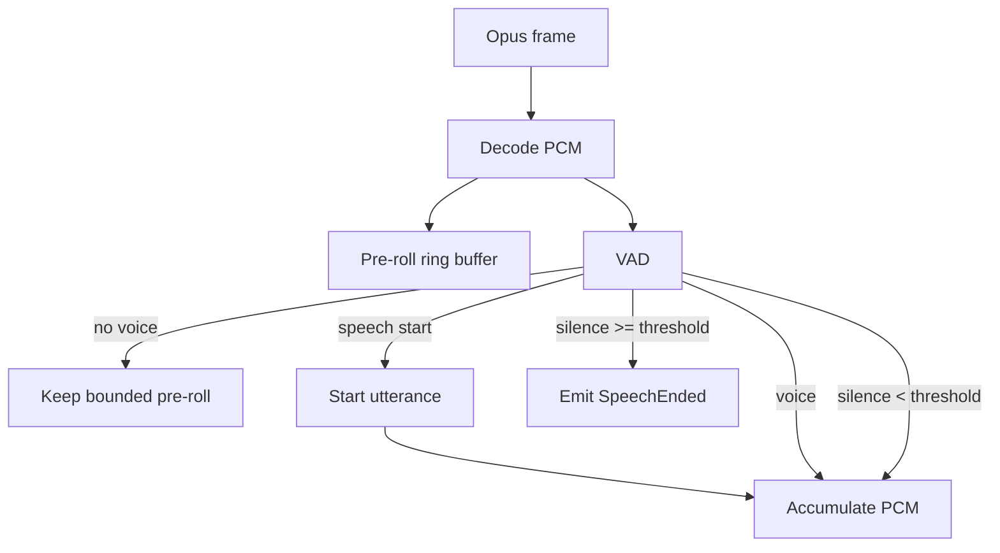

# Flow 02 — VAD và utterance boundary

## 1. Input / output

Input:

```text
Opus packet -> decode -> PCM 16 kHz mono
```

Mỗi uplink Opus packet V1 phải decode thành đúng 960 samples (16 kHz × 60 ms). Trước libopus, uplink policy guard drop packet lớn hơn `MAX_UPLINK_OPUS_PACKET_BYTES = 4.000`; đây không phải giới hạn format Opus. Decoder dùng scratch private 1.920 samples để giải mã được packet Opus tối đa 120 ms; packet rỗng, packet quá lớn, decode lỗi hoặc trả số sample khác 960 là local frame fault: drop packet, tăng metric không chứa audio, giữ nguyên Voice Session và capture đang có. V1 không PLC/FEC, không chèn silence và không tự ghép/chia packet khác duration.

Output domain:

```rust
pub enum VadEvent {
    SpeechStarted,
    SpeechContinued,
    SpeechEnded(UplinkAudioUtterance),
}
```

`UplinkPcmFrame` luôn là 960 samples / 16 kHz; `DownlinkPcmFrame` luôn là 1.440 samples / 24 kHz. Cả hai chỉ bọc `Pcm16Mono`, nhưng không thể thay thế cho nhau ở type boundary. `UplinkAudioUtterance` là PCM 16 kHz có độ dài biến thiên của một lượt thu; không dùng tên Audio Utterance chung chung khi đã có downlink PCM.

## 2. Auto mode



## 3. Pre-roll

Giữ khoảng 200–400 ms PCM trước khi VAD xác nhận speech start để tránh mất phụ âm đầu.

Pre-roll phải bounded ring buffer.

## 4. End-of-speech

Không kết thúc ngay khi có một frame silence. Dùng `end_silence_ms` để tránh cắt giữa câu.

Ví dụ V1 default:

```text
min_speech_ms = 180
end_silence_ms = 600
pre_roll_ms = 300
```

Các con số là config, không hard-code business logic.

## 5. Manual mode

Trong `listen mode=manual`:

- `listen:start` -> reset buffer và bắt đầu collect.
- Binary frames decode hợp lệ -> collect `UplinkPcmFrame`, không cần VAD quyết định end.
- `listen:stop` -> trả `CaptureOutcome`: `UplinkAudioUtterance`, `Empty` hoặc `Overflowed`.

Manual mode rất quan trọng để bring-up pipeline trước khi tune VAD.

Trong Phase 2, `SessionActor` gọi decoder rồi `ManualCapture` tuần tự theo ingress order; không có audio worker hoặc queue audio riêng. `ManualCapture` reset ở `listen:start`, `listen:stop` và `abort`; `UplinkOpusDecoder` sống theo Voice Session/Uplink Audio Stream, không reset ở các capture boundary. Decoder trả frame hợp lệ hoặc typed drop reason (`empty_packet`, `packet_too_large`, `decode_error`, `invalid_sample_count`); actor chỉ tracing reason/session metadata, không log packet hay PCM.

## 6. Barge-in

V1 không chạy VAD khi phase là `Speaking`: server AEC đang ngoài phạm vi, nên microphone echo không được tự cắt TTS. Device-side wake word hoặc interruption phải gửi `abort`; acoustic barge-in chỉ được xem lại cùng server AEC và protocol có timestamp.

## 7. Resource limits

- `max_utterance_ms`: tránh buffer vô hạn; V1 default 30 giây, validate trong khoảng 1.000–120.000 ms và chia hết cho 60 ms. Capacity được tính bằng integer frame count: 30 giây là 500 frame/480.000 samples; frame thứ 500 hợp lệ và frame thứ 501 mới overflow. `ManualCapture` pre-reserve capacity fallible ở runtime init trước ServerHello và không realloc khi thu.
- Auto/VAD vượt giới hạn: force-endpoint utterance, dừng collector và chuyển Processing; không thu utterance mới song song.
- Manual vượt giới hạn: discard buffer, đánh dấu capture overflow, ignore audio đến `listen:stop` và cần `listen:start` mới để thu lại. `listen:stop` trả `Overflowed`, không gọi ASR/STT/LLM/TTS và chuyển manual mode về Ready.
- PCM buffer thuộc một utterance, giải phóng sau khi gửi ASR.

## 8. Test contract

Fixtures nên có PCM hoặc synthetic samples:

- silence only -> không emit utterance.
- short noise dưới `min_speech_ms` -> ignore.
- speech + short pause + speech -> một utterance.
- speech + đủ silence -> `SpeechEnded` đúng một lần.
- manual start/stop -> flush dù VAD không active.
- speaking + confirmed speech -> không tạo interrupt event trong V1.
- auto max utterance -> đúng một force endpoint và collector dừng.
- manual max utterance -> không gọi ASR, audio tiếp theo bị ignore đến chu kỳ listen mới.
