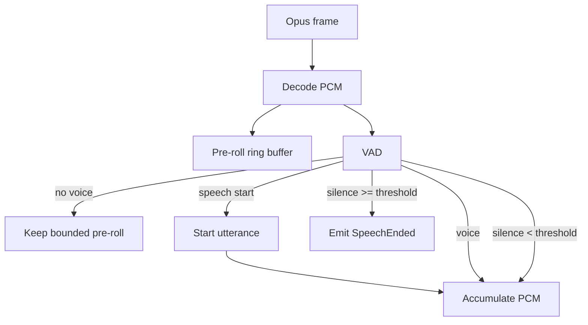

# Flow 02 — VAD và utterance boundary

## 1. Input / output

Input:

```text
Opus packet -> decode -> PCM 16 kHz mono
```

Output domain:

```rust
pub enum VadEvent {
    SpeechStarted,
    SpeechContinued,
    SpeechEnded(AudioUtterance),
}
```

## 2. Auto mode



## 3. Pre-roll

Giữ khoảng 200–400 ms PCM trước khi VAD xác nhận speech start để tránh mất phụ âm đầu.

Pre-roll phải bounded ring buffer.

## 4. End-of-speech

Không kết thúc ngay khi có một frame silence. Dùng `end_silence_ms` để tránh cắt giữa câu.

Ví dụ V1 default:

```text
min_speech_ms = 180
end_silence_ms = 600
pre_roll_ms = 300
```

Các con số là config, không hard-code business logic.

## 5. Manual mode

Trong `listen mode=manual`:

- `listen:start` -> reset buffer và bắt đầu collect.
- Binary frames -> collect PCM, không cần VAD quyết định end.
- `listen:stop` -> flush buffer thành `AudioUtterance`.

Manual mode rất quan trọng để bring-up pipeline trước khi tune VAD.

## 6. Barge-in

V1 không chạy VAD khi phase là `Speaking`: server AEC đang ngoài phạm vi, nên microphone echo không được tự cắt TTS. Device-side wake word hoặc interruption phải gửi `abort`; acoustic barge-in chỉ được xem lại cùng server AEC và protocol có timestamp.

## 7. Resource limits

- `max_utterance_ms`: tránh buffer vô hạn; V1 default 30 giây.
- Auto/VAD vượt giới hạn: force-endpoint utterance, dừng collector và chuyển Processing; không thu utterance mới song song.
- Manual vượt giới hạn: discard buffer, đánh dấu capture overflow, ignore audio đến `listen:stop` và cần `listen:start` mới để thu lại.
- PCM buffer thuộc một utterance, giải phóng sau khi gửi ASR.

## 8. Test contract

Fixtures nên có PCM hoặc synthetic samples:

- silence only -> không emit utterance.
- short noise dưới `min_speech_ms` -> ignore.
- speech + short pause + speech -> một utterance.
- speech + đủ silence -> `SpeechEnded` đúng một lần.
- manual start/stop -> flush dù VAD không active.
- speaking + confirmed speech -> không tạo interrupt event trong V1.
- auto max utterance -> đúng một force endpoint và collector dừng.
- manual max utterance -> không gọi ASR, audio tiếp theo bị ignore đến chu kỳ listen mới.
