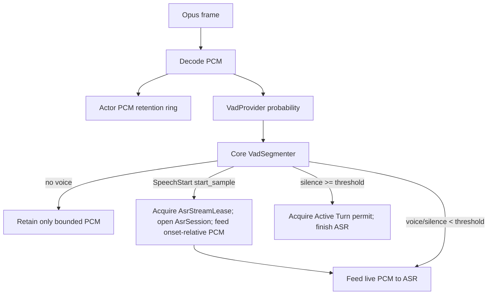

# Flow 02 — VAD và utterance boundary

## 1. Input / output

Input:

```text
Opus packet -> decode -> PCM 16 kHz mono
```

Mỗi uplink Opus packet V1 phải decode thành đúng 960 samples (16 kHz × 60 ms). Trước libopus, uplink policy guard drop packet lớn hơn `MAX_UPLINK_OPUS_PACKET_BYTES = 4.000`; đây không phải giới hạn format Opus. Decoder dùng scratch private 1.920 samples để giải mã được packet Opus tối đa 120 ms; packet rỗng, packet quá lớn, decode lỗi hoặc trả số sample khác 960 là local frame fault: drop packet, tăng metric không chứa audio, giữ nguyên Voice Session và capture đang có. V1 không PLC/FEC, không chèn silence và không tự ghép/chia packet khác duration.

Output domain:

```rust
pub enum VadEvent {
    SpeechStarted { start_sample: u64 },
    SpeechContinued,
    SpeechEnded { end_sample: u64 },
}
```

`VadProbability` giữ `probability` cùng `[start_sample, end_sample)` xuyên provider và worker boundary. Range phải liên tục, ordered và valid trong một Auto Listening cycle; gap, duplicate hoặc range sai là VAD Stream Integrity Failure, affected Auto Voice Session fail closed. `VadEvent` chỉ mang semantic sample boundary, không mang PCM. Đây là sample timeline của canonical PCM đã được đưa vào VAD, không phải callback count hoặc wall-clock worker latency.

`UplinkPcmFrame` luôn là 960 samples / 16 kHz; `DownlinkPcmFrame` luôn là 1.440 samples / 24 kHz. Cả hai chỉ bọc `Pcm16Mono`, nhưng không thể thay thế cho nhau ở type boundary. `UplinkAudioUtterance` là PCM 16 kHz có độ dài biến thiên của một lượt thu; không dùng tên Audio Utterance chung chung khi đã có downlink PCM.

## 2. Auto mode



## 3. Segmentation và pre-roll

Silero adapter giữ recurrent state và 64-sample context riêng theo VadSession. Rechunker vẫn đưa từng 512 current samples vào adapter; adapter ghép 64 context trước đó với 512 samples hiện thời cho ONNX inference, rồi update context. `reset()` clear recurrent state lẫn context.

`VadSegmenter` không giữ PCM. Nó dùng hysteresis: probability trên speech threshold tạo/giữ speech candidate, probability dưới exit threshold tạo/giữ silence candidate, và vùng giữa giữ decision trước. SpeechStart chỉ emit khi candidate đủ `min_speech_ms`; `start_sample` là candidate onset, không phải cursor lúc xác nhận. SpeechEnd chỉ emit sau silence liên tục đủ `end_silence_ms`.

Actor giữ PCM retention ring bounded. Khi nhận `SpeechStarted { start_sample }`, actor mở ASR và feed range `[start_sample - pre_roll_samples, current_pcm_cursor)`, rồi feed live PCM. `pre_roll_ms` là audio trước onset; capacity ring phải đủ pre-roll, confirmation horizon, bounded VAD in-flight lag và frame/rechunk slack để worker chậm không làm mất onset. Không dùng `Vec` unbounded hoặc capacity capture 30 giây làm pre-roll.

VAD mailbox không được silently drop canonical input rồi tiếp tục segmentation. Queue full làm continuity không còn chứng minh được và phải fail closed affected Auto Voice Session, trừ khi bounded backpressure vẫn bảo toàn toàn bộ input timeline.

## 4. End-of-speech và re-arm

Không kết thúc ngay khi có một frame silence. Dùng hysteresis và `end_silence_ms` theo sample timeline để tránh cắt giữa câu.

Ví dụ V1 default:

```text
min_speech_ms = 180
end_silence_ms = 600
pre_roll_ms = 300
```

Các con số là config, không hard-code business logic.

Sau terminal mỗi utterance, reset/re-arm boundary clear Silero recurrent state/context, VadSegmenter candidate/state, actor PCM retention và VAD cursor bookkeeping. Auto Listening cycle vẫn sống qua nhiều utterance; đây không phải đóng `listen:start auto`.

`listen:start(auto)` lặp lại trong một Auto Listening cycle không được `Close` rồi acquire worker mới. Nếu Reset đã pending, command là idempotent; nếu chưa, actor reset/re-arm chính `VadWorkerLease` đang pin và chỉ nhận microphone lại sau `ResetDone`. `abort` một turn Auto cũng hủy turn rồi reset lease đó, không kết thúc cycle. `VadCommand::Close` chỉ dành cho rời Auto mode, teardown Voice Session hoặc xử lý VAD fatal.

## 5. Manual mode

Trong `listen mode=manual`:

- `listen:start` -> reset buffer và bắt đầu collect.
- Binary frames decode hợp lệ -> collect `UplinkPcmFrame`, không cần VAD quyết định end.
- `listen:stop` -> trả `CaptureOutcome`: `UplinkAudioUtterance`, `Empty` hoặc `Overflowed`.

Manual mode rất quan trọng để bring-up pipeline trước khi tune VAD.

Trong Phase 2, `SessionActor` gọi decoder rồi `ManualCapture` tuần tự theo ingress order; không có audio worker hoặc queue audio riêng. `ManualCapture` reset ở `listen:start`, `listen:stop` và `abort`; `UplinkOpusDecoder` sống theo Voice Session/Uplink Audio Stream, không reset ở các capture boundary. Decoder trả frame hợp lệ hoặc typed drop reason (`empty_packet`, `packet_too_large`, `decode_error`, `invalid_sample_count`); actor chỉ tracing reason/session metadata, không log packet hay PCM.

## 6. Acoustic barge-in

Phase 5 không thêm server-side AEC vào raw WebSocket V1. Thay vào đó, client có thể assert uplink đã echo-suppressed bằng `features.aec=true`; assertion này chỉ được dùng khi `barge_in.enabled=true` và `barge_in.trust_client_aec_feature=true`. `Manual` không acoustic barge-in. `Auto` chỉ watch khi capture cycle đã arm; `Realtime` giữ VAD cycle armed xuyên `Processing`/`Speaking`.

Khi `Speaking`, actor decode frame, push vào retention và VAD Barge-in Watch, nhưng không feed ASR turn cũ. `SpeechStarted { start_sample }` hợp lệ thực hiện đúng thứ tự: snapshot `retention.range(start_sample - pre_roll_samples)`; invalidate GenerationGate turn N; cancel producers; gửi urgent đúng một `tts:stop` nếu N đã `Started`; tạo generation/ASR N+1 và feed snapshot, rồi tiếp tục frame sau vào ASR N+1. Snapshot phải trước reset retention/VAD; gate invalidation là interruption linearization point. Packet writer đã admit trước point này không thể thu hồi, mọi turn payload N sau point phải bị drop.

## 7. Resource limits

- `max_utterance_ms`: tránh buffer vô hạn; V1 default 30 giây, validate trong khoảng 1.000–120.000 ms và chia hết cho 60 ms. Capacity được tính bằng integer frame count: 30 giây là 500 frame/480.000 samples; frame thứ 500 hợp lệ và frame thứ 501 mới overflow. `ManualCapture` pre-reserve capacity fallible ở runtime init trước ServerHello và không realloc khi thu.
- Auto/VAD vượt giới hạn: force-endpoint, try-acquire `Active Turn` permit rồi `finish()` ASR stream; không thu turn mới song song. Nếu permit không có, cancel stream và release `AsrStreamLease`, không xếp chờ.
- Manual vượt giới hạn: discard buffer, đánh dấu capture overflow, ignore audio đến `listen:stop` và cần `listen:start` mới để thu lại. `listen:stop` trả `Overflowed`, không gọi ASR/STT/LLM/TTS và chuyển manual mode về Ready.
- `AsrStreamLease` chỉ giới hạn recognition stream và release sau final/cancel/lỗi; `Active Turn` permit bắt đầu ở endpoint và release ở terminal turn.

## 8. Test contract

Fixtures nên có PCM hoặc synthetic samples:

- silence only -> không emit utterance.
- short noise dưới `min_speech_ms` -> ignore.
- speech + short pause + speech -> một utterance.
- speech + đủ silence -> `SpeechEnded` đúng một lần.
- manual start/stop -> flush dù VAD không active.
- Speaking + one noisy frame -> không interrupt; Manual/no-AEC -> không Acoustic Barge-in. Auto/Realtime AEC-safe `SpeechStart` -> snapshot retention, interrupt đúng một lần, ASR turn mới nhận prefix và frame tiếp theo.
- auto max utterance -> đúng một force endpoint và collector dừng.
- manual max utterance -> không gọi ASR, audio tiếp theo bị ignore đến chu kỳ listen mới.
