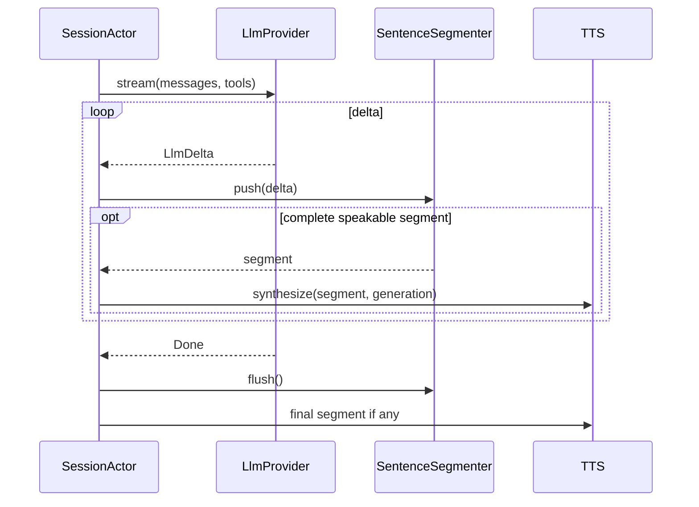
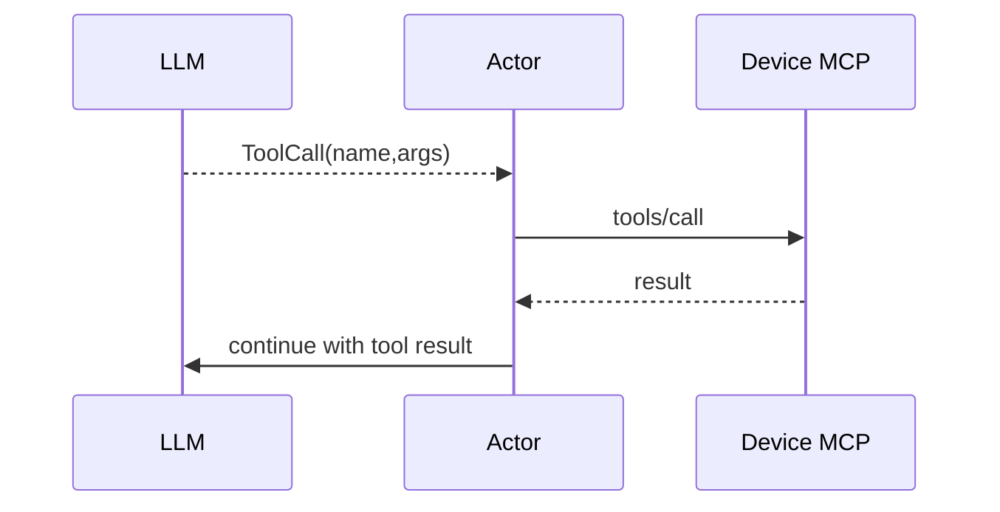

# Flow 04 — Streaming LLM

## 1. Input

```rust
pub struct LlmRequest {
    pub generation: u64,
    pub messages: Vec<ChatMessage>,
    pub tools: Vec<ToolDefinition>,
}
```

Adapter concrete V1 là `openai`, build qua crate Rust `llm`: factory map typed config sang `LLMBackend::OpenAI` và `LLMBuilder`, rồi bridge `ChatMessage`, `chat_stream_with_tools(...)` và `StreamChunk` thành `LlmEvent`. SessionActor không import type của crate `llm` hay parse OpenAI JSON/SSE.

`LlmRuntime` application-owned giữ provider shared, global semaphore và bounded route. Mỗi request là Tokio task theo Voice Session/generation, giữ permit từ runtime accept tới terminal event; timeout không reset bởi text delta. CancellationToken dừng polling/drop stream; terminal event không route được phải biến thành controlled failure, không silently drop.

Khi hàng đợi Speech Segment đầy, SessionActor giữ tối đa một delta LLM đang xử lý dở và tạm ngừng đọc bounded route. Sau khi TTS lấy bớt segment, actor tiếp tục đúng vị trí ký tự còn lại; không hủy lượt hoặc bỏ câu chỉ vì TTS chậm hơn LLM. Route bounded truyền áp lực ngược tới LLM operation.

Startup chỉ validate typed OpenAI config và build provider locally; không thực hiện network probe. DNS/TLS/auth/quota/model/5xx hay stream failure là `LlmEvent::Failed` của operation hiện tại, không làm server unavailable toàn cục.

## 2. Flow không tool call



## 3. Sentence segmentation

Không gửi từng token vào TTS.

Segmenter phát một Speech Segment ngay khi thấy dấu kết câu `. ! ? 。！？` mà không chờ độ dài tối thiểu. Dấu phẩy, chấm phẩy và hai chấm chỉ nằm trong câu; EOF phát phần text cuối còn lại. Dấu chấm có thể thuộc số thập phân hoặc phiên bản nên không tách các trường hợp đó. `max_chars` chỉ giới hạn khẩn cấp cho buffer chưa có dấu kết câu (hiện fail backpressure khi vượt `2 * max_chars`), không tự cắt một câu để đọc. Hai trường cấu hình `min_chars` và `soft_break_min_chars` được giữ để đọc cấu hình cũ nhưng không còn chi phối segmentation.

SpeechOutput giữ nguyên text hiển thị cho sự kiện WebSocket `llm` theo từng câu; text đưa vào TTS được NFC và loại markdown, emoji, control/symbol không đọc được, trong khi giữ dấu câu hữu ích. Actor phát `llm` trước khi bắt đầu tổng hợp audio của câu tương ứng.

## 4. Tool call

Phase 4 gọi `chat_stream_with_tools(messages, None)` để dùng một typed streaming seam. Nếu stream vẫn phát tool call, actor fail generation là `llm_unexpected_tool_call`, cancel LLM và SpeechOutput, không submit segment mới, không gọi MCP và không retry. Audio đã deliver trước event không thể thu hồi; GenerationGate drop mọi audio stale/còn queue.

Phase 6 mới truyền `Some(&tools)` và áp dụng tool-result loop sau:

Nếu Device MCP ready, tool definitions được đưa vào request LLM.



`max_tool_depth` giới hạn vòng lặp. Khi request có LLM-visible Tool, actor phải buffer prose và tool call đến hết round; không dựa vào prompt để bảo đảm thứ tự. Nếu round có tool call, prose round đó không đi vào TTS; server gọi MCP rồi bắt đầu round kế tiếp với tool result. Chỉ final round không tool call được đưa vào SpeechOutput. Request không có tool vẫn stream token → segmenter → TTS như bình thường.

Tool-level failure khi session khỏe được normalize thành tool result `ok:false` không chứa error body/secret rồi quay lại LLM. Khi tool depth vượt limit, inject `tool_depth_exceeded` và chỉ cho một final no-tools round; terminal session/cancellation failure không tiếp tục LLM.

Nhiều tool call của một round chạy tuần tự theo thứ tự LLM trả về, mỗi call có timeout riêng. Tool-level error không ngăn sibling call còn allowlisted khi session/generation vẫn khỏe; result giữ đúng tool_call_id và thứ tự để gửi vào round kế tiếp. `max_tool_depth` đếm tool round, không đếm individual call. Final no-tool round với text rỗng sau trim là `Failed(llm_empty_final_response)`, không gọi TTS.

## 5. History commit

Chỉ commit assistant response hoàn chỉnh vào dialogue khi turn kết thúc hợp lệ.

Nếu turn cancel giữa chừng:

- không ghi chunk dở như một assistant response hoàn chỉnh;
- optional: có thể lưu telemetry riêng.

## 6. Provider abstraction

V1 dùng OpenAI qua typed API của crate `llm` 1.3.8, pin exact với default features tắt và chỉ `openai`/`rustls-tls`. Adapter phải bridge stream thành event chuẩn:

```rust
pub enum LlmEvent {
    TextDelta(String),
    ToolCallDelta(ToolCallDelta),
    Usage(TokenUsage),
    Done,
}
```

V1 không automatic retry logical LLM operation sau timeout/lỗi.

## 7. Test contract

- multiple text deltas -> đúng concatenation.
- segmenter phát segment trước stream done.
- tool call fragmented JSON được assemble đúng.
- max tool depth được enforce.
- tool-capable round có prose + tool call -> prose không được TTS; final no-tool round mới được synthesize.
- cancellation dừng downstream TTS request.
- stale generation delta bị drop.
- provider stream error -> actor kết thúc turn sạch sẽ.
