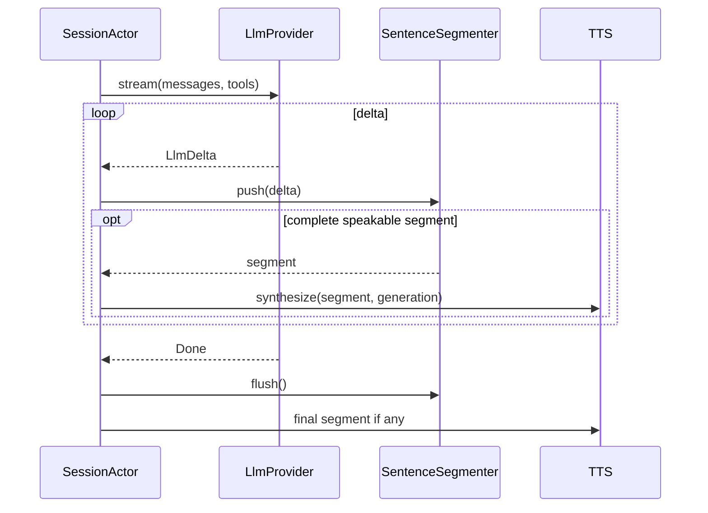
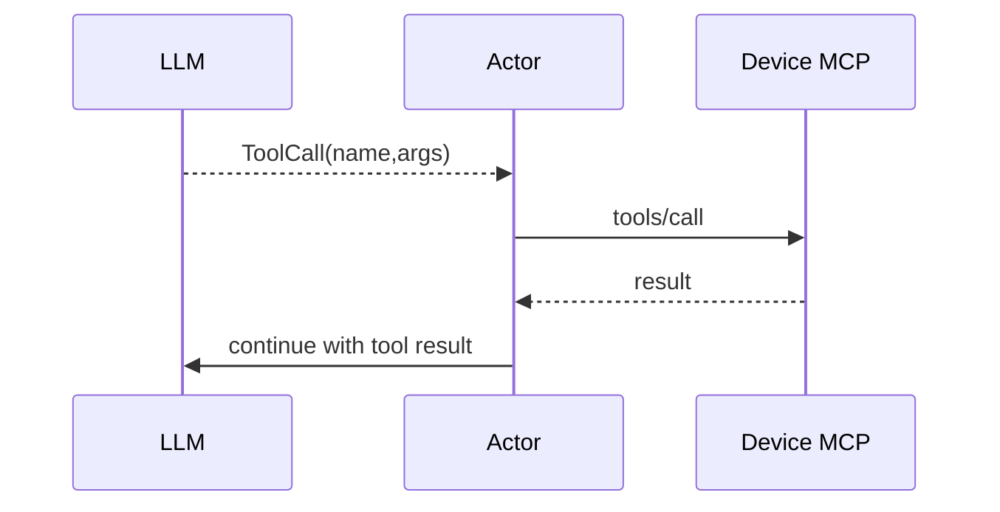

# Flow 04 — Streaming LLM

## 1. Input

```rust
pub struct LlmRequest {
    pub generation: u64,
    pub messages: Vec<ChatMessage>,
    pub tools: Vec<ToolDefinition>,
}
```

Adapter concrete V1 là `openai_chat_completions_v1`: `POST {base_url}/v1/chat/completions` với `stream=true` và function tools. Adapter parse SSE text delta, fragmented tool-call arguments và `finish_reason`, rồi phát `LlmEvent`; SessionActor không parse OpenAI JSON/SSE.

## 2. Flow không tool call



## 3. Sentence segmentation

Không gửi từng token vào TTS.

Segmenter nên ưu tiên:

1. dấu kết câu `. ! ? 。！？`;
2. dấu ngắt `, ; : ，；：` sau khi vượt minimum chars;
3. hard max chars để tránh đợi quá lâu.

Pure function/state machine này phải có unit test riêng.

## 4. Tool call

Nếu Device MCP ready, tool definitions được đưa vào request LLM.



`max_tool_depth` giới hạn vòng lặp. Khi request có LLM-visible Tool, actor phải buffer prose và tool call đến hết round; không dựa vào prompt để bảo đảm thứ tự. Nếu round có tool call, prose round đó không đi vào TTS; server gọi MCP rồi bắt đầu round kế tiếp với tool result. Chỉ final round không tool call được đưa vào SpeechOutput. Request không có tool vẫn stream token → segmenter → TTS như bình thường.

Tool-level failure khi session khỏe được normalize thành tool result `ok:false` không chứa error body/secret rồi quay lại LLM. Khi tool depth vượt limit, inject `tool_depth_exceeded` và chỉ cho một final no-tools round; terminal session/cancellation failure không tiếp tục LLM.

Nhiều tool call của một round chạy tuần tự theo thứ tự LLM trả về, mỗi call có timeout riêng. Tool-level error không ngăn sibling call còn allowlisted khi session/generation vẫn khỏe; result giữ đúng tool_call_id và thứ tự để gửi vào round kế tiếp. `max_tool_depth` đếm tool round, không đếm individual call. Final no-tool round với text rỗng sau trim là `Failed(llm_empty_final_response)`, không gọi TTS.

## 5. History commit

Chỉ commit assistant response hoàn chỉnh vào dialogue khi turn kết thúc hợp lệ.

Nếu turn cancel giữa chừng:

- không ghi chunk dở như một assistant response hoàn chỉnh;
- optional: có thể lưu telemetry riêng.

## 6. Provider abstraction

V1 ưu tiên OpenAI-compatible streaming API. Adapter phải convert vendor stream thành event chuẩn:

```rust
pub enum LlmEvent {
    TextDelta(String),
    ToolCallDelta(ToolCallDelta),
    Usage(TokenUsage),
    Done,
}
```

V1 không automatic retry logical LLM operation sau timeout/lỗi.

## 7. Test contract

- multiple text deltas -> đúng concatenation.
- segmenter phát segment trước stream done.
- tool call fragmented JSON được assemble đúng.
- max tool depth được enforce.
- tool-capable round có prose + tool call -> prose không được TTS; final no-tool round mới được synthesize.
- cancellation dừng downstream TTS request.
- stale generation delta bị drop.
- provider stream error -> actor kết thúc turn sạch sẽ.
