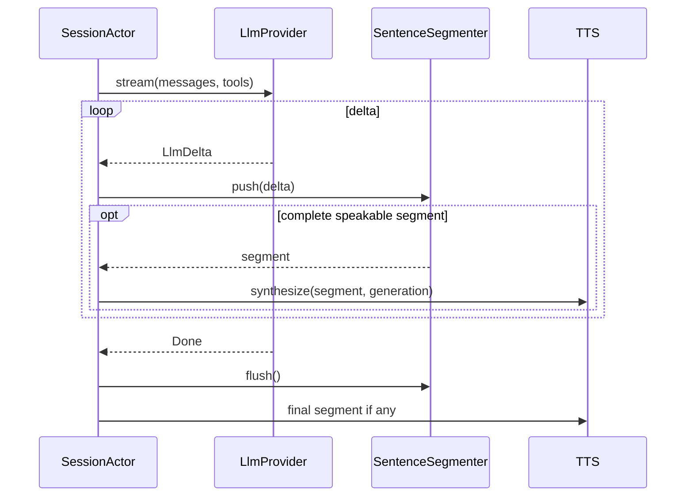
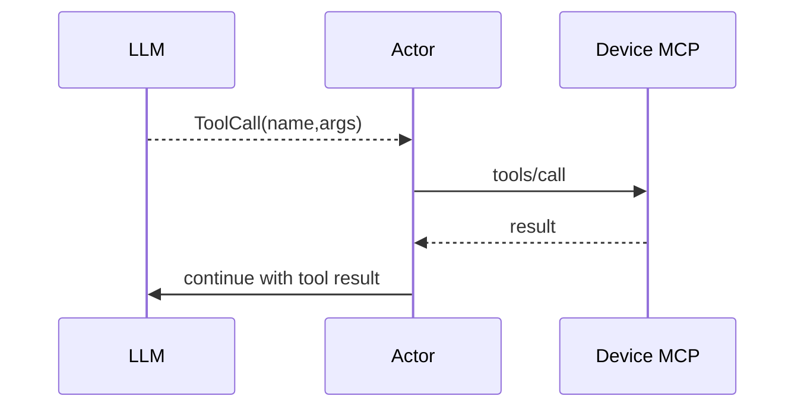

# Flow 04 — Streaming LLM

## 1. Input

```rust
pub struct LlmRequest {
    pub generation: u64,
    pub messages: Vec<ChatMessage>,
    pub tools: Vec<ToolDefinition>,
}
```

Adapter concrete V1 là `openai`, build qua crate Rust `llm`: factory map typed config sang `LLMBackend::OpenAI` và `LLMBuilder`, rồi bridge `ChatMessage`, `chat_stream_with_tools(...)` và `StreamChunk` thành `LlmEvent`. SessionActor không import type của crate `llm` hay parse OpenAI JSON/SSE.

`LlmRuntime` application-owned giữ provider shared, global semaphore và bounded route. Mỗi request là Tokio task theo Voice Session/generation, giữ permit từ runtime accept tới terminal event; timeout không reset bởi text delta. CancellationToken dừng polling/drop stream; terminal event không route được phải biến thành controlled failure, không silently drop.

Khi hàng đợi Speech Segment đầy, SessionActor giữ tối đa một delta LLM đang xử lý dở và tạm ngừng đọc bounded route. Sau khi TTS lấy bớt segment, actor tiếp tục đúng vị trí ký tự còn lại; không hủy lượt hoặc bỏ câu chỉ vì TTS chậm hơn LLM. Route bounded truyền áp lực ngược tới LLM operation.

Startup chỉ validate typed OpenAI config và build provider locally; không thực hiện network probe. DNS/TLS/auth/quota/model/5xx hay stream failure là `LlmEvent::Failed` của operation hiện tại, không làm server unavailable toàn cục.

## 2. Flow không tool call


```mermaid
sequenceDiagram
    participant A as SessionActor
    participant L as LlmProvider
    participant SEG as SentenceSegmenter
    participant T as TTS

    A->>L: stream(messages, tools)
    loop delta
      L-->>A: LlmDelta
      A->>SEG: push(delta)
      opt complete speakable segment
        SEG-->>A: segment
        A->>T: synthesize(segment, generation)
      end
    end
    L-->>A: Done
    A->>SEG: flush()
    A->>T: final segment if any
```

## 3. Sentence segmentation

Không gửi từng token vào TTS.

Segmenter phát một Speech Segment ngay khi thấy dấu kết câu `. ! ? 。！？` mà không chờ độ dài tối thiểu. Dấu chấm chỉ là boundary khi theo sau bởi whitespace/quote/closing delimiter, hoặc ở EOF và không đứng sau chữ số. EOF phát phần text cuối còn lại. Khi buffer đạt `max_chars` mà chưa có sentence boundary, nó cắt ở newline, rồi `, ; :`, rồi whitespace sau `soft_break_min_chars`; nếu không có, cắt đúng `max_chars` để giữ bound. `min_chars` không chi phối segmentation.

SpeechOutput giữ nguyên text hiển thị cho sự kiện WebSocket `llm` theo từng segment; text đưa vào TTS được NFC, chỉ giữ chữ/số cùng `.` và `,`, rồi coalesce phần còn lại thành space. Actor phát `llm` trước khi bắt đầu tổng hợp audio của segment tương ứng.

## 4. System prompt theo turn

Sau ASR/Speaker join, actor tạo đúng một System message từ snapshot prompt của
session và Speaker Context đã xác minh (nếu có). `{{speakers_info}}` được thay
thế bằng JSON đã escape trong block dữ liệu; prompt cũ không có slot chỉ được
append block khi có verified match. Context này không phải authorization, không
vào dialogue history/transcript và không sang turn sau. Tool continuation dùng
lại chính System message của turn; request vượt hard limit 96 KiB bị terminalize
trước khi gọi LLM.

## 5. Tool call

Mỗi round LLM nhận immutable catalog của session: builtin action, Device MCP đã
discover và External MCP đã admit. Nếu catalog có tool có thể thay đổi câu trả
lời, prose của round được buffer đến khi tool round kết thúc; round không có
tool vẫn stream token → segmenter → TTS.


```mermaid
sequenceDiagram
    participant L as LLM
    participant A as Actor
    participant MCP as Device MCP
    L-->>A: ToolCall(name,args)
    A->>MCP: tools/call
    MCP-->>A: result
    A->>L: continue with tool result
```

`llm.tools.max_rounds_per_turn` giới hạn vòng lặp. Khi request có LLM-visible Tool, actor phải buffer prose và tool call đến hết round; không dựa vào prompt để bảo đảm thứ tự. Nếu round có tool call, prose round đó không đi vào TTS; server gọi MCP rồi bắt đầu round kế tiếp với tool result. Chỉ final round không tool call được đưa vào SpeechOutput. Request không có tool vẫn stream token → segmenter → TTS như bình thường.

Tool-level failure khi session khỏe được normalize thành tool result `ok:false` không chứa error body/secret rồi quay lại LLM. Khi vượt `max_rounds_per_turn`, turn terminalize bằng `tool_round_limit_exceeded` trước khi gửi request của round kế tiếp, nên không có call nào mới bắt đầu; terminal session/cancellation failure không tiếp tục LLM.

Nhiều tool call của một round chạy tuần tự theo thứ tự LLM trả về, mỗi call có timeout riêng. Tool-level error không ngăn sibling call còn trong immutable catalog khi session/generation vẫn khỏe; result giữ đúng tool_call_id và thứ tự để gửi vào round kế tiếp. `llm.tools.max_rounds_per_turn` đếm tool round, không đếm individual call; `llm.tools.max_calls_per_round` giới hạn số call của một round và được kiểm tra cho cả round trước call đầu tiên. Một Tool-round Executor chung chạy Device MCP, External MCP và session-local action tuần tự; xem `docs/adr/0060-sequential-shared-tool-round-executor.md`. Final no-tool round với text rỗng sau trim là `Failed(llm_empty_final_response)`, không gọi TTS.

## 6. History commit

Chỉ commit assistant response hoàn chỉnh vào dialogue khi turn kết thúc hợp lệ.

Nếu turn cancel giữa chừng:

- không ghi chunk dở như một assistant response hoàn chỉnh;
- optional: có thể lưu telemetry riêng.

`dialogue history` ở đây là RAM state của `SessionActor` và là nguồn sự thật của prompt. Optional
Persistent Transcript là một bản archive riêng, không bao giờ đọc ngược vào prompt: tại
`WriterEvent::TurnClosed { outcome: Normal }` — cùng boundary mà commit dialogue history — turn đó
đẩy *một* record `role=assistant` vào handoff best-effort. Một turn nói thẳng tool result qua Device
MCP `direct_tts` hoặc session-local built-in action vẫn commit dialogue history như trước, nhưng không
có record assistant nào, vì đó không phải Generated Assistant Response của model. Xem
`docs/03-module-contracts.md` §6.2.

## 7. Provider abstraction

V1 dùng OpenAI qua typed API của crate `llm` 1.3.8, pin exact với default features tắt và chỉ `openai`/`rustls-tls`. Adapter phải bridge stream thành event chuẩn:

```rust
pub enum LlmEvent {
    TextDelta(String),
    ToolCallDelta(ToolCallDelta),
    Usage(TokenUsage),
    Done,
}
```

V1 không automatic retry logical LLM operation sau timeout/lỗi.

## 8. Test contract

- multiple text deltas -> đúng concatenation.
- segmenter phát segment trước stream done.
- tool call fragmented JSON được assemble đúng.
- max tool depth được enforce.
- tool-capable round có prose + tool call -> prose không được TTS; final no-tool round mới được synthesize.
- cancellation dừng downstream TTS request.
- stale generation delta bị drop.
- provider stream error -> actor kết thúc turn sạch sẽ.
- Speaker Context chỉ xuất hiện trong System message của current turn; tool continuation giữ nguyên message đó.
