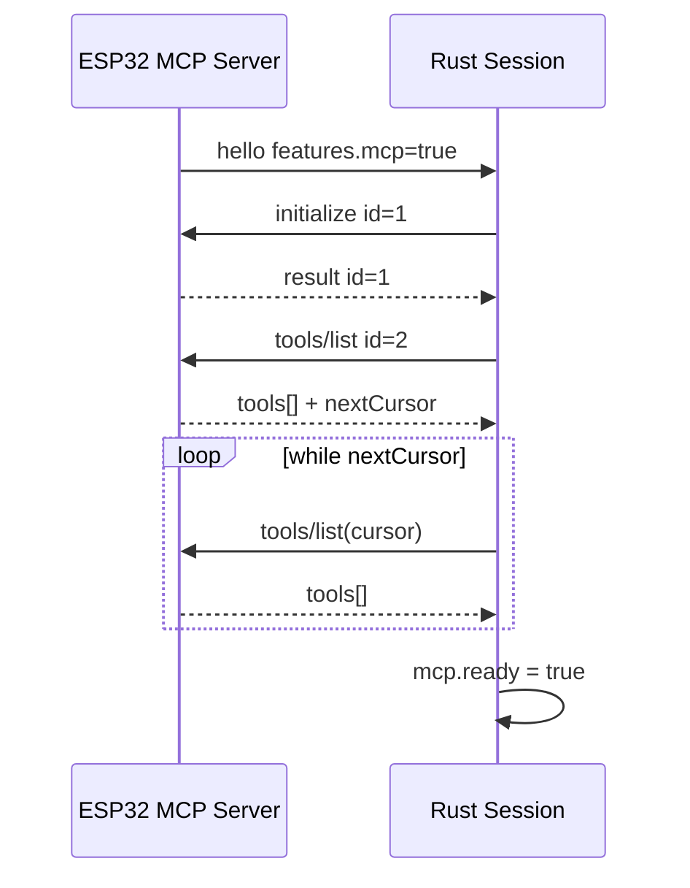
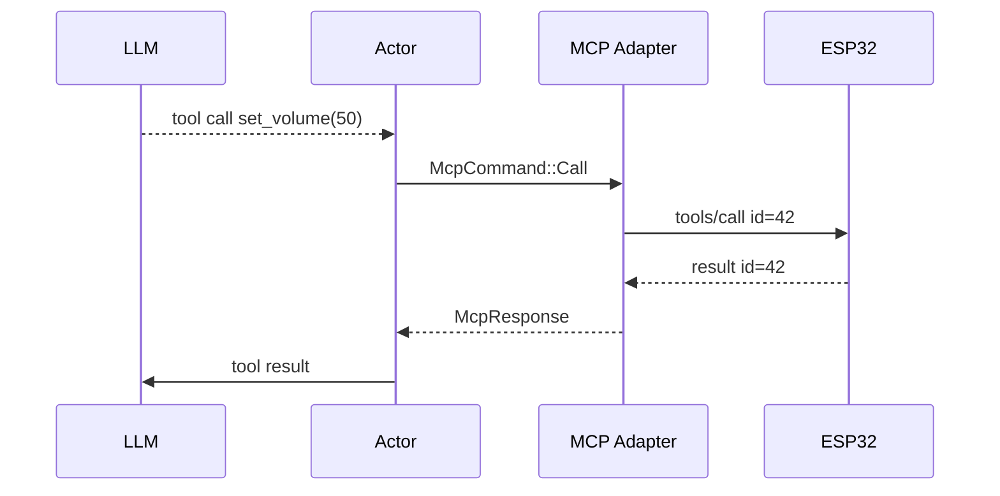

# Flow 07 — Device MCP

## 1. Scope V1

Chỉ implement ba method cốt lõi:

```text
initialize
tools/list
tools/call
```

MCP payload được bọc trong protocol message:

```json
{
  "type": "mcp",
  "session_id": "...",
  "payload": {
    "jsonrpc": "2.0"
  }
}
```

## 2. Discovery flow



## 3. Discovery, policy và tool registry

Discovery không phải permission. Server phải lọc tool trước khi đưa schema cho LLM:

```text
device tools/list -> discovered tools -> server policy filter -> LLM-visible tools
```

V1 default deny: chỉ read hoặc low-risk write có trong server-side allowlist mới được expose. Sensitive write bị deny mặc định; dangerous tool (reboot, firmware upgrade, reset, command execution tương đương) luôn deny trong V1.

Lưu:

```text
sanitized_name -> original_name + description + inputSchema
```

Tool schema được convert sang format LLM provider.

## 4. Tool call correlation

```rust
HashMap<McpRequestId, oneshot::Sender<McpResponse>>
```

Flow:



## 5. Timeout

Mỗi `tools/call` có timeout riêng. Timeout phải remove pending request khỏi map và không được automatic retry, kể cả khi tool có thể side effect.

Khi session close, fail toàn bộ pending waiters.

Actor là owner duy nhất của tool registry, request ID và `HashMap` pending. MCP adapter chỉ serialize/parse JSON-RPC và không gửi trực tiếp WebSocket; actor đóng gói request thành outbound message và match `McpResponse` theo ID.

## 6. Test contract

- initialize response -> tools/list được gửi.
- pagination -> merge đầy đủ tools.
- sanitized name map đúng original name khi call.
- out-of-order responses match đúng request id.
- timeout cleanup pending map.
- timeout/failure không gửi lần `tools/call` thứ hai tự động.
- MCP disabled -> không gửi initialize.
- discovered tool không có trong allowlist -> LLM không nhận schema và không thể gọi.
