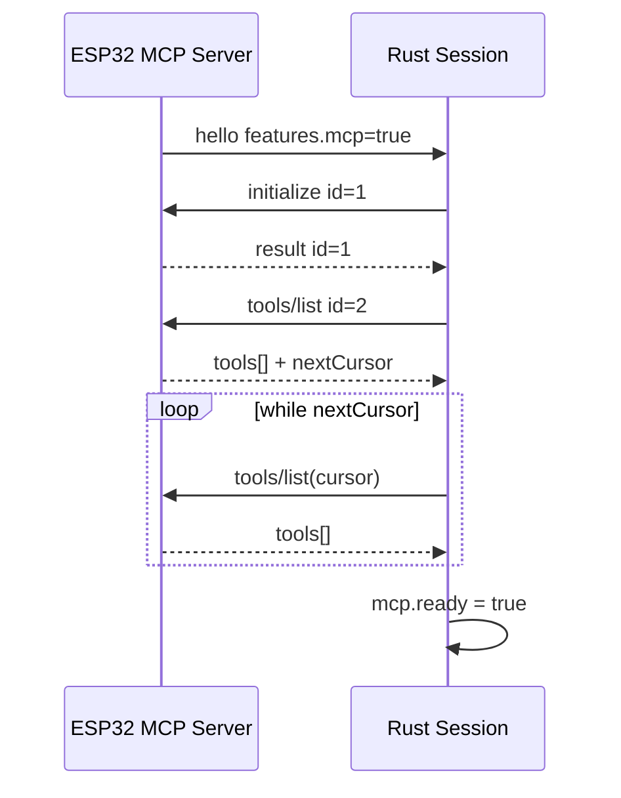
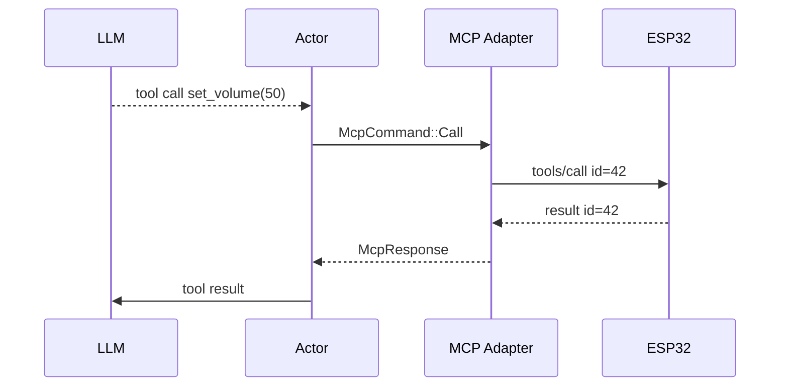

# Flow 07 — Device MCP

## 1. Scope V1

Chỉ implement ba method cốt lõi:

```text
initialize
tools/list
tools/call
```

MCP payload được bọc trong protocol message:

```json
{
  "type": "mcp",
  "session_id": "...",
  "payload": {
    "jsonrpc": "2.0"
  }
}
```

## 2. Discovery flow


```mermaid
sequenceDiagram
    participant ESP as ESP32 MCP Server
    participant A as Rust Session
    ESP->>A: hello features.mcp=true
    A->>ESP: initialize id=1
    ESP-->>A: result id=1
    A->>ESP: tools/list id=2
    ESP-->>A: tools[] + nextCursor
    loop while nextCursor
      A->>ESP: tools/list(cursor)
      ESP-->>A: tools[]
    end
    A->>A: mcp.ready = true
```

## 3. Discovery, policy và tool registry

Discovery không phải authorization. Server chỉ nhận catalog khi toàn bộ trang
`tools/list` hợp lệ và original name lẫn sanitized LLM name đều unique:

```text
device tools/list -> complete validated catalog -> LLM-visible tools
```

Device MCP V1 không có allowlist/review recovery path trong server. Catalog được
pin tại admission; discovery thất bại, timeout hoặc ambiguous name làm toàn bộ
Device MCP unavailable cho session đó. Builtin name không được Device MCP shadow,
và tool call luôn resolve từ catalog immutable này.

Lưu:

```text
sanitized_name -> original_name + description + inputSchema
```

Tool schema được convert sang format LLM provider.

## 4. Tool call correlation

```rust
HashMap<McpRequestId, PendingMcpRequest>
```

Flow:


```mermaid
sequenceDiagram
    participant L as LLM
    participant A as Actor
    participant M as MCP Adapter
    participant ESP as ESP32
    L-->>A: tool call set_volume(50)
    A->>M: McpCommand::Call
    M->>ESP: tools/call id=42
    ESP-->>M: result id=42
    M-->>A: McpResponse
    A->>L: tool result
```

## 5. Timeout

Mỗi `tools/call` có timeout riêng. Timeout phải remove pending request khỏi map và không được automatic retry, kể cả khi tool có thể side effect.

Khi session close, fail toàn bộ pending waiters.

Actor là owner duy nhất của tool registry, request ID và `HashMap` pending. MCP adapter chỉ serialize/parse JSON-RPC và không gửi trực tiếp WebSocket; actor đóng gói request thành outbound message và match `McpResponse` theo ID.

## 6. Test contract

- initialize response -> tools/list được gửi.
- pagination -> merge đầy đủ tools.
- sanitized name map đúng original name khi call.
- out-of-order responses match đúng request id.
- timeout cleanup pending map.
- timeout/failure không gửi lần `tools/call` thứ hai tự động.
- MCP disabled -> không gửi initialize.
- discovery có duplicate original/sanitized name -> cả catalog bị từ chối, không `tools/call`.
