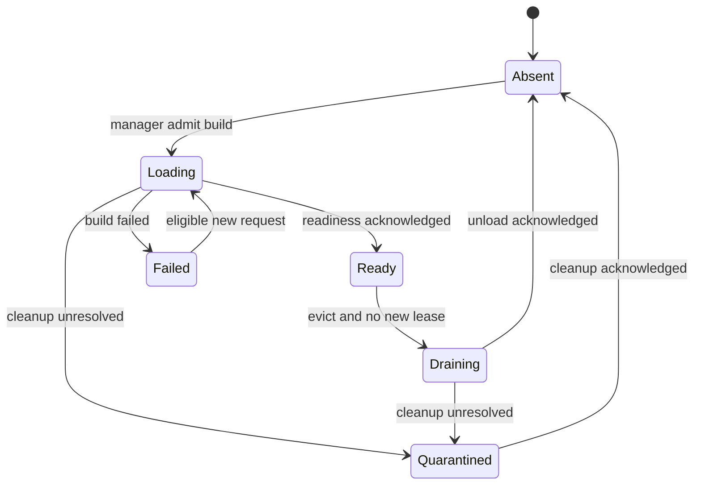

# Hướng dẫn triển khai Provider Runtime Manager theo ba đợt

**Dự án:** `hailp-vn38/ai-agent-voice`

**Nhánh đối chiếu:** `dev-test`

**Baseline:** `b3ef953fdeb9f2a83d1513f7f01b700d3fae83a2`

**Ngày:** 2026-10-03
**Đối tượng:** Agent triển khai Rust server và agent tích hợp web quản lý.

> Đây là đặc tả triển khai, chưa phải mô tả tính năng đã có. Các module, DTO, trường API và cấu hình được ghi là “đề xuất” cần được triển khai. Khi HEAD khác baseline, agent phải đối chiếu lại code trước khi sửa. Không đánh dấu tính năng hoàn thành chỉ vì đã thêm API hoặc thay badge UI.

## 1. Mục tiêu và hành vi phải đạt

Người dùng tạo Provider Instance từ API/web, gắn provider vào Template, gắn Template vào Agent. Voice Protocol Client kết nối WebSocket sau đó phải sử dụng cấu hình vừa lưu mà không restart server, nếu cấu hình hợp lệ, tài nguyên có thể được chuẩn bị và hệ thống còn đủ capacity.

Mỗi Voice Session giữ một Effective Session Profile bất biến tại thời điểm admission. Phiên mới nhận cấu hình mới; phiên đang chạy tiếp tục dùng snapshot và runtime đã được cấp. `switch_template` là thao tác explicit của phiên, sử dụng Template Switch Catalog đã snapshot tại admission, không tự đọc cấu hình mới từ database.

Tối ưu cần đạt:

- Một tài nguyên model/worker có thể phục vụ nhiều phiên theo giới hạn concurrency được kiểm soát.
- Các request cùng cần một tài nguyên đang lạnh chỉ tạo một tác vụ khởi tạo tài nguyên đó.
- Runtime còn nóng được tái sử dụng; sửa metadata hoặc prompt không làm nạp lại model sau đợt 2.
- Tài nguyên được giữ trong RAM có giới hạn, thu hồi có acknowledgement và không phá phiên đang sử dụng.
- Runtime đúng revision phải được cấp; không âm thầm fallback về runtime cũ hoặc server defaults khi cấu hình dự kiến lỗi.
- Thời gian nạp lạnh, admission, chuyển template, RAM và số lần khởi tạo đều đo được.

Không cam kết model chưa nạp sẽ nhanh như model đã nằm trong RAM. “Dùng ngay” ở đây nghĩa là không phụ thuộc restart; một lần sử dụng lạnh có thể phải chờ khởi tạo trong deadline hoặc nhận lỗi/pending rõ ràng.

## 2. Vấn đề hiện tại đã xác minh

### 2.1. Cấu hình được đọc tại WS nhưng runtime vẫn cố định từ startup

Flow hiện tại:

1. Provider CRUD lưu Database Desired Configuration.
2. Startup materialize các provider theo Provider Load Plan.
3. WS gọi `resolve_session_profile(...)` để đọc Device → Agent → Template → Provider binding.
4. Profile resolver và WS dùng Runtime Catalog đã nạp để resolve theo provider key.

`AdmittedProviderBinding` hiện chỉ có `provider_type`, `provider_key`, `provider_enabled`; chưa có provider ID, revision, adapter, config hoặc secret reference. Admission không tạo runtime mới từ cấu hình provider.

Hệ quả:

| Tình huống | Hành vi hiện tại / vấn đề |
|---|---|
| Tạo provider sau startup | Provider đã lưu nhưng chưa có runtime; WS không dùng được |
| Sửa cấu hình provider đã nạp | Catalog theo key vẫn có runtime cấu hình cũ |
| Gắn provider mới vào Template/Agent | Lưu binding không tạo runtime |
| Test provider chưa nạp | Diagnostic yêu cầu loaded runtime |
| Provider không thuộc load plan | Startup không tạo runtime dù đã có cấu hình |
| Các phiên bản provider cùng tồn tại | Catalog hiện chưa quản lý tài nguyên theo version và lease |
| Nhiều provider có cùng cấu hình | Chưa có Resource Key dùng để chia sẻ tài nguyên |

### 2.2. Những điểm phải xử lý cùng việc nạp động

- Mỗi revision có thể sinh model, worker và semaphore mới: nếu không có limiter chung sẽ tăng RAM/concurrency ngoài dự kiến.
- TTS runtime tạo worker thread nhưng chưa có một hợp đồng manager-level chứng minh mọi worker cần thiết đã khởi tạo thành công trước khi công bố Ready.
- TTS `worker_loop` hiện có fallback khi `open_worker()` lỗi. Dynamic materialization cần phân biệt adapter cố ý dùng worker wrapper với adapter native khởi tạo thất bại; không đánh dấu Ready nhờ fallback che lỗi.
- Worker sở hữu ONNX sessions của ZeroTTS/Kokoro: tính RAM theo số worker và đỉnh khởi tạo/warmup, không chỉ theo file model.
- Timeout của caller không đồng nghĩa native work đã dừng; không release accounting và tạo replacement vô hạn.
- Nếu mọi candidate trong switch catalog giữ strong runtime handle, một Agent có nhiều Template có thể pin tất cả model dù chưa dùng.
- Các read DB riêng rẽ có thể tạo graph không nhất quán trong lúc Admin mutation; cần read transaction ngắn cho snapshot.

### 2.3. Bản đồ mã nguồn cần đọc

Các đường dẫn dưới đây là đường dẫn repository tại baseline, không phải tên module mới.

| Đường dẫn | Vai trò / thay đổi liên quan |
|---|---|
| `crates/voice-agent-server/src/database/admission.rs` | Snapshot graph Device/Agent/Template/Provider |
| `crates/voice-agent-server/src/database/provider_config.rs` | Validate, normalize cấu hình credential-free |
| `crates/voice-agent-server/src/database/secrets.rs` | Secret resolver; identity/version của credential |
| `crates/voice-agent-server/src/database/load_plan.rs` | Chính sách startup hiện tại |
| `crates/voice-agent-server/src/providers/database_loader.rs` | Tách materialize một provider ra khỏi startup loop |
| `crates/voice-agent-server/src/providers/factory_registry.rs` | Factory đã compile, tạo provider/runtime |
| `crates/voice-agent-server/src/providers/runtime_catalog.rs` | Catalog lookup hiện tại; tránh giữ nó như owner song song |
| `crates/voice-agent-server/src/app/state.rs` | Application owner, profile admission, readiness |
| `crates/voice-agent-server/src/app/websocket.rs` | Chuẩn bị runtime trước upgrade và trước audio |
| `crates/voice-agent-server/src/session/profile.rs` | Effective Session Profile và switch candidate |
| `crates/voice-agent-server/src/services/provider_diagnostic.rs` | Test lifecycle, timeout, quarantine, permits |
| `crates/voice-agent-server/src/app/admin/providers.rs` | CRUD và runtime status |
| `crates/voice-agent-server/src/app/admin/provider_adapters.rs` | Descriptor, discovery và capabilities |
| `crates/voice-agent-server/src/app/admin/templates.rs` | Bind và default-template mutation |
| `crates/voice-agent-server/src/workers/{asr,tts,vad}.rs` | Stream/worker ownership, reset, cleanup |
| `crates/voice-agent-server/src/models.rs` | Model Preparation, installed artifacts, acquisition |
| `crates/voice-agent-server/src/main.rs` | Startup, manager owner, shutdown |
| `docs/api/00-all-apis.postman_collection.json` | Hợp đồng API cần cập nhật |

Nguồn baseline: [WS admission](https://github.com/hailp-vn38/ai-agent-voice/blob/b3ef953fdeb9f2a83d1513f7f01b700d3fae83a2/crates/voice-agent-server/src/app/websocket.rs), [database admission](https://github.com/hailp-vn38/ai-agent-voice/blob/b3ef953fdeb9f2a83d1513f7f01b700d3fae83a2/crates/voice-agent-server/src/database/admission.rs), [database loader](https://github.com/hailp-vn38/ai-agent-voice/blob/b3ef953fdeb9f2a83d1513f7f01b700d3fae83a2/crates/voice-agent-server/src/providers/database_loader.rs), [diagnostic service](https://github.com/hailp-vn38/ai-agent-voice/blob/b3ef953fdeb9f2a83d1513f7f01b700d3fae83a2/crates/voice-agent-server/src/services/provider_diagnostic.rs).

## 3. Các quyết định thay thế và các hợp đồng phải giữ

### 3.1. ADR cần cập nhật

| ADR | Hành động |
|---|---|
| `0050-database-desired-configuration-and-loaded-runtime` | Supersede phần process-immutable, requires-restart và không hot-load; thay bằng versioned runtime manager |
| `0052-effective-session-profile-is-immutable` | Giữ snapshot bất biến; sửa candidate snapshot để không bắt buộc pin/nạp mọi runtime lúc admission |
| `0066-single-owner-db-and-bounded-runtime-lifecycle` | Giữ single-process SQLite ownership; cập nhật readiness/startup và lifecycle của manager |
| `0040-asr-worker-pool-stream-pinning` | Giữ stream pinning, cancellation acknowledgement và quarantine |
| `0042-worker-runtime-module-boundaries` | Giữ provider/worker/session boundaries |
| `0043-compile-time-provider-registry` | Giữ adapter registry compile-time; không runtime plugin injection |
| `0023-zero-provider-retries` | Giữ logical ASR/LLM/TTS/MCP operation không automatic retry |
| `0062-credential-free-typed-provider-config` | Giữ config credential-free, bounded và typed |

Yêu cầu của tài liệu này đã chọn thiết kế mới thay cho startup-only runtime. Agent cập nhật ADR theo quy ước repo; không yêu cầu người dùng xác nhận lại cùng quyết định chỉ vì ADR cũ khác thiết kế mới.

### 3.2. Invariants bắt buộc từ đợt 1

1. SessionActor không giữ DB repository/pool, không load model và không gọi secret resolver.
2. Session snapshot chỉ gồm dữ liệu owned; read transaction kết thúc trước mọi load/warmup/network request.
3. Runtime version được chọn từ snapshot, không query lại desired config giữa pipeline để ghép các revision khác nhau.
4. Không fallback sang runtime cũ/server defaults khi selected Template/provider lỗi.
5. Cùng một key materialization chỉ có một builder đang chạy.
6. Không giữ registry lock trong native initialization, warmup, inference, chờ semaphore hoặc unload.
7. Resource Lease giữ tài nguyên sống; Inference Capacity Permit giới hạn công việc đang chạy. Phiên idle không giữ permit inference chỉ vì giữ runtime handle.
8. Giới hạn RAM, loader concurrency, queue và metadata entries có ngay từ đợt 1.
9. Tài nguyên bị quarantine vẫn tính RAM/capacity cho đến khi có bằng chứng cleanup; không replacement vô hạn.
10. Worker Ready phải được xác nhận; thành công của constructor spawn thread chưa đủ chứng minh khả năng inference.
11. Không đổi runtime giữa một ASR stream hoặc một response TTS nhiều segment.
12. Switch commit cùng lúc prompt/language/bindings/runtime và tăng Session Profile Revision đúng một lần.
13. Session cũ giữ snapshot cũ; Admin patch/disable/delete tác động admission mới, không tự revoke realtime.
14. Global/per-provider quotas không nhân lên theo số revision.
15. GET status, `/health`, `/ready` không khởi tạo model để “kiểm tra”.
16. Không log prompt, transcript, PCM, credential, raw config hoặc secret reference. Dùng metadata và error class đã redact.
17. Các adapter/model artifact ngoài khả năng binary hiện tại vẫn cần build/deploy phù hợp. Dynamic runtime không làm xuất hiện adapter mới trong binary.
18. Đổi ONNX Runtime library hoặc thiết lập process-global vẫn có thể cần restart; hot config ở đây áp dụng Provider Instance/Template/Agent được hỗ trợ.

## 4. Kiến trúc đích

### 4.1. Ba lớp ownership

| Lớp | Owner | Chia sẻ / vòng đời |
|---|---|---|
| Database Desired Configuration | SQLite và Admin service | Persisted, tăng revision theo mutation |
| Loaded Runtime / tài nguyên execution | Application-owned Runtime Manager | Dùng chung, giữ nóng/ấm có giới hạn |
| Session và stream state | Voice Session + Inference Worker Runtime | Riêng session/stream/turn; reset và cleanup explicit |

Manager có thể được chia thành các module đề xuất theo trách nhiệm:

```text
src/services/provider_runtime/
  mod.rs          # public facade và application ownership
  identity.rs     # ProviderVersion, ResourceKey, normalized selection
  registry.rs     # entries, singleflight, generation/state transitions
  materialize.rs  # typed adapter factory, worker readiness, warmup
  budget.rs       # resident/loading/draining accounting
  lease.rs        # resource/session/operation lifetime
  lifecycle.rs    # cancellation, quarantine, unload, shutdown
  status.rs       # DTO privacy-safe, không load khi GET
  tests/          # tách file test theo trách nhiệm
```

Đây là layout gợi ý. Tái sử dụng module hiện có nếu phù hợp; không tạo một file manager chứa toàn bộ DB, HTTP, model và worker logic.

### 4.2. Hai identity khác nhau

**ProviderVersion:** `(provider_identity, desired_revision)`; identity phải không bị tái sử dụng sau delete/recreate. Kiểm tra schema thực tế: nếu row ID có thể tái sử dụng, bổ sung immutable instance UUID bằng migration hoặc một identity tương đương. Chỉ dùng provider key là sai khi key được tạo lại.

**ResourceKey, từ đợt 2:** opaque digest của adapter-defined resource specification đã canonicalize. Tối thiểu bao gồm adapter/implementation version, installed artifact fingerprints, execution target, engine/thread/worker settings và các init-only parameter.

ProviderVersion → logical runtime view → ResourceKey → shared resource.

Không dùng raw JSON order, timestamp, provider name/description hoặc prompt làm ResourceKey. Không hash path string thay cho artifact content/version. File cùng path nhưng model khác phải tạo ResourceKey khác. Artifacts đang được phiên cũ sử dụng không được overwrite tại chỗ; lưu theo content/version, publish atomic.

Trong đợt 1, resource identity có thể tạm gắn một-một với ProviderVersion. Đợt 2 thêm chia sẻ chéo version/provider mà không đổi hợp đồng session lease.

### 4.3. Secret identity

- Config và DB snapshot chỉ chứa SecretRef, không credential value.
- Resolver trả credential và opaque generation/identity cho materializer; không log hoặc persist giá trị.
- Đợt 1 có thể scope credential tới provider identity + revision, chưa chia sẻ chéo provider.
- Đợt 2 chỉ chia sẻ authenticated resources khi credential scope/generation khớp theo hợp đồng resolver và adapter.
- EnvSecretResolver không hỗ trợ tự phát hiện “environment của process đã được đổi từ bên ngoài”. Không hứa hot secret rotation nếu chưa có nguồn secret hỗ trợ version/refresh explicit.
- Không so credential bằng hash hiển thị công khai; không coi mọi provider cùng base URL là cùng tài nguyên authenticated.

### 4.4. State machine và generation



Mỗi loading/eviction attempt có generation ID. Completion chỉ publish khi entry/key/generation còn khớp; completion cũ không ghi đè attempt mới. Không tạo lại cùng tài nguyên khi entry cũ đang Draining/Quarantined và accounting chưa giải quyết.

`Failed` có error class, thời điểm và cooldown ngắn được cấu hình. Một request đã lỗi không tự chạy lại inference. Sau cooldown, một request mới có thể tạo attempt mới; validation/artifact/secret failure có thể yêu cầu revision/resource generation hoặc Prepare explicit thay đổi. Cache failure và version aliases cũng phải bounded.

## 5. Đợt 1 — Runtime động đúng version, có giới hạn và an toàn

### 5.1. Kết quả cần đạt

Ngay đợt này: tạo provider khi server đang chạy, gắn Template/Agent và kết nối WS mới sử dụng được; Test provider mới không cần gắn Template; không restart. Chưa yêu cầu deduplicate mọi revision metadata hoặc chia sẻ model giữa provider khác nhau.

### 5.2. D1-01: Snapshot DB nhất quán

1. Đọc Device, Agent, Template assignments, overrides và provider bindings trong một read transaction ngắn.
2. Snapshot provider cần có immutable identity, key, type, revision, adapter, enabled, validated config và SecretRef.
3. Deduplicate các provider xuất hiện trong nhiều Template theo identity/version.
4. Bound số assignments, provider snapshots và tổng snapshot bytes; không chỉ dựa vào giới hạn 64 KiB cho từng config.
5. Dùng DB constraints/validation hiện có; unknown Device, disabled Agent/Template/Provider, default incomplete vẫn bị từ chối đúng hợp đồng.
6. Snapshot candidate phụ có cấu hình hợp lệ được giữ dù runtime chưa nạp. Candidate lỗi cấu hình bị loại và có diagnostics; không dùng tình trạng cold như lỗi cấu hình.
7. Kết thúc transaction trước resolve secret, model preparation hoặc runtime acquisition.

DTO đề xuất: `ProviderConfigSnapshot`, `TemplateConfigSnapshot`, `SessionAdmissionSnapshot`. Không serialize internal snapshot chứa SecretRef thành public API.

### 5.3. D1-02: Tách materializer khỏi startup

- Refactor factory invocation đang ở `database_loader.rs` thành seam tạo đúng một provider/runtime từ owned snapshot.
- Dùng compile-time registry, typed config validator và Model Preparation hiện có; không viết validator thứ hai chỉ cho WS.
- Có builder seam inject được trong unit/integration tests; production vẫn dùng registry compile-time thật.
- Blocking ONNX/native/file work chạy trên executor/thread dành cho materialization, có concurrency bound. Không chạy trên Tokio core hay audio actor.
- Không gọi một hàm constructor có `expect`/panic như cơ chế xử lý lỗi model/config bình thường. Chuyển failure thành typed result.
- Model acquisition dùng đường dẫn atomic và singleflight theo artifact identity; WS hot path không phụ thuộc tải lớn. Nếu artifacts thiếu/corrupt, báo cần chuẩn bị; Test/Prepare hoặc explicit deployment preparation có thể acquire theo policy online/offline hiện có.
- Runtime defaults từ TOML phải có namespace/source identity riêng để không va chạm provider DB cùng key.
- Capabilities/typed validation phải thống nhất descriptor registry, desired-config validator và runtime factory. Có contract test cho adapter được quảng bá nhưng không materialize được. Tại baseline cần kiểm tra riêng coverage của `kokoro_vi_onnx` trong DB config validation; không coi descriptor tồn tại là đủ hỗ trợ CRUD.

### 5.4. D1-03: Singleflight, budgets và publish Ready

Thứ tự cho một key chưa có:

1. Check application admission gate.
2. Đăng ký Loading entry một cách atomic hoặc tham gia attempt đang có.
3. Admit vào hàng đợi bounded; cấp load permit và memory reservation trước native allocation.
4. Resolve secret, kiểm tra installed artifacts và build runtime.
5. Khởi tạo worker thực tế; nhận acknowledgement thành công/lỗi từ worker.
6. Chạy warmup cần thiết trên worker sẽ được giữ lại; không warmup bằng engine tạm rồi bỏ engine đó và tải lại cho worker.
7. Chỉ publish Ready khi worker set cần thiết đã sẵn sàng và runtime hợp lệ.
8. Chuyển reservation sang resident accounting đúng một lần; phát kết quả tới waiters.

Hợp đồng budget từ đợt 1:

| Budget | Quy tắc |
|---|---|
| Loader concurrency | Khởi đầu một native model load đồng thời |
| Build queue/waiters | Bounded; đầy trả busy, không task/queue tăng vô hạn |
| Memory reservation | Dùng estimated peak của build/warmup, gồm native sessions, worker, subprocess và transient allocations |
| Resident resources | Bounded bytes và số resource; đợt 1 có thể evict idle theo policy đơn giản |
| Version/failed metadata | Bounded độc lập với số resource |
| Global work limit | Giữ Active Turn Limiter; bổ sung budget execution nếu cần |
| Logical provider quota | Dùng chung qua mọi revision của provider |

Estimated memory budget không phải hard OS RAM guarantee. Đặt estimate bảo thủ, đo peak thực tế, cộng safety margin và ngừng admit build khi RSS guard vượt ngưỡng nếu nền tảng hỗ trợ. Không gắn nhãn “hard RAM cap” cho bộ đếm estimate.

Một attempt đang native-build dù caller timeout vẫn giữ reservation/load slot cho đến khi completion/cleanup được xác nhận. `spawn_blocking` bị timeout hoặc drop future không chứng minh hàm native đã dừng.

### 5.5. D1-04: Resource Lease và lifecycle

- Resource Lease giữ tài nguyên; session/diagnostic giữ lease trong toàn lifetime có thể dùng runtime.
- Inference permit chỉ giữ trong công việc tương ứng; giữ nguyên ASR Stream Lease và cleanup semantics hiện có.
- Entry cache giữ warm resource khi không có active lease, trong budget/TTL.
- Acquire và evict phải đồng bộ qua registry: không check `Arc::strong_count` rồi evict mà để acquire race ở giữa.
- Không evict active/session-bound, building, operation-bound hoặc quarantined resources.
- Evict đặt Draining, chặn lease mới, yêu cầu worker shutdown rồi đợi acknowledgement/thread exit/subprocess exit.
- Chỉ trả memory budget sau unload được xác nhận. Unload tốn thời gian không chạy trong registry lock.
- Reset failure hoặc cleanup timeout không trả worker về available pool.
- Shutdown: đóng admission → hủy queued prewarm/build chưa chạy → drain sessions và operations → shutdown resources; dùng cùng application deadline. Không mở deadline mới nối tiếp để kéo dài shutdown.

Resource giữ trực tiếp các worker nên cần lifecycle service có quyền cleanup; không dựa hoàn toàn vào `Drop` best-effort gửi Shutdown. Diagnostics tiếp tục giữ capacity cho đến terminal acknowledgement/quarantine như service hiện có.

### 5.6. D1-05: WS admission và switch

Flow admission mới:

```text
validate WS identity/auth
→ read bounded DB snapshot
→ validate selected Template
→ acquire selected VAD/ASR/LLM/TTS versions through manager
→ materialize Effective Session Profile + leases
→ WS upgrade
→ ClientHello / ServerHello / Ready theo protocol hiện có
```

- Selected Template theo device override/default hiện có. Không tự chọn một candidate khác khi selected Template lỗi.
- Một overall admission deadline giới hạn các stage; stage timeout không được cộng dồn vượt overall deadline.
- Một slot lỗi: release các lease đã acquire; không để pipeline nửa mới/nửa cũ. Resource cache còn có thể giữ tài nguyên thành công theo budget.
- Không buộc load mọi Template phụ trước khi upgrade. Switch catalog snapshot config/candidate identity, không pin mọi runtime handle.
- Candidate switch được chuẩn bị bởi application service ngoài actor. Actor chỉ gửi command và nhận completion event mang session/request identity, cùng resource leases đã chuẩn bị.
- Hoàn tất một switch ở next-turn boundary sau terminal writer outcome và cleanup obligations của turn/streams cũ. Guard thêm History-Barrier Turn và cancellation/generation hiện có.
- Prompt, language, profile/bindings và runtime handles đổi atomic. Failure/cancel giữ profile cũ; late completion bị bỏ và leases được cleanup.
- Trong lúc PrepareSwitch chưa xong, phiên không tự dùng target. Chỉ giữ một switch request đang pending; request cạnh tranh nhận busy hoặc theo policy explicit, không queue vô hạn.
- Không query DB để refresh snapshot của phiên trong switch.

Cold admission vẫn có thể lỗi do WS/proxy/client handshake timeout. D1 bound chờ và trả lỗi rõ ràng; D2 prewarm/Prepare giảm trường hợp này. Không sửa wire handshake để giấu việc model chưa Ready.

### 5.7. D1-06: Diagnostics, trạng thái API và startup

**Diagnostics:** giữ endpoint `POST /providers/{key}/test/{type}`. Snapshot current desired revision một lần, acquire qua manager rồi test đúng version đó. Provider chưa bind vẫn test được. Trong lúc test có patch mới, test trả provenance của snapshot đã test, không tự đổi version giữa request.

**GET status/capabilities:** chỉ inspect manager và desired metadata; không resolve secret hoặc load model. Capabilities của runtime phải đến từ runtime/version thực sự dùng, không từ adapter desired mới khi đang giữ runtime cũ. Descriptor/discovery trước tạo provider tiếp tục metadata-only.

Public runtime DTO đề xuất, thêm vào response mà không đổi các trường business hiện có:

```json
{
  "key": "tts_maichi",
  "revision": 2,
  "runtime_status": "not_loaded",
  "runtime_matches_desired": false,
  "requires_restart": false,
  "runtime": {
    "desired_revision": 2,
    "desired_state": "cold",
    "ready_revisions": [1],
    "can_prepare": true,
    "failure_code": null
  }
}
```

Đây là response đề xuất, chưa có tại baseline. `ready_revisions` bounded; không chứa raw config, paths, credential hoặc SecretRef.

| `runtime.desired_state` | Ý nghĩa |
|---|---|
| `cold` | Desired version chưa Ready; không có build attempt |
| `queued` | Đã nhận Prepare/build intent, chờ capacity |
| `loading` | Đang khởi tạo |
| `ready` | Exact desired version acquire được |
| `failed` | Attempt lỗi; có safe error code |
| `draining` | Resource backing version đang unload |
| `quarantined` | Cleanup chưa được xác nhận |

Giữ enum cũ `runtime_status=not_loaded|loaded|unavailable` trong migration API: loaded chỉ khi desired version Ready; unavailable khi failed/quarantined; các trạng thái cold/queued/loading/draining map về not_loaded. Document thay đổi so với nghĩa “bất kỳ startup version nào đã loaded”. `runtime_matches_desired` chỉ true khi exact desired view Ready. `requires_restart` không còn tính bằng phủ định matches; provider hot-supported trả false kể cả đang cold/failed. Không báo restart như cách chữa mọi lỗi.

Provider disabled vẫn có thể có old leased resources nhưng không admit request mới. `enabled` và availability là hai trạng thái riêng.

**Startup/readiness:** manager là owner duy nhất cho cả runtime defaults và DB-backed runtime. Giữ preload bắt buộc cho deployment defaults cần chứng minh startup. DB Agent default Template không còn mặc định chặn bind vì tất cả provider phải load; nó là warmup intent, admission sẽ fail cụ thể nếu target không usable. `/ready` chứng minh manager/gates/DB/schema và deployment defaults theo hợp đồng mới, không chạy full per-device admission hoặc nạp model.

### 5.8. Test và tiêu chí nghiệm thu đợt 1

Tests cần xác nhận hành vi quan sát được, không chỉ map enum hoặc gọi helper vừa viết:

| ID | Scenario / assert |
|---|---|
| D1-T01 | Server giữ nguyên process; API tạo/bind provider mới; WS mới đi qua admission và gọi đúng provider |
| D1-T02 | Session A giữ revision 1; patch thành 2; session B dùng 2; A không đổi |
| D1-T03 | N request đồng thời cùng ProviderVersion → builder count = 1 |
| D1-T04 | Snapshot DB không trộn bindings/config revisions dưới concurrent mutations |
| D1-T05 | Worker init fail → không publish Ready; không fallback âm thầm |
| D1-T06 | Caller timeout/cancel không làm mất load/memory accounting của native attempt đang chạy |
| D1-T07 | Load queue, RAM, global/provider limits đầy → lỗi bounded; không tạo thêm native resources |
| D1-T08 | Active resource không bị evict; unload chưa ack không trả RAM reservation |
| D1-T09 | Failed/quarantined entry không tạo replacement vô hạn |
| D1-T10 | Test provider chưa bind khởi tạo đúng version và có provenance |
| D1-T11 | Switch cold target: chuẩn bị ngoài actor; commit ở boundary; failure giữ template cũ |
| D1-T12 | Switch late completion sau abort/disconnect không đổi profile hoặc rò lease |
| D1-T13 | Delete/recreate key hoặc ID không cấp runtime từ instance đã xóa |
| D1-T14 | GET status/capabilities/readiness không gọi builder/secret resolver |
| D1-T15 | Shutdown với sessions/builds/diagnostics pending giữ deadline và accounting |
| D1-T16 | Không đổi audio contract, cleanup acknowledgement, writer outcome và history commit |

Nghiệm thu đợt 1 khi D1-T01/T02/T03/T05/T06/T08/T10/T11 có bằng chứng automated rõ ràng và toàn bộ các gate liên quan đạt. Test D1-T01 cần có scenario public API + WS; unit mock manager không thay thế scenario này.

## 6. Đợt 2 — Tái sử dụng tài nguyên, chuẩn bị nền và cache có ngân sách

### 6.1. Kết quả cần đạt

Sửa metadata/prompt không nạp lại model; provider cấu hình giống nhau chia sẻ tài nguyên khi adapter cho phép; template sắp dùng được chuẩn bị nền; tài nguyên ít dùng được thu hồi theo usage và budget.

### 6.2. D2-01: ResourceKey và logical views

Adapter cung cấp resource specification typed gồm các field init-only. Manager canonicalize và hash specification; không hardcode mọi adapter vào một hàm lọc JSON chung.

- Metadata revision mới có thể ánh xạ về resource cũ; exact ProviderVersion view vẫn tồn tại để giữ provenance.
- Không mặc định hai model cùng tên là cùng artifact; dùng manifest/content fingerprints đã verify.
- Khóa bao gồm các yếu tố execution ảnh hưởng session/engine; omitted defaults được normalize trước khi hash.
- Chỉ share theo capability explicit của adapter. Native worker có mutable state không được truy cập đồng thời chỉ vì được bọc `Arc`.
- Pool backing resource có limiter vật lý dùng chung. Logical quotas của provider view vẫn độc lập và tồn tại qua revision.
- Generic cache cho remote LLM client chỉ chia sẻ trong credential/network-policy scope tương thích; prompt/history luôn per-session.
- Version aliases bounded; alias đang được session dùng không bị mất; expired alias có thể được dựng lại từ owned snapshot mà không reload engine nếu resource vẫn Ready.

### 6.3. D2-02: Prewarm sau commit và Prepare endpoint

Sau DB commit bind/default-template hoặc patch runtime-affecting của provider đang dùng, gửi warmup intent vào queue bounded. Không giữ transaction hoặc HTTP mutation chờ model.

Warmup intents:

- Coalesce theo ResourceKey; debounce cập nhật liên tiếp.
- Revalidate desired revision khi intent nền chạy; intent obsolete chưa bắt đầu có thể bỏ.
- Explicit snapshot request của session cũ không được đổi sang newest chỉ vì intent mới hơn xuất hiện.
- Voice admission/explicit Test hoặc Prepare có ưu tiên hơn speculative prewarm; prewarm không chiếm inference capacity phục vụ voice.
- Khi queue đầy, CRUD vẫn thành công; status chỉ ra chưa được chuẩn bị. WS/Test vẫn có đường acquisition theo deadline.
- Model acquisition nền dùng installed artifact manager singleflight và policy online/offline.

API mới đề xuất cho web:

```http
POST /api/admin/providers/{key}/prepare
Authorization: Bearer <admin_token>
Content-Type: application/json

{}
```

Server snapshot desired version hiện tại. Ready → `200`; đã nhận/coalesce intent queued/loading → `202`; disabled/conflict → `409`; capacity không thể nhận → `429`; DB/error infrastructure → `503`. Body không chứa arbitrary model paths/credentials/config override. Response trả provider key, desired revision và safe state.

Prepare là thao tác idempotent theo selected version; không chạy inference người dùng và không retry logical provider operation. Có rate/concurrency limit phù hợp để không biến endpoint thành native allocation flood.

Client poll `GET /providers/{key}`; khi revision desired thay đổi thì hiểu trạng thái của revision mới. Nếu cần inspect attempt cũ, dùng bounded manager diagnostics; không ngụ ý polling luôn theo dõi revision lúc bấm Prepare.

### 6.4. D2-03: Cache nóng/ấm/lạnh và eviction

| Mức | Chính sách |
|---|---|
| Active | Resource Lease/operation đang sử dụng; không evict |
| Hot | Tập deployment/default và provider sử dụng thường xuyên trong ngân sách |
| Warm | Không active, mới sử dụng; TTL và eviction theo last-use |
| Cold | Chỉ có config/installed artifacts, chưa có resident engine |

Không pin tất cả Agent default Template hoặc Template phụ vô điều kiện. Có `max_hot_resources` và byte budget; hot là ưu tiên retention, không quyền vượt ngân sách.

- Tính idle kể từ cuối operation/session lease tương ứng, không từ GET status.
- Chỉ đếm usage thật; polling hoặc list page không tăng hotness.
- Evict idle least-recently-used trước khi admit build mới; giữ registry synchronization với acquisition.
- Đủ RAM để overlap old/new thì tạo mới; không đủ thì trả memory-pressure/busy hoặc chờ bounded, giữ sessions cũ nguyên vẹn.
- Không evict Draining rồi admit build mới trên giả định RAM đã trả.
- Chống eviction/reload thrashing bằng TTL/hysteresis và số lần build có thể quan sát.
- Cache timer/reaper bắt đầu một lần bởi application owner; không một task vô hạn cho mỗi provider.

Đề xuất config mới trong deployment config, phải bổ sung parser/validation trước khi dùng:

| Field đề xuất | Điểm bắt đầu |
|---|---|
| `provider_runtime.max_parallel_loads` | `1` cho native model |
| `provider_runtime.max_pending_loads` | Bounded; xác định theo homelab workload |
| `provider_runtime.max_resident_bytes` | Bắt buộc tính từ RAM máy và measured peak; không copy số giả định |
| `provider_runtime.max_resources` | Bounded cùng byte budget |
| `provider_runtime.max_version_entries` | Bounded; tính cả aliases/failures |
| `provider_runtime.idle_ttl_ms` | Khởi đầu 600000 ms, điều chỉnh theo số đo |
| `provider_runtime.admission_timeout_ms` | Nhỏ hơn deadline handshake thực tế của client/proxy |
| `provider_runtime.failure_cooldown_ms` | Ngắn, bounded, không application retry inference |

Không thêm `preload=true` như quyền bỏ qua budget hoặc tạo model trong CRUD transaction.

### 6.5. D2-04: API/UI và observability

UI provider sau Save hiển thị “Đã lưu”. Hiển thị state mong muốn: chưa chuẩn bị, đang chuẩn bị, sẵn sàng hoặc lỗi; có Prepare/Test. Sau binding: “Áp dụng cho kết nối mới”. Loại bỏ luồng bắt restart cho hot-supported Provider Instance.

Các metric tối thiểu:

- Runtime acquisition hit/miss, coalesced waiters, build attempts/success/failure.
- Queue wait, config snapshot time, build/worker init/warmup time, WS admission time.
- Resident estimate, reserved build peak, draining/quarantined estimate; đo process RSS riêng.
- Active resource/session leases, physical worker/inference usage và logical provider usage.
- Evictions, reloads, obsolete intents skipped; switch prepare/commit/failure latency.

Không dùng provider revision, request ID hoặc ResourceKey digest làm metric label vô hạn. Dùng type/adapter/state/error class cho metrics; version provenance ở safe bounded response/log theo privacy policy repo.

### 6.6. Test và tiêu chí nghiệm thu đợt 2

| ID | Scenario / assert |
|---|---|
| D2-T01 | Đổi name/description → revision mới, engine build count không tăng |
| D2-T02 | Đổi prompt/language Template mà resource specification không đổi → không reload engine |
| D2-T03 | Hai Provider Instance cấu hình tương đương → dùng chung backing resource, quotas độc lập |
| D2-T04 | JSON field order/omitted defaults không thay đổi ResourceKey sau normalize |
| D2-T05 | Model fingerprints/execution/secret generations khác → không share sai |
| D2-T06 | Bind + Prepare + WS race cùng ResourceKey → một build |
| D2-T07 | Intent obsolete bị skip; old session snapshot vẫn acquire đúng version khi cần |
| D2-T08 | Poll GET không load model, không gia hạn hotness |
| D2-T09 | TTL/LRU/pressure evict idle; acquire/evict race không cấp handle đang shutdown |
| D2-T10 | Provider patch tạo nhiều revision không nhân logical/global concurrency |
| D2-T11 | Churn metadata/revisions không làm alias/failed-entry memory tăng vô hạn |
| D2-T12 | Prepare response 200/202/429 và polling provenance khớp desired revision |
| D2-T13 | RAM accounting overlap old/new và draining không double-release |

Nghiệm thu khi metadata/prompt edits không reload, chia sẻ an toàn có bằng chứng và eviction/pressure race được kiểm thử deterministic. Không chỉ chứng minh `Arc::ptr_eq`; kiểm tra builder count, outputs/provenance, quotas và cleanup.

## 7. Đợt 3 — Tối ưu adapter, worker và chuyển template theo số đo

### 7.1. Kết quả cần đạt

Giảm chi phí đổi voice/speed/config có thể tách khỏi engine, giảm native init lặp và cải thiện switch/admission warm path mà vẫn giữ isolation và chất lượng âm thanh.

Đợt này bắt đầu sau khi D1/D2 ổn định. Không thay toàn bộ ASR/TTS worker architecture trước khi có số đo cho thấy nút thắt.

### 7.2. D3-01: Tách engine settings khỏi request/session settings

Mỗi adapter có bảng field classification và tests chứng minh khả năng reuse:

| Nhóm | Ví dụ | Chính sách |
|---|---|---|
| Metadata | name, description | Không ảnh hưởng engine |
| Session profile | prompt, Template language selection | Snapshot riêng; validate tương thích runtime |
| Operation parameter | voice, speed nếu adapter hỗ trợ | Truyền typed cùng request, không mutate shared default |
| Engine parameter | model, execution provider, threads, native init-only fields | ResourceKey khác |
| Deployment-global | runtime library/backend process-global | Giữ giới hạn restart tương ứng |

- ZeroTTS/Kokoro: kiểm tra field hiện cố định trong provider/worker; chỉ loại voice/speed khỏi ResourceKey sau refactor thực sự.
- Có thể cache voicepack/embedding immutable riêng nếu engine cho phép; tính RAM của cache này và không override artifact đang dùng.
- ONNX mutable sessions vẫn worker-owned. Không share một `Session` có mutable state giữa threads bằng `Arc`/unsafe chỉ để giảm RAM.
- LLM connection pool có thể reuse theo credential/network scope; history/tools/prompt không nằm trong shared engine mutable state.
- TTS delivery_mode chỉ tách nếu stream/file paths cùng engine và lifecycle thật sự tương thích; giữ resample, Opus, tail fade-out, cancellation và segment continuity.

### 7.3. D3-02: Worker readiness, reuse và reset

- Loại native init lặp không cần thiết: verify/warmup trên worker giữ lại hoặc chia validation metadata khỏi việc mở ONNX session tạm.
- TTS pool giữ worker qua các operation; warmup và runtime worker thực tế cùng lifecycle/accounting.
- ASR hiện có recognizer share và thread per stream: benchmark trước khi chuyển sang executor dài hạn. Nếu đổi, giữ stream pin đúng worker từ Open tới terminal acknowledgement.
- Worker tăng thêm phải qua memory/load budget, có readiness acknowledgement và không tăng vô hạn theo waiter.
- Reset chỉ tại independent-operation/stream boundary phù hợp. Không reset codec/TTS state giữa các segment cùng response nếu production yêu cầu continuity.
- Reset failure hoặc uncertain terminal đưa worker vào quarantine/draining, không cấp cho operation mới.
- Giữ global CPU budget để tổng worker × native threads của nhiều resources không oversubscribe gây audio stutter.
- Không giữ physical worker cho Template phụ chỉ để “switch nhanh”; giữ warm engine/pool trong budget, cấp execution capacity khi cần.

### 7.4. D3-03: Prewarm dựa trên usage

Bắt đầu với policy đơn giản: provider hiện đang dùng, vừa dùng và Template chuyển thường xuyên có ưu tiên. Chỉ thêm thống kê/phỏng đoán nếu benchmark chứng minh lợi ích.

- Bound tập target prewarm và RAM; không prewarm toàn catalog.
- Ưu tiên active voice hơn speculative work.
- Usage counters không chứa transcript; GET/list không tính là usage.
- Công bố cold/queued/loading cho switch target; chuẩn bị trước commit để không cắt TTS giữa chừng.
- Nếu warm resources vượt ngân sách, giảm hotset; không nhân worker hoặc bỏ capacity permits.

### 7.5. Benchmark và gate đợt 3

| Workload | Số đo / assertion |
|---|---|
| Cold local model, artifacts sẵn | artifact verification, worker init, warmup, peak RSS, total acquire |
| Warm same version | acquisition p50/p95/p99 và build count = 0 |
| Metadata-only revision | engine build count = 0; desired provenance đúng |
| Same-engine voice/speed change | build count = 0 nếu adapter đã hỗ trợ; output đúng selection |
| Model change khi old session active | overlap peak, bounded admission và isolation |
| Chuyển template nóng/lạnh | prepare time và commit boundary time tách riêng |
| Concurrent cold admission/Test | build count = 1; capacity không vượt giới hạn |
| TTL/pressure/churn | resident/accounting ổn định, reload count, unload ack |
| TTS nhiều segment và cancel | PCM/delivery quality, reset và stale output behavior |

Ghi workload version, hardware, adapter/model fingerprints, số workers/threads, cache state, sample count và qualification status. Có thể bắt đầu 1 warmup + 5 runs để thăm dò; số mẫu này không đủ khẳng định p99 ổn định. Distribution claims cần số mẫu phù hợp và không đổi workload giữa hai bản đo.

Không đặt con số “warm switch dưới X ms” khi chưa đo baseline. Gate trước hết là đúng output/isolation, không tăng native builds và không tăng RAM/capacity ngoài ngân sách; sau đó chốt performance threshold theo máy homelab thực tế.

Tests D3 tối thiểu: voice/speed concurrent isolation; worker reuse/build counts; reset failure quarantine; no cross-session ASR/TTS state; native threads budget; switch trong Speaking/History-Barrier/abort; audio delivery regression qualification.

## 8. API error, compatibility và UI contract

### 8.1. Error mapping đề xuất

Các code mới dưới đây là đề xuất; giữ response envelope `error.code` và request ID theo Admin API hiện có.

| Lỗi | Admin HTTP đề xuất | WS admission |
|---|---|---|
| Provider không tồn tại | 404 `not_found` | Profile unavailable, không lộ graph |
| Disabled/type/selection mismatch | 409 hoặc existing validation code phù hợp | Denied/profile unavailable |
| Queue/load/physical capacity đầy | 429 `provider_runtime_busy` | 503, retry guidance bounded |
| Memory không đủ | 503 `provider_runtime_memory_pressure` | 503 |
| Artifacts cần chuẩn bị | 409 `provider_artifacts_not_ready` | 503 trước upgrade |
| Build/init thất bại | 503 `provider_runtime_unavailable` | 503 |
| Caller acquire timeout | 504 `provider_runtime_timeout` | 503 hoặc established admission timeout policy |
| Cleanup quarantine | 503 `provider_runtime_quarantined` | 503 |

Nêu rõ timeout là waiter timeout hay build failure. Không lộ native error string, filesystem path hoặc credential trong body. Request tiếp theo không được tự dùng old revision để “cho chạy”.

### 8.2. Compatibility work bắt buộc

- Cập nhật Postman và web types trong cùng đợt API tương ứng.
- CRUD payload hiện có giữ nguyên trừ khi có migration contract explicit; `If-Match` vẫn dùng revision đúng resource.
- TTS Test giữ binary `audio/wav`; provenance thêm bằng các header safe hiện có/mở rộng, không đổi thành JSON envelope chứa audio.
- LLM/ASR/VAD Test giữ wire result shape tương thích; thêm exact tested revision/resource state phù hợp.
- Bootstrap discover endpoint không trở thành model-load endpoint.
- Không advertise switch tool khi Agent không có candidate hợp lệ theo cơ chế Template hiện có.
- Không thay hello/audio profile để phục vụ runtime manager; uplink/downlink và close codes giữ Compatibility Profile.

## 9. Danh sách issue đề xuất cho agent

Theo `AGENTS.md` và `docs/agents/issue-tracker.md`, tạo spec và từng issue riêng trong `.scratch/provider-runtime-manager/` khi bắt đầu triển khai. Không dùng một file tickets chung thay cho từng issue. Tài liệu này có thể đặt tại `docs/architecture/provider-runtime-manager-three-phase-guide.md` và được spec tham chiếu.

| Issue | Đợt | Nội dung | Phụ thuộc |
|---|---|---|---|
| 01 | D1 | ADR/glossary và versioned DB admission snapshot | — |
| 02 | D1 | Single-provider materializer, factory parity, worker readiness | 01 |
| 03 | D1 | Manager singleflight, bounded build queue, memory reservations | 02 |
| 04 | D1 | Resource leases, quotas qua revision, unload/shutdown/quarantine | 03 |
| 05 | D1 | WS acquisition, immutable profile, prepare/commit switch | 01–04 |
| 06 | D1 | Diagnostics exact revision, API status, startup/readiness | 03–05 |
| 07 | D1 | Public API + WS qualification và lifecycle regression | 05–06 |
| 08 | D2 | Adapter ResourceKey và shared logical views | 07 |
| 09 | D2 | Warmup intents và Prepare API, artifact preparation | 08 |
| 10 | D2 | TTL/LRU/hotset/pressure budgets và bounded aliases | 08–09 |
| 11 | D2 | UI/Postman/status/metrics và race qualification | 09–10 |
| 12 | D3 | Adapter field separation, worker reuse/readiness optimization | 11 |
| 13 | D3 | Usage-driven prewarm, benchmark và audio/switch regression | 12 |

Agent phải đọc `CONTEXT.md`, ADR và test strategy trước khi sửa. Dùng vocabulary hiện có: Provider Instance, Database Desired Configuration, Loaded Runtime, Effective Session Profile, Inference Worker Runtime, Voice Session, ASR Stream Lease. Thêm khái niệm ProviderVersion/ResourceKey/Resource Lease vào glossary với định nghĩa và owner rõ ràng.

## 10. Hướng dẫn kiểm thử và báo cáo

### 10.1. Kiểm thử deterministic

- Fake materializer có build counter, readiness barrier, failure injection, memory estimates và unload acknowledgement.
- Clock injection/Tokio paused time cho deadlines/TTL/cooldown; không sleep dài để “chờ model”.
- Barrier cho DB patch/snapshot/acquire/evict races để test không phụ thuộc scheduler may mắn.
- Mock providers xác nhận provider/version/voice được dùng qua output quan sát được; test không chỉ assert private map layout.
- Public-boundary tests sử dụng API và WS; không đưa runtime trực tiếp vào AppState để chứng minh hot creation.
- Nếu qualification build/provider mechanism đã có trên HEAD, dùng nó. Nếu chưa có, public-boundary in-process tests với injected builder seam vẫn cần đi qua API + WS; không tự thêm runtime production fake flag. Process-level deterministic qualification cần explicit compile-time mechanism theo quy ước hiện có.

### 10.2. Lệnh kiểm tra

Các lệnh dưới đây là hướng dẫn cho repository checkout; tài liệu này không khẳng định đã chạy chúng.

```bash
cargo fmt --all -- --check
cargo test -p voice-agent-server --lib
cargo test -p voice-agent-server --test admin_api
cargo test -p voice-agent-server --test provider_load_plan
cargo test -p voice-agent-server --test session_profile
cargo test -p voice-agent-server --test tts_worker_runtime
cargo test -p voice-agent-server --test provider_registry
cargo test -p voice-agent-server --test database_bootstrap
cargo clippy -p voice-agent-server --all-targets -- -D warnings
git diff --check
```

Bổ sung integration test target mới cho runtime manager/admission race. Khi phạm vi public contract lan sang Reference Client, chạy contract tests của crate đó và required repo gates. Không thay tên/gate thật bằng lệnh mẫu nếu HEAD đã thay đổi. Real model/live tests là evidence opt-in; không coi thiếu credential/model thật là automated test đã pass.

### 10.3. Báo cáo sau mỗi đợt

Agent cung cấp:

1. Hành vi người dùng đã thay đổi và phạm vi hoàn thành.
2. Module/ADR/API/migration đã thay đổi.
3. Evidence của no-restart creation, exact version, singleflight, capacity và cleanup.
4. Kết quả tests: PASS/FAIL/NOT_RUN kèm lý do; không biến NOT_RUN thành PASS.
5. Benchmark nếu có: workload/hardware/cache state và peak memory.
6. Phần còn lại thuộc đợt sau và giới hạn hiện tại.

Không đánh dấu D1 complete nếu vẫn cần restart để Test/provider mới dùng được. Không đánh dấu D2 complete nếu metadata revision vẫn tạo native model mới. Không đánh dấu D3 complete nếu giảm thời gian bằng cách bỏ reset/cancellation/audio gates.

## 11. Checklist nghiệm thu cuối cùng

- [ ] Tạo Provider Instance qua API khi process đang chạy.
- [ ] Test provider chưa gắn Template khởi tạo và sử dụng được.
- [ ] Bind Template/Agent rồi WS mới dùng đúng desired revision, không restart.
- [ ] Session cũ giữ snapshot cũ qua patch/disable/delete và switch explicit.
- [ ] Same-key concurrent acquisition chỉ tạo một backing resource.
- [ ] Metadata/prompt edits không reload engine sau D2.
- [ ] Resource sharing không gây lẫn credential/voice/history/stream state.
- [ ] Candidate catalog không pin mọi model của Agent.
- [ ] Switch prepare/commit giữ đúng writer/turn/cleanup boundary.
- [ ] Global và logical quotas không tăng theo revision/resource alias.
- [ ] Load queue, waiters, RAM estimates và metadata đều bounded.
- [ ] Quarantine/unload không release RAM/capacity trước acknowledgement.
- [ ] GET/readiness không load model hay resolve credential.
- [ ] API status và UI không yêu cầu restart cho provider hot-supported.
- [ ] Artifact preparation atomic, fingerprint đúng và không overwrite model đang dùng.
- [ ] Shutdown dùng một deadline và không tạo work mới sau gate close.
- [ ] Automated public-boundary qualification và audio regression đạt.
- [ ] Performance evidence tách cold/warm và không dùng số đo giả định như cam kết.

## 12. Các cách triển khai không được chấp nhận

- “Fix” bằng restart tự động server sau mỗi CRUD.
- Mỗi WS tạo một bộ ASR/TTS model mới bất kể cấu hình giống nhau.
- Dùng key string làm identity phiên bản hoặc fallback runtime cũ khi mới chưa Ready.
- Cache toàn bộ cấu hình vô hạn hoặc giữ strong handles cho mọi Template phụ.
- Giữ SQLite transaction/registry lock trong model loading hoặc warmup.
- Drop future/timeout rồi coi native worker đã dừng và trả budget ngay.
- Tạo semaphore riêng mỗi revision để vượt global/logical limits.
- Share mutable native session không có hợp đồng thread-safety/reset.
- Bỏ native worker init error bằng fallback để báo Ready.
- Tối ưu benchmark bằng bỏ production tail, reset hoặc writer acknowledgement.
- Đưa raw secrets/config/transcript vào telemetry để debug cache.

**Điểm hoàn thành:** runtime được cấp theo snapshot của phiên, backing resources được tái sử dụng khi an toàn, và toàn bộ allocation/capacity/lifecycle có owner cùng giới hạn rõ ràng. Ba đợt triển khai phải giữ khả năng dùng provider mới không restart từ đợt đầu, rồi cải thiện reuse và hiệu năng bằng bằng chứng ở hai đợt sau.
