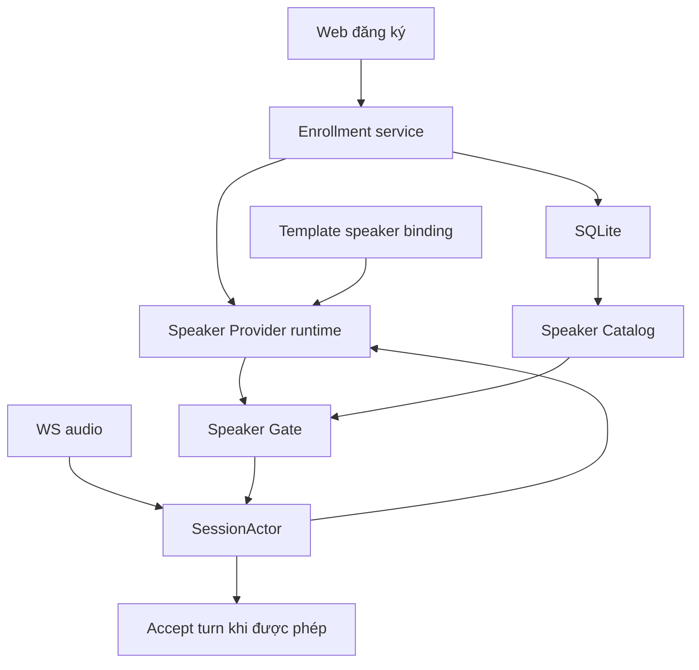
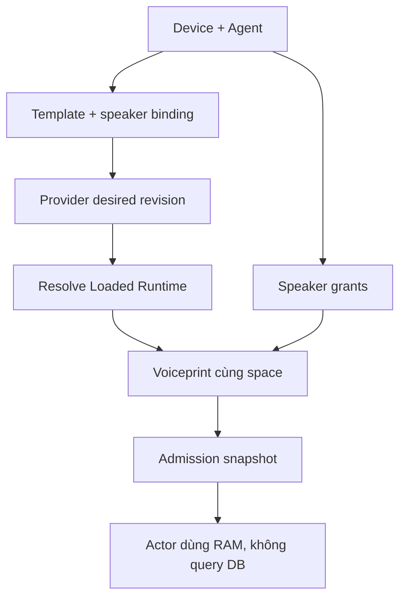
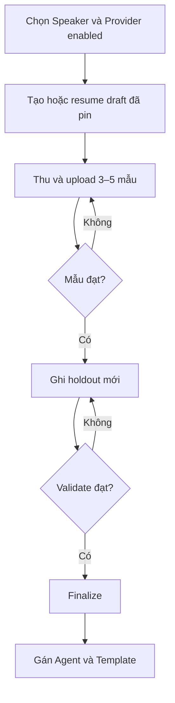
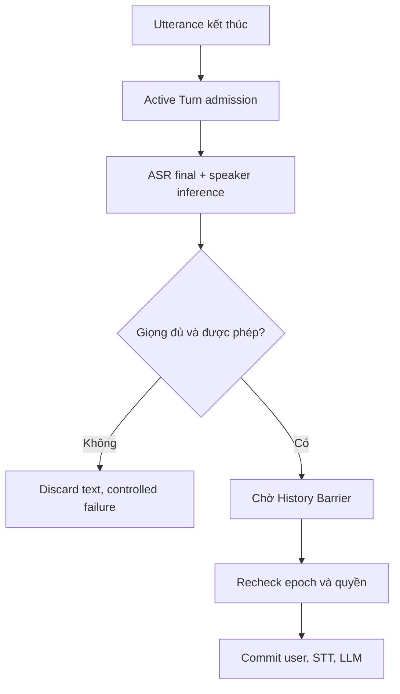

# Hướng dẫn triển khai Speaker Provider, nhận diện người nói và đăng ký giọng trên Web UI

Repository: `hailp-vn38/ai-agent-voice`  
Baseline: nhánh **`main`**, commit [`28caaa92becd9efc2c492eba7906b902b9220b63`](https://github.com/hailp-vn38/ai-agent-voice/commit/28caaa92becd9efc2c492eba7906b902b9220b63), đối chiếu ngày **07/10/2026**. Commit HEAD ngày 05/10/2026: `fix: allow trusted LAN CORS requests`.  
Trạng thái: **hướng dẫn triển khai**, chưa phải mô tả tính năng speaker đã có. `main` chưa có ProviderType Speaker, speaker tables, speaker routes, recorder enrollment hoặc WS speaker gate.  
Đối tượng: agent triển khai Rust server và Vue Admin Web tại `apps/admin-web/`.  
Bản cập nhật 3 thay baseline `dev-test` bằng `main`; cập nhật Provider Runtime Manager có điều kiện, provider key tự sinh, database bắt buộc, provider-owned assets, cold Template candidates, hard-delete và trusted-LAN CORS.

**Quy ước đọc:** “Hiện có” là hành vi đã đối chiếu tại commit trên; “Đề xuất/Mới/Cần thêm” là contract của tính năng speaker. Các ví dụ có `type=speaker` chưa chạy trên binary hiện tại. Agent phải đọc lại HEAD trước khi implement; tài liệu này không yêu cầu xây lại các thành phần runtime đã có.

## 1. Mục tiêu và quyết định đã chốt

Thêm nhận diện/xác minh người nói bằng giọng để server biết ai đang yêu cầu và người đó có được phép dùng Agent/Template đang active hay không. Đăng ký giọng được thực hiện từ **Web UI**, qua micro trình duyệt. Rust server nhận audio, kiểm tra chất lượng, tạo và lưu speaker embedding. Khi Voice Protocol Client kết nối WS, server xác thực Device trước; sau khi nhận audio mới xác minh người nói.

| Hạng mục | Quyết định triển khai V1 |
|---|---|
| Provider mới | Type `speaker`, adapter `campplus_sherpa`, DB key server sinh `speaker_{uuid32}`; deployment ID ví dụ `campplus_home` |
| Model đầu tiên | CAM++ ONNX pin URL/revision trong `assets.rs`, không chọn model qua Admin JSON |
| Runtime | CPU qua `sherpa-onnx`; dùng compiled registry và Provider Runtime Manager hiện có; giữ Resource Lease |
| Binding | Template có slot `speaker` tùy chọn; Agent sử dụng provider qua Template active |
| Đăng ký | Admin thao tác trên web; 3–5 mẫu giọng, sau đó một mẫu kiểm tra độc lập |
| Audio đăng ký | Browser tạo WAV PCM16, 16 kHz, mono; server xác minh format và chất lượng |
| Lưu trữ | SQLite lưu provider config, Template binding, profile/voiceprint và quyền; không lưu audio gốc |
| Tương thích voiceprint | Một Speaker có nhiều voiceprint theo `embedding_space_id`; provider key chỉ là provenance/selection |
| Quyền | Liên kết Speaker → Agent → tập Template cụ thể |
| Nhận diện lần đầu | 1:N trong danh sách được gắn với Agent, có ngưỡng và khoảng cách top-1/top-2 |
| Sau khi xác minh | Khóa một speaker cho Voice Session; xác minh 1:1 ở từng voice turn |
| Người khác dùng WS đang mở | Từ chối; cần kết nối mới để đổi người nói |
| Chính sách Agent | `off`, `observe`, `required`; mặc định `off` |
| Hiệu lực khi đăng ký | Với runtime đã ready, WS mới dùng được voiceprint sau finalize, không restart |
| Hiệu lực provider mới | Acquire exact desired version khi enrollment/diagnostic/admission; không cần thao tác activate riêng trong managed mode |
| Thu hồi quyền | Đóng các WS bị ảnh hưởng qua security invalidation; không sửa nóng Effective Session Profile |
| Điều kiện runtime V1 | Speaker yêu cầu `[provider_runtime]`; thiếu manager không fallback sang inference riêng |
| Tương thích | Off giữ đường speaker/core hiện có; pilot envelope tường minh áp dụng capacity mọi mode (§10.1), legacy busy đóng 1013; không đổi audio profile hoặc hello bắt buộc |

V1 giả định một người nói trong mỗi utterance. Không triển khai diarization, phân tách hai người nói đồng thời, tự đổi Template theo giọng, hoặc chống giả mạo đầy đủ. Speaker verification không tự chứng minh audio là tiếng nói trực tiếp: bản ghi phát lại và giọng tổng hợp cần biện pháp khác. Giữ auth Device và admin; không dùng giọng thay thế admin token.

Các thời lượng và mục tiêu hiệu năng trong guide là giá trị khởi đầu để thử nghiệm. Ngưỡng nhận diện phải được hiệu chỉnh bằng tiếng Việt và đường audio ESP32 → Opus → PCM thực tế, không sao chép ngưỡng demo upstream.

### 1.1. Quyết định V1 được xác nhận ngày 07/10/2026

Theo [ADR 0077](adr/0077-speaker-v1-authority-and-calibration.md), V1 phục vụ trò chuyện, tra cứu thông thường và điều khiển ít hậu quả như đèn/âm lượng. Thao tác nhạy cảm như mở khóa hoặc truy cập dữ liệu riêng cần **Independent Confirmation**; chưa có cơ chế xác nhận độc lập thì V1 từ chối. Giữ xác thực Device và Admin hiện có. Agent Tool Allowlist chặn tool nhạy cảm khi chưa có xác nhận độc lập theo §1.2; không giao việc quyết định quyền nhạy cảm cho Speaker Provider.

Phân biệt thuật ngữ theo `CONTEXT.md`: **Speaker Match** là kết quả đối chiếu giọng; **Speaker Authorization** là quyết định quyền cho voice turn trên Agent/Template; **Independent Confirmation** là xác nhận riêng cho thao tác nhạy cảm. Match không tự thành authorization hoặc xác nhận độc lập.

Required giữ fresh verification ở mỗi lượt và chấp nhận từ chối câu thiếu 2 giây tiếng nói; không kế thừa pass trước. Control `abort` của Device vẫn theo protocol hiện có, còn câu “dừng” qua ASR chịu cùng gate như các voice turn khác. Observe dùng để đánh giá ảnh hưởng trong hội thoại thực tế trước Required.

Mốc đầu bắt buộc có enrollment web và Observe từ ESP32 qua WS. Thứ tự: provider/draft/thu mẫu → calibration sơ bộ → validate/finalize → Observe trên ESP32 → hiệu chỉnh và đánh giá độc lập → Required. Calibration sơ bộ chỉ phục vụ enrollment/Observe; chi tiết ở §4 và acceptance gates ở §12.

### 1.2. Giới hạn thao tác của Agent tham gia V1

Theo [ADR 0078](adr/0078-agent-tool-allowlist.md), allowlist do server/admin quản lý áp dụng cho cả Device và External MCP trên Agent tham gia V1, bao gồm Observe và Required. Tool chưa được admin đánh giá và cho phép mặc định bị từ chối; tool nhạy cảm bị chặn khi chưa có Independent Confirmation. Không suy độ an toàn từ prompt, tên hoặc nhãn “read-only”; đọc dữ liệu riêng vẫn nhạy cảm.

Entry allowlist thuộc Agent. Với Device, API dùng `device_id` / Protocol Device Identity + tên tool gốc; với External MCP, dùng `server_key` + tên tool gốc. DB dùng FK tới resource nội bộ, không dùng display name hoặc Client ID, không thêm Device key riêng và không wildcard Device trong V1. Device mới hoặc resource bị xóa rồi tạo lại không tự kế thừa quyền cũ. Chỉ quảng bá tool được phép cho LLM, đồng thời kiểm lại trước dispatch để không vượt policy bằng tên tool gọi trực tiếp. Allowlist là giới hạn thao tác của Agent độc lập với Speaker Match; Observe không cấp quyền theo giọng và không bỏ qua giới hạn này. Các bộ lọc hiện có vẫn áp dụng, allowlist không biến tool vốn bị cấm thành được phép.

Chưa có implementation tương ứng ở baseline. Cần mở rộng đường publish Session Tool Catalog và điểm dispatch chung cho cả hai transport; prompt-only enforcement không đáp ứng contract. Allowlist lưu trong DB với revision và conditional update. Thêm quyền áp dụng ở WS mới; giảm quyền chặn dispatch mới và đóng WS bị ảnh hưởng, không sửa nóng Session Tool Catalog. Operation đã dispatch trước thu hồi không thể hoàn tác. Giới hạn tool phải có khi bàn giao Observe ở mốc đầu, không đợi Required mới bảo vệ thao tác.

### 1.3. Reviewed Tool Contract và thay đổi quan sát được

Allowlist entry giữ identity ở §1.2 và pin fingerprint của contract đã review. Device pin resource incarnation identity, tên tool gốc và input schema; External MCP pin resource/server identity, tên tool, input schema và cấu hình nguồn liên quan như endpoint, transport, auth scope/reference. Description ảnh hưởng cách sử dụng thuộc nội dung review. Không đưa secret value vào fingerprint, DB hoặc báo cáo; dùng secret reference/scope khi cần.

Server quan sát contract đổi qua configuration mutation hoặc discovery thì entry mất hiệu lực, chặn dispatch mới và đóng WS bị ảnh hưởng. Admin phải review contract hiện tại bằng conditional update; stale review không được approve contract khác. Pin chỉ kiểm contract quan sát được, không hứa phát hiện firmware/backend đổi hành vi giữ nguyên schema hoặc remote change trước discovery tiếp theo. Baseline chưa có Device contract persistence/admin inspection. V1 lưu observed contract metadata bounded trong SQLite từ discovery của WS đã admit, qua validation/bounds hiện có. Không coi schema Admin nhập là bằng chứng. Admin inspect tên/schema/description/fingerprint cùng thời điểm quan sát rồi approve đúng Device incarnation + observed revision + fingerprint. Transaction kiểm lại observation và allowlist revision; observation đổi giữa lúc xem/duyệt trả conflict.

Discovery không tự cấp quyền, không trộn các discovery chưa hoàn tất. Hai observation hợp lệ nhưng mâu thuẫn thì đánh dấu conflict, chặn entry liên quan và invalidation; không chọn kết nối mới nhất. Inspection ghi rõ đây là contract đã quan sát, không khẳng định Device đang online hoặc implementation vẫn giữ nguyên hành vi. Giải quyết conflict bằng đợt discovery riêng cho đúng Device incarnation, có identity/deadline/trạng thái rõ ràng. Chỉ observation hoàn tất thuộc đợt được dùng; kết quả muộn từ đợt cũ bị loại. Các discovery trong đợt nhất quán thì contract reviewable; mâu thuẫn, timeout hoặc chưa hoàn tất vẫn blocked. Không bỏ kết quả lỗi để tuyên bố nhất quán. Observation cũ superseded và giữ theo retention bounded. Admin vẫn conditional approve revision/fingerprint mới; không tự phục hồi allowlist. Tái dùng tools/list discovery hiện có, không tạo protocol discovery riêng.

### 1.4. Operator review nội dung và giới hạn Dialogue History

Operator chỉ đưa vào pilot các Agent/Template có Persona, prompt, nguồn context và tool results phù hợp phạm vi thông tin thông thường. Thay nguồn phải review lại trước sử dụng; chưa review thì operator vô hiệu hóa hoặc loại khỏi pilot. Đây là kiểm soát vận hành: server chưa tự chứng minh hoặc cưỡng chế eligibility nội dung; V1 chưa xây workflow eligibility riêng. Allowlist và Speaker Gate không bảo vệ dữ liệu riêng đã nằm trong prompt/context.

Người dùng vẫn có thể tự cung cấp thông tin riêng trong hội thoại. Review nguồn hệ thống không ngăn được điều đó; V1 không được quảng bá như bảo đảm bí mật hội thoại trước replay hoặc giọng giả. Giữ cách ly Dialogue History giữa Voice Sessions, không tự đưa lịch sử riêng từ nguồn khác vào pilot.

### 1.5. Giữ V1 vừa đủ cho project hiện tại

Tái dùng provider runtime manager, asset manager, worker/admission, MCP discovery, SQLite/CAS và Admin UI/API hiện có. Chỉ thêm boundary cần thực thi các contract đã chốt: allowlist/review observed contract, atomic admission pilot, status busy, calibration reload và invalidation. Dùng một admission coordinator có state transitions nguyên tử/lock ngắn tại các boundary hiện có; không giữ mutex trong native work hoặc tạo model manager/scheduler tổng quát song song.

Chưa xây workflow eligibility, credential operator riêng, time-based slot yielding, tự phân loại nội dung hoặc chống giả mạo. Admin flow đi qua các trang/quan hệ hiện có, không thêm wizard quản trị tổng quát. Discovery recovery tái dùng MCP discovery và một đợt có deadline, không tạo protocol mới. Các hướng V2 trong guide là tham khảo, không acceptance V1.

Quyết định domain/security của các vòng Q1–Q25 đã được ghi vào ADR 0077–0081. Agent triển khai chọn route/DTO, bounds/retention cụ thể theo conventions repo và ghi lại contract kiểm thử; không mở thêm cơ chế sản phẩm chỉ để hoàn thiện abstraction. Operator chốt protocol thu mẫu/số trial trước evaluation; đây là việc vận hành cần thực hiện, không phải evidence đã tồn tại. Guide chưa xác nhận implementation hoặc calibration đạt.

## 2. Hiện trạng `main` và điểm tích hợp

Đọc `AGENTS.md`, `CONTEXT.md`, `docs/agents/domain.md` và ADR liên quan. Dùng glossary của repo: ProviderVersion, Runtime Resource Key, Resource Lease, Effective Session Profile, Configured/Prepared Template Profile. Nếu chia công việc thành issues, theo `docs/agents/issue-tracker.md`: một spec và mỗi ticket một file trong `.scratch/speaker-recognition/`; tài liệu này không thay đổi code hoặc tạo tickets.

### 2.1. Những thay đổi làm thiết kế cũ không còn đúng

| Hiện có tại `main` | Hướng dẫn cho tính năng speaker |
|---|---|
| SQLite luôn mở/migrate trước provider initialization; bỏ `database.enabled` và `database.devices.admission_enabled` | Lưu profile, voiceprint, enrollment, policy và ACL vào SQLite hiện có; không thêm điều kiện bật database |
| `AppConfig.provider_runtime: Option<_>`; chỉ có manager khi `[provider_runtime]` hiện diện | V1 speaker dùng managed mode. Thiếu manager thì chức năng speaker báo unavailable; Agent Required không admit. Core voice legacy vẫn giữ contract riêng |
| `services/provider_runtime/` có exact-version acquire, leases, singleflight, resource accounting, sharing và lifecycle | Mở rộng manager/materializer đang có; không tạo cache/model manager riêng cho speaker |
| POST provider không nhận `key`; `deny_unknown_fields` từ chối key client gửi | Dùng key `speaker_{uuid32}` server trả về. `campplus_home` chỉ là TOML deployment identity, không phải DB key mới |
| Admin JSON local loại `model`, `num_threads`; migration `0006_provider_runtime_config.sql` đã strip các field cũ | Speaker config cũng chỉ chứa logical/domain settings; threads/model execution ở deployment/source |
| `assets.rs` từng provider khai báo URL pin, `MODEL_REVISION`, install path; không model manifest/checksum | Thêm `providers/speaker/campplus_sherpa/assets.rs`; model files chuẩn bị qua asset registry rồi build |
| POST `/providers/{key}/prepare` đã có; diagnostics trong managed mode snapshot và acquire exact desired version | Enrollment/test speaker tự acquire, giữ lease; prepare là tùy chọn để giảm cold wait |
| GET provider có `runtime.desired_state`, `ready_revisions`, `can_prepare`, `failure_code` khi manager bật; `requires_restart=false` | UI hiển thị cold/queued/loading/ready/failed theo response, không yêu cầu restart để kích hoạt speaker |
| Khi manager tắt còn startup Runtime Catalog và DTO legacy | Không suy manager luôn bật từ việc source tồn tại; không dùng legacy status để báo hot speaker supported |
| Template thiếu core slot lấy đúng `[provider_defaults]` của slot đó | Giữ fallback core hiện có; explicit binding lỗi không fallback. Speaker không có implicit fallback trong V1 |
| `session/runtime_profile.rs` giữ cold configured candidates; selected profile acquire trước upgrade, switch prepare ngoài actor | Bổ sung speaker snapshot/lease theo đúng selected hoặc target profile; không load mọi switch candidate ở admission |
| `AdmittedProviderBinding.snapshot` đã có `Arc<DesiredProvider>` gồm id/revision/config | Tái dùng exact snapshot; không chỉ bổ sung revision scalar như hướng dẫn cũ |
| ProviderType, Admin validation và DB CHECK vẫn chỉ `vad/asr/llm/tts` | Thêm Speaker xuyên suốt. Vision có đường deployment riêng; không giả định Admin đã có type vision |
| `assign_template` vẫn xét `complete == 4` để tự promote assignment đầu | Sửa điều kiện này cho optional speaker và core fallback; `set_default_template` hiện không chứa count check đó |
| ADR 0070 và delete handlers hỗ trợ hard-delete có điều kiện | DELETE provider không phải soft-disable. Speaker cần contract hard-delete/purge tường minh, không cascade xóa voiceprint |
| `app/cors.rs` đã cho localhost và origin IP LAN được chấp nhận; expose ETag/x-request-id | Dùng CORS này cho Bearer API. Micro ở địa chỉ HTTP LAN vẫn cần HTTPS; CORS không tạo secure context |
| Device Enrollment/Enrollment Session đã có | Speaker Enrollment là miền khác, không dùng Activation Code hay WS onboarding của Device |

### 2.2. Boundary cần giữ

- Dependency vẫn pin `sherpa-onnx = "=1.13.8"`, `ort = "=2.0.0-rc.13"`; thử API extractor đúng bản này trước khi nâng dependency.
- Admin auth riêng, request ID, audit, If-Match, JSON cap 256 KiB, typed config cap 64 KiB/depth 16/nodes 512. Audio speaker cần route limits riêng cả Content-Length và chunked; không tăng cap toàn API.
- Forward-only SQLx migrations, SQLite một process sở hữu, WAL/busy timeout và không application retry.
- Actor giữ semantic state/output; worker giữ mutable native state. Uplink Opus 16 kHz mono 60 ms dùng PCM decode hiện có.
- `session/actor/listening.rs::on_asr_event` hiện gọi `commit_user_text` ở ASR Final. `on_detect` cũng có text accept path. Required phải gate cả hai trước STT/history/archive/LLM.
- Active Turn admission, ASR cleanup acknowledgement, Turn ID/Generation ID, writer terminal outcome và History Barrier vẫn áp dụng. Resource Lease khác inference permit; timeout không giải phóng native capacity còn chạy.
- `/health` chỉ liveness; `/ready` không tải model. Speaker DB providers lazy không tự thành dependency toàn process.

### 2.3. ADR cần bổ sung

1. Speaker provider/worker, optional Template slot, enrollment và policy trên Agent; reuse ADR 0071 runtime manager và ADR 0076 assets.
2. Gate accept user text: ASR Final + speaker authorization + History Barrier; text Detect Required bị từ chối.
3. Security invalidation đóng WS khi quyền/voiceprint bị thu hồi; đây là exception có phạm vi với immutable-session contract ADR 0052/0071, không hot-reload profile.
4. Purge dữ liệu sinh trắc explicit; hard-delete Speaker có điều kiện theo ADR 0070. ADR 0055 vẫn áp dụng history purge, không còn là lý do cấm mọi configuration delete.
5. Optional hello `speaker_status`, `pipeline_status`, policy close 1008 và legacy capacity close 1013; wire contract cần qualification.
6. Embedding space theo pinned model/preprocessing contract; phân biệt với Runtime Resource Key và ProviderVersion.

Không phục hồi yêu cầu manifest/fingerprint của model trong phần ADR 0071 cũ: ADR 0076 đã thay asset preparation. Hash canonical resource specification/execution identity hiện có vẫn khác checksum quét model.

## 3. Khái niệm và kiến trúc

| Khái niệm mới | Ý nghĩa |
|---|---|
| Speaker | Hồ sơ người nói có resource key, tên và enabled flag; không phải Device hay Agent |
| Speaker Enrollment | Draft đăng ký/re-enroll, có TTL, sample slots và revision riêng |
| Voiceprint | Tập embedding đã hoàn tất của một Speaker trong một embedding space |
| Speaker Provider | Provider Instance type `speaker`, tạo embedding; không quyết định quyền |
| Speaker Recognition Runtime | Logical handle + Resource Lease tới shared backing worker; không biết WS/quyền |
| Speaker Catalog | Immutable view của voiceprint, ACL và policy đã publish trong process |
| Speaker Admission Snapshot | View của các candidate và quyền được chụp khi admit WS |
| Speaker Gate | Quyết định một voice turn có được accept với identity cụ thể hay không |
| Speaker Security Epoch | Atomic epoch dùng để invalidation; không phải Session Profile Revision |

Tách inference và policy. Runtime chỉ biến PCM thành vector. Domain service normalize/compare vector và kiểm quyền. SessionActor chỉ nhận decision mang identity, kiểm nó còn hợp lệ rồi tiếp tục pipeline.



Nhận diện là **Provider Instance chính thức**, dùng chung hạ tầng provider hiện có. Có thể tạo nhiều instance `speaker`, mỗi instance có key riêng và cùng hoặc khác model/calibration. Template bind provider bằng key, không bind adapter name. Agent không chứa một bản config nhận diện sao chép riêng.

Worker runtime được tái sử dụng giữa các WS cùng instance, không tạo model theo phiên. Bắt đầu với một instance/worker cho homelab; hỗ trợ catalog nhiều instance nhưng có tổng giới hạn model runtime/worker đang nạp. Provider chỉ tạo embedding; `Speaker Gate` vẫn thuộc domain security, không được đưa authorization vào adapter.

### 3.0. Pipeline resolve

`Device → Agent → selected Template → speaker binding exact DesiredProvider → manager.acquire(snapshot) → Resource Lease + speaker handle`. Policy Off bỏ speaker acquire và capture buffer. Observe có thể unavailable và vẫn chạy core path; Required cần binding, calibration và candidate đúng space. Không fallback sang instance speaker khác.

Enrollment chọn DB Provider Instance trực tiếp, không cần Template đã bind. Service snapshot đúng provider id/revision, acquire ngoài DB transaction, giữ lease qua operation rồi mới ghi sample. Tạo provider row không đồng nghĩa model đã loaded, nhưng cold runtime có thể được acquire ngay khi manager đã cấu hình hỗ trợ adapter.

Configured switch candidate chỉ pin desired provider snapshot và metadata compatibility. Target runtime hot acquire ở explicit switch preparation ngoài actor; trong pilot, cold target busy khi session giữ pipeline slot, operator prepare trước session. Không giữ native lease cho mọi candidate chỉ để hiện dropdown.

### 3.1. Module đề xuất và điểm mở rộng hiện có

Đường dẫn dưới `crates/voice-agent-server/src/`:

| Module mới | Trách nhiệm |
|---|---|
| `speaker/types.rs`, `embedding.rs`, `audio.rs` | Identity, finite/L2/centroid/cosine, WAV/quality/window boundaries |
| `speaker/enrollment.rs`, `catalog.rs` | Draft/holdout/finalize, immutable view và publish |
| `speaker/authorization.rs`, `revocation.rs` | Agent/Template ACL, epoch, registry và invalidation |
| `providers/speaker/traits.rs`, `mod.rs` | Embedding provider contract và re-export |
| `providers/speaker/campplus_sherpa/{assets,config,descriptor,provider,mod}.rs` | Adapter-owned assets, logical config, extractor construction |
| `workers/speaker/{mod,pool,diagnostic}.rs` | Bounded operation scheduling/native supervision/cleanup |
| `database/speakers.rs` | Query/transaction cho profile, voiceprint, draft, ACL |
| `app/admin/speakers/` | Typed DTO/handlers theo nhóm trách nhiệm |
| `session/actor/speaker.rs` | Pending turn gate, ASR/History Barrier và invalidation |

Mở rộng `providers/{registry,factory_registry,local_runtime,runtime_catalog,set}.rs`, `services/provider_runtime/{factory,plan,...}`, `services/provider_diagnostic.rs`, `config/`, `database/admission.rs`, `session/{profile,runtime_profile}.rs`. Đừng tạo Runtime Manager thứ hai hoặc duplicate provider table. Giữ test modules riêng và tránh dồn tính năng vào `actor/mod.rs`.

Web tái dùng `apps/admin-web/src/api/client.ts`, `api/providers.ts`, `api/types/providers.ts`, `components/providers/ProviderCreateDrawer.vue`, `pages/templates/TemplateDetailPage.vue` và `pages/agents/AgentDetailPage.vue`. Thêm speaker API/types, pages, recorder composable/worklet; mở rộng union type/icons/tabs/navigation/i18n tương ứng.

## 4. Assets, embedding space và runtime lifecycle

### 4.1. Model assets theo hiện trạng mới

Chọn CAM++ ONNX CPU qua sherpa làm adapter đầu tiên. Candidate ban đầu: `3dspeaker_speech_campplus_sv_zh_en_16k-common_advanced.onnx`; so sánh bằng tập tiếng Việt/ESP32 trước khi chốt model. Kiểm license của đúng artifact và API extractor trên crate đã pin. Không đưa kích thước disk hoặc RTF paper thành RSS/latency sản phẩm.

Thêm `providers/speaker/campplus_sherpa/assets.rs` theo pattern Silero:

- `MODEL_REVISION` pin upstream revision thật; `CORE_ASSETS` chứa URL immutable và relative install path.
- `model_dir()` dùng `model_path("SPEAKER", "campplus")`, ví dụ `models/SPEAKER/campplus/v1/` nếu cần versioned directory. Type directory viết hoa phù hợp các provider hiện có.
- Implement `ProviderAssetManager::ensure_assets()` và `revision()`; đăng ký cùng Provider Adapter Registration.
- Reuse `ensure_asset`: regular non-empty file được reuse, download `.part` + atomic rename + striped lock. Không thêm model manifest, SHA256 verify, URL/path/offline fields trong Admin JSON hoặc config.
- `FactoryMaterializer::prepare_artifacts` gọi asset manager; `build` chỉ resolve path và init/warmup native workers. Startup asset enumeration cần mở rộng cho deployment speaker đã khai báo.
- Đổi model giữ filename cũ phải đổi install path/filename cùng revision. Revision bump một mình không thay file final đã tồn tại.

Dimension lấy từ extractor, kiểm hữu hạn/norm/dimension, không hard-code 192/512. `embedding_space_id` là hash canonical **metadata contract**: adapter, pinned `MODEL_REVISION`, extractor contract revision, dimension, 16 kHz, preprocessing/fbank/window/VAD contract. Không đọc model bytes để tính ID.

ProviderVersion `(source, instance identity, desired revision)`, Runtime Resource Key và embedding space là ba identity khác nhau. Hai DB provider revisions có thể share backing engine và voiceprint space; calibration revision quyết định scoring, không tự làm extractor khác. Thread count thuộc Resource Key; chỉ giữ same space khi numerics đã được qualification. Không so vectors khác space.

### 4.2. Cấu hình đề xuất

Schema speaker bên dưới **cần thêm**, parser `main` chưa nhận. Model và threads là deployment-owned; Admin JSON không cho sửa hai field đó. Không dùng `database.enabled`, `[agent.providers]` hoặc model manifest.

```toml
[providers.speaker.instances.campplus_home]
adapter = "campplus_sherpa"
calibration_profile = "vi_esp32_v1"
min_speech_ms = 2000
target_speech_ms = 4000
max_window_ms = 6000

[runtime.onnx.threads]
campplus_sherpa = 1

[speaker_recognition]
max_speakers = 256
max_candidates_per_agent = 32
max_voiceprint_spaces_per_speaker = 4

[speaker_recognition.enrollment]
min_samples = 3
max_samples = 5
min_clip_ms = 5000
max_clip_ms = 10000
min_speech_ms = 3000
ttl_ms = 1800000
max_open_enrollments = 16
max_audio_body_bytes = 524288

[workers.speaker]
max_workers = 1
voice_queue_capacity = 8
admin_queue_capacity = 2
queue_timeout_ms = 500
inference_timeout_ms = 2000
cleanup_grace_ms = 5000

# Section hiện có: khi có section này server dùng managed runtime.
# Merge vào cấu hình thật; không copy nguyên block để ghi đè budget đã qualification.
[provider_runtime]
max_parallel_loads = 1
max_pending_loads = 8
max_waiters = 64
max_resident_bytes = 8589934592
max_resources = 16
max_version_entries = 128
admission_timeout_ms = 5000
startup_timeout_ms = 60000
failure_cooldown_ms = 1000
idle_ttl_ms = 600000
```

Các limit là điểm bắt đầu, chưa có số đo CAM++ trên máy đích. `[provider_runtime.estimated_peak_bytes]` hiện có phải thêm `campplus_sherpa = <peak đã đo>` dưới dạng integer thật khi triển khai; không invent estimate để vượt admission. Giữ estimates của mọi adapter khác đang dùng. Local materializer hiện yêu cầu adapter được deployment khai báo; mở rộng allowlist đó cho speaker để provider tạo từ web sử dụng được.

Không thêm `provider_defaults.speaker` trong V1: speaker chọn qua Template binding hoặc enrollment provider tường minh. Nếu Agent không có Template, Required trả policy conflict thay vì dùng một model khác ngầm. Policy Agent mặc định Off, vì vậy không cần global feature enable flag để điều khiển DB/runtime. Speaker enrollment cần Admin API bật/Bearer hợp lệ và manager; Agent Off không ngăn admin đăng ký.

Typed DB config của `campplus_sherpa` gồm `calibration_profile` nullable và các window limits ở trên. Preprocessing/extractor contract pin trong source. Validate `0 < min_speech <= target_speech <= max_window`, sample count/clip bounds và config shape; local `secret_ref` phải null.

Calibration là deployment-owned profile đã pin/allowlist, không phải raw threshold user nhập. Profile gồm embedding space, scoring revision, accept threshold, top-1/top-2 margin, enrollment consistency và quality rules. Chưa có calibration thì diagnostic/draft/thu vector vẫn được; decision unavailable, không finalize hoặc bật Required.

**Preliminary Calibration** đúng space cho phép kiểm chất lượng, consistency, validate holdout, finalize và Observe để thử nghiệm. Nó chưa đủ điều kiện cấp quyền trong Required. **Required-qualified Calibration** phải được hiệu chỉnh bằng dữ liệu thực tế và đánh giá độc lập theo §11 trước khi cho phép Required. Readiness của runtime, voiceprint hoặc browser holdout không chứng minh calibration đã qualified; Admin UI và server phải phân biệt khả năng enrollment/Observe với khả năng bật Required. Không dùng cosine demo constant làm mặc định cấp quyền. Profile có revision, trạng thái `preliminary`/`qualified` và tham chiếu báo cáo; người vận hành xác nhận dựa trên evidence cho đúng embedding space, preprocessing, scoring parameters và điều kiện audio/tải. Server kiểm khi bật Required và admission; thiếu, sai revision hoặc chưa qualified thì từ chối. Web chỉ hiển thị và không có bypass. Thay thông số đã qualification cần đánh giá lại. Thu hồi qualification vô hiệu hóa các Required sessions bị ảnh hưởng, không tự hạ xuống Observe; kết quả inference cũ không hồi quyền. Cơ chế reload deployment catalog ở §4.2.1; mục tiêu qualification pilot ở §11. Exact binomial một phía 95% đã chốt ở §11.2; cách lấy trial độc lập, số trial và phạm vi corpus còn cần chốt trước evaluation.

### 4.2.1. Reload calibration có phạm vi

Theo [ADR 0079](adr/0079-calibration-catalog-reload.md), operator gọi reload tường minh qua control path được xác thực; Web không có quyền sửa qualification. Chỉ đọc nguồn calibration deployment đã cấu hình, không nhận đường dẫn/URL tùy ý. Validate toàn catalog trước publish; reload thất bại giữ catalog hiện hành và báo lỗi. Sửa file đơn thuần chưa có hiệu lực tới khi reload thành công.

Publish catalog và invalidation nhất quán trước khi báo thành công. Thu hồi qualification hoặc đổi contract chặn dispatch mới và đóng Required WS liên quan; không downgrade Observe và không chấp nhận stale result để hồi quyền. Reload không tải lại model/provider runtime/toàn bộ TOML. V1 dùng Admin Bearer hiện có, chưa thêm credential operator riêng. Request không nhận qualification fields/path/URL. Web không có nút reload, sửa qualification hoặc bypass; người giữ Admin token vẫn tự gọi được reload API. Đây là giới hạn giao diện, chưa phải phân quyền operator. Route/response và validation catalog phải được ghi vào API contract khi triển khai theo conventions Admin hiện có; process baseline chưa có hot reload.

### 4.3. Managed acquisition và lease

Hiện có ở `main`: manager chỉ bật khi `config.provider_runtime.is_some()`. Core legacy startup vẫn tồn tại; speaker V1 chọn managed path, không triển khai song song một lifecycle speaker legacy.

Flow: POST provider ghi desired config → service lấy exact DesiredProvider → `manager.acquire(snapshot)` → singleflight/prepare assets/build/native readiness → Resource Lease + handle → operation → cleanup acknowledgement → release. POST create không tự load; enrollment, test hoặc WS admission tự acquire, vì vậy không có bước “activate runtime” bắt buộc. POST `/providers/{key}/prepare` body `{}` hiện có là tùy chọn, trả 200 Ready hoặc 202 Queued/Loading; GET provider chỉ inspect và không load.

Lease giữ đến khi mọi job/cleanup obligation dùng handle kết thúc. Enrollment draft lưu provenance trong DB, không giữ native lease xuyên TTL; mỗi request acquire exact version rồi kiểm pin. Caller HTTP timeout/disconnect không làm native attempt trả capacity sớm. Runtime manager giữ reservation/load slot đến terminal acknowledgement, drain/quarantine theo contract đang có.

Mở rộng `LocalRuntimeAdapterRegistry` với CAM++ physical plan. Khởi đầu một physical extractor replica dùng chung giữa các logical instances cùng physical specification (`onnx_with_replicas(..., 1)`); worker concurrency không tự nhân model. Nếu extractor không dùng chung mutable state an toàn thì serialize jobs trên replica. Thay voiceprint/calibration/window settings chỉ thay logical view khi có evidence; mọi processing ảnh hưởng vector phải đi vào embedding-space identity và/hoặc physical spec tương ứng.

Reuse manager logical-provider quotas xuyên revisions, global speaker inference cap và physical-resource cap; `logical_capacity`/`global_capacity` hiện chỉ match bốn types nên phải thêm speaker. Sharing không được làm inference vượt tổng cap. Không thêm `max_loaded_runtimes`/cache song song; RAM/resources/version metadata do manager budget hiện có quản lý.

### 4.4. Startup, admission và switch

| Tình huống | Lifecycle đích |
|---|---|
| Deployment speaker đã khai báo | Ensure files trước listener như các local adapters; asset failure là startup failure |
| DB speaker mới/chưa bind | Cold; enrollment/test/prepare acquire exact version khi cần |
| Agent Off | Không acquire speaker hoặc retain PCM chỉ vì Template có slot |
| Agent Observe | Best-effort speaker acquire trong deadline; unavailable không chặn core voice |
| Agent Required, selected Template | Acquire exact speaker version + calibration/candidate check trước upgrade; lỗi trả 503, không downgrade |
| Non-selected Template candidate | Snapshot cấu hình/compatibility; không preload/pin mọi native resource |
| Explicit switch | Prepare target runtime ngoài actor trong cùng bounded deadline; kiểm grant/epoch/space; commit ở writer/history/cleanup boundary |
| Provider PATCH | Admission mới dùng revision mới; sessions cũ giữ version/lease. Security-affecting speaker changes còn phải invalidation như phần 5.2 |

`app/mod.rs` hiện cài assets của mọi deployment local instance, còn runtime startup acquire deployment defaults và TTS preload. Không copy policy startup-required của legacy `database/load_plan.rs` sang speaker DB trong managed mode. DB default-template prewarm hiện đã có; mở rộng hook policy-aware nếu cần, không biến lỗi prewarm optional thành fail boot.

GET `/ready` giữ metadata-only + DB SELECT 1, không acquire speaker provider để kiểm. Dependency speaker deployment bắt buộc chỉ ảnh hưởng readiness nếu deployment thực sự yêu cầu nó; cold/failure của một DB speaker optional được phản ánh trên provider/Agent admission, không làm toàn server unready. V1 không có speaker deployment default nên native runtime speaker chủ yếu lazy.

### 4.5. Integration checklist và regression thực tế

| Điểm sửa | Kết quả cần có |
|---|---|
| ProviderType/descriptor, registry/factory, typed validation | `speaker`, `campplus_sherpa`, static descriptor không model/threads/path/URL |
| Assets/deployment snapshot/config validation | CAM++ asset manager, deployment local allowlist, threads và estimate checks |
| Local runtime planner/materializer/resource logical views | Exact version, optional shared physical plan, speaker handles/leases và quotas |
| RuntimeCatalog/ResolvedAgentRuntimes/EffectiveProviderBindings | Optional speaker, merge/resolution tại selected/target profile |
| `database/admission.rs` | Existing DesiredProvider snapshot đọc speaker slot consistent trong cùng graph |
| `session/runtime_profile.rs` | Mở whitelist types hiện chỉ core; Off skip speaker dependency, Required validate/acquire |
| Template binding + relationship/delete handlers | Cho speaker type, type/enabled checks, usage và policy conflicts/invalidation |
| Provider CRUD/diagnostics/capabilities/Vue | Auto-key, runtime states, bounded WAV diagnostic, no fake loaded |
| Actor `listening.rs`/Detect/retention/switch | Fresh per-turn pass trước user accept, cancellation/cleanup và history isolation |

**Regression cần sửa đúng vị trí:** `app/admin/templates.rs::assign_template` đếm mọi binding rồi auto-promote khi `complete == 4`. Có speaker làm count=5. Không chỉ sửa thành `>=4`; speaker có thể che core thiếu. Tái dùng validator structural completeness theo effective core bindings: absent core dùng deployment defaults hiện có; explicit disabled/type-mismatch core vẫn lỗi. Check speaker/policy riêng. `set_default_template` tại baseline này không còn query count cũ, nhưng vẫn cần policy validation.

Test Template đủ core có/không speaker; core partial dùng fallback; explicit broken core không fallback; first assignment/default selection đúng; Off không bị speaker unavailable chặn. `session/runtime_profile.rs` hiện reject binding kind ngoài bốn core, nên chỉ mở Admin/DB enum chưa đủ.

Trait conceptual: `SpeakerProvider::open_worker() -> SpeakerWorker`; `extract_embedding(PcmF32Mono) -> SpeakerEmbedding`. Factory nhận effective typed config và resolved asset paths sau preparation, không nhận manifest ResolvedModel cũ. Embedding không phải authorization token.

## 5. SQLite schema và lifecycle dữ liệu

Tên bảng là đề xuất; migration mới nối tiếp `0006_provider_runtime_config.sql` (số tiếp theo tại HEAD triển khai), không sửa migration đã applied. Public API dùng resource key, DB FK dùng ID nội bộ.

| Bảng | Field chính / constraint |
|---|---|
| `providers` — mở rộng bảng hiện có | Chấp nhận `type='speaker'`, `adapter='campplus_sherpa'`, config_json typed; `secret_ref` phải null cho adapter local |
| `template_provider_bindings` — mở rộng bảng hiện có | Slot `provider_type='speaker'`, UNIQUE template/type, FK provider; validate provider.type cùng slot |
| `speakers` | `id`, `key UNIQUE`, `name`, `description`, `enabled`, `revision`, timestamps |
| `speaker_voiceprints` | `id`, `speaker_id FK`, `embedding_space_id`, revision, `dimension`, `centroid_blob`, `sample_count`, `enrolled_with_provider_id FK`, `enrolled_with_provider_revision`, `calibration_revision`, timestamps; UNIQUE speaker/space |
| `speaker_voiceprint_samples` | `voiceprint_id FK`, `slot 1..5`, `embedding_blob`, quality metadata; UNIQUE voiceprint/slot |
| `speaker_enrollments` | UUID ID, `speaker_id FK`, `provider_id FK`, `desired_provider_revision`, `loaded_provider_revision`, `runtime_id` (operation provenance), `revision`, `status`, `embedding_space_id`, `base_speaker_revision`, `base_voiceprint_revision` của space này, expiry, validation metadata |
| `speaker_enrollment_samples` | `enrollment_id FK`, `slot 1..5`, vector, quality, private audio digest; UNIQUE enrollment/slot |
| `agent_speaker_policies` | `agent_id UNIQUE FK`, `mode`, `revision`, timestamps; absent = off |
| `agent_speaker_bindings` | UNIQUE agent/speaker, enabled binding; cascade rules explicit |
| `agent_speaker_template_grants` | UNIQUE agent/speaker/template; FK binding + FK Agent Template assignment nếu schema cho phép |

Profile create trả enabled=true nhưng `voiceprints:[]`; không phải candidate usable. Ready là trạng thái **theo selected provider/runtime**, không phải boolean toàn Speaker. Một người có thể ready trên một provider và cần enrollment trên provider thuộc space khác; readiness luôn có selected provider context.

Provider provenance không phải quyền và không quyết định compatibility một mình. Hai instance có cùng embedding space có thể dùng cùng voiceprint; đổi num_threads không đổi embedding space nếu không thay numerics contract. Chỉ tên model giống nhau chưa đủ. Không so sánh vector khác space; calibration profile là điều kiện scoring/accept riêng và phải khớp space. Disable provider nguồn không tự xóa vector còn dùng được trên provider khác cùng space.

`enrolled_with_provider_id` dùng FK RESTRICT để giữ provenance. Cần mở rộng delete usage checks: provider hard-delete trả `409 provider_in_use` khi còn voiceprint/draft reference, ngoài Template references hiện có. Unlink Templates rồi xóa provider không được âm thầm purge giọng. Admin có thể PATCH enabled=false để dừng dùng instance mà giữ provenance; hard-delete chỉ sau cleanup/purge references tường minh. Grant vẫn theo Speaker/Agent/Template, không cấp quyền qua provider ID. Lưu nhiều space giúp đổi model mà không mất hồ sơ cũ; re-enroll một space chỉ thay vector của space đó.

Vector lưu binary float32 little-endian, đúng `dimension * 4`, có bounds khi đọc; không lưu JSON vector. Centroid và từng mẫu đều đã L2-normalize. Không ghi audio gốc vào file tạm, SQLite, log, trace hoặc transcript archive. Không serialize embedding/digest trong response hay Debug.

Giới hạn deployment: tối đa 256 speaker; 4 voiceprint spaces mỗi speaker; tối đa 32 binding trên một Agent; tối đa 16 draft toàn process và một draft collecting/validated trên mỗi speaker. Các quota kiểm ở transaction; cleanup expired draft lúc startup và mỗi 5 phút. Expired draft bị xóa sample blobs; request tới ID hết hạn trả `enrollment_expired` nếu tombstone TTL còn giữ, sau đó `not_found`. Không giữ tombstone vô hạn.

### 5.1. Draft và re-enroll

`collecting → validated → finalized`; nhánh `cancelled/expired` là terminal. Thay/xóa sample sau validated đưa về collecting, tăng revision và xóa validation cũ. Tạo draft không làm thay voiceprint đang active. Re-enroll thất bại/hủy vẫn giữ voiceprint cũ.

Validation gắn với đúng enrollment revision, provider runtime đã pin, calibration revision, fingerprint và sample digests. Finalize phải CAS cả enrollment revision và speaker revision, kiểm base voiceprint revision **của selected space** chưa đổi và provider desired/loaded runtime vẫn tương thích. Atomic swap voiceprint cho space đó; giữ các space khác. Không publish dần theo từng sample.

Finalize thành công: voiceprint revision của space đó và speaker revision tăng; draft terminal không giữ bản sao embedding dư. Giữ metadata finalize bounded để GET/reconcile request mất response. Tất cả audit chỉ lưu metadata/revision/outcome, không lưu vector, audio hoặc score chi tiết. Re-enroll Space A không tăng voiceprint revision của Space B.

`runtime_id` chỉ là identity/provenance của process, không phải native handle có thể phục hồi từ DB. Sau restart hoặc manager idle unload, draft chưa hết TTL chỉ resume khi provider desired revision, embedding space và calibration vẫn tương thích. Service acquire exact version, giữ lease của operation, repin runtime_id/generation, tăng draft revision và clear holdout validation nếu runtime pin thay đổi; vectors accepted giữ lại nếu cùng space. Không đòi runtime process cũ còn resident để resume. Không tương thích thì đánh dấu draft cần tạo lại. Active voiceprint không phụ thuộc runtime_id của process cũ.

### 5.2. Catalog và hiệu lực không restart

Một application-owned mutation coordinator serialize các mutation liên quan speaker/policy/ACL. Inference chạy trước transaction và ngoài mutex; vào mutex/transaction phải kiểm lại revision, TTL và cancellation.

Trong transaction tạo catalog candidate bounded và validate; commit DB trước, rồi publish `Arc` view và cập nhật security epochs đồng bộ trước khi API trả success. Admission chụp view dưới coordinator để không thấy khoảng trống commit/publish. Mutation rollback thì không publish. Không query DB trong actor.

Nếu publish/reconciliation không thể bảo đảm, đóng speaker admission gate và trả `speaker_catalog_unavailable`; DB có thể đã commit, UI phải GET resource để reconcile. Không khẳng định rollback chỉ vì response 503. Startup xây lại catalog từ DB. Test commit thành công rồi response mất, concurrent mutations và process restart.

Enroll/binding mới áp dụng cho WS mới. WS đang chạy không tự thêm quyền. Vô hiệu hóa, unlink/reduce grants, purge voiceprint, thay voiceprint của space đang dùng hoặc đổi policy là security invalidation: invalidate affected epochs, notify actor cancel và controlled-close 1008; UI hiển thị cần kết nối lại. Mutation success xác nhận gate đã invalidated, không hứa client đã nhận close frame. Tên/description thay đổi không cần đóng WS.

Hook các handler hiện có có thể thu hồi quyền: disable Agent/Template/speaker Provider Instance, unlink Agent–Template, thay Template speaker provider và thay binding speaker. Chúng phải tham gia coordinator/publish/invalidation cho miền speaker; không chỉ gọi helper ở API mới. Đổi default Template giữ validation cấu trúc nhưng không tự thay active Template của WS cũ; thiếu evidence set mới không làm mutation hợp lệ trả 409. Quan hệ security bị xóa thì WS affected đóng; profile snapshot cũ không được dùng để giữ quyền đã thu hồi. Không tự mở rộng exception này thành hot-reload provider/prompt.

Thu hồi qualification của calibration cũng là security invalidation cho Required WS dùng đúng profile/revision bị ảnh hưởng; không downgrade policy hoặc giữ quyền bằng stale result.

Epoch là guard riêng, không sửa Effective Session Profile hay runtime handles. Kiểm epoch trước accept text, trước mỗi LLM request/continuation và trước từng tool dispatch. Work đã dispatch trước thu hồi không thể hoàn tác; không bắt đầu operation mới bằng quyền cũ. Nếu actor mailbox không nhận được invalidation, dùng shutdown escape path như lifecycle hiện có. Registry không giữ strong reference khiến WS không bao giờ giải phóng.

### 5.3. Migration, keys và indexes

Kiểm `sqlite_master`, migrations hiện có và CHECK constraints của `providers.type` / Template provider slot; thêm `speaker` ở **cả hai**. SQLite constraint thay đổi có thể cần forward migration rebuild table. Agent phải giữ nguyên primary key/FK, unique indexes, dữ liệu và trigger hiện có; dùng migration pattern của repo, test database thật trước/sau. Không tắt foreign_keys tùy ý hoặc sửa `_sqlx_migrations` để vượt lỗi.

Không thêm bảng `speaker_providers` chứa lại config. `providers` là nguồn desired configuration duy nhất; `template_provider_bindings` là nguồn chọn instance. Thêm FK constraints mẫu/voiceprint/enrollment đầy đủ; sample blobs có CHECK length khớp dimension ở domain validator và bounds khi decode. Index tối thiểu: voiceprints `(speaker_id,embedding_space_id)` unique; drafts `(status,expires_at)`; grants `(agent_id,template_id,speaker_id)`; reverse bindings để tìm WS impacted. DB timestamps dùng cùng convention baseline. Nếu rebuild `providers`, giữ `AUTOINCREMENT`, id hiện có và high-water mark của `sqlite_sequence`, kể cả id đã delete, để ProviderVersion không tái sử dụng identity. Test FK integrity và SQLx upgrade từ schema 0006; không sửa nội dung/checksum migration 0001–0006 đã applied.

### 5.4. Flow database: tạo Provider → operation/runtime → Template

| Bước | Đọc/ghi DB | Runtime / Web |
|---|---|---|
| Chọn adapter | GET static descriptor; không ghi DB | Type speaker, logical form fields, không model/thread controls |
| Create | INSERT provider key server sinh + revision=1 + audit, một transaction | 201 desired saved; managed response cold, requires_restart=false |
| Chuẩn bị tùy chọn | POST prepare `{}` đọc bounded DesiredProvider snapshot | Manager singleflight; 200 Ready hoặc 202 pending, GET chỉ inspect |
| Diagnostic/enrollment | SELECT exact provider id/revision/type/enabled; không giữ write transaction khi load/infer | acquire exact version + lease; assets/build/ready; WAV quality/embedding job |
| Bind Template | CAS Template revision + UPSERT speaker slot + audit | Policy validation; không build native trong transaction; postcommit prewarm là optional |
| Admission mới | Consistent graph + speaker catalog/epoch | Selected profile acquire runtime nếu Observe/Required; giữ lease trong session |

Enrollment có thể thực hiện trước khi bind Template. Không cần gắn deployment speaker default, restart hoặc gọi activate. Deployment phải khai báo adapter hỗ trợ, threads và RAM estimate; cold acquisition có thể chậm/busy, trả lỗi typed để UI retry tường minh. Không bật Required trước khi enrollment, calibration và grants hoàn tất.

### 5.5. Flow database: đăng ký giọng trên web

| Bước | Transaction / query | Ràng buộc |
|---|---|---|
| Tạo Speaker | INSERT `speakers` + audit | Key unique, chưa có giọng |
| Chọn Provider | SELECT exact DesiredProvider(type/enabled/id/revision), acquire lease ngoài transaction | DB provider key server đã sinh, UI chỉ chọn/gửi lại; không URL/file path |
| Tạo draft | INSERT `speaker_enrollments` + pin provider/runtime/space + audit | CAS Speaker revision, quota, TTL; active voiceprint chưa đổi |
| Upload sample | Native quality/embedding ngoài transaction; sau đó UPSERT slot + bump draft revision | Recheck pinned runtime/TTL/revisions trước commit; không raw audio |
| Validate | Compare holdout ngoài transaction; cập nhật validation + draft revision | Calibration/samples/runtime đúng snapshot |
| Finalize | CAS Speaker/draft/space revision; UPSERT voiceprint + replace samples của space; finalize draft + audit | Một transaction, không xóa space khác |
| Publish | Sau commit publish bounded catalog và epochs | Success mới báo voiceprint effective cho WS mới |

Ở finalized DB có **vector giọng + provider/model provenance**, không có session token xác thực bằng giọng. Verify status của WS không ghi thành credential reusable trong DB.

### 5.6. Flow database: cấp quyền và đổi Template provider

`PUT Agent speaker binding`: đọc Agent/Speaker và tập Template assignment → CAS Agent revision → replace binding/grants explicit → audit → commit → publish/invalidations. Không đổi `providers.config_json`, không copy centroid vào Template hoặc Agent.

`PUT Template speaker provider`: đọc Template/Provider và current Required dependencies → CAS Template revision → UPSERT slot → audit → commit. Ready validation phải xét **voiceprint đúng space của provider mới**, không chỉ Speaker enabled. Domain mutation hợp lệ vẫn được lưu nếu set mới chưa có qualification evidence; Required giữ mode nhưng admission set mới bị từ chối đến khi dependency/evidence được bổ sung. Response/UI phải ghi rõ “Đã lưu; Required chưa dùng được với candidate set này” cùng dependencies thiếu. Validate cấu trúc/revision/type vẫn giữ; không dùng thiếu qualification làm lý do 409. Chuyển policy sang Required có gate chặt riêng ở §7.5. Binding cold được lưu desired và acquire theo workload envelope khi cần; không downgrade để vượt readiness/qualification.

Sau bind change, WS cũ bị ảnh hưởng security invalidation; WS mới resolve provider mới. Không tự chuyển vector giữa space để tránh bước enrollment.

### 5.7. Flow database: admission và mỗi lượt WS



Admission đọc graph consistent qua repository/coordinator: Device/Agent/Template/provider bindings, speaker policy/grants và voiceprint metadata theo spaces cần cho active/switch Templates. Selected profile acquire runtime qua Provider Runtime Manager bằng DesiredProvider snapshot và giữ Resource Lease. Switch candidates giữ cấu hình/space metadata; target runtime acquire lúc prepare theo envelope (§10.1), hot Ready cho phép còn cold busy khi session giữ slot. Không load mọi candidate ở admission. Đọc vector từ Speaker Catalog đã publish, hoặc bounded repository load vào snapshot nếu catalog architecture yêu cầu; bảo đảm revisions/epochs cùng view, không trộn DB commit mới với catalog cũ.

Snapshot giữ `provider_key`, loaded revision/runtime_id, embedding_space_id, calibrated scoring policy, candidate vectors và Template grants. Mỗi turn reuse snapshot/runtime; kết quả verified identity chỉ RAM. Bounded candidates không được truncate để làm vừa quota: quá quota làm admission/config validation thất bại rõ ràng.

### 5.8. Flow database: thay model, thu hồi và khởi động lại

| Action | DB | Runtime/WS |
|---|---|---|
| Đổi name provider | Revision/audit theo lifecycle repo | Không tự tuyên bố embedding space đổi |
| Đổi model/preprocessing | Source/deployment release cập nhật pin/path/contract; DB voiceprint space cũ giữ nguyên | Deploy binary/runtime mới; space mới cần enrollment tương thích, không PATCH model trong web |
| Đổi calibration/window | PATCH logical config + revision/audit | Exact new version acquire, có thể share physical engine; clear stale draft validation, kiểm space/calibration |
| Re-enroll cùng space | Atomic replace đúng voiceprint row | Invalidate WS dùng speaker/space đó; space khác giữ nguyên |
| Disable provider | Soft-disable desired row, audit | Chặn admission dùng instance đó; Required WS affected đóng; giữ voiceprint provenance |
| Rebind sang instance cùng space | Update Template slot | Có thể reuse voiceprint, vẫn kiểm calibration/ACL/runtime và reconnect |
| Rebind khác space | Update sau ready/candidate checks | Không reuse vector; wizard đăng ký thêm giọng cho space mới |
| Unlink/reduce grants | Delete/replace relation, bump Agent revision | Epoch invalidate; không xóa voiceprint |
| Purge giọng Speaker | Xóa tất cả voiceprint spaces/samples/drafts; giữ profile/grants/audit | Speaker không còn usable; WS affected đóng |
| Restart | Migrations + rebuild speaker catalog/epochs | Ensure deployment assets; manager startup/lazy acquisition như phần 4; không phục hồi verified WS cũ |

Provider row không chứa model weights hoặc mutable native state. Model files do adapter `assets.rs` quản lý; DB chỉ giữ logical config và pinned enrollment provenance. RAM giữ Loaded Runtime, immutable catalog/snapshot và trạng thái xác minh phiên.

## 6. Enrollment và thuật toán nhận diện

### 6.1. Audio HTTP

V1 chỉ nhận `Content-Type: audio/wav`, RIFF/WAVE PCM signed 16-bit little-endian, **16.000 Hz, mono**. Không nhận JSON base64, multipart, WebM, MP3, URL audio, đường dẫn file hay client embedding. Không tin đuôi file hoặc header khai báo; parse format/data chunk và kiểm byte/sample bounds trước allocation lớn.

Hard cap **512 KiB toàn body** cho audio routes; JSON vẫn 256 KiB. Cap phải áp dụng cả chunked/no Content-Length. Reject non-identity Content-Encoding. WAV tối đa 12 giây tại parser boundary; enrollment yêu cầu clip 5–10 giây, verify/holdout 2–6 giây. Metadata chunk chỉ được skip bounded; malformed lengths, duplicate/conflicting fmt/data, NaN float/float WAV đều reject.

Audio upload không đi qua middleware suffix `/test/asr` hiện tại. Khai báo route class typed hoặc middleware riêng, thêm tests chứng minh route WAV không bị cap JSON 256 KiB và route JSON không được nâng cap theo tên path giả.

Browser normalize để phục vụ interoperability; server vẫn xác minh, chuyển PCM16 sang float normalized đúng upstream và chạy quality pipeline. Không tự giả lập 48 kHz thành 16 kHz bằng cách đổi header. V1 không server-resample arbitrary format; nếu mở rộng sau thì phải version contract và fingerprint.

### 6.2. Quality và cửa sổ

Validate duration, voiced duration, clipping ratio, finite samples và speech energy theo calibrated rules. VAD chỉ phát hiện có tiếng nói, không chứng minh chỉ một người nói. Không báo UI “đã phát hiện mọi trường hợp nhiều người nói” nếu không có overlap detector. Với âm thanh TV, hai người nói chồng hoặc score thiếu nhất quán, trả ambiguous/quality warning, yêu cầu thu lại.

Dùng cùng selection algorithm đã version cho enrollment và WS: giữ các voiced spans liên tiếp theo timeline, chọn một cửa sổ **contiguous** bounded; tính voiced duration trên mask trong cửa sổ, không nối các clip rời thành một utterance giả. Enrollment có thể chọn cửa sổ tối đa 6 giây trong clip 5–10 giây, yêu cầu ít nhất 3 giây voiced. WS tối thiểu 2 giây voiced, ưu tiên cửa sổ tới 4 giây voiced nhưng không vượt 6 giây wall time.

Voiced-mask/preprocessing của speaker thuộc adapter contract đã pin trong source và embedding space. Template VAD vẫn quyết định endpoint như baseline; chỉ reuse mask của nó nếu contract/fingerprint trùng speaker preprocessing. Nếu không trùng, quality/window pass của speaker chạy trong bounded worker bằng profile riêng cho cả enrollment và WS. Không thay silently embedding space vì Template đổi VAD; Speaker asset manager phải đảm bảo mọi artifact dependency của preprocessing, và benchmark đo cả chi phí quality pass này.

Nếu không có cửa sổ đủ tiếng nói, kết quả `insufficient_audio`. Không padding silence để vượt min speech. Không zero-pad đoạn ngắn rồi xem như xác minh thành công. Nếu Manual không có VAD stream, thực hiện cùng voiced-mask quality pass trong bounded audio worker ở utterance end; không thay endpoint Manual và không chạy VAD đồng bộ trong actor.

V1 kiểm một cửa sổ đại diện tối đa 6 giây trong mỗi utterance. Match chỉ đại diện cho đoạn audio được kiểm tra, không bảo đảm toàn bộ utterance do cùng một người nói. V1 chưa xử lý đổi người giữa câu hoặc nói chồng giọng; Required không giải quyết các trường hợp này. Chấp nhận giới hạn trong phạm vi ít hậu quả đã chốt và ghi rõ trong UI/docs. Nếu cần bảo vệ trước đổi người trong cùng utterance, bổ sung nhiều cửa sổ/segmentation ở version sau và benchmark chi phí.

### 6.3. Đăng ký

1. Với từng clip hợp lệ, runtime trả embedding; kiểm dimension, finite và norm; L2-normalize.
2. Có ít nhất 3 mẫu: tính các cosine pairwise. Mọi pair phải đạt enrollment consistency threshold; nếu không, yêu cầu thu lại slot không nhất quán, không lặng lẽ loại một mẫu để đủ điều kiện.
3. Centroid = L2-normalize của trung bình các normalized sample vectors, với trọng số bằng nhau trong V1.
4. Holdout là đoạn **mới**, không phải một sample đăng ký. Kiểm digest không trùng exact PCM với sample; cosine với centroid phải đạt accept threshold, cùng quality/calibration. Digest check chỉ phát hiện duplicate exact bytes, không chứng minh chống replay.
5. Finalize chỉ khi validated cho đúng revisions/fingerprint. UI hiển thị đăng ký đạt, chưa khẳng định đã kiểm tốt trên micro ESP32.

Không tự cập nhật voiceprint bằng audio WS sau nhận diện; việc đó có nguy cơ làm hồ sơ trôi hoặc bị đầu độc. Re-enroll luôn qua admin web.

### 6.4. Nhận diện 1:N và xác minh 1:1

V1 chấm điểm bằng cosine của query normalized và centroid normalized. Candidate 1:N là những speaker enabled được gắn với Agent trong admission snapshot và có voiceprint **cùng embedding_space_id với runtime của active Template**. Mỗi Speaker chỉ một centroid trong space đó; không gom nhiều space hoặc tính top-2 của cùng một người từ hai model. Score/threshold/margin dùng calibration đã pin của provider active.

So tập candidate Agent compatible trước, sau đó kiểm current Template grant; không loại người không được dùng current Template để ép nhận nhầm thành người khác. Speaker chỉ đăng ký ở space khác không phải candidate; UI báo cần đăng ký cho target provider. Không gọi lần lượt mọi provider để tìm model nào cho điểm cao nhất.

Accept 1:N khi `top1 >= accept_threshold` và, nếu có ≥2 candidate, `top1 - top2 >= identification_margin`. Có một candidate chỉ kiểm threshold. Tie hoặc không đủ margin = `ambiguous`; không đạt threshold = `unknown`; không có candidate = `no_candidates`. Điểm cosine không phải xác suất và không hiển thị “95% chắc chắn” từ score 0.95.

Sau lần accept đầu tiên khóa `speaker_key` trong WS. Lượt tiếp theo verify 1:1 với centroid của chính người đó trong space của provider active, rồi kiểm quyền current Template và security epoch. Không fallback 1:N để tự đổi speaker. Lượt ngắn không được kế thừa pass của lượt trước trong `required`.

## 7. Admin API contract

Tất cả endpoint dưới `/api/admin`, dùng `Authorization: Bearer <admin_token>` hiện có. Đây là giao diện quản trị, không public self-registration. UI dùng lớp auth hiện có; không hard-code token hoặc đưa admin token lên query string/WS thiết bị.

Resource key theo `[a-z][a-z0-9_]{0,63}`, immutable. Tên tối đa 128 UTF-8 bytes, description tối đa 2048 bytes. DTO mới deny unknown fields. Timestamps Unix seconds theo baseline Admin API; duration dùng milliseconds. Response mới dùng booleans cho enabled, không để UI suy từ integer. DB mapping không làm thay DTO cũ.

List dùng `page=1`, `page_size=50`, tối đa 200 như baseline. JSON response là object trực tiếp hoặc list envelope `items/page/page_size/total`. Không bọc toàn API cũ trong envelope mới.

`sort` chỉ nhận `key`, `name`, `-key`, `-name`; search `q` tối đa 128 UTF-8 bytes và SQL parameterized. `enrollment_status` chỉ nhận enum đã công bố. Query không hợp lệ trả 400; không nội suy sort/search trực tiếp vào SQL.

Mutation conditional dùng `If-Match: "<revision>"`. Các speaker resources mới trả ETag cùng revision ở GET/successful mutation; đây là response contract cần thêm. Các DTO hiện có vẫn lấy revision từ body theo client hiện tại, không giả định mọi existing handler đã trả ETag. Thiếu/sai If-Match = 400 `invalid_if_match`; stale = 409 `revision_conflict`, giữ convention baseline. Không đổi toàn server sang 412. Audit success và revision conflict theo helper hiện có.

### 7.0. Provider API: route hiện có và extension speaker

Path tương đối với `/api/admin`. Không tạo `/speaker-providers`. “Mở rộng” nghĩa route hiện có nhưng `main` chưa chấp nhận speaker.

| Method | Path | Trạng thái / contract đích |
|---|---|---|
| GET | `/provider-adapters?type=speaker` | Mở rộng type filter; static CAM++ metadata, không acquire |
| GET | `/provider-adapters/campplus_sherpa` | Mở rộng registry; logical fields, không model/threads/path/URL |
| GET | `/providers?type=speaker` | Mở rộng type validation/facets; pagination hiện có |
| POST | `/providers` | Mở rộng kind; server tự sinh key, config_json request là object |
| GET/PATCH | `/providers/{provider_key}` | Existing revision/audit; GET inspect không load, PATCH desired state |
| DELETE | `/providers/{provider_key}` | Hiện có hard-delete If-Match, success 204; mở rộng in-use checks cho speaker refs |
| POST | `/providers/{provider_key}/prepare` | **Đã có**: JSON `{}`, không If-Match ở baseline; 200/202 exact snapshot preparation |
| GET | `/providers/{provider_key}/capabilities` | Mở rộng speaker metadata; không load model chỉ vì GET |
| POST | `/providers/{provider_key}/test/speaker` | **Mới**: raw WAV + Provider If-Match; exact version acquire/lease, trả quality/provenance, không vector |
| GET | `/providers/{provider_key}/templates` | Existing relationship surface, mở rộng type |
| PUT/DELETE | `/templates/{template_key}/providers/speaker` | Mở rộng slot; Template If-Match, policy conflict checks và invalidation |

Ví dụ request **sau khi implement speaker extension**:

```http
POST /api/admin/providers
Content-Type: application/json
Authorization: Bearer <admin_token>
```

```json
{
  "name":"Nhận diện giọng CAM++",
  "type":"speaker",
  "adapter":"campplus_sherpa",
  "config_json":{
    "calibration_profile":"vi_esp32_v1",
    "min_speech_ms":2000,
    "target_speech_ms":4000,
    "max_window_ms":6000
  }
}
```

Không gửi `key`, `model` hoặc `num_threads`. Key provider immutable server-owned, tên có thể đổi/trùng. `secret_ref` local vắng/null. Response `config_json` vẫn là **canonical JSON string** theo DTO hiện có; không đổi nó thành object riêng cho speaker. Các ví dụ dùng key `speaker_0123456789abcdef0123456789abcdef` để minh họa, code phải lấy key thật server trả về.

Trích response managed-mode sau create, trước acquisition:

```json
{
  "key":"speaker_0123456789abcdef0123456789abcdef",
  "type":"speaker",
  "adapter":"campplus_sherpa",
  "revision":1,
  "runtime_status":"not_loaded",
  "runtime_matches_desired":false,
  "requires_restart":false,
  "runtime":{
    "desired_revision":1,
    "desired_state":"cold",
    "ready_revisions":[],
    "can_prepare":true,
    "failure_code":null
  }
}
```

Ready có `desired_state=ready`, matches_desired=true. Cold không phải unavailable vĩnh viễn; operation acquire có thể làm nó Ready. `requires_restart=false` không chứng minh calibration/grants hợp lệ. Legacy mode chưa có manager vẫn trả DTO khác và có thể requires_restart=true; speaker endpoint báo `speaker_runtime_manager_required`, không tự dùng legacy native factory.

Bind Template dùng revision của Template:

```http
PUT /api/admin/templates/daily_assistant/providers/speaker
Content-Type: application/json
Authorization: Bearer <admin_token>
If-Match: "4"
```

```json
{"provider_key":"speaker_0123456789abcdef0123456789abcdef"}
```

`test/speaker` If-Match là **contract mới**, không suy tất cả diagnostics/prepare hiện có đã yêu cầu header này. Service snapshot và so revision trước acquire; sau native job kiểm lại desired revision/epoch trước trả result có provenance. Handler không tự build model, service acquire qua manager. Busy/timeout/configuration dùng existing RuntimeError mapping, không chuyển thành nhận diện sai.

Static adapter descriptor có thể công bố space contract biết trước. GET provider capabilities hiện chỉ thành công khi desired version Ready; cold trả 409 provider_runtime_not_loaded, không acquire. Speaker extension giữ hành vi này; resident status/provenance chỉ hiện nếu manager Ready. GET capabilities không mint runtime_id hoặc acquire ngầm. Enrollment POST tự acquire rồi trả metadata chuẩn, không yêu cầu user prepare riêng. Diagnostic chỉ trả duration/speech_ms/quality/space/dimension/timing, không enroll hoặc cấp credential.

**Khoảng cách với UI hiện có:** `ProviderCreateDrawer.vue` bước “Kiểm tra” hiện là review/validation cấu hình, chưa có inference test trước lưu. Baseline không có unsaved-provider diagnostic API. Flow speaker V1 dùng create desired provider → optional diagnostic/acquire → enrollment samples/holdout → finalize voiceprint. Không ghi tài liệu như thể pre-save inference đã implement. Nếu triển khai yêu cầu test provider trước khi tạo DB row, đó là extension riêng cần DTO và bounded ephemeral manager identity rõ ràng; không gọi factory trực tiếp từ drawer/handler để bypass quotas.

### 7.1. Danh mục endpoint

Đường dẫn trong bảng là tương đối so với `/api/admin`.

| Method | Path | Input / If-Match | Success |
|---|---|---|---|
| GET | `/speaker-recognition` | Không body | 200 capabilities/runtime/calibration/limits |
| GET | `/speakers` | Query `page,page_size,enabled,q,sort`; thêm `provider_key,enrollment_status` khi lọc readiness | 200 paged profiles |
| POST | `/speakers` | JSON key/name/description; không If-Match | 201 profile + ETag |
| GET | `/speakers/{key}` | Optional query `provider_key` để xem compatibility | 200 profile/voiceprint metadata + ETag |
| PATCH | `/speakers/{key}` | JSON name/description/enabled; Speaker revision | 200 profile + ETag |
| DELETE | `/speakers/{key}` | Speaker revision; không body | 204 conditional hard-delete; 409 speaker_in_use nếu còn voiceprints/drafts/grants |
| GET | `/speakers/{key}/bindings` | Pagination | 200 Agent/Template grants; không embedding |
| POST | `/speakers/{key}/enrollments` | JSON provider_key/expected_provider_revision; Speaker revision | 201 pinned draft + Enrollment ETag |
| GET | `/speakers/{key}/enrollments/{id}` | Không body | 200 draft/slots/validation + ETag |
| PUT | `/speakers/{key}/enrollments/{id}/samples/{slot}` | Raw WAV; Enrollment revision | 200 updated draft + ETag |
| DELETE | `/speakers/{key}/enrollments/{id}/samples/{slot}` | Enrollment revision | 200 updated draft + ETag |
| POST | `/speakers/{key}/enrollments/{id}/validate` | Raw holdout WAV; Enrollment revision | 200 validation + updated draft + ETag |
| POST | `/speakers/{key}/enrollments/{id}/finalize` | JSON expected_speaker_revision; Enrollment revision | 200 finalized draft + speaker + catalog metadata |
| DELETE | `/speakers/{key}/enrollments/{id}` | Enrollment revision | 200 cancelled draft; xóa sample blobs |
| POST | `/speakers/{key}/verify` | Query provider_key/provider_revision; raw WAV; Speaker revision | 200 diagnostic đúng provider/space; không mutation |
| POST | `/speakers/{key}/voiceprint/purge` | JSON confirm; Speaker revision | 200 profile `voiceprints:[]` + ETag; purge mọi space |
| GET | `/agents/{agent_key}/speaker-policy` | Không body | 200 policy + Policy ETag |
| PUT | `/agents/{agent_key}/speaker-policy` | JSON mode; Policy revision | 200 policy + ETag |
| GET | `/agents/{agent_key}/speakers` | Pagination | 200 bindings + `agent_revision` + Agent ETag |
| PUT | `/agents/{agent_key}/speakers/{speaker_key}` | JSON template_keys; Agent revision | 200 binding + `agent_revision` + Agent ETag |
| DELETE | `/agents/{agent_key}/speakers/{speaker_key}` | Agent revision | 200 unlinked + `agent_revision` + Agent ETag |

Các enrollment routes kiểm speaker key và enrollment ID thực sự cùng chủ; không truy cập draft người khác bằng UUID biết trước. UUID không thay thế admin auth.

### 7.2. Runtime capability response

```json
{
  "available": true,
  "runtime_mode": "managed",
  "providers": [
    {
      "provider_key":"speaker_0123456789abcdef0123456789abcdef",
      "desired_provider_revision":1,
      "loaded_provider_revision":1,
      "runtime_id":"speaker-runtime-1",
      "runtime_status":"loaded",
      "runtime_matches_desired":true,
      "adapter":"campplus_sherpa",
      "embedding_space_id":"sha256:<embedding-contract-id>",
      "calibration":{"status":"preliminary","revision":"vi_esp32_pilot_v1","report_ref":"<deployment-evaluation-report>"},
      "verification":{"min_speech_ms":2000,"max_window_ms":6000}
    }
  ],
  "enrollment": {
    "content_type": "audio/wav",
    "sample_rate": 16000,
    "channels": 1,
    "bits_per_sample": 16,
    "min_samples": 3,
    "max_samples": 5,
    "min_clip_ms": 5000,
    "max_clip_ms": 10000,
    "max_body_bytes": 524288,
    "ttl_ms": 1800000
  },
  "limits":{"max_voiceprint_spaces_per_speaker":4,"max_candidates_per_agent":32},
  "catalog_revision": 18
}
```

`GET /speaker-recognition` là feature summary, không thay `GET /providers` hoặc capabilities từng provider. `providers` trong summary là resident speaker runtime metadata, được bound bởi manager resource limits. Dropdown mọi desired instances dùng list providers paginated. `available` biểu thị manager/adapter service khả dụng, không thay enabled flag của Speaker/Provider hoặc mode policy. GET không tự acquire; manager absent trả unavailable + reason. Instance not_loaded không có fingerprint/runtime ID giả trong summary. Fingerprint/runtime ID ở ví dụ là placeholder minh họa. Response không expose filesystem path, remote model URL, raw threshold/embedding hoặc secret. Admin diagnostic score có thể xuất riêng cho calibration, không có trong WS message.

### 7.3. Speaker CRUD

```http
POST /api/admin/speakers
Content-Type: application/json
Authorization: Bearer <admin_token>
```

```json
{"key":"owner","name":"Chủ nhà","description":"Hồ sơ giọng cá nhân"}
```

```json
{
  "key": "owner",
  "name": "Chủ nhà",
  "description": "Hồ sơ giọng cá nhân",
  "enabled": true,
  "revision": 1,
  "voiceprints": [],
  "created_at": 1791000000,
  "updated_at": 1791000000
}
```

Khi enrolled, `voiceprints` có metadata mỗi space: revision, sample_count, embedding_space_id, enrolled_with_provider_key/revision, enrolled_at, browser_validation_status. Không trả vector/digest. `description:null` clear field; `name:null` hoặc `enabled:null` invalid. Không cho PATCH key.

Khi GET/list có `provider_key`, thêm `compatibility` object gồm selected provider, space và `enrollment_status`: `not_enrolled`, `ready`, `re_enrollment_required`, `provider_unavailable`. Status filter yêu cầu provider_key; không đưa một ready flag global dễ hiểu sai cho nhiều model. Không tự enabled lại khi finalize; profile disabled vẫn disabled đến admin bật tường minh.

### 7.4. Enrollment example và concurrency

Create draft dùng Speaker revision hiện tại và desired Provider revision UI đã đọc. Service snapshot enabled speaker provider rồi acquire exact version ngoài transaction, giữ operation lease, pin runtime ID/generation, loaded revision, embedding space, `base_speaker_revision` và `base_voiceprint_revision` của space đó. Không đổi provider giữa draft; muốn đổi phải hủy/tạo draft mới.

```http
POST /api/admin/speakers/owner/enrollments
Content-Type: application/json
If-Match: "1"
```

```json
{"provider_key":"speaker_0123456789abcdef0123456789abcdef","expected_provider_revision":1}
```

```json
{
  "id": "01234567-89ab-4cde-8123-0123456789ab",
  "speaker_key": "owner",
  "provider_key": "speaker_0123456789abcdef0123456789abcdef",
  "desired_provider_revision": 1,
  "loaded_provider_revision": 1,
  "runtime_id": "speaker-runtime-1",
  "embedding_space_id": "sha256:<embedding-contract-id>",
  "revision": 1,
  "status": "collecting",
  "base_speaker_revision": 1,
  "base_voiceprint_revision": null,
  "expires_at": 1791001800,
  "samples": [],
  "validation": null
}
```

PUT slot là upload một raw WAV, không có JSON body. Slots là số 1..5. Web gọi tuần tự và sử dụng ETag/revision mới sau mỗi mutation.

```http
PUT /api/admin/speakers/owner/enrollments/01234567-89ab-4cde-8123-0123456789ab/samples/1
Content-Type: audio/wav
If-Match: "1"

<binary RIFF/WAVE bytes>
```

```json
{
  "id": "01234567-89ab-4cde-8123-0123456789ab",
  "speaker_key": "owner",
  "provider_key": "speaker_0123456789abcdef0123456789abcdef",
  "loaded_provider_revision": 1,
  "embedding_space_id": "sha256:<embedding-contract-id>",
  "revision": 2,
  "status": "collecting",
  "base_speaker_revision": 1,
  "base_voiceprint_revision": null,
  "expires_at": 1791001800,
  "samples": [
    {"slot":1,"status":"accepted","duration_ms":7200,"speech_ms":5300,"quality":"good"}
  ],
  "validation": null
}
```

Sample quality fail trả 422 và không mutate draft/revision. Slot upload là replace-by-slot, không append vô hạn. Revision stale sau response mất không tự PUT lại: GET draft xem slot và revision trước. Digest nội bộ giúp nhận duplicate nhưng không tạo identity từ client.

Validate dùng một holdout WAV 2–6 giây. HTTP 200 nghĩa xử lý thành công, **không có nghĩa giọng match**:

```json
{
  "result": {"decision":"matched","reason":"accepted"},
  "enrollment": {
    "id":"01234567-89ab-4cde-8123-0123456789ab",
    "speaker_key":"owner",
    "provider_key":"speaker_0123456789abcdef0123456789abcdef",
    "loaded_provider_revision":1,
    "embedding_space_id":"sha256:<embedding-contract-id>",
    "revision":5,
    "status":"validated",
    "base_speaker_revision":1,
    "base_voiceprint_revision":null,
    "expires_at":1791001800,
    "samples":[
      {"slot":1,"status":"accepted","quality":"good"},
      {"slot":2,"status":"accepted","quality":"good"},
      {"slot":3,"status":"accepted","quality":"good"}
    ],
    "validation":{"status":"passed","calibration_revision":"vi_esp32_v1"}
  }
}
```

Validation decision không đạt trả 200 với `unknown`/`ambiguous`, draft collecting và revision mới; quality fail trả 422, không mutation. Không để frontend diễn giải mọi 2xx là đăng ký đạt.

Finalize:

```http
POST /api/admin/speakers/owner/enrollments/01234567-89ab-4cde-8123-0123456789ab/finalize
Content-Type: application/json
If-Match: "5"
```

```json
{"expected_speaker_revision":1}
```

```json
{
  "enrollment":{"id":"01234567-89ab-4cde-8123-0123456789ab","revision":6,"status":"finalized"},
  "speaker":{
    "key":"owner","name":"Chủ nhà","enabled":true,"revision":2,
    "voiceprints":[{"revision":1,"sample_count":3,"embedding_space_id":"sha256:<embedding-contract-id>","enrolled_with_provider_key":"speaker_0123456789abcdef0123456789abcdef","enrolled_with_provider_revision":1,"browser_validation_status":"passed","enrolled_at":1791000000}],
    "compatibility":{"provider_key":"speaker_0123456789abcdef0123456789abcdef","enrollment_status":"ready"}
  },
  "activation":{"catalog_revision":19,"new_connections":"effective","existing_connections":"reconnect_if_affected"}
}
```

Finalize không auto-grant quyền và không auto-enable speaker. Finalize lặp với If-Match cũ trả conflict; GET finalized draft để reconcile, không tạo voiceprint version thứ hai. Validation expired/model/calibration/provider runtime changed = 409, phải validate hoặc tạo draft mới tùy reason. Provider revision/runtime checks do server thực hiện từ pin draft và current lifecycle, không chỉ tin expected_speaker_revision client gửi.

Diagnostic `POST /speakers/{key}/verify?provider_key=speaker_0123456789abcdef0123456789abcdef&provider_revision=1` trả object provider/runtime/space metadata + `decision/reason/quality/voiceprint_revision`, có optional cosine score chỉ cho Admin để debug. Provider query revision pin desired snapshot; service acquire exact version + lease và kiểm lại revision/space trước trả diagnostic. Không mint bearer token, không cấp quyền WS hoặc tự update voiceprint. Không có compatible voiceprint thì unavailable/`speaker_model_mismatch`, không fallback sang space cũ. Cold runtime được acquire trong deadline; manager absent/load failed/busy/timeout trả typed 429/503/504 theo mapping; profile disabled trả diagnostic unavailable, không “authorized”.

Purge bắt buộc body:

```json
{"confirm":"PURGE_SPEAKER_VOICEPRINT"}
```

Purge V1 xóa **tất cả spaces** voiceprint, sample embeddings và mọi draft của speaker; giữ profile/audit/grants để admin quản lý. Candidate unusable ngay, invalidation đóng WS liên quan. PATCH enabled=false dùng để vô hiệu hóa. DELETE speaker là conditional hard-delete 204 sau purge voiceprint/drafts và unlink grants; còn reference trả 409 speaker_in_use. Purge không xóa profile/grants/history; hard-delete không cascade purge giọng hoặc transcript. UI ghi rõ xóa toàn bộ dữ liệu giọng; nếu chỉ đăng ký lại một model thì dùng re-enroll space đó, không gọi purge.

### 7.5. Agent policy và grants

Policy có revision **riêng**, không dùng Speaker revision hoặc Agent revision. Khi absent GET trả off/revision=1; PUT đầu tạo row bằng CAS của virtual revision rồi tăng thành 2. Tốt hơn materialize default policy khi tạo/migrate Agent, nhưng contract GET/PUT phải giống nhau.

```json
{
  "agent_key":"home",
  "mode":"observe",
  "revision":2,
  "verification_scope":"every_voice_turn",
  "speaker_change":"reconnect",
  "text_turns":"allowed_without_speaker_authority"
}
```

PUT body chỉ `{"mode":"required"}`. Server từ chối nếu manager/adapter không khả dụng hoặc calibration chưa Required-qualified, Agent/default Template không enabled hoặc không có candidate usable được grant selected default Template. Native readiness dùng bounded acquire ngoài DB transaction rồi kiểm lại desired graph/revision trước ghi policy; cold alone không phải policy conflict. Các domain mutation cấu trúc hợp lệ của Agent đang Required vẫn được lưu dù candidate set mới chưa có evidence. Giữ validation cấu trúc, revision, type và các constraints baseline; không trả 409 chỉ vì set mới chưa qualified. Required giữ mode, admission set mới bị từ chối; response/UI chỉ rõ config đã lưu nhưng Required chưa dùng được và dependency còn thiếu. Thu hồi quyền/re-enroll/contract change vẫn invalidation ngay; WS cũ chỉ tiếp tục khi exact snapshot còn qualified và quyền chưa bị thu hồi. Quy tắc này không bypass việc PUT chuyển policy sang Required: thao tác đó luôn kiểm qualification hợp lệ.

Binding:

```http
PUT /api/admin/agents/home/speakers/owner
Content-Type: application/json
If-Match: "7"
```

```json
{"template_keys":["daily_assistant","home_control"]}
```

```json
{
  "agent_key":"home",
  "speaker_key":"owner",
  "template_keys":["daily_assistant","home_control"],
  "agent_revision":8,
  "activation":{"new_connections":"effective","existing_connections":"reconnect_if_affected"}
}
```

Danh sách là replace-all, không additive. Phải có 1..32 unique template keys, mọi Template đã được assign với Agent và enabled. Không nhận wildcard, empty list không có nghĩa all; dùng DELETE để unlink. Grant mới không tự mở rộng khi Agent thêm Template sau này. Bump Agent revision và audit cùng transaction; policy revision không tăng chỉ vì grant đổi.

Với Agent không có policy row, khi tạo binding dùng Agent revision như bình thường; không tự bật Observe/Required. Khi tạo policy row, dùng unique constraint/CAS để hai tab cùng `If-Match: "1"` không cùng thành công. PUT policy sau thành công trả Policy ETag, không phải Agent ETag.

Điều kiện `required`: Device admitted theo baseline ∩ Agent enabled ∩ Template enabled ∩ speaker enabled/voiceprint usable ∩ binding Agent ∩ grant Template ∩ epoch valid. Nhận diện đúng người nhưng thiếu grant current Template = denied, không tự chuyển Template để lách gate.

### 7.6. Error contract

Envelope giữ format hiện có; thêm details bounded khi UI cần, không echo body hoặc internal model message:

```json
{"error":{"code":"speaker_insufficient_audio","request_id":"<server-request-id>","details":{"min_speech_ms":3000}}}
```

| HTTP | Code | Web xử lý |
|---|---|---|
| 400 | `invalid_json`, `invalid_if_match`, `invalid_query`, `validation_failed` | Chỉ rõ input/revision không hợp lệ |
| 401 | `unauthorized` | Dùng flow đăng nhập admin hiện có |
| 404 | `not_found` | Reload danh sách, không tạo lại resource im lặng |
| 409 | `revision_conflict` | GET resource, hiển thị thay đổi; không auto-overwrite |
| 409 | `enrollment_already_open`, `enrollment_expired`, `enrollment_not_validated` | Mở draft hiện có hoặc tạo draft mới theo thao tác người dùng |
| 409 | `speaker_model_mismatch`, `speaker_calibration_changed` | Đăng ký/validate lại |
| 409 | `speaker_provider_revision_conflict`, `speaker_provider_changed` | GET provider/draft; đổi runtime thì tạo draft mới, không trộn samples |
| 409 | `speaker_policy_conflict` | Sửa candidate/grants/policy |
| 409 | `speaker_in_use`, `provider_in_use`, `provider_disabled`, `provider_artifacts_not_ready`, `provider_runtime_not_loaded` | Unlink/purge tường minh hoặc sửa dependency; không cascade |
| 413 | `request_too_large` | Rút ngắn clip; không retry cùng body |
| 415 | `unsupported_audio_format`, `unsupported_content_encoding` | Recorder phải tạo đúng format |
| 422 | `speaker_insufficient_audio`, `speaker_audio_clipped`, `speaker_sample_inconsistent`, `speaker_duplicate_sample` | Thu lại sample; draft không tăng revision |
| 429 | `provider_runtime_busy`, `provider_test_busy`, `speaker_quota_exceeded` | Giữ bản local, chờ user thử lại; không retry loop |
| 503 | `provider_runtime_unavailable`, `provider_runtime_memory_pressure`, `provider_runtime_quarantined`, `speaker_runtime_manager_required`, `speaker_calibration_required`, `speaker_catalog_unavailable`, `database_busy`, `database_unavailable` | Hiển thị unavailable; reconcile mutation nếu outcome chưa rõ |
| 504 | `provider_runtime_timeout`, `provider_test_timeout`, `speaker_inference_timeout` | Không tuyên bố pass; worker chưa chắc đã cleanup |

Existing RuntimeError codes giữ nguyên qua speaker service; chỉ quality/domain errors dùng prefix speaker. `matched/unknown/ambiguous` là domain decisions của verify/validate, không dùng 401 cho giọng không match vì admin auth đã đúng. WS policy denial có contract riêng ở phần 9.

Deadline HTTP audio gồm đọc body có giới hạn, queue và inference; không chỉ dựa vào Content-Length. Reserve một upload slot toàn process trước đọc body (mặc định tối đa 2), TTL/timeout rõ; hết slot trả busy trước allocation. Native audio work dùng worker bounded, không `spawn_blocking` không giới hạn theo request. Chỉ upload chất lượng hợp lệ mới commit; client disconnect/cancel trước commit phải revoke operation, kết quả muộn không ghi sample. Nếu disconnect đúng lúc commit đã xảy ra, GET draft là nguồn để reconcile.

## 8. Web UI: trang, recorder và flow

### 8.1. Trang Người nói

Thêm sidebar **Người nói**. Trang list có search, enabled filter và Provider selector để lọc enrollment readiness; status filter dùng selected provider, không global ready. Mỗi row/card gồm tên, key, số model/space đã đăng ký, trạng thái với provider đang chọn, số Agent được grant và updated time. Actions: xem chi tiết, đăng ký/đăng ký lại, kiểm tra giọng, vô hiệu hóa. Trong detail thêm action riêng xóa toàn bộ dữ liệu giọng.

Detail gồm thông tin người nói; danh sách voiceprint theo model/provider provenance và lần đăng ký; bảng Agent/Template grants; nút mở wizard chọn provider. Hai instance dùng cùng space hiển thị compatible, không yêu cầu đăng ký hai lần chỉ vì key khác. Không hiện vector, dimension, hash hay cosine như nội dung chính. Diagnostic score chỉ ở phần kỹ thuật dành cho admin khi cần.

Agent detail thêm block **Xác minh người nói** bên cạnh AI Pipeline hiện có. Giữ Template selector và AI Pipeline; speaker policy là security block riêng. Radio:

- Tắt: hoạt động như hiện tại.
- Theo dõi: đo nhận diện, không chặn yêu cầu và không cấp quyền riêng theo giọng.
- Bắt buộc: yêu cầu giọng hợp lệ cho từng lượt nói; lượt text bị từ chối.

Hiển thị danh sách người được phép và từng Template cụ thể, provider speaker của từng Template và badge giọng tương thích/chưa đăng ký/runtime chưa ready. Khi thay policy/quyền, ghi rõ các kết nối bị ảnh hưởng cần kết nối lại. Nút Required disabled nếu active/default Template không bind speaker provider, capabilities/runtime chưa ready hoặc calibration chưa Required-qualified hoặc default grants chưa có candidate compatible; server vẫn validate cuối cùng.

### 8.2. Wizard đăng ký

| Step | UI | API |
|---|---|---|
| 1. Hồ sơ | Nhập tên/key hoặc chọn speaker hiện có | POST/GET speaker |
| 2. Provider | Chọn enabled speaker instance; preselect từ Template; kiểm manager/adapter/calibration, cho phép cold | GET providers + static/resident capabilities |
| 3. Chuẩn bị | POST draft acquire exact runtime; hiện đang chuẩn bị, ready rồi xin micro khi bấm ghi | POST enrollment provider_key/expected_provider_revision; prepare là tùy chọn |
| 4. Thu mẫu | Timer, level meter, slots accepted/retry, nghe lại clip local | PUT sample slot tuần tự |
| 5. Kiểm tra | Ghi một đoạn mới 2–6 giây, tránh dùng lại sample | POST validate dùng provider đã pin |
| 6. Hoàn tất | Chỉ bật nút khi validated; báo đăng ký thành công sau finalize response | POST finalize cho space được chọn |
| 7. Gán quyền | Chọn Agent/Template; hiển thị compatibility với provider từng Template | PUT Agent speaker binding |

Quyền có thể sửa sau, không tự bật Required khi hoàn tất wizard. Đăng ký giọng thành công và được cấp quyền là hai kết quả khác nhau. Default Template không nằm trong grant thì UI cảnh báo người đó không dùng được khi kết nối ban đầu, không lặng lẽ thêm grant.



Mẫu câu gợi ý khác nhau, đủ 5–10 giây, dùng tiếng Việt tự nhiên. Không bắt người dùng nói mật khẩu. Các câu là hướng dẫn thu âm, không phải challenge chống replay. Mute playback local trước khi ghi; không phát TTS trong lúc enrollment.

### 8.3. Recorder implementation

Browser dùng `getUserMedia`, `AudioContext` và `AudioWorklet` để lấy PCM; khởi tạo bằng thao tác người dùng. Micro cần secure context: HTTPS hoặc localhost. Deployment web đi cùng origin `/api/admin` qua reverse proxy; hoặc dùng trusted-LAN CORS hiện có tại `app/cors.rs` cho Bearer requests. Localhost/origin IP private, loopback/link-local IPv4 và IPv6 tương ứng được chấp nhận; public origins và tùy ý LAN DNS hostname không mặc nhiên được cho phép. Header ETag/x-request-id đã expose. Không thêm wildcard CORS. Origin `http://192.168.x.x` có thể gọi API qua CORS nhưng không đáp ứng secure context của micro; dùng HTTPS hoặc localhost.

Yêu cầu mono, nhưng kiểm actual channel count/sample rate; không giả định browser cấp 16 kHz dù constraints đã yêu cầu. Downmix rồi resample có bộ lọc phù hợp về 16 kHz, clamp và encode WAV PCM16 đúng little-endian; kiểm WAV duration/data length trước gửi. Dùng Web Worker cho resample/encode nếu cần, tránh treo UI. Server kiểm lại toàn bộ.

Không dùng `MediaRecorder` mặc định WebM rồi đổi MIME/đuôi thành WAV. V1 không hỗ trợ WebM upload. Nếu recorder không được hỗ trợ, UI báo rõ và không giả lập recording pass. Không bắt buộc thêm phương thức upload file vào scope V1.

Giới hạn buffer local bằng max clip; auto-stop ở 10 giây. Dừng tất cả MediaStream tracks, disconnect nodes/close AudioContext, hủy fetch bằng AbortController và revoke ObjectURL khi đóng wizard, route change hoặc unmount. Audio local chỉ ở RAM, không lưu localStorage/IndexedDB hay analytics. Resume draft chỉ phục hồi slot metadata; sample local mất thì ghi lại, vì server không trả audio gốc.

### 8.4. Frontend state và lỗi

Recorder: `idle → requesting_permission → recording → encoding → ready_to_upload → uploading → accepted`; error quay lại trạng thái có thể thu lại. Không cho hai upload đồng thời trên một enrollment. Giữ speaker/enrollment/provider revisions riêng; Template provider binding dùng Template revision; speaker grants dùng Agent revision; policy dùng Policy revision. Resume draft phải hiển thị provider đã pin, không dùng dropdown hiện tại để đổi runtime của draft.

| Tình huống | UI |
|---|---|
| Người dùng từ chối micro | Giải thích cách cấp lại quyền; không lặp prompt tự động |
| No microphone / device disconnected | Giữ draft, cho chọn lại micro |
| Ít speech / clipping | Đánh dấu slot cần thu lại, hướng dẫn khoảng cách/âm lượng |
| Samples inconsistent | Yêu cầu cùng một người thu lại; không coi VAD là overlap detector |
| Holdout không match | Hiển thị chưa đạt; không bật Finalize |
| 409 do tab khác sửa | GET latest, giữ clip RAM và cho admin quyết định ghi lại |
| Expired draft | Giải thích phải bắt đầu lượt đăng ký mới |
| Response mất sau mutation | GET draft/speaker để reconcile; không auto-repeat finalize |
| Runtime busy/timeout | Giữ clip local trong giới hạn; cho thử lại tường minh |
| Model changed | Badge cần đăng ký lại; không dùng hồ sơ cũ |
| Provider cold/queued/loading | Enrollment/diagnostic tự acquire; hiển thị chuẩn bị, giữ revision, chỉ record khi draft ready; không yêu cầu activate/restart |
| Manager chưa cấu hình | Hiển thị service chưa sẵn sàng; operator cấu hình managed runtime/adapter/budget, không fallback |
| Provider đổi lúc đang ghi | Hủy upload/validation semantic; reconcile draft, tạo draft mới nếu runtime pin không còn hợp lệ |
| User hủy | DELETE draft khi còn hợp lệ; luôn dừng micro/fetch |

Sau finalize, hiển thị **“Đã đăng ký giọng. Hãy kiểm tra trên thiết bị thực tế.”** Micro web và ESP32 khác nhau; web holdout không thay thế kiểm thử cross-device.

V1 kiểm tra ESP32 bằng luồng voice bình thường trên Agent mode Observe trong môi trường kiểm thử. Không thêm API gửi lệnh micro đến Device ở scope này. Nếu cần panel theo dõi WS trực tiếp trên web, triển khai một status surface riêng ở version sau; không để UI giả vờ API verify bằng micro browser đã chứng minh ESP32 đạt.

### 8.5. Vue integration tại repository hiện có

Tái dùng `apps/admin-web/src/api/client.ts` và auth/error/revision pattern, thêm `api/speakers.ts`, `api/types/speakers.ts`, `pages/speakers/`, `components/speakers/`, `composables/useMicrophoneRecorder.ts` và AudioWorklet module phù hợp build Vite. Routes/navigation tại `router/index.ts`, `config/navigation.ts`; localization tại `i18n/messages.ts`. Không lưu bearer/audio vào analytics; recorder không đọc SQLite/TOML.

Mở rộng `TemplateProviderType` trong `api/types/templates.ts` cùng `domain/admin.ts`, icons, ProviderTypeTabs, ProviderCreateDrawer, Provider detail/test actions, Template pipeline selector và Agent detail. Theo UI hiện có, descriptor là nguồn form; không hard-code các execution fields đã bị loại khỏi Admin DTO.

### 8.6. Provider → Template → enrollment → policy

Trang Providers thêm filter/card **Nhận diện người nói**. Form chỉ nhập tên và logical calibration/window settings; key tự sinh, model/threads không có form controls. Create trả desired state; badge riêng cho cold/queued/loading/ready/failed. Diagnostic có thể acquire cold instance, không disable chỉ vì runtime chưa resident; disable khi provider disabled, manager/adapter thiếu hoặc operation đang chạy.

Template detail có slot speaker optional và usage/readiness. Bind/unlink dùng Template revision, policy conflicts xử lý từ server. Core absent slot vẫn là fallback server defaults, speaker absent hiển thị “Chưa cấu hình”; không ghi fallback model speaker ngầm. Agent detail có policy/grants riêng, không gán speaker bằng Agent key hay Device Activation Code.

Flow đầy đủ: tạo DB speaker provider → đăng ký giọng bằng provider (service acquire) → bind Template → cấp quyền Speaker/Agent/Template → Observe và thử ESP32 → Required sau calibration. Có thể bind trước enrollment khi policy Off/Observe. POST prepare là tiện ích giảm cold wait, không điều kiện kích hoạt. UI không tự sửa TOML/restart process; operator chuẩn bị adapter/thread/estimate và `[provider_runtime]` trước khi dùng tính năng.

Trước khi bật Required, UI lấy fresh policy/Agent/Template/provider/Speaker metadata để hiện dependencies; server kiểm snapshot cuối cùng. Nếu revision conflict, GET reconcile và hiển thị thay đổi, không auto-repeat mutation. Finalize voiceprint kiểm holdout trước lưu active voiceprint; provider create review không được ghi nhãn inference test đã đạt.

## 9. WS flow và Speaker Gate

### 9.1. State tách biệt với SessionPhase

Không thay Ready/Listening/Processing/Speaking bằng một state auth duy nhất. Speaker gate là state trực giao:

- `Disabled`: policy off, không inference.
- `Observing`: nhận diện diagnostic, không authorization grant.
- `Unverified`: required, chưa khóa speaker.
- `Verifying`: đang có một operation cho current turn.
- `VerifiedSpeaker`: identity locked trong session; **mỗi turn vẫn cần decision mới**.
- `Revoked`: epoch invalidated, cancel/close.

WS mới không reuse verification từ Device ID, Client ID, cache hoặc previous WS. Client-supplied speaker name, `session_id` và ASR text không phải credential.

### 9.2. Normal voice turn

1. Baseline Device auth/admission/ClientHello/ServerHello giữ nguyên. Repository đọc consistent graph gồm optional speaker DesiredProvider snapshot và policy/grants; application acquire selected speaker version + lease, chụp space/calibration/candidates/epoch. Non-selected switch candidates chỉ snapshot cấu hình và compatibility. Required không có usable binding/runtime/candidate thì từ chối trước upgrade, không đợi có audio để phát hiện config lỗi.
2. Listen capture hoạt động như hiện tại. Dùng lại PCM16 từ decoder; thu cửa sổ speaker bounded riêng, không giữ bản sao cả utterance chỉ để nhận diện.
3. Ở `SpeechEnd`/`listen:stop`, giữ Active Turn admission như baseline. Tạo Turn ID trước dispatch speaker operation; phối hợp ASR finish và speaker inference song song nhưng không accept text sớm.
4. Native result trở về actor với Session identity, Turn ID, Generation ID, operation ID, provider key/runtime ID/loaded revision, fingerprint và catalog/epoch identity. Validate tất cả; stale chỉ cleanup, không semantic output. Hai provider jobs cùng Turn ID không được tráo kết quả.
5. Chờ ASR final non-empty, speaker pass và History Barrier hết. Kiểm quyền current Template/epoch lần cuối, snapshot authenticated speaker vào TurnContext.
6. Chỉ bây giờ gọi `commit_user_text`, gửi đúng một STT và khởi động LLM/TTS. Mọi tool dispatch/continuation cũng hỏi security guard.
7. Trước assistant commit, giữ writer normal outcome như hiện tại. Transcript opt-in có thể thêm speaker attribution trong migration riêng, nhưng không tự bật capture hoặc lưu rejected text.



Không đổi thời điểm lấy ASR Stream Lease chỉ để giảm CPU. Nếu muốn delay ASR tới sau speaker verification, đó là refactor khác, cần đo tăng độ trễ và giữ capture semantics. V1 ưu tiên reuse ASR path hiện tại.

### 9.3. Pending state, timeout và cleanup

Giữ tối đa một pending transcript và một speaker operation cho Active Turn. Result có thể đến trước/sau ASR; chỉ một function `try_accept_authorized_user_text` quyết định accept và bảo đảm exactly-once.

`abort`, generation change, disconnect, shutdown hoặc invalidation cancel cả ASR/speaker semantic ownership. Không chờ native inference xong để xử lý urgent controls. Native compute có thể chưa ngắt được ngay: logical timeout không release slot khi worker còn chạy. Chỉ cleanup acknowledgement trả worker về reusable; quá cleanup grace thì quarantine/fail dependency. Không spawn worker thay thế vô hạn để vượt cap.

Admission queue speaker đầy, quality fail hoặc timeout ở Required thì cancel turn, release permits theo existing cleanup contract, không gửi STT, không commit history/archive, không LLM/TTS/tool. Trở về listening/ready theo baseline mode. Queue/unavailable không bị tính thành người nói sai.

### 9.4. Observe, text turns và failure policy

| Mode | Voice turn | `listen:detect{text}` / text-turn |
|---|---|---|
| off | Hành vi hiện tại | Hành vi hiện tại |
| observe | Diagnostic không block accept text, không cấp speaker-based authority | Cho baseline text path; speaker identity absent |
| required | Chỉ accept khi có fresh pass cho đúng turn | Từ chối `speaker_audio_required`, kể cả đã verified trước đó |

Observe có thể chạy best-effort asynchronous; result muộn chỉ cập nhật diagnostic đúng identity, không đổi một turn đã được accept. Không biến observer match thành quyền KB/tools theo người nói. Nếu bật quyền speaker-specific, phải Required.

Lượt thiếu audio: yêu cầu nói dài hơn, giữ WS; không kế thừa verified pass. `unknown/ambiguous/denied` đạt 3 lần liên tiếp thì close 1008; pass reset counter. Runtime unavailable/busy/timeout/insufficient_audio không tăng mismatch counter. Bất kể counter, rejected turn không được xử lý.

V1 không gọi LLM để tạo câu thông báo từ chối. Client nhận wire status nếu hỗ trợ; legacy client bị controlled close khi policy vi phạm và không được xác nhận âm thầm. Không tự phát câu TTS auth trước pass; nếu muốn spoken prompt sau này, dùng system prompt cố định với contract riêng.

Explicit `abort` vẫn là control của kết nối Device đã xác thực và không chờ Speaker Gate. Câu nói “dừng” qua ASR vẫn là voice turn và chịu fresh verification/thời lượng tối thiểu như các câu khác. Acoustic Barge-in giữ baseline echo-safe policy; speaker chưa biết ở SpeechStart nên có thể ngắt playback trước khi bị từ chối ở endpoint. Không mô tả feature này như chống mọi người lạ làm gián đoạn loa. Tool handshake/discovery có thể tiếp tục để transport hoạt động, nhưng LLM/tool invocation có tác động vẫn đi qua gate.

### 9.5. Template switch và dialogue isolation

Switch chỉ dùng Template Switch Catalog admission-time. Với Required, kiểm grant của locked speaker trước arm và lại lúc apply, đồng thời kiểm epoch và voiceprint compatible với **speaker provider của target Template**. Không có compatible voiceprint hoặc target runtime preparation thất bại thì từ chối switch, không auto-enroll hoặc downgrade policy.

Switch preparation acquire speaker runtime của target **exact admission-time DesiredProvider** ngoài actor; giữ PreparedTemplateProfile leases qua boundary. Khi apply ở normal turn boundary, install prepared target handle/lease và release old profile leases sau cleanup acknowledgement. Trong pilot, cold target trả busy ngay và không build khi session giữ pipeline slot; operator prepare trước session. Hot acquisition/preparation timeout hoặc failure cũng giữ profile cũ; không query latest DB/provider key để thay snapshot. Locked speaker identity giữ nguyên nhưng fresh pass của turn trước không chuyển sang provider/Template mới. Lượt audio tiếp theo phải verify bằng runtime/space/calibration target. Provider cùng space có thể dùng lại vector; khác space chọn voiceprint target đã đăng ký từ web. Quyết định này thay quy tắc “không đổi speaker runtime khi switch” của bản tài liệu đầu tiên để phù hợp Template provider binding.

Một Voice Session chỉ có một locked speaker. Khi người khác nói, reject và yêu cầu reconnect; không chuyển identity giữ nguyên Dialogue History. Cách này tránh người B nhận history/private output của người A. Sau reconnect lịch sử RAM mới như baseline. History-Barrier Turn không được commit trước gate hoặc trước writer outcome của lượt trước.

### 9.6. Wire extension có capability

Thêm optional hello feature `features.speaker_status=true` được parser chấp nhận; không làm thay đổi các trường bắt buộc hoặc audio negotiation. Reference Client thêm flag để qualification. Chỉ gửi JSON `type:"speaker"` cho client đã opt-in.

```json
{
  "session_id":"<voice-session-id>",
  "type":"speaker",
  "state":"verified",
  "reason":"accepted"
}
```

States: `unverified`, `verifying`, `verified`, `insufficient_audio`, `unknown`, `ambiguous`, `denied`, `unavailable`, `revoked`. Payload không gửi speaker key/name, score, danh sách candidate, quyền hay voiceprint. Session-only status sau hello dùng control lane; turn status mang Turn ID/Generation ID **nội bộ** để writer drop stale, không bắt client hiểu Turn ID wire mới.

Client legacy không opt-in vẫn chạy được khi Off/Observe. Required dùng cùng audio và server gate, nhưng legacy không có UI báo thu thêm audio: có thể phải reconnect sau close 1008 với reason ngắn, content-free (`speaker_audio_required`, `speaker_policy_denied`). Khi triển khai Required cần qualify behavior firmware; không tuyên bố status sẽ hiện nếu client bỏ qua unknown JSON.

Không dùng close 1002 cho nhận diện sai; 1002 dành protocol lỗi. Close 1011 dành runtime failure terminal thật; một speaker job timeout thông thường là controlled turn failure, không bắt buộc đóng WS. Frame/body oversize giữ đúng boundary hiện có.

### 9.7. Pipeline status và busy

Capability opt-in `features.pipeline_status=true` độc lập với `speaker_status`; áp dụng mọi mode chịu envelope, kể cả Off. Client opt-in nhận busy giữ WS/control hoạt động và chỉ thử lại công việc bằng thao tác tường minh. Payload chỉ có trạng thái/lý do bounded, không lộ Device đang giữ slot. Status gắn với request/lifecycle nội bộ để writer loại kết quả muộn; không bắt client hiểu Turn ID mới trước khi utterance được admit. Wire DTO cụ thể phải được ghi trong protocol contract và qualification cùng Reference Client/firmware pilot, tái dùng control lane và stale-output filtering hiện có.

Legacy không hỗ trợ status đóng **1013** khi yêu cầu bắt đầu công việc bị busy, không về Ready im lặng. Áp dụng cả text Detect khi đường đó cần capacity pipeline. Busy không phải lỗi auth hay speaker mismatch, không tăng mismatch counter; không mở native worker hoặc chờ vô hạn. Required Detect vẫn bị chặn bởi audio-required policy, không dùng capacity làm đường bypass. Pilot client nên hỗ trợ capability mới để giữ kết nối và báo contention.

## 10. Hiệu năng, concurrency và telemetry

Một physical worker sở hữu mutable extractor/model và phục vụ các logical Provider Instances compatible; mỗi job có stream/scratch riêng và cleanup. Không tạo extractor theo WS, sample slot hoặc frame 60 ms. `workers.speaker.max_workers=1` và `runtime.onnx.threads.campplus_sherpa=1` là điểm bắt đầu. Tăng logical concurrency không nhân fixed physical replica; đổi physical topology/replicas hoặc Resource Key cần benchmark lại peak RAM/latency. Manager RAM/resource reservations, fixed physical-replica plan, logical/global/physical permits chặn việc thêm nhiều instance rồi nhân RAM không giới hạn. Logical provider cùng Resource Key share physical engine; không tự nhân worker cho từng DB row. Capacity đầy trả typed busy/memory-pressure; resource còn lease không bị evict.

Voice và admin dùng queue riêng bounded cùng tổng worker cap. Scheduling ưu tiên voice nhưng có fairness: tối đa 8 voice jobs liên tiếp khi admin queue đang chờ rồi phục vụ một admin job. Queue deadline và inference deadline riêng; deadline end-to-end gồm cả hai. Admission Gate đóng thì không nhận job mới.

Cửa sổ 6 giây PCM16 mono 16 kHz = 192.000 bytes; float32 tương ứng 384.000 bytes. Đây chỉ là buffer audio tính toán, không phải tổng RSS. Chỉ retain một representation khi có thể; toàn bộ buffers/conversions tính trong resource budget. Observe không xếp chồng nhiều pending jobs khi turn nhanh.

Model size trên disk và RTF paper không được đưa vào UI như RAM/latency đã đo. Paper CAM++ có RTF CPU một luồng 0,013; đây là bằng chứng lựa chọn thử nghiệm, không SLA server. Không tự suy inference 39 ms sẽ đạt trên máy homelab đang chạy ASR/TTS.

Metrics mới bounded labels theo mode/outcome/reason, không speaker key/Device ID/audio/transcript/score làm label:

- `speaker_inference_ms`, `speaker_queue_wait_ms`, `speaker_gate_wait_ms`.
- `speaker_decision_total`, `speaker_job_rejected_total`.
- `speaker_stale_result_dropped_total`, `speaker_cleanup_timeout_total`.
- `speaker_enrollment_total`, `speaker_catalog_publish_total`, `speaker_session_revoked_total`.

Log metadata chỉ request/trace ID, resource type, revision và bounded reason theo privacy convention. Không derive Debug in toàn PCM/vector. Browser analytics không nhận audio hoặc speaker diagnostic payload.

### 10.1. Giới hạn pipeline cho pilot

Theo [ADR 0080](adr/0080-bounded-pilot-voice-pipeline.md), giới hạn process tối đa một Voice Session đang xử lý pipeline trước native work tương ứng; nhiều WS idle vẫn được giữ. Cap một speaker voice operation chưa đủ nếu WS khác vẫn chạy VAD/ASR/LLM/TTS. Active Turn limiter hiện cấp ở endpoint cũng chưa đủ để giới hạn native capture đã bắt đầu trước đó. Envelope pilot là cấu hình deployment tường minh áp dụng toàn process/mọi Agent/mode, không tự bật khi tạo provider hoặc đổi policy Agent. Off không chạy speaker inference nhưng chịu capacity chung; đây là ngoại lệ concurrency có chủ đích. Giữ listening-mode semantics và các provider cleanup obligations hiện có.

Speaker voice operation tối đa một; enrollment cạnh tranh trên bounded scheduler. Turn vượt capacity trả busy, Required không xử lý transcript. Permit native chỉ được trả sau cleanup acknowledgement, không vì timeout/cancel semantic. Idle session không được âm thầm chạy native background work làm vượt tải đã qualified.

**Voice Pipeline Processing Permit** acquire trước khi mở VAD/ASR, giữ qua Listening → Processing → Speaking và khi capture còn armed; barge-in cùng session dùng lại slot. Chỉ release khi Ready hoặc teardown, sau writer terminal và native cleanup acknowledgement. Đây là quyền xử lý pipeline, khác Resource Lease giữ model. Pilot chấp nhận Auto/Realtime giữ slot lâu, chưa thêm nhường slot theo thời gian. WS khác vẫn kết nối/xử lý control; capture khi hết capacity trả busy, không mở native worker và không chờ vô hạn. UI/client phải thể hiện contention theo pipeline status ở §9.7; legacy busy đóng 1013, opt-in giữ WS/control.

Text Detect và Admin diagnostics dùng chung ASR/LLM/TTS cũng chịu envelope hoặc chỉ chạy khi pipeline rảnh. Một enrollment cạnh tranh tài nguyên là workload được phép trong qualification; không mặc nhiên cho thêm các native workloads khác. Provider-level Diagnostic/Voice admission hiện có chưa thay thế gate toàn pipeline.

Cold materialization chỉ chạy khi pipeline và native enrollment đều rảnh, qua admission chung acquire nguyên tử. Không dùng check-rảnh-rồi-load vì race với capture mới. Quyền cold preparation giữ qua build/readiness/warmup đến terminal acknowledgement; HTTP timeout không trả quyền sớm khi native work còn chạy. Capture/enrollment mới trả busy trong thời gian đó. Áp dụng cả startup/background prewarm, admission, prepare và diagnostics có thể cold load; max_parallel_loads=1 chỉ giới hạn loader, không thay admission chung.

Hot acquire tới backing runtime đã Ready vẫn dùng capacity hiện có. Enrollment cạnh tranh với voice trong qualification phải dùng runtime Ready. Switch target cold khi session giữ pipeline slot trả busy và giữ profile cũ; operator prepare trước session. Reuse manager materializer/singleflight và admission hooks, không thêm runtime cache/model manager. Cold work completion và cleanup phải được theo dõi bằng identity dù HTTP caller đã timeout/cancel.

`speaker_gate_wait` đo từ utterance terminal boundary tới khi actor nhận decision hợp lệ, gồm queue, quality và inference. Queue wait/inference time báo riêng; ASR và History Barrier wait đo riêng. Tải target là 1 WS processing + 1 enrollment cùng ASR/TTS thật; không yêu cầu hai inference song song trên extractor. Báo và pin máy/model revision/threads/worker/queue/workload; chưa qualified 2/4 active WS.

## 11. Benchmark và calibration bắt buộc trước Required

Tạo workload speaker benchmark versioned qua binary benchmark hiện có hoặc subcommand mới cùng phong cách; không viết một đường inference khác production. CLI chọn adapter/provider snapshot đã cấu hình, acquire qua production manager/worker, warmup, iterations và report JSON opt-in; không dùng manifest CLI cũ. Đo cold readiness riêng khỏi steady inference.

Tập dữ liệu local tối thiểu pilot: nhiều speaker khác nhau, nhiều câu không trùng enrollment, nhiều khoảng cách/ồn, browser microphone và ESP32 sau Opus. Include người chưa đăng ký, người cùng nhà, utterance 1/2/4/6 giây, silence, clipping, TV, replay mẫu có kiểm soát và hai người chồng giọng. Replay/overlap tests ghi nhận giới hạn, không biến classifier thành anti-spoof bằng tên test.

Tách enrollment, calibration và held-out evaluation; không dùng cùng clip để chỉnh threshold và báo accuracy. 1:N thresholds phải evaluate với số candidate thực tế, không chỉ pairwise 1:1. Report FAR, 1:N genuine failure/pure rejection/misidentification và 1:1 FRR cùng số genuine/impostor trials và confidence/giới hạn mẫu; EER không phải production accept threshold.

| Chỉ số | Cách đánh giá |
|---|---|
| Warm inference p50/p95/p99 | Audio 2/4/6 giây, num_threads=1 rồi thử 2 nếu cần |
| Queue và gate wait | Pilot 1 active WS + 1 enrollment; 2/4 active WS là mở rộng chưa qualified |
| RAM | RSS trước/sau model, idle WS, active windows và repeated jobs |
| Shared CPU | Cùng ASR và TTS thật, không chỉ speaker chạy riêng |
| FAR/FRR | Held-out tiếng Việt, browser → ESP32 cross-device |
| UI latency | Thời gian thu audio, encode/upload, queue, inference riêng |
| Existing pipeline | ASR/TTS p95 và audio continuity trước/sau |

### 11.1. Mục tiêu qualification pilot đã chốt

- Trên audio đủ điều kiện: **cận trên một phía 95% theo exact binomial**, riêng bốn phép kiểm. FAR ≤ **1%** cho 1:N và 1:1; genuine failure ≤ **10%** cho 1:N, FRR ≤ **10%** cho 1:1. Genuine failure 1:N gồm reject và nhận nhầm identity; báo thêm pure rejection và `misidentification`. Không gộp hai đường hoặc tuyên bố bảo đảm đồng thời 95%; chưa đủ trial chứng minh mục tiêu thì giữ `preliminary`. Báo riêng short/quality rejection, busy/timeout/runtime failure và replay/overlap.
- Tải qualified mục tiêu: **1 WS xử lý giọng đồng thời + 1 enrollment**, ASR/TTS thật cùng hoạt động. Đây là hai luồng cạnh tranh tài nguyên, không yêu cầu hai inference chạy song song trên một extractor. Báo riêng queue wait và inference time.
- Warm inference p95 ≤ **200 ms** với cửa sổ **4 giây**; speaker gate wait p95 ≤ **500 ms** ở tải pilot trên. Đây là mục tiêu cần đo, chưa phải kết quả PASS; không tự hạ recognition threshold để đạt tốc độ hoặc tỷ lệ pass.
- Qualification gắn với máy, model revision, threads, worker/queue settings và workload đã đo, cùng embedding space/preprocessing/scoring parameters. Có thể giữ nhiều WS idle; tải 2/4 WS hoạt động đồng thời chưa qualified, cần đánh giá lại trước mở rộng. Phải giới hạn cả Voice Session đang xử lý pipeline trước native work, không chỉ speaker operation. Lifecycle pipeline permit đã chốt, idle-WS bounds theo giới hạn deployment hiện có; xem §10.1.

Required chỉ bật khi có Required-qualified Calibration còn hiệu lực, đúng revision/embedding space/preprocessing/scoring parameters/điều kiện audio và tải, cùng báo cáo held-out evaluation được người vận hành xác nhận. Mục tiêu và phương pháp CI đã chốt ở §11.1–11.3; cách lấy trial độc lập, số trial cụ thể và phạm vi corpus/workload còn cần chốt trước evaluation. Chưa có evidence xác nhận đạt. Một vài lần chủ nhà match không chứng minh FAR thấp. Model chạy được tiếng Việt không đồng nghĩa đã đủ an toàn cho giao dịch hoặc thao tác giá trị cao.

### 11.2. Exact binomial và điều kiện bằng chứng

Dùng cận trên một phía 95% của exact binomial cho từng phép kiểm riêng. Với `k` lỗi trong `n` trial đủ điều kiện, `0 ≤ k < n`, cận `U` thỏa `P(Binomial(n,U) ≤ k) = 0.05`; `k = n` cho `U = 1`. `n = 0` không có bằng chứng và không qualified. Với 0 lỗi: `U = 1 − 0.05^(1/n)`. Tham khảo [NIST exact binomial](https://www.itl.nist.gov/div898/software/dataplot/refman2/auxillar/exacbino.htm).

Với 0 false accept, 298 trial cho cận 1,00024%, chưa đạt FAR ≤ 1%; 299 trial cho 0,99691%, đạt về mặt tính toán. Điều này phụ thuộc giả định trial độc lập; nhiều cặp vector từ vài clip không đáp ứng yêu cầu. Chưa có cơ sở độc lập hoặc chưa đủ trial thì giữ preliminary. Không coi bốn cận riêng là bảo đảm đồng thời 95%.

### 11.3. Trial, lỗi và stopping rule

- 1:N: một utterance mới qua toàn candidate set là một trial. Genuine success chỉ khi nhận đúng identity; reject hoặc nhận nhầm là genuine failure. Misidentification được tính vào failure đồng thời báo riêng, cùng pure rejection rate; mục tiêu ≤10% áp dụng cho không nhận đúng người, không chỉ reject thuần. Người chưa đăng ký được accept thành candidate là false accept; việc chia nhóm impostor cụ thể cần pin trong protocol.
- 1:1: một utterance mới đối chiếu identity đang khóa là một trial. Người đang khóa bị reject là false reject; người khác được accept là false accept.
- Không nhân số trial theo candidate, không chạy lại clip để tăng bằng chứng. Chốt quality rules, protocol, số trial và stopping rule trước evaluation. Busy/timeout/runtime failure phải báo riêng, không âm thầm loại để cải thiện kết quả; denominator/counts và lý do loại phải đủ để reconcile mọi lần thử.
- Short/quality rejection báo riêng ngoài các tỷ lệ trên audio đủ điều kiện. Replay/overlap là nhóm đánh giá giới hạn, không tuyên bố anti-spoof hoặc overlap protection.

### 11.4. Corpus do operator quản lý

Corpus ngoài server, có sự đồng ý của người tham gia và không commit audio vào repo. Tách enrollment/calibration/held-out theo lần thu hoặc phiên thu, không chỉ đổi tên file. Server không lưu raw audio để làm corpus. Workload evaluation đọc corpus operator chuẩn bị và đi qua production manager/worker; không tạo inference lifecycle riêng.

Báo cáo giữ mã mẫu, ground truth dạng mã người, đường thu âm (browser/ESP32/Opus và audio conditions), điều kiện thử, lý do loại và kết quả; lưu corpus/protocol version để tái lập. Không đưa tên thật, credential, transcript hoặc đường dẫn corpus nhạy cảm vào report/telemetry. Đổi threshold sau khi xem held-out biến tập đó thành dữ liệu phát triển; cần held-out mới để qualification. Qualification candidate set đã chốt ở §11.5; participant sampling, randomization, tính độc lập và số trial cụ thể phải pin trong protocol trước thu evaluation.

### 11.5. Candidate set chính xác theo Agent/Template

Theo [ADR 0081](adr/0081-exact-candidate-set-qualification.md), qualification pin các candidate set thực tế đã kiểm cho Agent/Template, gồm candidate identities, voiceprint revisions, embedding space, scoring/calibration contract và đường thu. Không dùng một roster chung toàn deployment; subset không tự được coi là qualified vì đổi top-2/margin có thể làm quyết định khác đi. Candidate set ở đây là tập thực sự đưa vào scoring theo §6.4 (Agent bindings, enabled, đúng space của Template); Template grant được kiểm sau scoring, không pre-filter để ép match.

Admission Required và target Template switch chỉ dùng set được evidence bao phủ. Thêm/thay người, re-enroll hoặc đổi grants làm thay candidate set cần evidence cập nhật. Enrollment/Observe vẫn dùng được; Required ngoài phạm vi bị từ chối, không tự downgrade. Thu hồi quyền vẫn có hiệu lực ngay dù Required tạm unavailable; invalidate WS affected, không giữ stale rights để duy trì candidate set cũ. Grant đổi mà không đổi set scoring vẫn phải kiểm quyền/invalidation, không suy quyền từ qualification.

Domain mutation hợp lệ vẫn lưu khi set mới chưa có evidence, không 409 chỉ vì thiếu qualification. Required giữ mode; response/UI hiện “Đã lưu; Required chưa dùng được với candidate set này” và dependency thiếu. Admission mới cho set chưa covered bị từ chối; chuyển policy sang Required vẫn phải kiểm qualification hợp lệ. WS cũ tiếp tục khi exact snapshot còn qualified và quyền chưa bị thu hồi; thêm quyền không cập nhật nóng snapshot, re-enroll/reduce/contract change vẫn invalidation.

Catalog có thể giữ evidence cho nhiều exact sets. Thêm evidence set mới không tự xóa qualification set cũ; catalog generation bump không tự đổi scoring/calibration revision hoặc revoke snapshot. Xóa/thu hồi evidence entry hoặc đổi contract invalidates các Required WS bị ảnh hưởng; không tự hạ mode.

## 12. Ba đợt triển khai và acceptance gates

### Đợt 1 — Runtime, enrollment Web và Observe trên ESP32

Implement ProviderType Speaker xuyên suốt registry/factory/config/catalog/runtime/diagnostics, provider-owned assets/planner, manager materializer/leases/quotas, worker và DB type migration. Mở rộng provider CRUD + Template slot; implement profile/voiceprint theo space, draft samples/holdout/finalize/verify/purge và wizard chọn provider. Thêm domain docs/ADRs, Postman và API integration guide. Implement Agent Tool Allowlist theo §1.2 ở cả catalog publish và pre-dispatch cho Device/External MCP. Agent policies hỗ trợ Off/Observe; chưa bật Required và chưa chặn WS theo Speaker Match. Hoàn thiện provider/draft/thu mẫu trước, tiếp đó tạo Preliminary Calibration cho quality/consistency/holdout, rồi validate/finalize. Resolve Speaker Provider từ active Template, capture window trên Manual/Auto/Realtime, worker result identity, Observe diagnostic/capability status và policy/grants UI/APIs phải có trong mốc này để thử ESP32 qua WS. Provider enrollment acquire exact version qua manager hiện có; không bỏ qua NotLoaded bằng cách infer trực tiếp trong handler.

Acceptance:

- Admin auth/bounds/revision/audit qua HTTP thật; JSON cap giữ nguyên, WAV cap đúng cả chunked.
- Web ghi audio đúng format, tối thiểu 3 mẫu + holdout, finalize một lần; reload/restart vẫn có voiceprint.
- Observed-contract review/discovery recovery tái dùng Device/Agent Admin flow và MCP tools/list; chưa có eligibility workflow riêng.
- Explicit pilot envelope giới hạn cả pipeline/cold preparation nguyên tử; cold work không release sớm vì HTTP timeout; pilot status busy/legacy1013 được qualify.
- Re-enroll fail không xóa active voiceprint; cancel/TTL cleanup không giữ raw audio.
- Inference không block actor/Tokio; model ready/fingerprint checks fail đúng boundary.
- Catalog publish thành công cho admission mới mà không restart, không sửa profile WS đang chạy.
- Tạo/lọc/test Speaker Provider, bind Template đúng type, desired/loaded status chính xác; không tự báo provider mới loaded.
- Nhiều provider cùng space reuse voiceprint, khác space không so vector; DB migration giữ provider/template data cũ.
- Allowlist chặn tool chưa được đánh giá/cho phép và tool nhạy cảm; chỉ quảng bá tool được phép, chặn cả gọi trực tiếp và không nhầm nguồn/tên tool gốc. Observe vẫn chịu giới hạn thao tác này.
- Off không tạo speaker inference/PCM overhead; deployment pilot envelope vẫn áp dụng capacity chung mọi mode; Observe giữ baseline accept behavior, không phát speaker-based privilege.
- Opus decode dùng lại, bounded window; Manual quality VAD không thay endpoint.
- Abort/disconnect/stale results/worker cleanup được qualification; không đổi STT cardinality hiện tại.
- Client legacy Off/Observe và Reference Client opt-in đều được kiểm qua WS thật.
- Template/runtime revisions được pin; provider unavailable không fallback sang instance khác.
- Enrollment chỉ finalize khi có Preliminary Calibration hoặc Required-qualified Calibration hợp lệ; Preliminary Calibration vẫn bị chặn bật Required. Observe ESP32 qua WS thật là acceptance bắt buộc của mốc đầu; demo constant không cấp quyền.

### Đợt 2 — Hiệu chỉnh thực tế và đánh giá độc lập trước Required

Dùng enrollment và Observe của Đợt 1 để hiệu chỉnh bằng dữ liệu ESP32 thực tế, chạy workload benchmark và cross-device held-out evaluation. Tách dữ liệu hiệu chỉnh khỏi dữ liệu đánh giá; ghi evidence trước khi xác nhận Required-qualified Calibration. Required tiếp tục bị guard khi qualification chưa đạt. Kiểm selected acquisition/cold switch candidates và optional prewarm không làm DB speaker Off/Observe thành startup runtime dependency.

Acceptance:

- Báo cáo latency/RSS/FAR/FRR bằng mẫu independent; calibration profile pinned. Cận trên một phía exact binomial 95% đạt FAR ≤ 1% riêng cho 1:N/1:1, genuine failure 1:N ≤ 10% và FRR 1:1 ≤ 10%; chưa đủ evidence giữ preliminary.
- Đo tải pilot 1 active WS + 1 enrollment cùng ASR/TTS thật: inference p95 ≤ 200 ms/cửa sổ 4 giây, gate wait p95 ≤ 500 ms; tách queue/inference và pin máy/model/threads/worker/queue/workload.
- Enrollment, calibration và held-out evaluation tách theo lần/phiên thu; protocol/corpus version, số trial và stopping rule chốt trước evaluation; ghi đường audio ESP32/Opus, số candidate và tải thử nghiệm.
- Preliminary Calibration không mở được Required; runtime ready hoặc holdout đạt không vượt qualification gate.

### Đợt 3 — Required, ACL và thu hồi quyền

Implement gate trước user accept, per-turn 1:1, session speaker lock, block Detect text, Template grants/switch checks, security epoch/invalidation và controlled close. Bật Required qua admin sau qualification/calibration.

Acceptance:

- Unknown/ambiguous/short/denied voice tạo zero STT/user history/archive/LLM/tool/TTS cho turn bị từ chối.
- Speaker đúng nhưng không được grant current Template không chạy được.
- Abort/revocation giữa speaker pass và LLM/tool dispatch chặn continuation mới.
- Lượt B qua History Barrier chỉ accept khi đủ cả ba gate; không lẫn writer commit của lượt A.
- Người B trong WS của người A không được kế thừa identity hoặc Dialogue History.
- Enrollment mới được dùng ngay ở WS mới; re-enroll/revoke/purge đóng WS bị ảnh hưởng, không hồi quyền bằng stale result.
- Regression suite/audio gates liên quan ASR/TTS vẫn đạt; Required legacy-client behavior được ghi rõ.
- Switch sang Template provider khác chỉ được phép khi locked speaker đã có voiceprint đúng space; lượt tiếp theo verify fresh trên target runtime.

## 13. Test matrix cho agent triển khai

Test vào public/domain boundaries cần thiết; tránh chỉ mirror implementation.

| Nhóm | Cases tối thiểu |
|---|---|
| Embedding | Zero norm, NaN/Inf, wrong dimension, space mismatch; centroid/cosine trên fixture có đáp án |
| Decision | Single candidate, top tie, margin insufficient, unknown, đúng người thiếu Template grant |
| WAV | Đúng PCM16; format spoof; bad chunks; truncated; wrong rate/channel; over duration/body; chunked |
| Enrollment | 2 mẫu chưa đủ; inconsistent sample; duplicate holdout; thay slot invalidate validation |
| Concurrency | Stale enrollment/speaker revisions; concurrent tabs; finalize lặp; lost response; transaction rollback |
| Runtime | Queue full; timeout không release native slot sớm; cleanup ack/quarantine; shutdown gate |
| HTTP auth | Missing/wrong admin token; voice token không dùng cho enrollment; không vector export |
| ACL | Binding Template chưa assign/disabled; explicit list không wildcard; policy required không usable default |
| Snapshot | Enroll sau WS admission không grant nóng; WS mới thấy catalog; revocation epoch chặn dispatch |
| WS gate | ASR trước speaker và ngược lại; denied zero side effects; text Detect không bypass |
| WS lifecycle | Abort sau infer start; stale Turn ID cùng Generation; disconnect/reconnect; writer barrier |
| Identity | First 1:N lock; later 1:1 fail người khác; không thay người và giữ history |
| Switch | Không grant target; revoke giữa arm/apply; keep Runtime Snapshot contracts |
| UI | Pipeline busy opt-in giữ WS/explicit retry, legacy1013, stale status không đổi lifecycle mới; saved-but-unqualified dependencies; Micro permission/no device; secure context; correct resample; teardown tracks/URLs; revision conflict |
| Persistence | Forward migration; invalid blob; fingerprint mismatch; restart draft cleanup; purge audited |
| Provider integration | ProviderType/descriptor/typed config/DB type CHECK; create/filter/capabilities/test/speaker; Template binding đúng kind |
| Multi-provider | Same space different keys reuse; different spaces isolation; provider-source disable không xóa giọng dùng trên instance khác |
| Provider lifecycle | Create cold/auto-key; exact-version acquire; manager optional; lease giữ resource; no restart/activate; memory/queue limits |
| Pilot pipeline | Explicit deployment envelope toàn process/mọi mode; acquire trước VAD/ASR, giữ khi armed; barge-in reuse; Ready/teardown + writer terminal + cleanup ack mới release; busy vẫn controls; Detect/diagnostics không vượt cap; enrollment duy nhất workload thêm |
| Candidate qualification | Valid mutation thiếu evidence vẫn lưu, enable Required vẫn gated; multiple evidence sets/catalog generation không revoke tùy tiện; exact Agent/Template scoring set; subset không tự qualified; voiceprint/contract revisions pin; change/revoke không dùng stale rights hoặc downgrade |
| Evaluation evidence | 1:N wrong identity là genuine failure/misidentification; exact one-sided 95% riêng bốn checks; không nhân trials/reuse clip; report operational failures; held-out sau tuning phải thay |
| Cold preparation | Atomic admission khi pipeline/enrollment rảnh; capture/enroll busy; build/readiness/warmup tới terminal ack; HTTP timeout không release; hot Ready acquire không bị coi là cold; background/diagnostic/switch cùng boundary |
| Discovery recovery | Incarnation + đợt/deadline; chỉ complete observations cùng đợt; stale dropped; conflict/timeout/incomplete blocked; bounded superseded retention; review không tự approve |
| Shared resources | Hai logical instances cùng spec build một physical engine; quota xuyên revisions/global cap; thread/model revision đổi key đúng |
| Cold switch | Exact target hot acquire ngoài actor; pilot cold target busy không build khi session giữ slot; prepare trước session; concurrent PATCH không đổi target version; busy/failure giữ profile cũ |
| Existing contracts | Partial core fallback, first assignment có speaker, conditional hard-delete/provenance FK, CORS If-Match/ETag, HTTPS recorder |
| DB flow | Provider → Template → policy/grants → compatible voiceprints; transaction rollback không publish; partial finalize không tạo ready |
| Runtime restart | Draft repin chỉ khi space/config/calibration đúng; bump draft revision/clear validation; WS verified không phục hồi |
| Privacy | Không PCM/vector/text rejected trong log, transcript hoặc errors; bounded metric labels |
| Tool allowlist | Complete admitted discovery bounded SQLite; approve CAS incarnation/observed revision/fingerprint/allowlist revision; conflicting observations revoke/no latest-wins; Agent + device_id/server_key + original tool name; reviewed-contract fingerprint drift revoke/re-review; no secret value; resource recreate không kế thừa; chỉ publish tool được phép; direct dispatch không bypass; Observe vẫn bị giới hạn; grant mới chỉ WS mới, revoke chặn dispatch/đóng WS |
| Calibration qualification | Preliminary không mở Required; missing/stale revision hoặc sai contract/audio/load bị từ chối; revoke đóng Required WS affected, stale result không hồi quyền |
| Calibration reload | Admin Bearer, token holder có thể gọi API; Web không nút reload; nguồn deployment cố định; không arbitrary path/URL; validate toàn catalog; failure giữ catalog cũ; success publish/invalidation nhất quán; không model/runtime/TOML reload |

Deterministic providers/doubles chỉ qua seam/compile-time qualification hiện có. Không tạo runtime flag bí mật để bypass recognition trong production. Real-model evidence tách khỏi mandatory deterministic compatibility; calibration là operational prerequisite của Required, không bắt CI tải model/credential.

Cập nhật `docs/api/00-all-apis.postman_collection.json`: folder **Speaker Providers**, **Speakers & Enrollment**, **Agent Speaker Policy & Grants**. Speaker Providers có adapter/type filter, create CAM++, bind/unlink Template speaker, loaded capabilities và test/speaker. Add variables speaker_provider_key, provider_revision, template_revision, speaker_key, enrollment_id, speaker_revision, enrollment_revision, policy_revision và sample_slot; auth kế thừa admin token. Enrollment body gửi provider_key/expected_provider_revision. WAV requests dùng binary file placeholder, không nhúng base64/audio hay token thật. Collection tests lưu đúng revision từng resource, không overwrite biến revision dùng chung.

## 14. Checklist bàn giao

- [ ] ADRs và glossary cập nhật, nêu rõ security epoch khác profile revision.
- [ ] Adapter assets.rs pin URL/revision/path, không model manifest/checksum scan; calibration/settings typed/bounded.
- [ ] ProviderType Speaker có factory/descriptor/CRUD/diagnostics/Template binding/manager acquire/lease/planner đầy đủ.
- [ ] Provider create không gửi key/model/threads; config_json response giữ string; manager optional/prepare 200-202/cold acquire đúng.
- [ ] First Template assignment có optional speaker và partial core fallback được kiểm; conditional hard-delete không cascade dữ liệu giọng.
- [ ] SQLite mở rộng providers và template slot constraints; không tạo bảng config provider trùng lặp.
- [ ] Voiceprint keyed theo Speaker + embedding space, provider provenance pin; multi-model compatibility có tests.
- [ ] SQLx migration/repository/index/TTL cleanup/audit hoàn chỉnh.
- [ ] API implement đúng table, samples/validation/finalize có revision và failure semantics.
- [ ] Web wizard thực sự ghi WAV hợp lệ, cleanup microphone và không lưu audio lâu dài.
- [ ] Người nói và Agent security block nối API, quyền Template explicit.
- [ ] WS gate trước accept text, không Detect bypass, không inherited pass cho short turn.
- [ ] Runtime shared, bounded queues, deadline/cleanup không leak hoặc overcommit.
- [ ] Template switch/history/writer barrier/regression gates đạt.
- [ ] Revocation/purge/catalog publish có race tests và không dùng live DB trong actor.
- [ ] Postman/API guide/Reference Client capability cập nhật.
- [ ] Benchmark real-machine và cross-device calibration report ghi số đo thật, limits rõ.
- [ ] Operator review Persona/prompt/context/tool results và review lại khi thay nguồn; server chưa enforce eligibility nội dung.
- [ ] History cách ly theo Voice Session; không tuyên bố bí mật hội thoại trước replay/giọng giả hoặc ngăn người dùng tự cung cấp dữ liệu riêng.
- [ ] V1 tái dùng hạ tầng hiện có; chưa thêm eligibility workflow, credential operator riêng, time slicing hoặc model manager/policy engine tổng quát.
- [ ] Không tuyên bố anti-spoof, speaker diarization hoặc độ chính xác tiếng Việt khi chưa có evidence.

## 15. Nguồn đối chiếu và provenance

Các link repository pin tại commit baseline; chúng dùng để phân biệt implementation với đề xuất. Không lấy ADR accepted-design một mình làm bằng chứng implementation; các nhận định lifecycle trong guide đã đối chiếu code.

| Nội dung | Nguồn pin |
|---|---|
| Baseline | [main @ 28caaa92](https://github.com/hailp-vn38/ai-agent-voice/tree/28caaa92becd9efc2c492eba7906b902b9220b63) |
| Config/runtime conditional | [config.example.toml](https://github.com/hailp-vn38/ai-agent-voice/blob/28caaa92becd9efc2c492eba7906b902b9220b63/config.example.toml), [app/mod.rs](https://github.com/hailp-vn38/ai-agent-voice/blob/28caaa92becd9efc2c492eba7906b902b9220b63/crates/voice-agent-server/src/app/mod.rs) |
| Auto-key/desired status | [admin/providers.rs](https://github.com/hailp-vn38/ai-agent-voice/blob/28caaa92becd9efc2c492eba7906b902b9220b63/crates/voice-agent-server/src/app/admin/providers.rs) |
| Existing prepare/diagnostics | [admin/provider_tests.rs](https://github.com/hailp-vn38/ai-agent-voice/blob/28caaa92becd9efc2c492eba7906b902b9220b63/crates/voice-agent-server/src/app/admin/provider_tests.rs), [provider_diagnostic.rs](https://github.com/hailp-vn38/ai-agent-voice/blob/28caaa92becd9efc2c492eba7906b902b9220b63/crates/voice-agent-server/src/services/provider_diagnostic.rs) |
| Manager/leases/planner | [services/provider_runtime](https://github.com/hailp-vn38/ai-agent-voice/tree/28caaa92becd9efc2c492eba7906b902b9220b63/crates/voice-agent-server/src/services/provider_runtime), [providers/local_runtime.rs](https://github.com/hailp-vn38/ai-agent-voice/blob/28caaa92becd9efc2c492eba7906b902b9220b63/crates/voice-agent-server/src/providers/local_runtime.rs) |
| Asset contract | [ADR 0076](https://github.com/hailp-vn38/ai-agent-voice/blob/28caaa92becd9efc2c492eba7906b902b9220b63/docs/adr/0076-provider-owned-model-assets.md), [providers/assets.rs](https://github.com/hailp-vn38/ai-agent-voice/blob/28caaa92becd9efc2c492eba7906b902b9220b63/crates/voice-agent-server/src/providers/assets.rs) |
| DB/admission | [ADR 0073](https://github.com/hailp-vn38/ai-agent-voice/blob/28caaa92becd9efc2c492eba7906b902b9220b63/docs/adr/0073-required-database-and-device-admission.md), [database/admission.rs](https://github.com/hailp-vn38/ai-agent-voice/blob/28caaa92becd9efc2c492eba7906b902b9220b63/crates/voice-agent-server/src/database/admission.rs), [migrations](https://github.com/hailp-vn38/ai-agent-voice/tree/28caaa92becd9efc2c492eba7906b902b9220b63/crates/voice-agent-server/migrations) |
| Profile/switch | [session/runtime_profile.rs](https://github.com/hailp-vn38/ai-agent-voice/blob/28caaa92becd9efc2c492eba7906b902b9220b63/crates/voice-agent-server/src/session/runtime_profile.rs), [session/profile.rs](https://github.com/hailp-vn38/ai-agent-voice/blob/28caaa92becd9efc2c492eba7906b902b9220b63/crates/voice-agent-server/src/session/profile.rs) |
| Actor user accept | [actor/listening.rs](https://github.com/hailp-vn38/ai-agent-voice/blob/28caaa92becd9efc2c492eba7906b902b9220b63/crates/voice-agent-server/src/session/actor/listening.rs) |
| Template regression | [admin/templates.rs](https://github.com/hailp-vn38/ai-agent-voice/blob/28caaa92becd9efc2c492eba7906b902b9220b63/crates/voice-agent-server/src/app/admin/templates.rs) |
| Deletion | [ADR 0070](https://github.com/hailp-vn38/ai-agent-voice/blob/28caaa92becd9efc2c492eba7906b902b9220b63/docs/adr/0070-conditional-admin-hard-delete.md) |
| Browser CORS | [app/cors.rs](https://github.com/hailp-vn38/ai-agent-voice/blob/28caaa92becd9efc2c492eba7906b902b9220b63/crates/voice-agent-server/src/app/cors.rs) |
| UI/API thực tế | [admin-web/src](https://github.com/hailp-vn38/ai-agent-voice/tree/28caaa92becd9efc2c492eba7906b902b9220b63/apps/admin-web/src), [ProviderCreateDrawer.vue](https://github.com/hailp-vn38/ai-agent-voice/blob/28caaa92becd9efc2c492eba7906b902b9220b63/apps/admin-web/src/components/providers/ProviderCreateDrawer.vue) |

Tham khảo thuật toán/browser đã dùng khi đề xuất; lần cập nhật này đối chiếu repo, không đo lại model:

- [Sherpa Rust speaker example](https://github.com/k2-fsa/sherpa-onnx/blob/master/rust-api-examples/examples/speaker_embedding_manager.rs): implement theo API release 1.13.8 thực tế, không mặc định master tương thích.
- [Sherpa speaker identification](https://k2-fsa.github.io/sherpa/onnx/speaker-identification/index.html).
- [Speaker ONNX artifacts](https://huggingface.co/csukuangfj/speaker-embedding-models/tree/main): pin revision/URL/license trong adapter assets.rs khi chọn artifact.
- [CAM++ paper](https://arxiv.org/abs/2303.00332): evidence chọn model, không SLA server.
- [MDN getUserMedia](https://developer.mozilla.org/en-US/docs/Web/API/MediaDevices/getUserMedia), [AudioWorklet](https://developer.mozilla.org/en-US/docs/Web/API/AudioWorklet).
- [ASVspoof](https://www.asvspoof.org/workshop2024): replay/deepfake cần đánh giá riêng.

Tài liệu chốt thiết kế triển khai; không xác nhận server đã có tính năng, model đã được benchmark tại homelab, hoặc Web UI đã được sửa. Agent triển khai phải ghi code revision, tests và real-runtime evidence khi bàn giao từng đợt.
