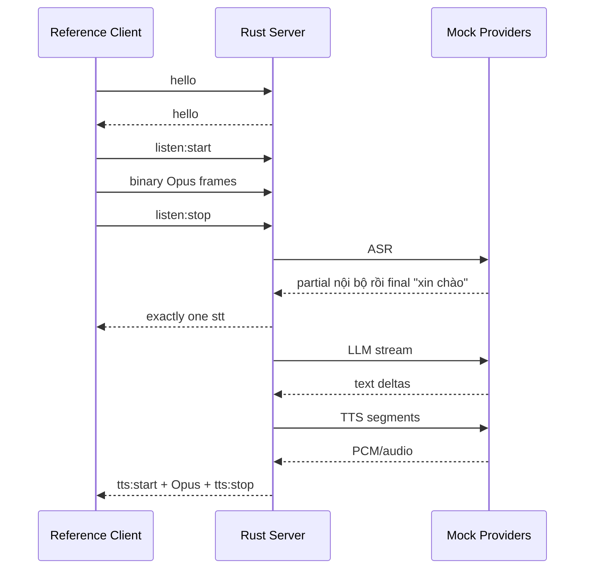

# Testing 06 — End-to-end voice pipeline

## Gate A — E2E mock test

Không cần ESP32 thật. Test client WebSocket giả lập firmware.



## Assert

- ordering protocol đúng.
- partial ASR không xuất hiện trên wire; final non-empty current-generation phát đúng một `type:"stt"` trước LLM.
- ít nhất một audio packet đến trước khi mock LLM stream hoàn tất nếu segmentation cho phép.
- dialogue chứa user + assistant sau turn hoàn tất.
- metrics latency có record.

## Interrupt E2E

Trong lúc server đang gửi audio turn 1:

1. client gửi `abort`, hoặc trong Auto đã arm/Realtime + trusted `features.aec=true` gửi speech mới.
2. assert `tts:stop`.
3. assert không nhận thêm JSON hoặc packet generation 1 được admit sau gate boundary.
4. Với barge-in, assert ASR turn 2 nhận `[SpeechStart - pre_roll, cursor)` gồm triggering PCM trước reset.
5. turn 2 xử lý bình thường trên cùng WebSocket và có quiet period 250 ms sau stop không audio cũ.
6. đưa JSON/audio generation 1 vào outbound queue trước interrupt; assert writer drop chúng trước urgent `tts:stop`.

## MCP E2E

- hello có `features.mcp=true`.
- fake client trả initialize result và tool list.
- mock LLM gọi tool.
- server gửi `tools/call`.
- fake client trả result.
- LLM tiếp tục và server TTS final response.

Gate A chỉ chứng minh **CI-compatible**, không phải firmware-compatible.

## Gate B — Real Firmware HIL

Trước release V1, chạy trên firmware `78/xiaozhi-esp32` v2.5.0 commit `ac6deed3d8e75348475364bf40ad953c6cd48054`, profile `bread-compact-wifi`. Xác nhận boot, OTA, WebSocket Bearer-authenticated, `hello`, real Opus uplink/downlink, STT, `tts:start`/`tts:stop`, `abort`, MCP `initialize`/`tools/list`/hai tool allowlisted và reconnect.

## Gate C — Real AI pipeline smoke

Ít nhất một cấu hình real ASR → streaming LLM → real TTS → ESP32 playback phải pass, gồm first response, multi-turn context, cancellation, provider timeout và reconnect.

## Commands

```bash
./scripts/test-module.sh e2e
./scripts/test-all.sh
```
